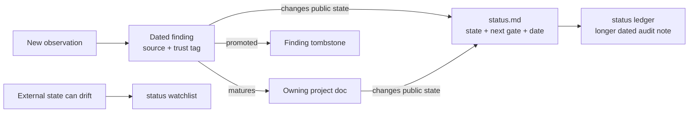

# Contributing to the ROCK 5B support record

This repository is an evidence-backed record of work to improve Radxa ROCK 5B
support on Armbian's Ubuntu 26.04 (Resolute) images. A useful contribution makes
one of these things easier on the next investigation pass:

- reproduce an observation;
- understand which layer owns a problem;
- tell validated behavior from a hypothesis;
- identify the next proof needed to close a support gap; or
- rebuild, test, install, and recover the relevant artifact safely.

This is not a source monorepo. Most implementation trees are external and are
identified in [`docs/source-trees.md`](docs/source-trees.md). Keep generated
build products and external checkouts out of this repository.

## Where a change belongs

| Change | Canonical home |
|--------|----------------|
| A newly learned fact, experiment, or unresolved explanation | A dated file under [`findings/`](findings/README.md). |
| A stable project-specific explanation | The owning project's `docs/`, linked from its `README.md`. |
| A patch, test, reproducer, package recipe, or operational script | The project directory that owns the affected layer. |
| A cross-project map, source pin, or global trap | [`docs/`](docs/README.md). |
| A board subsystem with no or only narrow repo evidence | The stable row in [`docs/support-coverage.md`](docs/support-coverage.md), plus a dated finding when runtime evidence is gathered. |
| A user-visible support state or the next proof needed | [`status.md`](status.md), with the matching audit row in [`docs/status-ledger.md`](docs/status-ledger.md). |
| An external fact that can change without a repository edit | The [`status.md` watchlist](status.md#watchlist--facts-that-go-stale-silently). |
| A shared term | [`glossary.md`](glossary.md); project-only terms stay in the project's `keywords.md`. |
| A source checkout, build directory, log bundle, binary, or board backup | An external workspace or ignored local path; document its reconstruction or disposition instead. |
| An upstream submission plan, a CVE or vulnerability-disclosure question, or a reproducer that provokes memory corruption | Not this repository — the private `rock-5b-security` repository. See below. |

## What does not belong here

This repository is public. Three classes of material live in the separate
private `rock-5b-security` repository instead, and must not be reintroduced
here:

- **Upstream submission planning** — the cross-package upstreaming ledger and
  the per-package `UPSTREAMING.md` disposition lists (which patch goes to which
  upstream, in what order, and what is deliberately never sent).
- **Vulnerability disclosure and CVE material** — severity triage, disclosure
  sequencing, vendor security contacts, and anything discussing CVE assignment.
- **Reproducers that provoke memory corruption** — the unprivileged MPP/RGA
  proof-of-concept programs, the fuzzer ABI grammar, and the pre-fix capture
  harness.

What stays here is the engineering record: how the hardware and drivers behave,
what was measured, which patch fixes what, and how to rebuild and validate it.
A finding may state that a defect exists and was fixed. It should not carry a
working trigger for it, a severity ranking aimed at a disclosure, or a plan for
reporting it.

Referring to moved material is fine — name the `rock-5b-security` repository in
plain text. Do not add a link: it is a different repository and a private one,
so a link would dangle for every reader and fail the link check.

### Running the validation gates that need both repositories

Two gates cannot be closed from this repository alone, because the reproducers
they drive moved: the memory-safety step of
[`kernel-drivers/docs/kernel-validation-runbook.md`](kernel-drivers/docs/kernel-validation-runbook.md)
and the destructive-PoC row of
[`kernel-drivers/docs/validation-index.md`](kernel-drivers/docs/validation-index.md).
The syzkaller fuzzing definition-of-done in
[`kernel-drivers/docs/rewrite-validation-plan.md`](kernel-drivers/docs/rewrite-validation-plan.md)
is in the same position.

Clone the two repositories as siblings:

```sh
cd ~/Code
git clone git@github.com:yisding/rock-5b-ysp.git
git clone git@github.com:yisding/rock-5b-security.git   # private
```

The security repository mirrors this one's directory layout, so a harness keeps
the same relative path under it — `kernel-drivers/tests/…` there matches
`kernel-drivers/tests/…` here. Run those harnesses from the security checkout
and record the result in the owning document here, naming the harness without
linking it. Full memory-safety validation therefore needs both checkouts
present; plan for that before starting a patch-tail validation rather than
discovering it at the gate.

The nearest `README.md` is the front door for every user-facing Markdown file.
Adding or moving a document therefore also means adding or updating its entry in
that README. Tracked tools follow the same rule — shell, Python, and C/C++
alike, including internal packaging helpers and standalone reproducers — so
operational code never becomes an invisible entry point. The repository consistency check
enforces both ownership rules.

## Evidence lifecycle



Use [`findings/TEMPLATE.md`](findings/TEMPLATE.md) for the low-ceremony capture
step. State what was measured, inspected, inferred, designed, hypothesized, or
left unverified. Prefer a pinned commit plus function/section anchor over a bare
line number. Include the command and pass/fail signal when a result came from a
build or test. Then run `python3 scripts/update-findings-index.py`; the compact
index is generated from the filename and exact H1, so evidence detail and trust
tags stay in the finding.

Also add the finding to the [by-subsystem topic index](findings/README.md#browse-by-subsystem)
under the layer that owns it. That index is hand-curated — a machine cannot tell
that a dma-buf oops first seen through GRD is really a memory-plumbing finding —
so only its coverage is mechanically enforced, not its judgement.

Promote a mature finding into the owning project documentation. Replace the
original finding with a short `promoted → ...` tombstone so links and history
survive; do not leave two competing canonical explanations.

## Updating project status

The dashboard is a dated support contract, not a general task list.

When an existing track changes:

1. Update its public state only as far as current evidence proves.
2. Update the matching **Next gates** row with the smallest result that
   materially advances the track and a working **Action path** to its runbook,
   exact evidence owner, or decision boundary.
3. Change the verification date only when the state was actually rechecked.
4. Update the matching ledger row with the same number, track name, and date.
5. Link the project document or finding that owns the evidence.

Keep each dashboard state to the latest proven capability plus its material
boundary. Incident chronology, build fingerprints, per-case results, and
superseded explanations belong in the ledger, owning project document, or
dated finding. Likewise, a next-gate row names the next proof rather than
retelling the proofs already closed. Keep every numbered row contiguous with
the table above it; a blank line ends a Markdown table.

When adding a track, add it to both files with a new stable number. Do not create
a dashboard row for every finding: use a row when the subject is a user-visible
support area or a sustained workstream. Put volatile package, upstream-review,
and distro facts in the watchlist rather than burying them in project prose.

Watchlist entries use stable `W##` IDs. Add or update both the compact index row
and its detail block, keeping the item name and last-checked date identical —
this pairing is mechanically enforced. Every detail records **Why recheck**,
**Last checked**, and a dated **State** block; date each state rather than
writing a bare "State then", so an entry that gains a newer state keeps the
older one correctly attributed. Do not renumber the remaining items when one is
retired.

Dashboard, next-gate, ledger, and coverage **prose** is maintained by hand — it
is convention, not mechanically enforced. `scripts/check-doc-consistency.py`
checks substantive drift and completeness only:

- every tracked `.md`/`.sh`/`.py`/`.c`/`.cpp`/`.h` is named by its nearest
  ancestor README (`debian/` is exempt — dpkg dictates that layout);
- every nested `README.md` is linked from its nearest ancestor README, so each
  directory front door is reachable through the project hierarchy;
- no `.patch` or `.diff` sits at the repository root without a project owner;
- every finding is linked from the findings index, every index link resolves to
  a file, and the generated filename/H1 index is exact and newest-first;
- every live finding sits in exactly one by-subsystem topic group, each group's
  stated count matches its rows, and no group lists a tombstone or a file that
  does not exist — the topic index is curated, so only its coverage is checked,
  never which group a finding belongs to;
- each `W##` watchlist entry has both halves, and they agree on item name and
  last-checked date;
- every `status.md` dashboard track has a ledger row under the same number and
  name, no ledger row lacks a dashboard track, and numbered dashboard,
  next-gate, and ledger rows stay in one rendered table;
- the kernel source packages' copied helpers stay identical;
- packaging version pins (FFmpeg/GRD) have not drifted;
- no operational script defaults to a personal home path;
- every tracked `.sh` outside `debian/` matches the shell conventions below —
  `#!/usr/bin/env bash` at mode `0755`, or `# shellcheck shell=bash` at mode
  `0644` for a source-only helper, and nothing in between.

It does not police dashboard, ledger, or coverage **dates**, nor any prose,
required-field, or `C##` schema convention.

## Updating whole-board coverage

[`docs/support-coverage.md`](docs/support-coverage.md) is the scope inventory;
it is not a second status dashboard. Preserve each stable `C##` ID and use only
the documented `TRACKED`, `NARROW`, or `UNASSESSED` states. A device-tree node,
bound driver, or device file is discovery evidence, not a functional pass.

Promote an area from `UNASSESSED` to `NARROW` only after a dated runtime finding
records identity, detection, real exercise, a pass/fail signal, logs, and the
untested boundary. Promote it to `TRACKED` only when it has a durable evidence
owner and maintenance path. Add a `status.md` track separately when the result
is user-visible or becomes a sustained workstream.

## Source and artifact discipline

- Record external source pins in [`docs/source-trees.md`](docs/source-trees.md)
  when documentation depends on their exact contents.
- Preserve existing user changes and unrelated dirty worktrees. External trees
  are inputs, not scratch space to reset during documentation maintenance.
- Do not commit built kernels, Debian packages, modules, DTBs, firmware images,
  board dumps, or downloaded source trees. The relevant patterns are in
  [`.gitignore`](.gitignore); publication policy lives in
  [`packaging/README.md`](packaging/README.md).
- Put machine-specific absolute paths in prose only when they record provenance;
  every required input must also have a portable reconstruction path.
- Treat commands that flash SPI, write raw SD sectors, install kernels, or alter
  boot configuration as destructive operations. Provide a dry run, target
  verification, backup, and recovery path where applicable.

## Shell conventions

These are conventions the tree already follows; they are written down here
because the exceptions are deliberate and were previously indistinguishable
from oversights.

- Start executables with `#!/usr/bin/env bash`. A file meant only to be
  `source`d carries no shebang, uses `# shellcheck shell=bash` instead, and
  stays mode `0644` so it cannot be run by accident. This pair is mechanically
  enforced by `check-doc-consistency.py`; the mode comes from the Git index,
  since that is what a fresh clone materializes.
- Use `set -euo pipefail`. Two families deliberately drop `-e` and use
  `set -uo pipefail`: aggregating harnesses, where a failing case is the
  result being reported rather than a reason to abort the run, and board
  mutators, which must reach their cleanup or rollback path. Both are
  reporting or restoring state that an early exit would lose.
- Scan kernel logs through `SUITE_DMESG_FATAL_RE` from
  `kernel-drivers/tests/suite-common.sh`, with `grep -aiE`. Do not copy the
  signature set into a new script: private copies have twice drifted into
  missing every RK3588 IOMMU/RGA fault line while firing on the harness's own
  log markers. `kernel-drivers/tests/run-root-gates.sh` keeps a standalone copy
  on purpose so it can run as root without the helpers, and its behavior is
  pinned by `scripts/tests/test_repo_checks.py`.

## Documentation style

- Write the primary path for the repository owner returning with Linux and
  ROCK 5B context, not for a complete newcomer. Generic Linux, Git, C, or media
  primers may remain as opt-in references when they preserve useful learning,
  but they should not delay the subsystem model, evidence boundary, or next
  decision in a front door.
- Lead with the result, then explain the mechanism and evidence.
- Separate current facts from historical facts and proposed work.
- Use exact dates (`YYYY-MM-DD`) for validation claims; do not use “currently”
  as a substitute for a date.
- Define a cross-cutting acronym once in the glossary and link it; avoid cloning
  definitions into many pages.
- Keep one canonical explanation and link to it from summaries.
- Use relative repository links and stable heading/function anchors.

A project front door should make four questions cheap to answer:

1. **What does this layer own, and where does it sit?**
2. **What is the current proven boundary, and which file owns that moving
   verdict?**
3. **Where is the maintained mechanism or runbook?**
4. **What is the next proof or unresolved discriminator?**

Do not make the README retell a long status row or finding to answer them. Link
the canonical owner and state only the load-bearing distinction needed to choose
the next document.

When a stable technical model spans enough layers or sections that returning to
it otherwise requires a scan, front-load a compact re-entry aid. Use only the
pieces the subject needs:

- a question → section → load-bearing-fact map;
- one vertical ownership/data-flow trace;
- a short “do not conflate” table for similar names, handles, states, or green
  signals; and
- a direct handoff to the live status/coverage owner.

These are navigation and reasoning aids, not duplicate summaries. Small
documents and single-purpose runbooks do not need them.

Preserve causal learning as:

```text
symptom
  -> discriminating observation
  -> hypotheses ruled out or superseded
  -> bounded root cause
  -> fix/workaround
  -> verification result
  -> still-open boundary and next discriminator
```

The dated finding owns the exact experiment and trust tags. The stable project
doc owns the maintained mechanism. Curate an
[investigation trail](findings/README.md#reconstruct-an-investigation) only for
a recurring thread whose turning points are otherwise hard to recover; ordinary
findings stay in the generated chronology.

For every experiment-to-conclusion write-up, preserve enough of this chain to
audit the claim:

```text
exact source/package/boot identity
  -> controlled variable and command
  -> observed pass/fail signal and artifacts
  -> counterexample or comparison where relevant
  -> narrowest conclusion licensed by the result
  -> untested boundary
  -> next discriminating test
```

An exit code, device node, compiled object, negotiated codec, positive hardware
counter, correct output, sanitizer-clean interval, paired differential, and
production soak are different evidence classes. Name the one actually observed;
do not let one silently stand in for another.

Contributors may license only their own original work. License new original
documentation and non-code under `CC-BY-SA-4.0`; license original code for the
upstream project it targets, using `GPL-2.0-or-later` for the contributor's own
new kernel-source code and original kernel-code patch hunks. Standalone
packaging, test, and build tools retain an existing accurate file/package notice
or follow their direct upstream target; directory placement alone does not make
them kernel code. Add an `SPDX-License-Identifier` to a standalone source file
only when that identifier accurately describes the file, preserve all upstream
notices and patch context, and read
[`LICENSE.md`](LICENSE.md) before accepting third-party content or introducing
a new code target whose upstream license is not already mapped there.

## Before handoff

From the repository root, run:

```bash
bash scripts/check-repo.sh
```

This checks local Markdown paths and anchors — including relative links that
climb out of the repository, which are unreachable from any other checkout and
are always a bug — runs the repository-check
regression tests, runs ShellCheck at warning-or-higher severity across every
maintained shell file, runs the documentation consistency check described above,
and finds whitespace errors in staged, unstaged, and untracked files. Run `bash -n` on changed shell scripts as
an additional syntax gate. Run project-specific build or hardware
tests in proportion to the behavior changed, and report exactly what was and
was not exercised.

The read-only [repository-checks workflow](.github/workflows/repository-checks.yml)
runs the same command on every push and pull request. Run it locally first so a
CI failure does not become the first explanation of a documentation-contract
problem.
