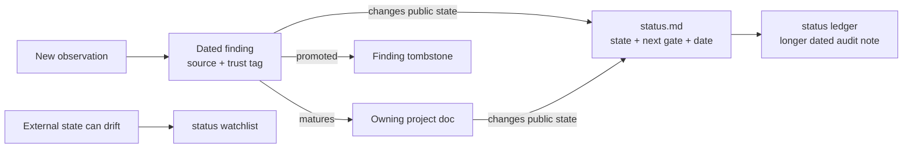

# Contributing to the ROCK 5B support record

This repository is an evidence-backed record of work to improve Radxa ROCK 5B
support on Armbian's Ubuntu 26.04 (Resolute) images. A useful contribution makes
one of these things easier for the next person:

- reproduce an observation;
- understand which layer owns a problem;
- tell validated behavior from a hypothesis;
- identify the next proof needed to close a support gap; or
- rebuild, test, install, and recover the relevant artifact safely.

This is not a source monorepo. Most implementation trees are external and are
identified in [`docs/source-trees.md`](docs/source-trees.md). Keep generated
build products and external checkouts out of this repository.

## Where a change belongs

| Change | Canonical home |
|--------|----------------|
| A newly learned fact, experiment, or unresolved explanation | A dated file under [`findings/`](findings/README.md). |
| A stable project-specific explanation | The owning project's `docs/`, linked from its `README.md`. |
| A patch, test, reproducer, package recipe, or operational script | The project directory that owns the affected layer. |
| A cross-project map, source pin, or global trap | [`docs/`](docs/README.md). |
| A board subsystem with no or only narrow repo evidence | The stable row in [`docs/support-coverage.md`](docs/support-coverage.md), plus a dated finding when runtime evidence is gathered. |
| A user-visible support state or the next proof needed | [`status.md`](status.md), with the matching audit row in [`docs/status-ledger.md`](docs/status-ledger.md). |
| An external fact that can change without a repository edit | The [`status.md` watchlist](status.md#watchlist--facts-that-go-stale-silently). |
| A shared term | [`glossary.md`](glossary.md); project-only terms stay in the project's `keywords.md`. |
| A source checkout, build directory, log bundle, binary, or board backup | An external workspace or ignored local path; document its reconstruction or disposition instead. |

The nearest `README.md` is the front door for every user-facing Markdown file.
Adding or moving a document therefore also means adding or updating its entry in
that README. Tracked shell and Python tools follow the same rule: name each one
in its nearest README, including internal packaging helpers, so operational code
never becomes an invisible entry point. The repository consistency check
enforces both ownership rules.

## Evidence lifecycle



Use [`findings/TEMPLATE.md`](findings/TEMPLATE.md) for the low-ceremony capture
step. State what was measured, inspected, inferred, designed, hypothesized, or
left unverified. Prefer a pinned commit plus function/section anchor over a bare
line number. Include the command and pass/fail signal when a result came from a
build or test.

Promote a mature finding into the owning project documentation. Replace the
original finding with a short `promoted → ...` tombstone so links and history
survive; do not leave two competing canonical explanations.

## Updating project status

The dashboard is a dated support contract, not a general task list.

When an existing track changes:

1. Update its public state only as far as current evidence proves.
2. Update the matching **Next gates** row with the smallest result that
   materially advances the track and a working **Action path** to its runbook,
   exact evidence owner, or decision boundary.
3. Change the verification date only when the state was actually rechecked.
4. Update the matching ledger row with the same number, track name, and date.
5. Link the project document or finding that owns the evidence.

When adding a track, add it to both files with a new stable number. Do not create
a dashboard row for every finding: use a row when the subject is a user-visible
support area or a sustained workstream. Put volatile package, upstream-review,
and distro facts in the watchlist rather than burying them in project prose.

Watchlist entries use stable `W##` IDs. Add or update both the compact index row
and its detail block, keeping the item name and last-checked date identical.
Every detail records **Why recheck**, **Last checked**, and **State then**; do not
renumber the remaining items when one is retired.

Dashboard/next-gate/ledger identity, watchlist structure, dates, and required
fields are checked automatically by `scripts/check-doc-consistency.py`.

## Updating whole-board coverage

[`docs/support-coverage.md`](docs/support-coverage.md) is the scope inventory;
it is not a second status dashboard. Preserve each stable `C##` ID and use only
the documented `TRACKED`, `NARROW`, or `UNASSESSED` states. A device-tree node,
bound driver, or device file is discovery evidence, not a functional pass.

Promote an area from `UNASSESSED` to `NARROW` only after a dated runtime finding
records identity, detection, real exercise, a pass/fail signal, logs, and the
untested boundary. Promote it to `TRACKED` only when it has a durable evidence
owner and maintenance path. Add a `status.md` track separately when the result
is user-visible or becomes a sustained workstream.

## Source and artifact discipline

- Record external source pins in [`docs/source-trees.md`](docs/source-trees.md)
  when documentation depends on their exact contents.
- Preserve existing user changes and unrelated dirty worktrees. External trees
  are inputs, not scratch space to reset during documentation maintenance.
- Do not commit built kernels, Debian packages, modules, DTBs, firmware images,
  board dumps, or downloaded source trees. The relevant patterns are in
  [`.gitignore`](.gitignore); publication policy lives in
  [`packaging/README.md`](packaging/README.md).
- Put machine-specific absolute paths in prose only when they record provenance;
  every required input must also have a portable reconstruction path.
- Treat commands that flash SPI, write raw SD sectors, install kernels, or alter
  boot configuration as destructive operations. Provide a dry run, target
  verification, backup, and recovery path where applicable.

## Documentation style

- Lead with the result, then explain the mechanism and evidence.
- Separate current facts from historical facts and proposed work.
- Use exact dates (`YYYY-MM-DD`) for validation claims; do not use “currently”
  as a substitute for a date.
- Define a cross-cutting acronym once in the glossary and link it; avoid cloning
  definitions into many pages.
- Keep one canonical explanation and link to it from summaries.
- Use relative repository links and stable heading/function anchors.

Repository-owned material does not yet have a repository-wide redistribution
license. Read [`LICENSE.md`](LICENSE.md) before copying material out of the repo
or accepting third-party content with unclear licensing.

## Before handoff

From the repository root, run:

```bash
bash scripts/check-repo.sh
```

This checks local Markdown paths and anchors, runs the repository-check
regression tests, verifies Markdown/operational-file README ownership, finding
metadata/order, and dashboard/ledger contracts, and finds whitespace errors in
staged, unstaged, and untracked files. For changed shell scripts, also run
`bash -n` and `shellcheck` on those files. Run project-specific build or
hardware tests in proportion to the behavior changed, and report exactly what
was and was not exercised.

The read-only [repository-checks workflow](.github/workflows/repository-checks.yml)
runs the same command on every push and pull request. Run it locally first so a
CI failure does not become the first explanation of a documentation-contract
problem.
