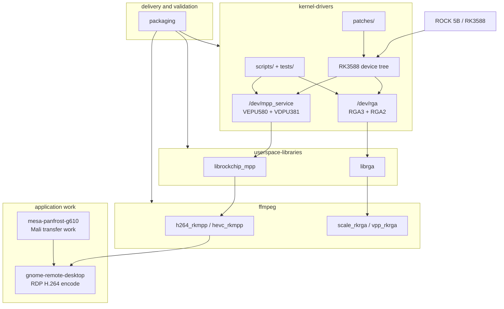

# rock-5b-ysp - ROCK 5B support work packages

This repo explains the pieces of work done to support RK3588 hardware video on
the Radxa ROCK 5B: kernel codec/RGA drivers, userspace libraries, FFmpeg,
GNOME Remote Desktop, Mesa/Panfrost investigation, packaging, and hardware
validation.

The shipped kernel result is a Rockchip vendor **MPP** codec stack plus **RGA**
forward-port from the Rockchip 6.1 BSP to Linux 6.18, packaged for Armbian on
the ROCK 5B. The repo also records the application and distribution work built
on top of that base: `ffmpeg-rockchip`, a hardware H.264 backend for
`gnome-remote-desktop`, Mesa/Panfrost Mali-G610 debugging, DKMS/PPA packaging,
a BSP audit fix series, and a clean-room rewrite track.

The dated project scoreboard is [`status.md`](status.md). Every status claim
below should be read through that file's last-verified dates.

## Main split: work packages



| Package | User-facing content | Developer-facing content | Entry |
|---------|---------------------|--------------------------|-------|
| **Kernel drivers** | Get `/dev/mpp_service` and `/dev/rga` on the board, build/install the combined kernel, and run on-hardware smoke tests. | Forward-port design, MPP/RGA internals, DT, patch series, scripts, tests, audit findings, rewrite drivers. | [`kernel-drivers/`](kernel-drivers/README.md) |
| **Userspace libraries** | Build or install `librockchip_mpp` and `librga` with the right headers, `.pc` files, and device permissions. | Library/kernel responsibility split, ioctl behavior, dma-buf imports, ABI facts. | [`userspace-libraries/`](userspace-libraries/README.md) |
| **FFmpeg** | Build and use rkmpp codecs and RGA filters for decode, encode, scale, and transcode. | FFmpeg hardware-frame model, fork vs upstream behavior, rebase/fix series. | [`ffmpeg/`](ffmpeg/README.md) |
| **GNOME Remote Desktop** | Run a real RDP workload with RK3588 H.264 hardware encode. | GRD backend design, zero-copy path, IDR/bitrate fixes, GDM greeter ACL. | [`gnome-remote-desktop/`](gnome-remote-desktop/README.md) |
| **Mesa/Panfrost** | Understand why Mali-G610 transfer work mattered to the GRD fallback path. | Panfrost BLIT/COMPUTE correctness, AFBC constraint, reproducers, validation. | [`mesa-panfrost-g610/`](mesa-panfrost-g610/README.md) |
| **Packaging** | Choose combined kernel, DKMS, local debs, or PPA-style source packages. | DKMS layout, udev/ACL packages, PPA import plan, rollback, binary policy. | [`packaging/`](packaging/README.md) |
| **Cross-package docs** | Follow the package map, source pins, and whole-repo trap index. | Source reconstruction, global maintenance rules, and cross-package navigation. | [`docs/`](docs/README.md), [`glossary.md`](glossary.md) |

The detailed package reading map is [`docs/work-packages.md`](docs/work-packages.md).

## Choose your path

| Your goal | Start at | What you will find |
|-----------|----------|--------------------|
| Get hardware codecs working on a ROCK 5B | [`install.md`](install.md) | Delivery-model chooser, combined-kernel quickstart, PHASH pinning, validation, userspace handoff. |
| Understand the whole stack | [`docs/work-packages.md`](docs/work-packages.md) | Package map plus user/developer reading paths. |
| Learn the kernel internals | [`kernel-drivers/`](kernel-drivers/README.md) | Driver architecture, forward-port deltas, DT, audit, rewrite track. |
| Build userspace media tools | [`userspace-libraries/`](userspace-libraries/README.md) -> [`ffmpeg/`](ffmpeg/README.md) | MPP/librga staging, FFmpeg build, transcode validation. |
| Use the stack in an application | [`gnome-remote-desktop/`](gnome-remote-desktop/README.md) | Hardware H.264 RDP encode path, performance, patches, packaging notes. |
| Package or redistribute | [`packaging/`](packaging/README.md) | Delivery channels, udev/ACL packages, DKMS, PPA, binary policy. |
| Debug a failure | [`docs/gotchas.md`](docs/gotchas.md) | Trap index, test links, crash-capture workflow. |

## Current board support

The core validated result is a single Armbian kernel with all three accelerator
families built in (`=y`) and exercised on real ROCK 5B hardware:

| Area | Block or package | Interface | Current state |
|------|------------------|-----------|---------------|
| Encoder | VEPU580 / `rkvenc2` | `/dev/mpp_service`, nodes `fdbd0000`, `fdbe0000` | H.264 + H.265 encode validated at 256x256 and 720p. |
| Decoder | VDPU381 / `rkvdec2` | `/dev/mpp_service`, CCU `fdc30000`, cores `fdc38000` / `fdc40000` | H.264 + H.265 decode validated on both cores. |
| RGA | RGA3 x2 + RGA2 | `/dev/rga`, nodes `fdb60000`, `fdb70000`, `fdb80000` | Probe, IOMMU, scale/color-convert path validated through FFmpeg. |
| End-to-end media | `ffmpeg-rockchip` | `h264_rkmpp`, `hevc_rkmpp`, `scale_rkrga` | Full hardware transcode validated. |
| Real application | GNOME Remote Desktop | FFmpeg `h264_rkmpp` backend | 60 fps RDP hardware encode measured in the documented path. |
| BSP audit fixes | `kernel-drivers/patches/cleanup-split/` | 65-patch fix series | Staged, not shippable; compile/runtime gates remain in [`status.md`](status.md). |

Userspace talks to the vendor MPP framework through `/dev/mpp_service`
(`librockchip_mpp`, not V4L2) and to RGA through `/dev/rga` (`librga`). This is
the stack `ffmpeg-rockchip` expects.

> **Why the vendor stack and not mainline V4L2?** The mainline RK3588 encoder
> path is JPEG-only in Collabora's
> [mainline-status note](https://gitlab.collabora.com/hardware-enablement/rockchip-3588/notes-for-rockchip-3588/-/blob/main/mainline-status.md),
> so it does not provide the H.264 encode path GRD targets, nor H.265 encode.
> The RGA3 V4L2 driver is also still a subset for RK3588. The vendor MPP + RGA
> stack gives the full feature set used here today. See
> [`kernel-drivers/docs/vanilla-kernel.md`](./kernel-drivers/docs/vanilla-kernel.md) for the mainline-V4L2
> alternative and its trade-offs.

## Quickstart

The canonical walkthrough is [`install.md`](install.md). The shape is:

```bash
git clone https://github.com/armbian/build armbian-build
mkdir -p armbian-build/userpatches/kernel/archive/rockchip64-6.18
cp kernel-drivers/patches/rk3588-rkvenc2-0*.patch armbian-build/userpatches/kernel/archive/rockchip64-6.18/
bash kernel-drivers/scripts/build-combined-kernel.sh
sudo PHASH='P####-C####' bash kernel-drivers/scripts/install-combined-kernel.sh
sudo reboot
sudo bash kernel-drivers/scripts/validate-combined.sh
```

Then install the udev rule from [`kernel-drivers/scripts/99-rockchip-codec.rules`](kernel-drivers/scripts/99-rockchip-codec.rules),
build or install userspace through [`userspace-libraries/`](userspace-libraries/README.md)
and [`ffmpeg/`](ffmpeg/README.md), and run [`kernel-drivers/tests/`](kernel-drivers/tests/README.md).

## Repository map

Each directory README owns the file-level index for that package or artifact
area. Additions should update the owning README.

```
install.md             board-user install path and delivery chooser
status.md              dated whole-project scoreboard and staleness watchlist
glossary.md            vocabulary used across packages
kernel-drivers/        MPP/RGA kernel driver package
  docs/                architecture, status, DT, audit, resync, rewrite notes
  patches/             kernel patch deliverables and audit-fix series
  scripts/             combined-kernel build, install, validate, udev rule
  tests/               on-hardware decode, encode, and transcode smoke tests
userspace-libraries/   package front door for libmpp and librga
  docs/                userspace-library architecture notes
ffmpeg/                FFmpeg build/use docs, architecture notes, fix series
  docs/                FFmpeg architecture, comparison, rebase, fix candidates
gnome-remote-desktop/  hardware H.264 RDP backend docs and patches
  docs/                GRD baseline, design, capture path, testing, profiling
mesa-panfrost-g610/    Mali-G610 transfer investigation and reproducers
  docs/                Panfrost validation and issue notes
packaging/             deploy hub: DKMS, udev/ACL debs, PPA notes, policy
  docs/                Armbian packaging notes
docs/                  cross-project map, source-tree pins, and gotchas
```

Maintenance rule: a commit that adds a user-facing file should update the
owning package README; a commit that adds a top-level package should update
this map and [`docs/work-packages.md`](docs/work-packages.md). Status
changes belong in [`status.md`](status.md) with a real verification date.

## Provenance and licensing

- The driver code is forward-ported from Rockchip's GPL-2.0 BSP MPP framework
  (`rockchip-kernel` `drivers/video/rockchip/mpp/`) and `airockchip/librga`'s
  kernel driver. It is GPL-2.0 like the kernel.
- `librga` userspace is open source (Apache-2.0). The official `airockchip/librga`
  repo ships a prebuilt `.so`; the source lineage and build notes are linked
  from [`userspace-libraries/`](userspace-libraries/README.md) and
  [`docs/gotchas.md`](docs/gotchas.md).
- The mainline RGA-in-U-Boot / RGA-V4L2 context comes from Collabora's RK3588
  upstreaming work.
- License of this repo's own prose/scripts: TODO - owner decision pending. The
  kernel patches are GPL-2.0 as derived works; nothing else is licensed yet.

This repo is the integration and analysis record; the heavy lifting on the
drivers is Rockchip's.
