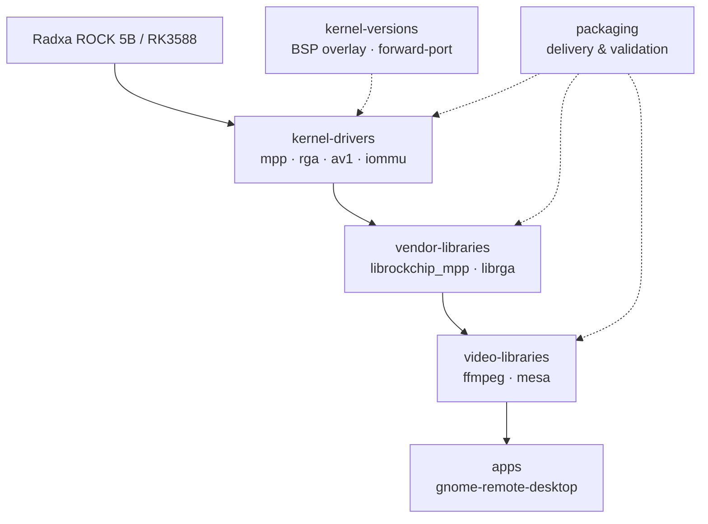

# rock-5b-ysp — ROCK 5B RK3588 hardware-video record

This repo is the tracking and knowledge record for making the Radxa ROCK 5B's
RK3588 do hardware video encode/decode under Linux. The actual code lives in
sibling source trees (kernel forks, `ffmpeg-rockchip`, `gnome-remote-desktop`,
mesa, `librga`, `mpp-rockchip`); this repo holds the architecture notes,
forward-port design, patch deliverables, captured findings, and the dated status
of every track. Cross-cutting vocabulary (MPP, RGA, CCU, DCHS, …) lives in
[`glossary.md`](glossary.md); each project also keeps a `keywords.md`.

The shipped kernel result is a Rockchip vendor **MPP** codec stack plus **RGA**
forward-port from the Rockchip 6.1 BSP to Linux 6.18, packaged for Armbian on the
ROCK 5B. The repo also records the work built on that base: `ffmpeg-rockchip`, a
hardware H.264 backend for `gnome-remote-desktop`, Mesa/Panfrost Mali-G610
debugging, DKMS/PPA packaging, a BSP audit fix series, and a clean-room rewrite
track.

The dated project scoreboard is [`status.md`](status.md); read every state claim
through its last-verified dates.

## Structure

The repo is split project-by-project, grouped into the categories below. Each
project directory carries its own `README.md` (front door) and, where useful, a
`keywords.md` ("key words to know"). Shared driver architecture, the combined
patch series, scripts, and on-hardware tests stay at the `kernel-drivers/` top.


```mermaid
flowchart TB
  board["Radxa ROCK 5B / RK3588"]
  kver["kernel-versions<br/>BSP overlay · forward-port"]
  kernel["kernel-drivers<br/>mpp · rga · av1 · iommu"]
  libs["vendor-libraries<br/>librockchip_mpp · librga"]
  video["video-libraries<br/>ffmpeg · mesa"]
  apps["apps<br/>gnome-remote-desktop"]
  packaging["packaging<br/>delivery & validation"]

  board --> kernel
  kver -.-> kernel
  kernel --> libs --> video --> apps
  packaging -.-> kernel
  packaging -.-> libs
  packaging -.-> video
```

| Category | What lives here | Entry |
|----------|-----------------|-------|
| **kernel-versions** | The kernel bases and moving between them: what the BSP adds vs stock, the forward-port narrative, the mainline-V4L2 alternative. | [`kernel-versions/`](kernel-versions/README.md) |
| **kernel-drivers** | In-kernel accelerator drivers, split `mpp` · `rga` · `av1` · `iommu`; shared architecture docs, patches, scripts, on-hardware tests at the top. | [`kernel-drivers/`](kernel-drivers/README.md) |
| **vendor-libraries** | Userspace vendor libs: `mpp` (librockchip_mpp), `rga` (librga). | [`vendor-libraries/`](vendor-libraries/README.md) |
| **video-libraries** | `ffmpeg` (rkmpp codecs + rkrga filters) and `mesa` (Mali-G610 transfer work). | [`video-libraries/`](video-libraries/README.md) |
| **apps** | Real applications on the stack: `gnome-remote-desktop` H.264 RDP backend. | [`apps/`](apps/README.md) |
| **packaging** | Delivery channels: DKMS, udev/ACL debs, PPA source packages, binary policy. | [`packaging/`](packaging/README.md) |
| **findings** | Raw capture inbox — drop a freshly-learned fact first, graduate it into a project doc later. | [`findings/`](findings/README.md) |
| **docs** + glossary | Cross-cutting: package map, source-tree pins, whole-repo trap index, shared vocabulary. | [`docs/`](docs/README.md), [`glossary.md`](glossary.md) |

The detailed package reading map is [`docs/work-packages.md`](docs/work-packages.md).

## Current board support

The core validated result is a single Armbian kernel with all three accelerator
families built in (`=y`) and exercised on real ROCK 5B hardware:

| Area | Block or package | Interface | Current state |
|------|------------------|-----------|---------------|
| Encoder | VEPU580 / `rkvenc2` | `/dev/mpp_service`, nodes `fdbd0000`, `fdbe0000` | H.264 + H.265 encode validated at 256x256 and 720p. |
| Decoder | VDPU381 / `rkvdec2` | `/dev/mpp_service`, CCU `fdc30000`, cores `fdc38000` / `fdc40000` | H.264 + H.265 decode validated on both cores. |
| RGA | RGA3 x2 + RGA2 | `/dev/rga`, nodes `fdb60000`, `fdb70000`, `fdb80000` | Probe, IOMMU, scale/color-convert path validated through FFmpeg. |
| End-to-end media | `ffmpeg-rockchip` | `h264_rkmpp`, `hevc_rkmpp`, `scale_rkrga` | Full hardware transcode validated. |
| Real application | GNOME Remote Desktop | FFmpeg `h264_rkmpp` backend | 60 fps RDP hardware encode measured in the documented path. |
| BSP audit fixes | `kernel-drivers/patches/cleanup-split/` | 65-patch fix series | Staged, not shippable; compile/runtime gates remain in [`status.md`](status.md). |

Userspace talks to the vendor MPP framework through `/dev/mpp_service`
(`librockchip_mpp`, not V4L2) and to RGA through `/dev/rga` (`librga`). This is
the stack `ffmpeg-rockchip` expects.

> **Why the vendor stack and not mainline V4L2?** The mainline RK3588 encoder
> path is JPEG-only in Collabora's
> [mainline-status note](https://gitlab.collabora.com/hardware-enablement/rockchip-3588/notes-for-rockchip-3588/-/blob/main/mainline-status.md),
> so it does not provide the H.264 encode path GRD targets, nor H.265 encode.
> The RGA3 V4L2 driver is also still a subset for RK3588. The vendor MPP + RGA
> stack gives the full feature set used here today. See
> [`kernel-versions/docs/vanilla-kernel.md`](./kernel-versions/docs/vanilla-kernel.md) for the mainline-V4L2
> alternative and its trade-offs.

Three details are load-bearing enough to state up front — they are the ones that
most often trip people who assume the encoder and decoder are symmetric, or that
the port replaces Armbian's DT:

- **⚑ Decoder CCU is real hardware; the encoder's is not.** The decoder's
  Central Control Unit is a real MMIO block (`@fdc30000`, its own DT node);
  the encoder has no such register block — its equivalent is a **software-only
  dual-core hand-shake (DCHS)**. See
  [`kernel-drivers/docs/how-the-drivers-work.md`](./kernel-drivers/docs/how-the-drivers-work.md) §7 and
  [`kernel-drivers/docs/device-tree.md`](./kernel-drivers/docs/device-tree.md).
- **⚑ Decoder RCB lives in SRAM; the encoder's lives in DRAM.** The decoder
  backs its Row Cache Buffer with on-chip SRAM (`system_sram2@ff001000`); the
  encoder has no SRAM slice and row-caches from DRAM. See
  [`kernel-drivers/docs/device-tree.md`](./kernel-drivers/docs/device-tree.md).
- **⚑ The port converts Armbian's DT nodes in place — it does not replace
  them.** *Convert-in-place* retypes Armbian's existing V4L2 decoder DT nodes
  (`vdec0`/`vdec1`) to the vendor binding where they sit, so nothing edits
  Armbian's own files. See
  [`packaging/docs/armbian-packaging.md`](./packaging/docs/armbian-packaging.md).

## Quickstart

The canonical walkthrough is [`install.md`](install.md). The shape is:

```bash
git clone https://github.com/armbian/build armbian-build
mkdir -p armbian-build/userpatches/kernel/archive/rockchip64-6.18
cp kernel-drivers/patches/rk3588-rkvenc2-0*.patch armbian-build/userpatches/kernel/archive/rockchip64-6.18/
bash kernel-drivers/scripts/build-combined-kernel.sh
sudo PHASH='P####-C####' bash kernel-drivers/scripts/install-combined-kernel.sh
sudo reboot
sudo bash kernel-drivers/scripts/validate-combined.sh
```

Then install the udev rule from [`kernel-drivers/scripts/99-rockchip-codec.rules`](kernel-drivers/scripts/99-rockchip-codec.rules),
build or install userspace through [`vendor-libraries/`](vendor-libraries/README.md)
and [`video-libraries/ffmpeg/`](video-libraries/ffmpeg/README.md), and run [`kernel-drivers/tests/`](kernel-drivers/tests/README.md).

## Repository map

Each project README owns the file-level index for its area; additions update the
owning README.

```
README.md              this map + the taxonomy diagram
status.md              dated whole-project scoreboard and staleness watchlist
glossary.md            cross-cutting vocabulary (per-project terms live in each project's keywords.md)
install.md             board-user install path and delivery chooser
findings/              raw capture inbox (drop-first, graduate-later): README + TEMPLATE
kernel-versions/       the kernel bases and moving between them
  bsp/                 what the Rockchip 6.1 BSP adds vs stock Linux (13-file subtree)
  docs/                vanilla / mainline-V4L2 notes, forward-port narrative + review log
kernel-drivers/        MPP/RGA in-kernel drivers
  docs/                shared architecture, uAPI, DT, audit, resync, rewrite, forward-port status
  mpp/ rga/ av1/ iommu/  per-block notes (keywords + scoped docs)
  patches/             combined kernel patch deliverables and audit-fix series
  scripts/ tests/      combined-kernel build/install/validate; on-hardware smoke tests
vendor-libraries/      librockchip_mpp + librga userspace
  docs/                shared userspace-library architecture
  mpp/ rga/            per-library notes (keywords + scoped docs)
video-libraries/
  ffmpeg/              rkmpp codecs + rkrga filters: docs, patches, pkgconfig
  mesa/                Mali-G610 Panfrost transfer: docs, patches, reproducers, scripts
apps/
  gnome-remote-desktop/  hardware H.264 RDP backend: docs, patches, bench
packaging/             deploy hub: DKMS, udev/ACL debs, PPA notes, policy
docs/                  cross-project map, source-tree pins, and gotchas trap index
```

Maintenance rule: a commit that adds a user-facing file updates the owning project
README; a commit that adds a top-level category or project updates this map and
[`docs/work-packages.md`](docs/work-packages.md). Status changes belong in
[`status.md`](status.md) with a real verification date.

## Provenance and licensing

- The driver code is forward-ported from Rockchip's GPL-2.0 BSP MPP framework
  (`rockchip-kernel` `drivers/video/rockchip/mpp/`) and `airockchip/librga`'s
  kernel driver. It is GPL-2.0 like the kernel.
- `librga` userspace is open source (Apache-2.0). The official `airockchip/librga`
  repo ships a prebuilt `.so`; the source lineage and build notes are linked
  from [`vendor-libraries/`](vendor-libraries/README.md) and
  [`docs/gotchas.md`](docs/gotchas.md).
- The mainline RGA-in-U-Boot / RGA-V4L2 context comes from Collabora's RK3588
  upstreaming work.
- License of this repo's own prose/scripts: TODO - owner decision pending. The
  kernel patches are GPL-2.0 as derived works; nothing else is licensed yet.

This repo is the integration and analysis record; the heavy lifting on the
drivers is Rockchip's.
