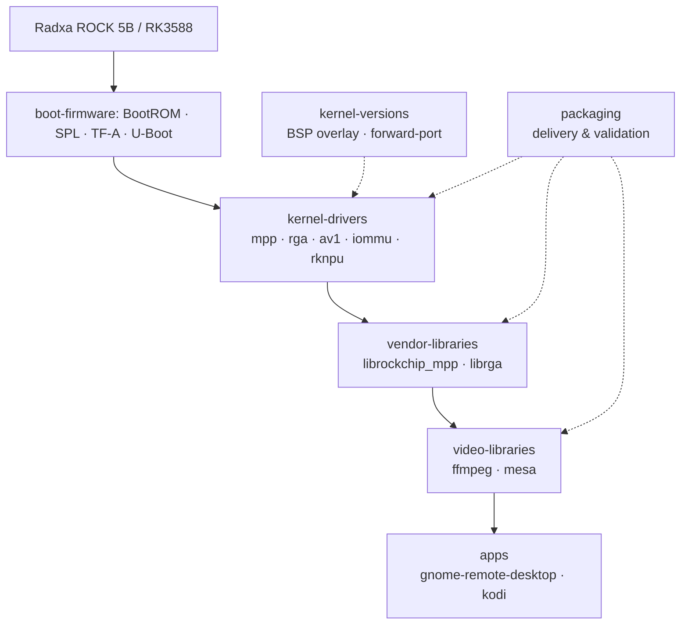

# rock-5b-ysp — ROCK 5B RK3588 support record

This repo is the tracking and knowledge record for improving Radxa ROCK 5B
support on Armbian's Ubuntu 26.04 (Resolute) images. The largest body of work is
making the RK3588 hardware-video stack usable end to end, but the record also
captures board bring-up, boot-chain, packaging, and application gaps encountered
along the way. The goal is to make each gap, experiment, result, and remaining
gate understandable and reproducible by someone other than the person who first
investigated it.

The actual code lives in sibling source trees (kernel forks, `ffmpeg-rockchip`,
`gnome-remote-desktop`, Mesa, `librga`, `mpp-rockchip`); this repo holds the
architecture notes, forward-port design, patch deliverables, captured findings,
and dated status of every track. Cross-cutting vocabulary (MPP, RGA, CCU, DCHS,
…) lives in [`glossary.md`](glossary.md); each project also keeps a
`keywords.md`.

The deepest body of evidence follows a Rockchip vendor **MPP** codec stack plus
**RGA** from the Rockchip 6.1 BSP into Linux 6.18, plus an end-to-end source
inspection of the BSP **RKNPU/RKNN** stack, then upward through
`ffmpeg-rockchip`, GNOME Remote Desktop, Kodi, Mesa/Panfrost, and package
delivery. BSP-audit and clean-room rewrite work are recorded alongside that
forward-port path rather than presented as interchangeable kernels.

The dated project dashboard is [`status.md`](status.md); read every state claim
through its last-verified dates.

## Start here

Choose the owner for the question you are trying to answer. This front door does
not repeat dated status or operational commands because those copies drift.

| Need | Start here |
|------|------------|
| Install the validated ROCK 5B kernel path | [`install.md`](install.md) |
| Check what is usable, experimental, or stale | [`status.md`](status.md) |
| Understand U-Boot and the ROCK 5B boot chain | [`boot-firmware/`](boot-firmware/README.md) |
| See which board subsystems have not been assessed | [`docs/support-coverage.md`](docs/support-coverage.md) |
| Capture the exact board/kernel/userspace baseline | [`docs/system-baseline.md`](docs/system-baseline.md) |
| Record a newly discovered gap or result | [`findings/`](findings/README.md) |
| Update or contribute to the record | [`CONTRIBUTING.md`](CONTRIBUTING.md) |
| Review repository-specific agent instructions | [`AGENTS.md`](AGENTS.md) |
| Review the kernel patch deliverables | [`kernel-drivers/patches/`](kernel-drivers/patches/README.md) |
| See what each forward-port patch does and which fixes belong back in the BSP | [`kernel-drivers/docs/patch-catalog.md`](kernel-drivers/docs/patch-catalog.md) |
| Compare the validated vendor path with maximum-mainline RK3588 builds | [`kernel-versions/`](kernel-versions/README.md) |
| Understand RKNN conversion, userspace, and the RKNPU driver | [`kernel-drivers/rknpu/`](kernel-drivers/rknpu/README.md) |
| Understand the repo taxonomy | [`docs/work-packages.md`](docs/work-packages.md) |
| Reconstruct an external source tree or resolve a code citation | [`docs/source-trees.md`](docs/source-trees.md) |
| Decode shared terms like MPP, RGA, CCU, DCHS | [`glossary.md`](glossary.md) |

This is an integration record and patch-delivery repo, not a self-contained
source monorepo. A subsystem missing from the dashboard is not implicitly
working or broken. Use the support coverage inventory to see the evidence
boundary, then create a finding rather than guessing.

## Repository structure

The repo is split project-by-project, grouped into the categories below. Each
project directory carries its own `README.md` (front door) and, where useful, a
`keywords.md` ("key words to know"). Shared driver architecture, the combined
patch series, scripts, and on-hardware tests stay at the `kernel-drivers/` top.

```mermaid
flowchart TB
  board["Radxa ROCK 5B / RK3588"]
  boot["boot-firmware: BootROM · SPL · TF-A · U-Boot"]
  kver["kernel-versions<br/>BSP overlay · forward-port"]
  kernel["kernel-drivers<br/>mpp · rga · av1 · iommu · rknpu"]
  libs["vendor-libraries<br/>librockchip_mpp · librga"]
  video["video-libraries<br/>ffmpeg · mesa"]
  apps["apps<br/>gnome-remote-desktop · kodi"]
  packaging["packaging<br/>delivery & validation"]

  board --> boot --> kernel
  kver -.-> kernel
  kernel --> libs --> video --> apps
  packaging -.-> kernel
  packaging -.-> libs
  packaging -.-> video
```

| Category | What lives here | Entry |
|----------|-----------------|-------|
| **boot-firmware** | Power-on through Linux handoff: U-Boot primer, RK3588 stages/artifacts, lineage comparison, and safe debugging. | [`boot-firmware/`](boot-firmware/README.md) |
| **kernel-versions** | The kernel bases and moving between them: what the BSP adds vs stock, the forward-port narrative, the mainline-V4L2 alternative. | [`kernel-versions/`](kernel-versions/README.md) |
| **kernel-drivers** | In-kernel accelerator drivers, split `mpp` · `rga` · `av1` · `iommu` · `rknpu`; shared architecture docs, patches, scripts, on-hardware tests at the top. | [`kernel-drivers/`](kernel-drivers/README.md) |
| **vendor-libraries** | Userspace vendor libs: `mpp` (librockchip_mpp), `rga` (librga). | [`vendor-libraries/`](vendor-libraries/README.md) |
| **video-libraries** | `ffmpeg` (rkmpp codecs + rkrga filters) and `mesa` (Mali-G610 transfer work). | [`video-libraries/`](video-libraries/README.md) |
| **apps** | Real applications on the stack: `gnome-remote-desktop` H.264 RDP encode and Kodi DRM PRIME hardware decode. | [`apps/`](apps/README.md) |
| **packaging** | Delivery channels: DKMS, udev/ACL debs, PPA source packages, binary policy. | [`packaging/`](packaging/README.md) |
| **findings** | Raw capture inbox — drop a freshly-learned fact first, graduate it into a project doc later. | [`findings/`](findings/README.md) |
| **captured evidence** | Small tracked inventories for forensic inputs; generated or bulky downloads stay outside Git. | [`downloads/armbian-rock5b-uboot-compare/`](downloads/armbian-rock5b-uboot-compare/README.md) |
| **docs** + glossary | Cross-cutting: support coverage, package map, source-tree pins, whole-repo trap index, shared vocabulary. | [`docs/`](docs/README.md), [`glossary.md`](glossary.md) |

The detailed package reading map is [`docs/work-packages.md`](docs/work-packages.md),
while [`docs/support-coverage.md`](docs/support-coverage.md) makes the repo's
media-heavy evidence boundary and the remaining whole-board gaps explicit.
New to the memory/address-translation path? Start with the
[IOMMU explainer series](kernel-drivers/iommu/docs/01-iommu-primer.md) —
concept → RK3588 hardware → RGA/MPP driver code.

## Canonical owners

| Information | Canonical owner |
|-------------|-----------------|
| Dated public state, next proof, and volatile external facts | [`status.md`](status.md) and its [`audit ledger`](docs/status-ledger.md) |
| Whole-board tracked/narrow/unassessed scope | [`docs/support-coverage.md`](docs/support-coverage.md) |
| Exact build, install, rollback, and validation commands | [`install.md`](install.md), then the owning project README |
| Fresh observations and unresolved explanations | [`findings/`](findings/README.md) |
| Stable technical explanations, patches, tests, and scripts | The nearest project `README.md` in the category table above |
| Evidence lifecycle, file placement, and handoff checks | [`CONTRIBUTING.md`](CONTRIBUTING.md) |

The deepest evidence follows the vendor MPP/RGA media path from kernel through
userspace and applications. That depth is not proof of unrelated board support;
the coverage inventory keeps the untouched areas visible. Likewise, this README
does not choose between the vendor and mainline media models: the maintained
comparison and its dated trade-offs live in
[`kernel-versions/docs/vanilla-kernel.md`](kernel-versions/docs/vanilla-kernel.md).

## Provenance and licensing

- Current repo-wide license state is recorded in [`LICENSE.md`](LICENSE.md):
  no repository-wide license has been granted yet.
- The driver code is forward-ported from Rockchip's GPL-2.0 BSP MPP framework
  (`rockchip-kernel` `drivers/video/rockchip/mpp/`) and `airockchip/librga`'s
  kernel driver. It is GPL-2.0 like the kernel.
- `librga` userspace is open source (Apache-2.0). The official `airockchip/librga`
  repo ships a prebuilt `.so`; the source lineage and build notes are linked
  from [`vendor-libraries/`](vendor-libraries/README.md) and
  [`docs/gotchas.md`](docs/gotchas.md).
- RKNN-Toolkit2, RKNNLite, `librknnrt`, and `rknn_server` are distributed under
  Rockchip's proprietary RKNN SDK license; public headers, manuals, and some
  separately licensed examples do not make the compiler/runtime implementation
  open source. The inspected boundary is recorded in the
  [`RKNPU/RKNN guide`](kernel-drivers/rknpu/docs/how-rknpu-works.md#4-what-is-open-and-what-is-closed).
- The mainline RGA-in-U-Boot / RGA-V4L2 context comes from Collabora's RK3588
  upstreaming work.
- Repo-level licensing for this repo's own prose/scripts still needs an owner
  decision before public redistribution. The kernel patches are GPL-2.0 as
  derived works; test utilities with SPDX headers keep their stated licenses.

This repo is the integration and analysis record; the heavy lifting on the
drivers is Rockchip's.
