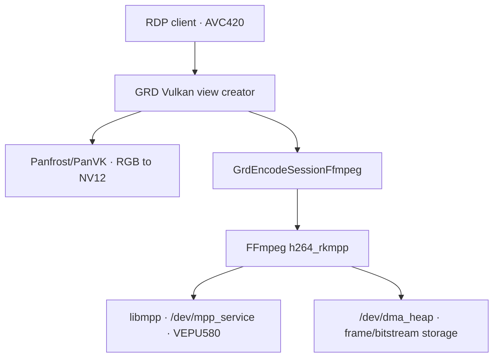

# apps/gnome-remote-desktop/ — hardware-accelerated RDP encode on RK3588

Project vocabulary: [`keywords.md`](keywords.md).

This directory owns the GNOME Remote Desktop integration that converts Mutter
capture buffers on the Mali GPU and encodes RDP H.264 on RK3588 VEPU580.

## Package brief

| Field | Contents |
|-------|----------|
| User outcome | Run an RDP session whose H.264 stream is encoded by RK3588 hardware. |
| Developer focus | Capture, panvk RGB-to-NV12 conversion, FFmpeg encode-session ownership, RDP frame-ACK pacing, recovery, handover, and greeter permissions. |
| Owns | Stable integration model, design/capture/profiling/testing docs, accumulated [validation](docs/validation.md), benchmarks, and a portable 50.1 replay. |
| Does not own | Intended package source ([build input](../../packaging/ppa/build-source-packages.sh)), release head ([W10](../../status.md#watch-w10)), publication ([W05](../../status.md#watch-w05)), or installed verdict/next proof ([status track 7](../../status.md)). |
| Depends on | Kernel MPP/DMA heaps, a compatible FFmpeg/MPP userspace, Mesa/Panfrost Vulkan, PipeWire/Mutter, FreeRDP, and optional GDM codec ACL packaging. |

## Fast re-entry

| Question | Canonical route |
|----------|-----------------|
| What can the integration establish? | [Validation scorecard](docs/validation.md) |
| Who owns each frame? | [Capture path](docs/capture-path.md) |
| Why FFmpeg and hardware encode? | [Design](docs/design.md), [software baseline](docs/baseline.md) |
| How were performance and stalls separated? | [Profiling](docs/profiling.md) |
| How do I run a safe gate? | [Testing playbook](docs/testing.md) |
| What is the audio boundary? | [Audio redirection](docs/audio-redirection.md) |
| Which code is portable replay versus archive? | [Patch map](patches/README.md) |
| What is live now? | [Status track 7](../../status.md), [W10](../../status.md#watch-w10), [W05](../../status.md#watch-w05) |

### One visible frame, nine handoffs

```text
Mutter capture buffer
  -> PipeWire delivery
  -> GRD view creator imports RGB dma-buf
  -> panvk compute writes NV12 dma-buf
  -> GrdEncodeSessionFfmpeg wraps DRM PRIME AVFrame
  -> h264_rkmpp / libmpp owns input and bitstream storage
  -> VEPU580 completes H.264 packet
  -> GRD sends RDPGFX frame
  -> client frame ACK replenishes server pacing capacity
```

### Similar signals that belong to different boundaries

| Do not conflate | Distinction |
|-----------------|-------------|
| capture, NV12 input, and H.264 output | Different producers, storage, formats, synchronization, and lifetimes |
| Mali and VEPU580 work | panvk converts RGB to NV12; MPP encodes NV12 to H.264 |
| PipeWire, encoder, and RDPGFX progress | A frame can stop before GRD, in FFmpeg/MPP, or after encode while awaiting client progress |
| TCP ACK and RDPGFX frame ACK | Transport delivery does not replenish graphics frame slots |
| smoke packet and visible frame | A discarded smoke frame can consume the encoder's natural IDR |
| AVC420 negotiation and hardware submission | Negotiation selects a codec; MPP markers plus a completed packet prove hardware |
| symptom and owner | A frozen desktop does not identify capture, GPU, codec, transport, or package ownership |
| video and audio | RDPGFX and RDPSND have separate sources, codecs, pacing, and gates |

## Files

| Path | Role |
|------|------|
| [`docs/design.md`](docs/design.md) | Backend choice and narrow fail-closed design |
| [`docs/baseline.md`](docs/baseline.md) | Measured software readback bottleneck and benchmark boundary |
| [`docs/capture-path.md`](docs/capture-path.md) | PipeWire/view-creator/session-selection and ownership map |
| [`docs/profiling.md`](docs/profiling.md) | Dated performance, client, starvation, backpressure, and verification evidence |
| [`docs/testing.md`](docs/testing.md) | Safe live-session and recovery playbook |
| [`docs/validation.md`](docs/validation.md) | Accumulated capability scorecard and evidence ladder |
| [`evidence/`](evidence/README.md) | Small project-owned artifacts retained after promotion, currently the full-range BT.709 package/metadata experiment. |
| [`docs/audio-redirection.md`](docs/audio-redirection.md) | RDPSND/PipeWire model, measured audio, and deferred codec work |
| [`docs/mesa-panfrost-transfer.md`](docs/mesa-panfrost-transfer.md) | GRD-facing route to the Mesa transfer investigation |
| [`bench/`](bench/README.md) | Readback and RKMPP lifecycle benchmark tools |
| [`patches/`](patches/README.md) | Portable 16-patch 50.1 replay; archive/reference material is separated below it |

PPA topology and operation belong to [`packaging/ppa/`](../../packaging/ppa/README.md).

## How it fits the stack



MPP codec and DMA-heap nodes, the Mali render node, and the PipeWire/Mutter
capture session are independent prerequisites. Package lineage matters because
two `h264_rkmpp` implementations expose different control surfaces under the
same codec name. Use [status track 7](../../status.md) for the installed stack,
not a literal version copied here.

## Upstream-style FFmpeg 8.1.2 `h264_rkmpp` vs ffmpeg-rockchip

The measured upstream-style bridge and ffmpeg-rockchip share a codec name but
not all behavior:

| Capability | Upstream-style bridge | ffmpeg-rockchip |
|------------|-----------------------|----------------|
| Rate control | VBR/CBR/AVBR | VBR/CBR/AVBR/FIXQP |
| Fixed QP | Not wired in the measured line | Supported |
| H.264 profile | Fell back to MPP default | Explicit profile |
| Per-frame forced IDR | Ignored in the measured line | MPP IDR control |
| VBR ceiling | Requires `rc_max_rate` or inherits a low MPP default | Explicit QP or rate controls |

The hardware supports the missing controls; the difference is FFmpeg glue.
The [FFmpeg comparison](../../video-libraries/ffmpeg/docs/implementation-comparison.md)
owns source details and the
[FFmpeg scorecard](../../video-libraries/ffmpeg/docs/validation.md) owns
evidence freshness.

## The four issues we hit (and fixed)

These are durable integration lessons, not a current package verdict.

### 1. The frozen desktop — no IDR in the stream

The startup smoke encode consumed the encoder's natural first IDR. The measured
upstream-style bridge ignored GRD's next forced-I-frame request, so the first
visible packets contained no SPS/PPS/IDR. The client decoded nothing, sent no
RDPGFX frame ACK, and GRD's frame controller correctly reduced available slots
to zero.

The valid designs are to recreate after smoke on a bridge without force-IDR,
or retain the smoke-tested context and use a proven MPP IDR request. Always
validate packet NALs and client frame ACKs; an open connection is insufficient.

### 2. Terrible quality — the 2.5 Mbps ceiling

The measured bridge set MPP's maximum bitrate only from `rc_max_rate`. Without
it, MPP kept a low default ceiling despite a much higher target, producing
blocking artifacts. Bounded VBR min/target/max values fixed that lineage;
ffmpeg-rockchip can instead use FIXQP. Rate-control policy must match the
actual encoder implementation.

### 3. The login screen stayed software — the greeter's dynamic user

GDM greeters use changing dynamic users that share the stable `gdm` group.
Seat ACL handling reaches DRM but does not reliably grant non-seat MPP and
DMA-heap nodes to each new greeter identity. A deliberate group ACL therefore
enables login-screen hardware encode. The opt-in
[`gdm-hwenc` package](../../packaging/gdm-hwenc/README.md) owns that security
choice.

### 4. Temporary stalls under encoder backpressure

The low-latency path keeps one frame in flight. When encode blocks, newer
capture work can queue behind stale work. The bounded response is to avoid new
view work while busy, drop stale completed views, fall back briefly to software
with a full refresh, then retry hardware. Encode timeout, FFmpeg input
backpressure, and client frame-ACK stalls require separate markers and
recoveries.

## How we diagnosed it (methodology)

- Instrument capture, conversion, encode, packet, and frame-ACK seams with
  stable correlation IDs.
- Inspect the first H.264 access units for SPS, PPS, IDR, and P-slice shape.
- Use thread stacks to distinguish idle starvation from a blocked call.
- Compare transport byte progress with RDPGFX frame-ACK progress.
- Inspect actual device fds, worker threads, library maps, daemon identity, and
  ACLs before claiming hardware.
- Reproduce encoder controls with a standalone FFmpeg command and inspect the
  exact `rkmppenc.c` lineage.

The [profiling signal table](docs/profiling.md#7-verification-signals-what-to-grep)
and [testing playbook](docs/testing.md) own commands and safety rules.

## The patches

The root [patch series](patches/README.md) is a portable 16-patch replay on its
recorded 50.1 base:

- `0001`–`0008` add and bound the RKMPP/panvk backend;
- `0009`–`0013` restore/fix GNOME 50 handover ownership;
- `0014` adds cached GPU-copy readback;
- `0015` adds bounded encode recovery and IDR handling; and
- `0016` adds progress-gated frame-ACK recovery.

It is reconstruction material, not the package input. The build script owns
the intended GRD commit, W10 the remote branch head, and the patch README the
mechanical replay. Diagnostic/watchdog/audio experiments remain under
`patches/archive/` and reference prototypes under `patches/reference/`.

## Packaging & install

The acceptance stack has three roles:

| Component | Durable responsibility |
|-----------|------------------------|
| GRD package | Backend, handover, cached readback, encode recovery, ACK recovery |
| Compatible FFmpeg/MPP packages | RKMPP encoder ABI, bounded waits/backpressure, frame ownership |
| Optional `gnome-remote-desktop-gdm-hwenc` | Stable `gdm` group access to codec nodes |

Do not copy package versions or publication IDs here. Resolve intended inputs
from [`build-source-packages.sh`](../../packaging/ppa/build-source-packages.sh),
publication through [W05](../../status.md#watch-w05), remote heads through
[W10](../../status.md#watch-w10), and installed acceptance through
[status track 7](../../status.md). Confirm hardware with the
[profiling signals](docs/profiling.md#7-verification-signals-what-to-grep).

## Provenance & licensing

- GNOME Remote Desktop is GPL-2.0+; the public GNOME fork and checked-in patch
  replay preserve authorship and source provenance.
- The measured development deployment used an upstream-style FFmpeg build with
  RKMPP enabled; package policy may select a different ABI-compatible line.
  [`video-libraries/ffmpeg/`](../../video-libraries/ffmpeg/README.md) owns both
  lineages and their licensing/configuration boundary.
- `gnome-remote-desktop-gdm-hwenc` is udev/package policy under GPL-2+.

This directory owns integration and debugging knowledge. GNOME owns the remote
desktop implementation; Rockchip/Mesa/FFmpeg own the lower layers.
