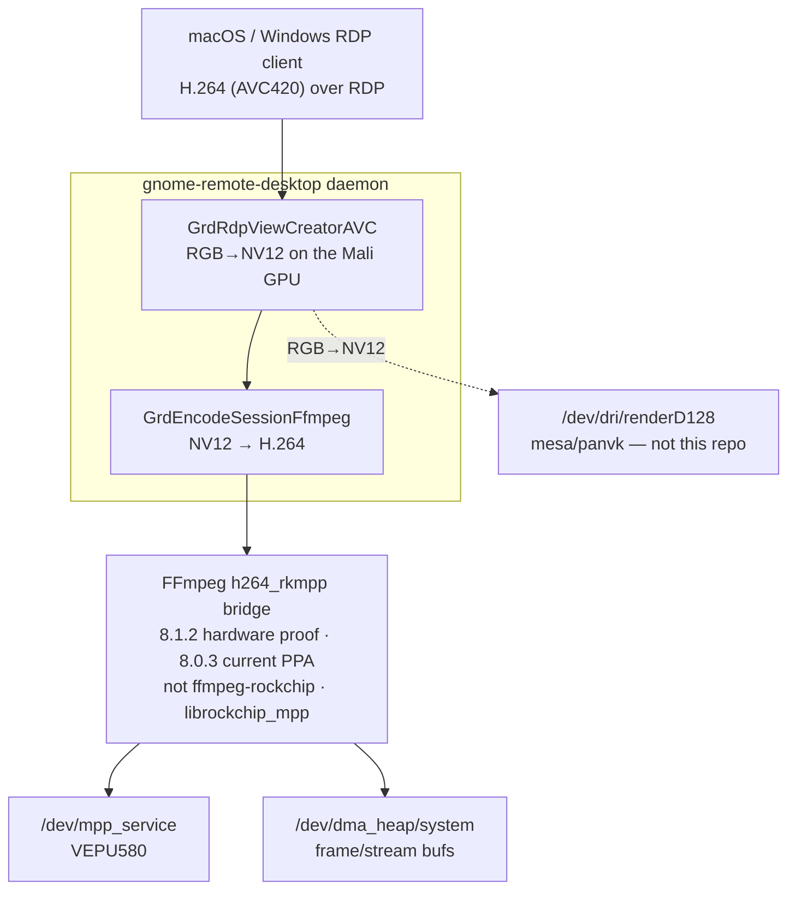

# apps/gnome-remote-desktop/ — hardware-accelerated RDP encode on RK3588

Project vocabulary: [`keywords.md`](keywords.md).


The codec stack in this repo exists to be *used*. This directory documents the
first real application built on it: a **hardware H.264 encode backend for
[gnome-remote-desktop](https://gitlab.gnome.org/GNOME/gnome-remote-desktop)
(GRD)**, so a remote desktop (RDP) session is encoded on the **VEPU580** instead
of in software. On an RK3588 the difference is a live, full-framerate desktop at
a few percent CPU instead of a laggy, CPU-bound one.

## Package brief

| Field | Contents |
|-------|----------|
| User outcome | Run an RDP session whose H.264 video stream is encoded by RK3588 hardware instead of software. |
| Developer focus | Understand GRD's capture path, FFmpeg encode-session integration, RDP frame-ack behavior, zero-copy buffers, panvk RGB-to-NV12 conversion, and GDM greeter permissions. |
| Owns | Runtime story here, design notes, baseline/profiling docs, capture-path map, testing playbook, benchmark code, and the portable 16-patch 50.1 replay behind the current 50.2 release branch. Investigation patches are archived separately. |
| Depends on | Kernel drivers, userspace libraries, an rkmpp-enabled FFmpeg build, Mesa/Panfrost Vulkan support, and optional GDM codec ACL packaging. |
| Current state | The release branch and earlier measurements establish that the RKMPP backend can sustain hardware-encoded RDP, but the latest installed-stack result is a separate gate: [`status.md` track 7](../../status.md#dashboard) owns the current runtime blocker and next proof. Read the historical capability evidence below as dated results, not as the state of the newest package/kernel pairing. |

The capability table records established results from the linked historical
measurements. It is not a substitute for the current package/kernel result in
[`status.md` track 7](../../status.md#dashboard).

| Piece | What | Established evidence |
|-------|------|----------------------|
| **Encode backend** | `GrdEncodeSessionFfmpeg` → FFmpeg `h264_rkmpp` → VEPU580, zero-copy | ✅ live over real RDP (macOS client), post-login desktop |
| **RGB→NV12** | Vulkan (**panvk**) compute on the Mali GPU, explicit-sync dma-buf | ✅ cross-driver panfrost→panvk sync works |
| **Login screen** | GDM greeter, same path | ✅ with the opt-in [`gdm-hwenc`](../../packaging/gdm-hwenc) package |
| **Quality** | VBR, artifact-free at ~0.25 bpp target | ✅ after the bitrate fix (below) |
| **Throughput** | sustained **60 fps** vsync-bound; MPP encode 1.26 ms median (~8 % of the frame budget) | ✅ measured — [`docs/profiling.md`](docs/profiling.md) |

> **This is the *consumer* layer.** The kernel drivers are in [`kernel-drivers/patches`](../../kernel-drivers/patches),
> libmpp/librga in [userspace library guide](../../vendor-libraries/docs/how-the-userspace-libs-work.md), and the
> FFmpeg build in [`video-libraries/ffmpeg`](../../video-libraries/ffmpeg). GRD sits on top of all of it. If the
> validate script and `tests/` pass, the hard part is already done — GRD is just
> another `/dev/mpp_service` + `/dev/dma_heap` client.

## Fast re-entry

This page owns the application integration and established capability model.
The installed package/kernel verdict and next proof belong to
[`status.md` track 7](../../status.md#dashboard); dated findings own individual
attributions.

| Question to recover | Re-enter through | Load-bearing fact |
|---------------------|------------------|-------------------|
| Where is the current installed path blocked? | [Current oops trace](../../findings/2026-07-27-grd-rkmpp-system-heap-sg-corruption-oops.md) → [`status.md` next gate](../../status.md#next-gates) | Authentication, GDM handover, device access, and AVC420 negotiation completed; the first smoke frame then oopsed while ending CPU access to a corrupted system-heap output scatterlist, before encoder hardware submission. |
| Who creates and owns each frame before encode? | [Capture path](docs/capture-path.md) | Mutter/PipeWire supplies capture storage; the selected view creator and panvk produce NV12; `GrdEncodeSessionFfmpeg` owns the FFmpeg-facing frame/packet lifecycle. |
| Why is hardware encode the architectural fix? | [Software baseline](docs/baseline.md) and [backend design](docs/design.md) | GPU-side transfer can reduce readback cost, but only hardware encode removes the GPU→CPU readback/software-RFX path from the hot loop. |
| Which `h264_rkmpp` behavior does GRD depend on? | [FFmpeg implementation comparison](../../video-libraries/ffmpeg/docs/implementation-comparison.md) and [the four issue chain](#the-four-issues-we-hit-and-fixed) | The upstream-style bridge and `ffmpeg-rockchip` share a codec name but differ in IDR, rate control, formats, and control surface; package lineage changes the diagnosis. |
| Is a stall capture starvation, codec backpressure, or client pacing? | [Profiling](docs/profiling.md), [MPP backpressure root cause](../../findings/2026-07-19-grd-rkmpp-encoder-wedge-mpp-input-backpressure.md), and [RDPGFX ACK wedge](../../findings/2026-07-20-grd-rdpgfx-focus-resume-ack-wedge.md) | Frame production, encoder queue progress, and RDPGFX slot/ACK progress are different clocks and need separate evidence. |
| What is the audio path and current proof? | [Audio redirection](docs/audio-redirection.md) and [live validation](../../findings/2026-07-21-grd-rdp-audio-live-validation-and-codec-control.md) | PipeWire capture and RDPSND negotiation are separate from the video pipeline; audible PCM/SVC is measured, while compressed-audio interoperability remains separate. |
| How do I test without corrupting the session? | [Testing playbook](docs/testing.md) | Never launch a second GRD against the same Mutter session; identify the live daemon/package and bracket the exact gate being exercised. |
| Which code is release material versus diagnostic history? | [Release patches](patches/README.md) | The 50.2 release branch carries the bounded backend/recovery changes; instrumentation and rejected experiments remain archived rather than silently shipping. |

### One visible frame, nine handoffs

```text
Mutter capture buffer
  -> PipeWire delivery to GRD
  -> GRD view creator imports the RGB dma-buf
  -> panvk compute writes an NV12 dma-buf
  -> GrdEncodeSessionFfmpeg wraps a DRM PRIME AVFrame
  -> h264_rkmpp / libmpp imports input and owns output-bitstream storage
  -> VEPU580 completes an H.264 packet
  -> GRD sends that packet in an RDPGFX frame
  -> client frame ACK releases server pacing capacity
```

The current login-screen failure stops in the sixth handoff: a later CPU-sync
of libmpp's system-heap output buffer sees a corrupted scatterlist and oopses
before VEPU580 starts. That localizes the present blocker without reclassifying
the earlier userspace flow-control findings as kernel bugs.

### Similar signals that belong to different boundaries

| Do not conflate | Distinction |
|-----------------|-------------|
| capture dma-buf vs NV12 encoder input vs H.264 output buffer | They are different storage roles with different producers, formats, synchronization, and lifetimes. |
| Mali GPU work vs VEPU580 work | panvk converts RGB→NV12 on the GPU; `/dev/mpp_service` encodes NV12→H.264 on the video encoder. |
| PipeWire delivery vs encoder progress vs RDPGFX progress | A frame can stop before GRD, inside FFmpeg/libmpp, or after encode while waiting for client frame acknowledgements. |
| TCP ACK vs `RDPGFX_FRAME_ACKNOWLEDGE` | TCP delivery confirms bytes reached the peer transport; the RDPGFX PDU confirms the client consumed a numbered graphics frame and replenishes frame slots. |
| smoke encode vs first visible frame | The smoke frame proves import/codec setup and is discarded; consuming its natural IDR caused the historical first-visible-frame failure. |
| AVC420 negotiation vs hardware submission | Negotiating the codec says what the RDP session selected. Device markers/counters and a completed packet prove the hardware path actually ran. |
| GRD symptom vs faulting owner | A missing login image is an application symptom; the current evidence places the immediate fault in kernel-managed system-heap scatterlist state before encoder start. |
| video progress vs audio progress | RDPGFX video and RDPSND audio have separate PipeWire objects, negotiation, codecs, pacing, and validation gates. |

## Files

| Path | One-liner |
|------|-----------|
| [`docs/design.md`](docs/design.md) | Why FFmpeg (vs VA-API / GStreamer / direct MPP), and the panvk hardware-enablement journey. |
| [`docs/baseline.md`](docs/baseline.md) | The measured *before*: why the software path costs ~20 ms/frame (the `glReadPixels` readback) and why HW encode is the only real fix. |
| [`docs/capture-path.md`](docs/capture-path.md) | The code map: view-creators, encode-session selection, PipeWire buffer negotiation, and where the backend plugs in. |
| [`docs/audio-redirection.md`](docs/audio-redirection.md) | Why audio was initially silent, the audible post-reboot PCM/SVC proof, why playback DVC is not the AAC blocker, and the bounded ADPCM/A-law control evidence. |
| [`docs/profiling.md`](docs/profiling.md) | The measured *after*: per-stage timing of the HW path (60 fps sustained, jitter breakdown, the headless harness, the client-caps prerequisite, the verification-signal table). |
| [`docs/testing.md`](docs/testing.md) | The benchmarking playbook (eviction hazard, env setup, HW-path checklist). |
| [`docs/mesa-panfrost-transfer.md`](docs/mesa-panfrost-transfer.md) | GRD-facing summary of the Mesa/Panfrost texture-transfer investigation behind the compute-path finding. |
| [`bench/`](bench) | The benchmark this package owns — [`bench/README.md`](bench/README.md) plus [`readback_bench.c`](bench/readback_bench.c), the surfaceless `glReadPixels` readback timer behind `baseline.md`. |
| [`patches/`](patches) | The portable 16-patch 50.1 replay, plus clearly separated investigation and async-PBO/MemFd archives; [`patches/README.md`](patches/README.md) relates it to the current public 50.2 release branch. |
| [`UPSTREAMING.md`](UPSTREAMING.md) | Per-item upstream submission disposition (SUBMIT-NOW / SUBMIT-AFTER-GATE / HOLD / NEVER / MERGED) for every fix and RFC this package holds, with rationale and evidence links. |

Packaging the whole stack for a Launchpad PPA is covered in
[`packaging/ppa`](../../packaging/ppa).

## How it fits the stack



Two device classes do the work, both from this repo's drivers: the **encoder**
(`/dev/mpp_service`, the `rkvenc2` driver) and the **DMA-heaps**
(`/dev/dma_heap/*`, where rkmpp allocates every frame/stream buffer). A third,
the **Mali GPU** (`/dev/dri/renderD128`, mesa/panvk — *not* from this repo), does
the RGB→NV12 colour conversion in a Vulkan compute shader before handing the NV12
dma-buf to the encoder zero-copy.

> **Which FFmpeg?** The hardware measurements and the bugs below came from the
> upstream-style `h264_rkmpp` bridge deployed at **FFmpeg 8.1.2**, not the
> [`ffmpeg-rockchip` fork](../../video-libraries/ffmpeg). The current normal-PPA
> pairing links the same bridge lineage at FFmpeg 8.0.3, on package branch
> `fix/rkmpp-output-timeout@da5befc806`. Its Launchpad build is Published and is
> paired with the clean 50.2 `~rk1` GRD source. Keep the measured 8.1.2 proof
> separate from that 8.0.3 package state; [`status.md` track 7](../../status.md#dashboard)
> owns the latest installed result and [W05](../../status.md#watch-w05) owns
> publication state.

## Upstream-style FFmpeg 8.1.2 `h264_rkmpp` vs ffmpeg-rockchip

There are **two independent** `h264_rkmpp` encoders with the same name. **This is
the single most load-bearing fact on this page** — knowing which one you have
explains everything else below. The detailed
source-level comparison lives in
[`video-libraries/ffmpeg/docs/implementation-comparison.md`](../../video-libraries/ffmpeg/docs/implementation-comparison.md);
[`video-libraries/ffmpeg/docs/how-ffmpeg-works.md`](../../video-libraries/ffmpeg/docs/how-ffmpeg-works.md) explains the
FFmpeg data model around packets, frames, DRM PRIME, and hardware filters. This
table is the GRD-relevant subset.

| Capability | **upstream FFmpeg 8.1.2** (`libavcodec/rkmppenc.c`) | **ffmpeg-rockchip** |
|---|:---:|:---:|
| Rate control | `-rc vbr / cbr / avbr` only | vbr / cbr / avbr / **fixqp** |
| Fixed QP (`qp_init`, `qp_min/max`) | ✗ never set on MPP | ✅ `qp_init ≥ 0 → MPP FIXQP` (constant quality) |
| H.264 profile (`h264:profile`) | ✗ never set → **Constrained Baseline** | ✅ honoured (High, etc.) |
| Forced IDR (`frame->pict_type = I`) | ✗ ignored | ✅ `→ MPP_ENC_SET_IDR_FRAME` (`rkmppenc.c:926`) |
| `bps_max` (VBR ceiling) | only from `avctx->rc_max_rate`, else MPP's **~2.5 Mbps** default | same (plus the QP path) |

The RK3588 VPU and libmpp support fixed QP, High profile, and forced IDR — it's
purely upstream FFmpeg 8.1.2's glue that doesn't wire them up. On
ffmpeg-rockchip, GRD's existing `qp_init=22` already yields constant-quality
output and forced IDR just works; **both fixes below are upstream-only
workarounds, harmless on ffmpeg-rockchip.**

## The four issues we hit (and fixed)

Getting from "compiles" to "live, crisp remote desktop" took four fixes. Each is
a good worked example of an upstream-rkmpp gotcha.

### 1. The frozen desktop — no IDR in the stream

**Symptom.** RDP connects, the login works, then the desktop freezes on the first
frame. The daemon isn't crashed — every thread is idle.

**What we saw.** gdb stacks: all worker threads parked in their main loops (a
*starvation*, not a deadlock). The socket had sent ~450 KB (real frames, not just
the TLS/RDP handshake) and the client had ACK'd it at the TCP level — but had sent
**zero** `RDPGFX_FRAME_ACKNOWLEDGE` PDUs. Dumping the first H.264 packets and
parsing their NAL units showed the smoking gun: **every packet, including frame
#0, was a bare P-slice (NAL type 1)** — no SPS, no PPS, no IDR anywhere.

**Root cause.** A decoder cannot start from a P-frame with no parameter sets, so
the client decoded nothing and never acknowledged a frame. GRD's RDPGFX **frame
controller** then did exactly what it's designed to: after
`activate_throttling_th = MAX(2, MIN(rtt_frames+2, fps))` = **2** unacknowledged
frames on a LAN, it throttled `total_frame_slots` to **0** and stopped producing —
a permanent freeze. Why no IDR? Two things compounded, both upstream-specific:

1. rkmpp only emits a real IDR access unit (SPS+PPS+IDR) for the **first frame
   after the encoder is opened**; and
2. the backend's start-up **smoke encode** (a throwaway frame that proves
   zero-copy DRM-PRIME import works) *consumed* that one natural IDR — and
   upstream FFmpeg 8.1.2 ignores the `pict_type=I` request that was supposed to
   force the next one.

**Fix evolution.** Patch `0007` recreated the encoder after the smoke test so
the first real frame received a fresh natural IDR on the measured FFmpeg 8.1.2
implementation. The release's matching bounded-wait FFmpeg now honours the
per-frame MPP IDR request, so patch `0015` keeps the already smoke-tested
context and requests the first/refresh IDRs directly. This avoids repeated MPP
teardown during rapid refreshes while retaining the decoder-start guarantee.
→ [`apps/gnome-remote-desktop/patches`](patches), `run_smoke_test()`.

### 2. Terrible quality — the 2.5 Mbps ceiling

**Symptom.** It worked, but with blocking artifacts everywhere.

**What we saw.** The MPP log line said it all:
`set rc vbr bps [16049664:2500000:1500000]` — a 16 Mbps *target* but a **2.5 Mbps**
ceiling. A standalone test confirmed it: a complex full-screen frame capped at
~6 Mbps without `rc_max_rate` vs ~26 Mbps with it.

**Root cause.** Upstream FFmpeg 8.1.2's `rkmppenc.c` sets MPP's `bps_max` **only** from
`avctx->rc_max_rate`, and GRD left that unset — so MPP kept its ~2.5 Mbps default
ceiling and quantised every frame hard to stay under it. With **no QP knob on
upstream FFmpeg 8.1.2**, bitrate *is* the only quality control.

**Fix.** Set `rc_max_rate` (`bps_max` = target×3) and `rc_min_rate`
(`bps_min` = target÷8), and raise the target to ~0.25 bpp. VBR still keeps static
frames near-free (idle ≈ 0), but active/detailed frames can now spend the bits they
need — measured peaks ~67 Mbps under heavy motion on a LAN, and the artifacts are
gone. → [`apps/gnome-remote-desktop/patches`](patches), `create_encoder()`.

> On **ffmpeg-rockchip** this whole bug is moot: `qp_init=22` selects MPP FIXQP and you
> get constant-quality output with no bitrate tuning at all. The bitrate triplet
> is the upstream FFmpeg 8.1.2 substitute for a QP knob.

### 3. The login screen stayed software — the greeter's dynamic user

**Symptom.** After logging in, the desktop is hardware-encoded — but the **GDM
login screen** is software (RFX), even though it's the same daemon and codec.

**What we saw.** Instrumenting the codec-selection point showed the greeter's
capture buffer passes *every* hardware gate (dma-buf, `XRGB8888`, `LINEAR`
modifier, sync objects, a Vulkan image) — yet it still fell back to software. The
rkmpp encode session was failing to *create*, silently. The tell: the greeter
runs as a **dynamic per-session user** — `gdm-greeter`, `gdm-greeter-2`, … (uid
60578+), a member of only the **`gdm`** group, never `video`/`render`.

**Root cause.** That user cannot open `/dev/dma_heap/system` or `/dev/mpp_service`
(both `root:video 0660`, no ACL), so the encode session dies at the very first
`open()`. It reaches the **GPU** (`renderD128`) only because DRM nodes get a
systemd **`uaccess`** ACL for the active seat — but the codec nodes have no such
rule.

**Why `uaccess` alone doesn't fix it.** We tried tagging the codec nodes
`uaccess`. It half-worked: `getfacl` showed the ACL granted to `gdm-greeter` — but
the *active* greeter was `gdm-greeter-2`, which had no access. logind reliably
refreshes the **DRM seat node's** ACL across GDM's dynamic-user churn, but leaves
these **non-seat** codec nodes stuck with whichever greeter user was first. So the
grant has to be to something *stable* across the churn.

**Fix.** A persistent **`g:gdm` ACL** — `setfacl -m g:gdm:rw` on the codec nodes
via udev. Every greeter user shares the `gdm` group, so the grant always applies.
This is packaged, opt-in, as
[`gnome-remote-desktop-gdm-hwenc`](../../packaging/gdm-hwenc) — *separate* from GRD
because it widens codec access to the whole `gdm` group, which is a deliberate
security choice, not a default.

> **Precedent check.** Armbian grants the *interactive login user* the codec
> groups (`armbian-firstlogin` adds `video`+`render`); it never grants the display
> manager. `uaccess` (the desktop-standard) only covers the logged-in seat user.
> Neither covers a *pre-login greeter that encodes video* — that's novel to this
> GRD-over-RDP use case, which is why there's no existing rule for it. See the
> [`codec-udev` group discussion](../../packaging/codec-udev/README.md) for the wider
> `video`/`render`/`uaccess` map.

### 4. Temporary stalls under encoder backpressure

**Symptom.** Under load, the desktop can become temporarily unresponsive even
though it eventually recovers. This is different from the no-IDR permanent
freeze: the encoder is alive, but frame production gets stuck behind an encode
operation that is taking too long.

**Root cause.** The low-latency hardware path is intentionally synchronous at
the bitstream-lock boundary. That keeps only one hardware frame in flight, which
is what `h264_rkmpp` wants, but it also means Mutter can deliver newer buffers
while an old frame is still waiting for MPP. Without a guard, GRD can spend work
on stale frames and keep queuing behind the busy encode session, so the user sees
a burst of delayed frames rather than the latest desktop state.

**Fix.** Patch `0008` keeps the one-frame encoder model but adds backpressure
control around it: bitstream lock duration is measured, view work is not started
while that render context's encode session is busy, stale finished views are
dropped before encode, and a slow AVC lock starts a short hardware-encode
cooldown. During cooldown GRD requests a full refresh and uses software
RFX/CAPROGRESSIVE; when the cooldown expires, another full refresh tears down the
software context and retries hardware AVC.

**Verification.** On RK3588 hardware, a dummy Mutter/PipeWire/GRD session was
run with a FreeRDP test client linked against a local H.264-enabled FreeRDP
build. With one forced 300 ms AVC lock, the client decoded the sequence
`RDPGFX_CODECID_AVC420` → `RDPGFX_CODECID_CAPROGRESSIVE` →
`RDPGFX_CODECID_AVC420` in a single connection. The switch is valid RDPGFX usage:
each surface command carries its own `codecId`, and GRD does the transition with
a full surface/context refresh.

## How we diagnosed it (methodology)

Every fix above came from the same cheap toolkit — useful for anyone debugging a
codec consumer:

- **`g_message` instrumentation** at the pipeline seams (`[ACKDBG]`/`[SYNCDBG]`/
  `[GDMDBG]`): the encoded packet size + keyframe flag, the RDPGFX frame-ack
  callback, and the buffer-info gate values. `g_message` always reaches the
  journal, so no debug-env dance. **These tags were throwaway instrumentation —
  they exist in no committed patch.** For verifying a running daemon, use the
  current signals instead: the `[HWAccel.FFmpeg]` journal lines, the
  `mpp_h264e` thread, and the device fds — the full greppable table is
  [`profiling.md`](./docs/profiling.md) §7.
- **Dump the bitstream.** Writing the first few `AVPacket`s to `/tmp/*.h264` and
  parsing NAL units offline (`SPS=7 PPS=8 IDR=5 P=1`) is what proved "all
  P-slices, no IDR."
- **gdb thread stacks** (`thread apply all bt`): *all idle* ⇒ starvation, not a
  deadlock — which pointed at flow-control, not a stuck encoder.
- **`ss -ti`** on the RDP socket: `bytes_sent` growing in KB bursts = real frames
  on the wire; flat = nothing. Distinguishes "encoder stalled" from "client not
  acking."
- **`getfacl` / `udevadm info`**: the whole greeter bug is visible in one
  `getfacl /dev/dma_heap/system`.
- **Standalone `ffmpeg` CLI + reading `rkmppenc.c`** (upstream FFmpeg 8.1.2 and
  ffmpeg-rockchip) to establish what the encoder *actually* does vs. what the API
  asked for — this is how the comparison table got nailed down.

## The patches

The root of [`patches/`](patches) is the portable **16-patch 50.1 replay**. Patches
`0001`–`0008` provide the rkmpp backend, panvk enablement, codec configuration,
and bounded backpressure handling. Patches `0009`–`0013` restore GNOME 50's
two-stage handover and fix variant, socket, timer, and pending-connection
ownership. The final three retain only the fixes justified by the live
investigation: cached GPU-copy readback (`0014`), bounded hardware-encode
recovery (`0015`), and progress-gated frame-acknowledgement recovery (`0016`).

The current package instead archives public branch `release/50.2-rkmpp` at
`24f4392`: 16 authored release commits on upstream 50.2, whose base already
includes the reconnect revert represented by replay patch `0009`. The tip
signals the shader's full-range BT.709 output in the AVC VUI, fixing the
client-visible muted colors.
The periodic pipeline diagnostics/watchdog, separate diagnostics thread,
focus-idle workaround, routine ACK transition messages, audio traces, Opus
suppression, and legacy codec probe are excluded from the release. They remain
under [`patches/archive/`](patches/archive/) as investigation history. The
release series replays on `c14e09e` (`50.1` + 16); pristine tag `50.1` lacks
the `cf250ed` context required by `0003`. See
[`patches/README.md`](patches/README.md) for the complete map and replay command.

Bug **#3** (greeter access) is not a code change — it's the udev package in
[`packaging/gdm-hwenc`](../../packaging/gdm-hwenc). The design rationale (why FFmpeg
at all, and the panvk enablement story) is in [`design.md`](./docs/design.md).

## Packaging & install

Three pieces make up the acceptance stack. This table fixes their identities
and roles; it deliberately delegates live publication and runtime state.

| Component | Durable boundary | Needed? |
|-----------|------------------|:---:|
| `gnome-remote-desktop` | Clean 50.2 candidate `50.2+rkmpp+git20260729.14.24f4392-0ubuntu1~rk1`; current installed result and next gate: [`status.md` track 7](../../status.md#dashboard). | required |
| Rockchip FFmpeg 8.0.3 | Package branch `fix/rkmpp-output-timeout@da5befc806`; absorbs the transient MPP input-pool backpressure exposed by exp5. Publication: [W05](../../status.md#watch-w05). | required |
| `gnome-remote-desktop-gdm-hwenc` `1.0` | Opt-in package granting the stable `gdm` group access to codec nodes. | optional (login-screen HW) |

The Launchpad path is a **test path**, not a blanket validated install path. Do
not treat `~exp3` as the final candidate: it predates the retained cached-readback
and frame-acknowledgement fixes. Follow the next proof in
[`status.md` track 7](../../status.md#dashboard), then use the sustained-video checks in
[`profiling.md` §10](./docs/profiling.md#10-exp5-closes-the-readback-hang-and-exposes-a-separate-encoder-fallback)
and the focus/resume ACK gate in
[`testing.md` §10](./docs/testing.md#10-exp6exp7-macos-focusresume-gate).
Use [`packaging/ppa`](../../packaging/ppa) for exact publication IDs and the
six-archive layout; use [`install.md`](../../install.md) for the kernel/codec
stack chooser. Confirm a test session is really using hardware with the signal
table in [`profiling.md` §7](./docs/profiling.md#7-verification-signals-what-to-grep).

## Provenance & licensing

- **gnome-remote-desktop** is GPL-2.0+. The rkmpp encode backend is our addition
  on top of upstream **50.1**, on the branch
  [`ffmpeg-rkmpp-encode-backend`](https://gitlab.gnome.org/yding/gnome-remote-desktop/-/commits/ffmpeg-rkmpp-encode-backend)
  and [`rdp-handover-reconnect-v2`](https://gitlab.gnome.org/yding/gnome-remote-desktop/-/commits/rdp-handover-reconnect-v2)
  branches of the GNOME fork `gitlab.gnome.org/yding/gnome-remote-desktop`. The backend is a
  sibling of GRD's existing VA-API path and reuses its design (fixed QP 22 intent,
  the Vulkan view-creator, the frame controller).
- The measured development deployment linked **upstream FFmpeg 8.1.2**
  `8.1.2+rk1` (GPL-3 via `--enable-version3`) for rkmpp. The current system-PPA
  rebuild instead links the ABI-compatible Rockchip FFmpeg 8.0.3 package so it
  can coexist with Resolute's normal ABI-62/60 consumers. This repo's
  [`video-libraries/ffmpeg`](../../video-libraries/ffmpeg) documents both
  lineages; the earlier 8.1 deployment remains the hardware proof until the
  published 8.0/GRD pair is re-run on the board.
- `gnome-remote-desktop-gdm-hwenc` is a few lines of udev + a tiny package; GPL-2+.

This directory is the *integration + the debugging story*; the remote-desktop
heavy lifting is GNOME's, and the codec heavy lifting is Rockchip's (the rest of
this repo).
