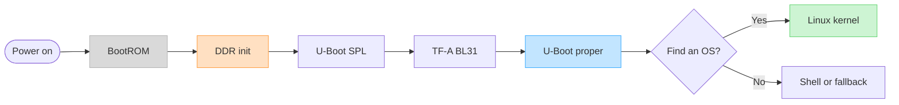

# Boot firmware — U-Boot on the ROCK 5B

## Project brief

| Field | Contents |
|-------|----------|
| Purpose | Explain what happens between power-on and Linux, make the installed boot firmware identifiable, and keep SD/SPI/eMMC/NVMe recovery work understandable without requiring prior U-Boot knowledge. |
| Developer focus | The RK3588 BootROM → DDR init → SPL → TF-A → U-Boot proper chain, U-Boot's own device tree and environment, OS discovery, Rockchip image packaging, and the differences between the Armbian, Radxa, and upstream trees. |
| Owns | The durable U-Boot primer, version comparison, debugging method, warm-reset ramoops-retention boundary, and boot-firmware vocabulary. Dated observations and raw captures still enter through [`../findings/`](../findings/README.md); destructive board operations remain in [`../scripts/`](../scripts/README.md). |
| Depends on | Rockchip's immutable BootROM, an RK3588 DDR-training binary or TPL, TF-A BL31, the selected U-Boot source/configuration, and recoverable storage. |
| Evidence boundary | [`docs/version-comparison.md`](docs/version-comparison.md) owns the pinned artifact/source conclusions, [`docs/ramoops-retention.md`](docs/ramoops-retention.md) owns warm-reset evidence, and [`../status.md`](../status.md) track 12 owns the current public boot verdict and next proof. |

## Start here

| Question | Read |
|---|---|
| What is U-Boot, and what runs before it? | [`docs/u-boot-primer.md`](docs/u-boot-primer.md) |
| How do Armbian 26.2, 26.5, Radxa, and upstream differ? | [`docs/version-comparison.md`](docs/version-comparison.md) |
| Where did a boot stop, and what should I inspect next? | [`docs/debugging.md`](docs/debugging.md) |
| Why does ramoops return empty after a warm reset, and what is actually proven? | [`docs/ramoops-retention.md`](docs/ramoops-retention.md) |
| How do I check a published Rockchip image for the zero-DTB FIT race without downloading it in full? | [`scripts/audit-armbian-rockchip-fit.sh`](scripts/audit-armbian-rockchip-fit.sh); use [`scripts/audit-armbian-radxa-catalog.sh`](scripts/audit-armbian-radxa-catalog.sh) for every image linked from one or more board pages. |
| What do SPL, BL31, FIT, Bootstd, and `idbloader.img` mean? | [`keywords.md`](keywords.md) |
| What is the dated public state and next hardware proof? | [`../status.md`](../status.md) track 12 |
| How do I back up, erase, or restore SPI safely? | [`../scripts/`](../scripts/README.md) |

## The 30-second model

U-Boot is not the first code that runs and it is not the operating system. On
this board it is a chain of cooperating stages:

Three distinctions prevent most reasoning mistakes:

1. **Firmware source and firmware package are different identities.** An
   Armbian `current` package can still contain Radxa's vendor U-Boot 2017.09
   fork; `current` may name the kernel family, not the U-Boot lineage.
2. **Boot source and OS target are separate choices.** BootROM may load U-Boot
   from SPI, then U-Boot may load Linux from NVMe or SD.
3. **There are two device trees.** U-Boot needs a control DTB to operate its own
   drivers; Linux later receives a kernel DTB describing the machine to Linux.

## What this project does not claim

- A successful build is not proof that the image boots.
- A FIT hash or enabled RSA option is not proof of an enforced secure-boot
  chain; signatures, trusted keys, verification policy, and fuses all matter.
- No bootloader should be written to SPI or raw SD sectors merely because its
  source looks newer. Keep a verified backup and an independent recovery path.
- A source-supported explanation or valid-looking FIT is not a board result;
  read the comparison's trust boundary and status track 12 before relying on it.

## Source anchors

The maintained comparison is pinned to these sibling trees:

| Tree | Pin |
|---|---|
| Armbian 26.2.1 reconstruction | `radxa/u-boot` `6c807ac5008722e240f5282229c15a40aba4918f` |
| Armbian 26.5.1 current reconstruction | `radxa/u-boot` `39cd993e5d6296635438e84f4576b3a9bf76f86e` |
| Radxa development tip | `d9ab7ec6029573ac538b6707a0dffd0a5d049e77` |
| Upstream development tip | `6741b0dfb41dc82a284ab1cff4c58af6ef2f3f9c` |

Paths and reconstruction details are recorded in the
[version comparison](docs/version-comparison.md#evidence-and-reproduction).
