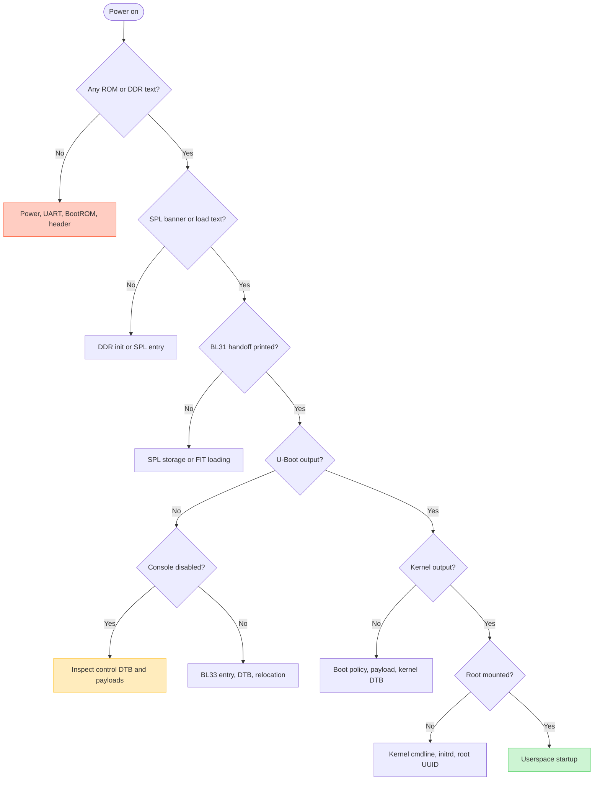
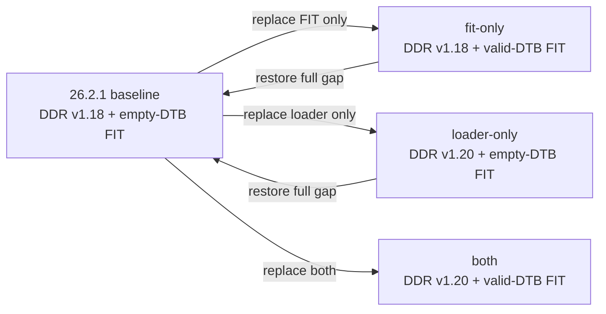

# Debugging ROCK 5B boot firmware

The goal is not to "try another U-Boot" at random. It is to identify the last
stage known to have executed, preserve a recovery path, and change one boot-chain
variable at a time.

## Safety boundary

Reading files, inspecting FIT metadata, hashing artifacts, listing block
devices, and capturing UART are low-risk. Writing SPI, writing raw SD/eMMC
sectors, erasing flash, changing persistent U-Boot environment, or installing a
kernel are destructive operations.

Before any write:

1. identify the board and exact target device;
2. capture hashes and a full backup of the region being changed;
3. verify the backup can be read independently;
4. keep a second boot/recovery route;
5. write only the intended bytes and verify readback;
6. record both firmware source and intended OS target.

The maintained SPI scripts implement additional board and size checks. Use
their dry-run modes; do not copy raw commands from an investigation into an
unidentified device. See [`../../scripts/README.md`](../../scripts/README.md).

## 1. Locate the last proven stage



Absence of a message is weaker evidence than presence of one. In particular,
the inspected vendor builds set `CONFIG_DISABLE_CONSOLE=y`; no U-Boot banner
after BL31 does not prove U-Boot failed. It does, however, make packaged control
data and a diagnostic rebuild much more important.

## 2. Capture identity before interpretation

For an installed Armbian package, retain:

```bash
dpkg-query -W 'linux-u-boot-*'
find /usr/lib -maxdepth 2 -type f -path '*linux-u-boot*' -printf '%p %s bytes\n'
sha256sum /usr/lib/linux-u-boot-*-rock-5b/idbloader.img
sha256sum /usr/lib/linux-u-boot-*-rock-5b/u-boot.itb
```

Package paths vary by branch, so review shell expansion before using any output
as input to a write command.

Record package metadata rather than trusting the package filename:

```bash
sed -n '1,200p' /usr/lib/linux-u-boot-*-rock-5b/u-boot-metadata.sh
sed -n '1,120p' /usr/lib/linux-u-boot-*-rock-5b/u-boot-metadata-target-1.sh
```

The high-value fields are source URL, Git revision, patch directory, artifact
version, make variables, and binary list.

## 3. Inspect artifacts without building

### Identify DDR and SPL

```bash
strings idbloader.img | grep -E 'ddr-v|DDR .*fwver|U-Boot SPL'
```

This commonly exposes the DDR firmware version, its internal build identity,
the U-Boot SPL version string, and build date. Treat strings as identification,
not cryptographic proof; pair them with whole-file hashes.

### Inventory a FIT

```bash
dumpimage -l u-boot.itb
```

Check every component:

- description and type;
- data size;
- load address;
- hash algorithm and value;
- selected configuration;
- firmware, FDT, and loadable references;
- signature algorithm **and whether a signature value is present**.

A parser successfully listing a FIT proves only that the container is
structurally readable. It does not prove its required payloads are nonempty or
that the board accepts them.

For this vendor configuration, a zero-byte FDT is a release-blocking anomaly:

```text
Image (fdt)
  Data Size: 0 Bytes
  Hash value: e3b0c44298fc...  # SHA-256 of empty data
```

### Compare components, not just container hashes

Two FITs can have different whole-file hashes because of timestamps or version
strings while carrying identical BL31 segments. Conversely, similar package
metadata can hide a zero versus nonzero component. Save the `dumpimage -l`
output beside the whole-file hash.

## 4. Distinguish the four major failure classes

| Boundary | Evidence that reaches it | Common next checks |
|---|---|---|
| BootROM → DDR | DDR/version line | raw offset, Rockchip header, DDR blob, power, board/RAM compatibility |
| DDR/SPL → FIT | SPL banner or load message | boot device, offset, storage driver, FIT header/hash/configuration |
| SPL/BL31 → U-Boot proper | BL31 announces normal-world handoff | BL33 load/entry, U-Boot control DTB, SPL relocation, console configuration |
| U-Boot → Linux | device scan, boot menu, `Starting kernel` | boot target order, boot script/extlinux/EFI, kernel/initrd/kernel-DTB paths |
| Linux → root filesystem | kernel messages | `console=`, initrd modules, root UUID, storage driver, filesystem integrity |

Do not transplant a kernel to test a pre-BL33 hypothesis. Do not change the DDR
blob and control DTB simultaneously if the objective is to discriminate them.

## 5. UART and console reasoning

UART capture must match voltage, pins, baud, and console instance. RK3588 logs
can come from different stages with different drivers. A readable DDR/BL31 log
does not guarantee U-Boot proper uses the same enabled console.

Record:

```text
adapter voltage and ground
TX/RX pins and board header
baud, data bits, parity, stop bits
first byte captured after power-on
exact last complete line
whether output resumes at the Linux kernel
```

For a diagnostic vendor build, remove `CONFIG_DISABLE_CONSOLE`, use a nonzero
boot delay, and keep the known-working debug UART settings. That changes timing
and binary identity, so it is a diagnostic image—not proof the original image
would have printed the same path.

## 6. Inspect U-Boot interactively when a prompt is available

Start with read-only commands:

```text
version
bdinfo
printenv
help
dm tree
mmc list
nvme scan
pci enum
```

Then inventory storage without writing:

```text
part list mmc 1
ls mmc 1:1 /
ls mmc 1:1 /boot
bootflow scan -l
```

Command availability depends on the build. The vendor tree may expose legacy
`distro_bootcmd` but not Bootstd's `bootflow`; upstream is the reverse model.
An unknown command is a configuration result, not necessarily a runtime fault.

Avoid `saveenv`, `sf update`, `mmc write`, `gpt write`, `erase`, `fastboot
flash`, or `ums` until the target and recovery consequences are explicit.

## 7. Read boot policy in the correct layer

Trace in this order:

1. resolved `.config` for enabled device/command support;
2. compiled environment/default boot command;
3. persistent environment backend and contents, if enabled;
4. U-Boot control DTB for enabled controllers and aliases;
5. partition boot flags and filesystem contents;
6. `boot.scr`, extlinux, or EFI variables;
7. kernel command line and root filesystem identity.

This avoids blaming device order when the PCIe driver is absent, or blaming
U-Boot when the discovered extlinux stanza points to a missing initrd.

## 8. Package/build gates worth automating

A ROCK 5B boot-firmware package should fail its build if any of these checks
fail:

- expected output file absent or zero-size;
- `dumpimage -l` cannot parse the FIT;
- required FIT component absent or zero-size;
- FIT configuration references a missing image;
- DDR/TPL or BL31 input does not match the declared pin/hash;
- control DTB cannot be parsed by `fdtget`/`dtc` tooling;
- final binary sizes exceed their reserved layout regions;
- final artifact hashes and component inventory are not recorded.

The Radxa Makefile race shows why "make exited zero" is insufficient.

## 9. Current ROCK 5B discriminator

The present evidence is:

```text
26.2.1 vendor: DDR v1.18, valid SPL/BL31 progress, empty control DTB
26.5.1 vendor: DDR v1.20, empty control DTB, HDMI appears but boot incomplete
26.5.1 current: DDR v1.20, valid 12,752-byte control DTB, raw path untested
```

Use the maintained
[`rock5b-sd-uboot-hypothesis-test.sh`](../../scripts/rock5b-sd-uboot-hypothesis-test.sh)
runbook to preserve the brand-new 26.2.1 card and change one raw component at a
time:



A `fit-only` success is the cleanest support for the empty-control-DTB/BL33
package hypothesis because DDR v1.18 and the 26.2.1 SPL remain in place. A
`loader-only` success instead favors the DDR/SPL path, with the caveat that it
is a mixed-stage image. `both` is the positive-control candidate. A failure of
all three means the next split is BL33 entry versus disabled console versus OS
discovery—not another simultaneous artifact change. Capture UART and HDMI for
each boot, and restore the complete baseline raw gap between variants.

## 10. Evidence template

```text
Date/time and operator:
Board/RAM revision and attached media:
Power source:
Firmware source path: SPI | raw SD | raw eMMC | unknown
Intended OS target: NVMe | SD | eMMC | USB | network
U-Boot package/source commit:
DDR/TPL hash and version:
BL31 hash and version:
idbloader hash:
U-Boot/FIT hash:
Control-DTB size/hash:
Persistent environment backend/hash:
UART settings and complete log:
HDMI observation/photo:
Last proven stage:
One variable changed from baseline:
Readback verification:
SD baseline image/hash:
SD test variant: baseline | fit-only | loader-only | both
SPI state/hash (held constant):
Boot result and exact last line:
Baseline restored and verified afterward:
Recovery result:
```

Link the result into the status track only after distinguishing observation
from inference. The version-specific evidence lives in
[`version-comparison.md`](version-comparison.md).
