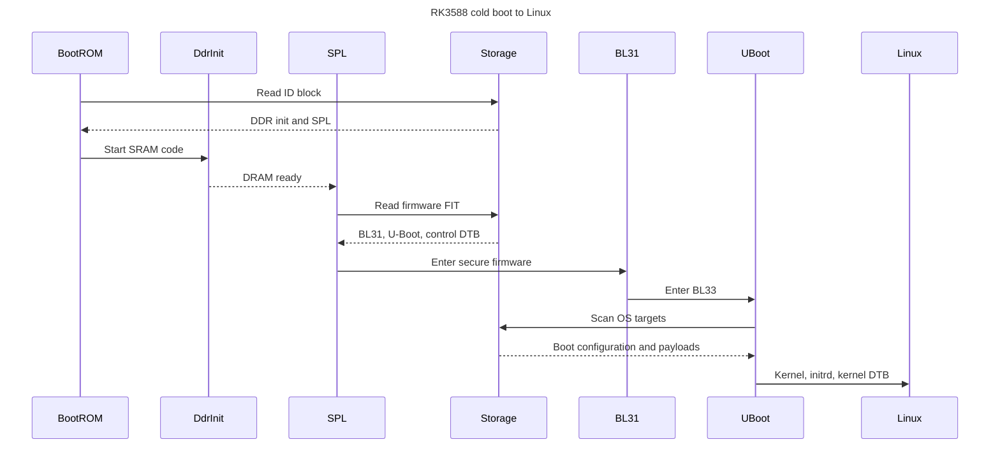
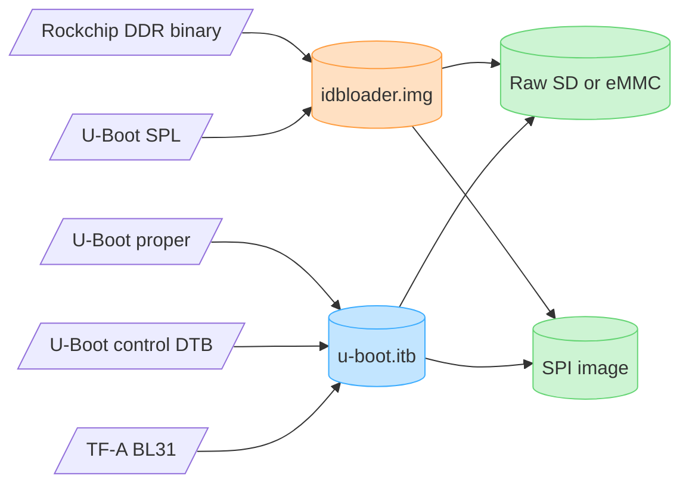
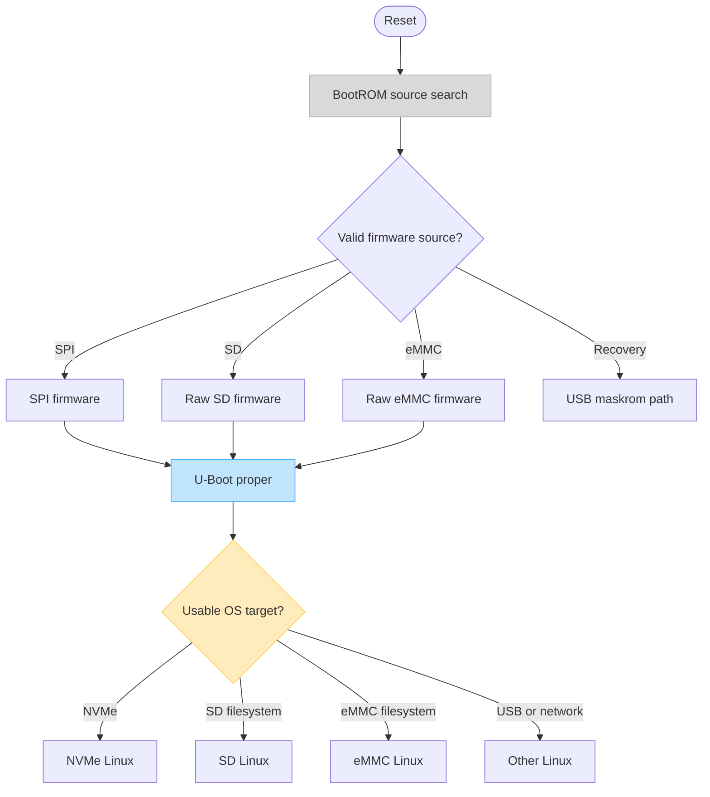
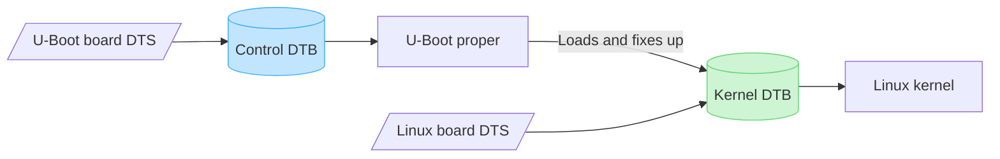

# U-Boot primer for the ROCK 5B

This guide starts with the general U-Boot model and then makes it concrete for
the Radxa ROCK 5B's RK3588. The exact filenames and offsets are not universal:
they are consequences of the SoC boot protocol, board configuration, packager,
and chosen U-Boot lineage.

## Fast re-entry

| Question to recover | Read | Load-bearing fact |
|---------------------|------|-------------------|
| Which program owns a visible failure? | [Cold-boot sequence](#2-the-rk3588-cold-boot-sequence) | BootROM, DDR init, SPL, BL31, U-Boot proper, and Linux are different programs with different inputs and failure signals. |
| Which bytes contain each stage? | [Vendor artifacts](#3-how-the-examined-vendor-artifacts-fit-together) | `idbloader.img`, `u-boot.itb`, raw-media placement, and a filesystem image are separate identities; mounting a partition does not reveal every boot component. |
| Did firmware and Linux come from the same medium? | [Boot source vs OS target](#4-boot-source-is-not-os-target) | BootROM chooses a firmware source first; U-Boot later chooses an OS target. Record both sides of the arrow. |
| Why can U-Boot proper run yet fail before Linux? | [Driver model and control DTB](#driver-model-and-the-control-dtb) | U-Boot proper needs its own control DTB and drivers before it can discover or load the OS. |
| Which configuration actually controls boot policy? | [Environment](#environment) and [commands/scripts](#commands-scripts-and-boot-policy) | Compiled defaults, an optional persistent environment, distro scripts, and OS descriptions are distinct state sources. |
| Which device tree am I inspecting? | [Two-device-tree rule](#6-the-two-device-tree-rule) | U-Boot's control DTB describes firmware; the kernel DTB later describes hardware to Linux. One cannot substitute for the other. |
| What do FIT and binman prove? | [FIT/binman](#7-fit-hashes-signatures-and-binman) | A container inventory or hash proves composition/integrity, not successful execution or an enforced secure-boot policy. |
| How do I name one reproducible build? | [Configuration identities](#8-configuration-identities) and [practical build identity](#9-a-practical-definition-of-one-bootloader-build) | Source commit alone is insufficient; record configs, external blobs, control DTB, toolchain, packaging, and final artifact hashes. |

### One boot, eight ownership transitions

```text
BootROM source choice
  → DDR firmware makes DRAM usable
  → SPL loads the later firmware package
  → BL31 establishes EL3/PSCI
  → U-Boot proper binds through its control DTB
  → boot policy chooses an OS description and target
  → U-Boot passes kernel + initrd + kernel DTB
  → Linux mounts the root filesystem
```

When a run stops, preserve the last transition that is **proven**, not merely
the last component expected to run. Then use the
[boot debugging guide](debugging.md#1-locate-the-last-proven-stage) to choose
the next discriminator.

## 1. What U-Boot is

U-Boot is an open-source firmware project commonly used to initialize embedded
boards and start an operating system. Depending on the platform and build, it
can provide:

- small early loaders (TPL and SPL);
- U-Boot proper, with a shell and driver model;
- block, filesystem, USB, PCIe, network, display, and console drivers;
- parsers for extlinux, boot scripts, EFI applications, FITs, and other images;
- image verification, recovery/download protocols, and firmware-update tools.

"U-Boot" can therefore mean the whole project, one early stage, the interactive
program, or a packaged image. Always name the stage or artifact when debugging.

U-Boot is **not** the RK3588 BootROM, the DDR-training binary, TF-A, OP-TEE, the
Linux kernel, or the boot configuration stored by a distribution. It often
packages or hands off to those components, which is why logs can look like one
large program.

## 2. The RK3588 cold-boot sequence

The chain below describes the examined Armbian/Radxa `spl-blobs` arrangement.
Upstream binman changes the packaging, but the functional responsibilities are
similar.



### BootROM

The immutable BootROM is burned into the SoC. It runs from internal memory,
interprets Rockchip boot headers, and probes ROM-defined boot sources. Software
can choose what valid images exist on SPI, SD, or eMMC, but it cannot replace
the ROM.

Do not assume one universal source order. Straps, recovery conditions, media
contents, and SoC behavior matter. On this board, measured experiments show
that clearing the SD raw-loader region can change which usable SPI path is
reached, so "SPI is installed" does not prove SPI supplied the current SPL.

### DDR init / TPL

Large later stages need external DRAM, but DRAM is not usable immediately after
reset. An early binary configures the controller and trains the attached
LPDDR4/LPDDR5 memory.

U-Boot calls its earliest optional stage **TPL** (tertiary program loader).
Many RK3588 builds instead use Rockchip's proprietary DDR binary as the TPL-like
input. Upstream names that external build input `ROCKCHIP_TPL`; Armbian's
vendor path gives `mkimage` a Rockchip DDR blob followed by U-Boot SPL.

The DDR binary is executable firmware, not passive timing data. Its version is
part of the bootloader identity: the inspected Armbian 26.2 image uses v1.18,
26.5 uses v1.20, and the companion Radxa build checkout currently selects
v1.22.

### SPL

**SPL** is U-Boot's secondary program loader: a size-constrained U-Boot build
that runs before U-Boot proper. It initializes just enough clocks, pin control,
storage, memory bookkeeping, and image parsing to find and load later stages.

On the examined vendor path, `idbloader.img` combines the DDR blob and SPL.
BootROM loads it from the Rockchip ID-block location. SPL then reads
`u-boot.itb`, chooses a FIT configuration, places the components at their load
addresses, and arranges the secure-firmware handoff.

SPL has its own Kconfig subset, device tree, memory limits, and relocation
behavior. A line such as `CONFIG_SPL_SKIP_RELOCATE` changes SPL itself; it is
not a Linux setting and not merely a packaging option.

### TF-A BL31 and optional BL32

Arm Trusted Firmware-A (**TF-A**) supplies the EL3 runtime firmware. Its BL31
stage initializes secure-world services and PSCI, then transfers to the normal
world. U-Boot proper is the **BL33** payload in this vocabulary.

An optional **BL32** payload is a trusted execution environment such as OP-TEE.
A missing or disabled BL32 is not automatically fatal: BL31 can explicitly
continue to BL33. Diagnose the final handoff message and the actual configured
chain instead of treating any OP-TEE warning as the root cause.

### U-Boot proper / BL33

This is the full interactive firmware people normally picture. It relocates as
configured, binds drivers from its control device tree, establishes an
environment, discovers devices, finds an OS description, loads the kernel
payloads, prepares the kernel device tree, and jumps to Linux.

The examined vendor builds compile the console out and set zero boot delay.
U-Boot proper can therefore fail—or even run normally—without printing a
banner or accepting an interruption.

### Linux

U-Boot normally hands Linux three major payloads:

- the kernel image;
- an optional initrd/initramfs;
- the **kernel device tree**, after any firmware fixups.

From this point, Linux owns the hardware. A kernel panic, missing root
filesystem, or wrong `console=` parameter is later than a U-Boot control-DTB
failure even if both end with a blank screen.

## 3. How the examined vendor artifacts fit together



For the captured Armbian raw SD layout:

```text
byte offset   sector     content
0x00008000        64     idbloader.img
0x00800000     16384     u-boot.itb
```

These offsets are outside normal filesystem contents. Reformatting or copying
the root filesystem does not necessarily replace them, and mounting the SD
partitions does not reveal them. Conversely, writing a filesystem image can
overwrite them even though no file named `u-boot.itb` appears in the mounted
tree.

Upstream Rockchip U-Boot uses binman to produce ready-to-place
`u-boot-rockchip.bin` for SD/eMMC and `u-boot-rockchip-spi.bin` for SPI. The
upstream SD image is written at the Rockchip 32 KiB position (`seek=64` with a
512-byte block), but its internal composition is defined by binman rather than
Armbian's separate-artifact procedure.

## 4. Boot source is not OS target

Two independent searches happen during a normal boot:



Examples:

- **SPI → NVMe:** BootROM/SPL/U-Boot come from SPI; Linux and its root
  filesystem come from NVMe. This is the known-good local baseline.
- **SPI → SD:** firmware comes from SPI, but U-Boot reads the kernel and root
  from SD.
- **raw SD → SD:** both firmware and Linux payloads originate on SD, but from
  different regions.

When reporting a result, say both sides. "Booted from SD" is ambiguous.

## 5. U-Boot proper's internal model

### Driver model and the control DTB

Modern U-Boot uses a device model similar in spirit to Linux: drivers bind to
devices described by a device tree, are grouped into uclasses such as MMC or
PCI, and are probed as needed. U-Boot proper's **control DTB** tells U-Boot
which UART, clocks, regulators, storage controllers, PCIe roots, USB ports, and
other devices exist for the firmware to use.

`CONFIG_OF_SEPARATE=y` means the control DTB is a separate build artifact
packaged beside `u-boot-nodtb.bin`. If that DTB is empty, U-Boot proper has
executable code but lacks the external hardware description that build expects.

### Environment

The U-Boot environment is a key/value store used for settings and scripts:

```text
bootcmd=...
boot_targets=...
fdtfile=rockchip/rk3588-rock-5b.dtb
kernel_addr_r=...
```

It has two layers:

1. compiled defaults from Kconfig, headers, and text environments;
2. an optional persistent copy in SPI, MMC, EEPROM, or another backend.

The examined Armbian/Radxa package has `CONFIG_ENV_IS_NOWHERE=y`, so there is
no normal persistent environment backend. Changing a variable at a prompt does
not imply it will survive reset. Upstream or custom Armbian builds can choose a
persistent SPI environment, which then becomes another state source that must
be recorded and recoverable.

### Commands, scripts, and boot policy

U-Boot commands (`mmc`, `nvme`, `pci`, `load`, `ext4ls`, `booti`, `bootm`,
`printenv`) are building blocks. Boot policy decides which are called and in
what order.

The vendor tree uses legacy **distro boot** environment scripts, then Rockchip
fallbacks such as `boot_fit` and `bootrkp`. The effective examined ROCK 5B
vendor build scans USB, SD, NVMe, eMMC, MTD and network methods according to
the enabled commands and compiled target list.

Modern upstream enables **Standard Boot (Bootstd)**. Its vocabulary is:

- **bootdev:** somewhere an OS can be found, such as MMC or NVMe;
- **bootmeth:** a discovery format, such as extlinux or EFI;
- **bootflow:** one concrete bootable OS description found by applying a
  bootmeth to a bootdev.

Conceptually:

```text
for each bootdev
    for each bootmeth
        for each bootflow
            try to boot it
```

This replaces much of the large environment-script graph with driver-model
objects and commands such as `bootflow scan -lb`.

### Common OS descriptions

| Mechanism | What U-Boot finds | Typical command/path |
|---|---|---|
| extlinux | text describing kernel, initrd, DTB, command line | `/boot/extlinux/extlinux.conf` or `extlinux/extlinux.conf` |
| boot script | a compiled U-Boot command script | `boot.scr` made from `boot.cmd` |
| EFI | an EFI executable and optional EFI boot-manager variables | `BOOTAA64.EFI`, EFI boot options |
| FIT | one container with images, hashes, configurations, optional signatures | `bootm` / SPL FIT loading |
| Android/vendor | Android boot/recovery partitions and vendor metadata | vendor-specific commands |

An Armbian kernel DTB named in a boot script is not the same DTB used to run
U-Boot itself.

## 6. The two-device-tree rule



| Property | U-Boot control DTB | Linux kernel DTB |
|---|---|---|
| Consumer | SPL and/or U-Boot proper | Linux |
| Purpose | Run firmware drivers and package images | Describe the complete runtime machine |
| Typical source | U-Boot tree plus `*-u-boot.dtsi` additions | Linux DTS tree |
| Typical size | often minimized to early/firmware needs | generally fuller hardware description |
| Failure symptom | early firmware cannot bind required devices | kernel probes wrong/missing hardware |

Upstream U-Boot now imports Linux-synchronized RK3588 DTS files and layers
U-Boot-only `bootph-*` and firmware properties in `*-u-boot.dtsi`. The Radxa
vendor fork carries a compact SDK-era board DTS directly under
`arch/arm/dts/`.

## 7. FIT, hashes, signatures, and binman

### FIT

A Flattened Image Tree is a device-tree-shaped container. It can contain
U-Boot, TF-A, an OS kernel, DTBs, ramdisks, hashes, multiple configurations,
and signatures. SPL uses the configuration to choose and place later stages.

A hash detects accidental or malicious content changes **only if the hash
metadata itself is trusted**. A signature can authenticate a configuration
only if verification is enabled, the correct public key is trusted by an
earlier stage, failure is enforced, and the chain begins from an immutable or
otherwise trusted root.

The captured vendor FITs advertise `sha256,rsa2048:dev`, but `dumpimage`
reports the signature value as unavailable. That is not evidence of an
enforced secure boot chain.

### binman

Binman is U-Boot's image-assembly tool. It describes final offsets, padding,
and nested entries in device tree, then assembles the built binaries and
external blobs once. FIT remains a container binman can create and place;
binman solves the surrounding SoC image layout.

This distinction matters here because the Radxa vendor path has a Makefile/FIT
dependency race. Upstream's RK3588 path has moved final image composition to
binman and no longer uses that custom generator.

## 8. Configuration identities

Several similarly named files answer different questions:

| File/term | Meaning |
|---|---|
| `configs/rock5b-rk3588_defconfig` | minimal upstream board configuration |
| `configs/rock-5b-rk3588_defconfig` | Radxa vendor board configuration |
| `.config` | fully resolved Kconfig result for one build directory |
| `defconfig` saved by Armbian | generated minimal config captured in a package |
| `CONFIG_*` | one compile-time feature or value |
| local version | string embedded in banners/artifacts; identity, not necessarily behavior |

Comparing defconfigs alone can miss Kconfig default changes between trees.
Comparing `.config` files alone can drown the meaningful differences in renamed
symbols. A useful review does both, then traces the few important symbols into
code and packaged output.

## 9. A practical definition of one bootloader build

Record all of these before saying two images are the same:

```text
U-Boot repository + commit
board defconfig + resolved .config
U-Boot/Armbian patch set
cross compiler and relevant build variables
DDR/TPL binary and hash
TF-A BL31 binary and hash
optional BL32/TEE binary and hash
control DTB and hash
image assembly method and final artifact hashes
boot medium and raw offsets
persistent environment, if any
```

The [version comparison](version-comparison.md) applies this identity to the
four local lineages. The [debugging guide](debugging.md) shows how to inspect a
packaged image without building or flashing it.
