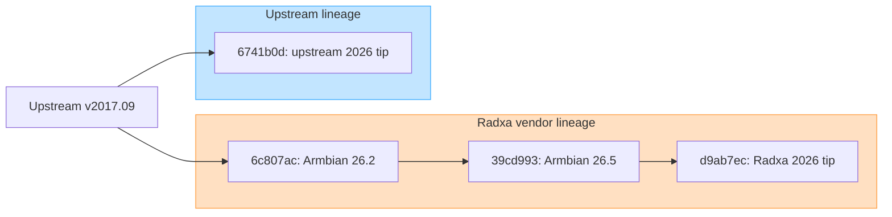
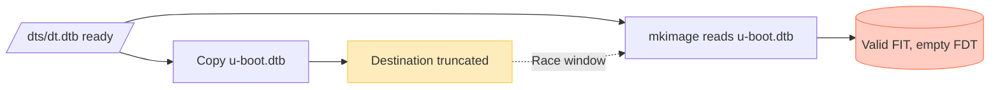

# ROCK 5B U-Boot lineage and version comparison

This is the durable comparison of the U-Boot sources and packages currently
available in the sibling workspaces. It separates five things that version
labels often collapse: source lineage, exact commit, board configuration,
external firmware blobs, and final packaged bytes.

Claims are SOURCE-INSPECTED, CONFIG-INSPECTED, or CODE-INSPECTED unless marked
**INFERRED**. Runtime state and the next hardware proof remain in
[`../../status.md`](../../status.md) track 12.

## 1. The names do not mean what they first appear to mean



Armbian 26.5.1 **current** still packages Radxa's vendor-derived U-Boot whose
reported base version is 2017.09. `current` names the Armbian kernel/package
branch; it does not mean current upstream U-Boot. Armbian's captured build
framework uses upstream U-Boot v2026.01 only for its separate `edge` path.

The Radxa and upstream tips share merge base `v2017.09` commit
`c98ac3487e413c71e5d36322ef3324b21c6f60f9c`. From there the inspected tips
contain 9,587 Radxa-lineage-only commits and 60,644 upstream-lineage-only
commits. This is a deep fork, not a small patch queue.

## 2. Exact baselines

| Name | Exact source | Build/package context | External firmware |
|---|---|---|---|
| Armbian 26.2.1 vendor | `radxa/u-boot` `6c807ac5008722e240f5282229c15a40aba4918f`; Armbian build `5abb97453fbabc453df560ee5b13fcc0ce31f417` | official Trixie vendor 6.1.115 minimal image | DDR v1.18; BL31 v1.48 |
| Armbian 26.5.1 current | `radxa/u-boot` `39cd993e5d6296635438e84f4576b3a9bf76f86e`; Armbian build `603aa92aed425c0b14e5f923259a14ccd0719379` | installed/downloaded `linux-u-boot-rock-5b-current` | DDR v1.20 dated 2025-09-26; BL31 v1.48 |
| Armbian 26.5.1 vendor control | same `39cd993e...` source and saved functional config | downloaded `linux-u-boot-rock-5b-vendor` | same DDR v1.20 and BL31 v1.48 |
| Radxa tip | branch `next-dev-v2026.01` at `d9ab7ec6029573ac538b6707a0dffd0a5d049e77` | direct source checkout | companion `radxa-build` selects DDR v1.22 and BL31 v1.54 |
| Upstream tip | `master` at `6741b0dfb41dc82a284ab1cff4c58af6ef2f3f9c`, described as `v2026.07-730-g6741b0dfb41` | direct source checkout | `ROCKCHIP_TPL` and `BL31` are external build choices |

The 26.5 vendor package is not a fifth requested lineage. It is a useful
control because it shares the 26.5 source and blobs but reproduced the failing
FIT property seen in 26.2.

## 3. Armbian 26.2 versus 26.5

The source move is surprisingly small. Exactly two commits separate the pins:

1. remove a USB high-speed limit on Radxa CM5 IO;
2. enable XMC SPI flash in RK3576 configurations.

Neither touches ROCK 5B. Direct inspection finds:

- byte-identical `arch/arm/dts/rk3588-rock-5b.dts`;
- byte-identical `configs/rock-5b-rk3588_defconfig`;
- effective `.config` and package `defconfig` differences limited to
  `CONFIG_LOCALVERSION`;
- the same 1,179,864-byte U-Boot-proper component in each captured FIT;
- byte-identical BL31 FIT components.

The meaningful input changes are the DDR binary, build identity/timestamp, and
whether the final FIT captured a valid control DTB.

| Artifact/property | 26.2.1 vendor | 26.5.1 current |
|---|---:|---:|
| DDR firmware | v1.18 (`9fa84341ce`) | v1.20 (`b8ce94f14b`) |
| `idbloader.img` size | 321,536 B | 323,584 B |
| `idbloader.img` SHA-256 | `961f208930865f1096b4f0f947b06b3ce47f1c443c945d7fd04c7727f5334f8b` | `f9dbc3b5fa6178bd68b756ac8203f05dbd78c2086d794d4d9bbbf805dcad4f72` |
| FIT control DTB | **0 B** | **12,752 B** |
| `u-boot.itb` size | 1,448,960 B | 1,461,760 B |
| `u-boot.itb` SHA-256 | `54350eaf2ae3a616ffe5cbb804878eb05971161509c6f09cb1cba22680ab6c44` | `98e2c8af220907929221c1677c4c09dc9be3bdec5fa43ded738a124763988779` |
| `rkspi_loader.img` SHA-256 | `740c95e013883f6768875d16e921672693ee95a9a5adafec854b455b84666e28` | `38b40ad14ec672899ff51118d65d10970f026f366a5c10afdbb82851b89aeacf` |

The 26.5.1 vendor control also has a zero-byte DTB. Its hashes are preserved in
[`../../downloads/armbian-rock5b-uboot-compare/README.md`](../../downloads/armbian-rock5b-uboot-compare/README.md).

## 4. The packaged control-DTB race

All three captured vendor-lineage FITs have the same U-Boot payload size and
the same three BL31 component hashes. Their control-DTB entries differ:

| Captured image | Control DTB size | SHA-256 |
|---|---:|---|
| Armbian 26.2.1 vendor | 0 B | empty-data hash `e3b0c442...` |
| Armbian 26.5.1 vendor | 0 B | empty-data hash `e3b0c442...` |
| Armbian 26.5.1 current | 12,752 B | `6ed9a9d75157ca30d7fcff27670b782a335cfa949dc446d6b9dfebc1fec39078` |

The build requires a separate control DTB:

```text
CONFIG_OF_CONTROL=y
CONFIG_OF_SEPARATE=y
CONFIG_OF_EMBED is not set
CONFIG_OF_PRIOR_STAGE is not set
```

The Radxa FIT generator includes `u-boot.dtb`, but the Makefile target for
`u-boot.itb` depends on `dts/dt.dtb` rather than on that copied file:

```make
u-boot.dtb: dts/dt.dtb FORCE
	$(call cmd,copy)

u-boot.itb: u-boot-nodtb.bin dts/dt.dtb $(U_BOOT_ITS) FORCE
	$(call if_changed,mkfitimage)
```

Armbian requests `u-boot.dtb` and `u-boot.itb` together in the `spl-blobs`
build. The missing dependency permits this ordering:



If `mkimage` reads after `cp` opens/truncates the destination but before the
copy completes, the FIT is structurally valid while its FDT data is empty. The
26.5 current build captured the completed file; the two vendor builds did not.

**INFERRED:** this race is the leading immediate explanation for the silent
post-BL31 vendor failure. It fits the packaged bytes and code, but has not been
proven with a repeated controlled build or the pending 26.5-current hardware
test. The older claim that zero length was intentional is superseded.

The minimal correction is to make `u-boot.itb` depend on `u-boot.dtb` (or make
the generator include its declared `dts/dt.dtb` input). A packaging gate should
reject a FIT whose required FDT component has zero bytes. Radxa tip still
contains this dependency bug; upstream no longer uses the custom generator.

## 5. Armbian/Radxa vendor feature profile

The inspected effective configuration provides:

- compile-time-disabled console and zero boot delay;
- legacy distro-boot scripts followed by Rockchip `boot_fit` / `bootrkp`;
- enabled USB, SD, eMMC, NVMe, MTD, PXE and DHCP paths;
- RockUSB, USB mass storage, fastboot, Android boot image, and AVB code;
- Rockchip integrated-GMAC and display/HDMI/DP drivers;
- FIT hashing/RSA code and hardware-crypto hooks;
- no EFI loader;
- no persistent environment (`ENV_IS_NOWHERE`);
- separate `idbloader.img` + `u-boot.itb`, with Armbian building a 16 MiB SPI
  image around the components.

The board's physical Ethernet is a PCIe RTL8125B, not the SoC GMAC. Enabling a
driver in a generic vendor config does not prove it reaches the board's wired
NIC.

The FIT advertises `sha256,rsa2048:dev`, but the captured signature value is
unavailable. This configuration is not evidence of an enforced verified chain.

## 6. Armbian 26.5 versus Radxa tip

From `39cd993e...` to `d9ab7ec...` there are 1,014 reachable commits and a net
change of 546 files, 123,587 insertions, and 35,254 deletions. Most churn is
new boards and shared vendor infrastructure. The ROCK 5B DTS remains
byte-identical.

The direct board-defconfig delta is:

```text
# CONFIG_SPL_SKIP_RELOCATE is not set
```

Armbian's effective package has `CONFIG_SPL_SKIP_RELOCATE=y`; Radxa tip enables
SPL relocation through commit `b1ffb198e90`. This is an actual early-stage
behavior change even though the board DTS did not move.

Shared changes also touch RK3588 MMU/QoS setup, eMMC iomux and clock behavior,
PCIe retries/error handling, USB gadget paths, OTP-derived MAC handling, and
OP-TEE configuration. A direct Radxa build additionally changes DDR v1.20 to
v1.22 and BL31 v1.48 to v1.54 if it follows the companion `radxa-build`
checkout. Qualify these as one new firmware bundle rather than crediting the
commit count.

## 7. Vendor versus upstream architecture

| Capability | Armbian/Radxa vendor | Upstream tip |
|---|---|---|
| Board model | generic RK3588 EVB target plus vendor board DTS | dedicated `TARGET_ROCK5B_RK3588`; ADC/DRAM detection also selects ROCK 5B+ and 5T |
| Device tree | compact SDK-era DTS in U-Boot tree | Linux-synchronized DTS import plus U-Boot-only dtsi |
| OS discovery | legacy environment-script distro boot plus vendor fallbacks | Bootstd/bootflow with extlinux, EFI, script, PXE and VBE methods |
| Console | compiled out; delay 0 | serial enabled; delay 2 |
| EFI | disabled | enabled |
| Android / AVB / fastboot | selected | not selected in ROCK 5B defconfig; RockUSB and UMS remain |
| U-Boot display | Rockchip DRM/HDMI/DP selected | no video driver selected in board defconfig |
| Board Ethernet | vendor config selects SoC GMAC | PCIe RTL8169-family driver includes RTL8125B support |
| Storage | SD/eMMC/NVMe/USB and vendor MTD | SD/eMMC HS200, NVMe, AHCI/SCSI, USB |
| USB-C | vendor Type-C additions were reverted | FUSB302/TCPM path maintained with upstream DT |
| Board family | ROCK 5B configuration only | one image/config supports 5B, 5B+, and 5T DT selection |
| Packaging | custom FIT generator and Armbian assembly | binman produces SD/eMMC and SPI images |
| Control-DTB race | present | obsolete code path removed |

Upstream is the maintainable long-term base and has a modern OS-discovery
model. It is not a drop-in replacement: image names/layout differ, the vendor
Android/display/recovery behavior is absent, and every physical boot path still
needs qualification.

## 8. Which version should be used for what?

| Goal | Best starting point | Reason / condition |
|---|---|---|
| Discriminate the current raw-SD failure | captured Armbian 26.5.1 current | closest vendor behavior with a valid control DTB |
| Preserve vendor Android/display workflows | corrected and qualified Radxa vendor build | keep required vendor features, fix dependency, enable diagnostic console |
| Evaluate newer vendor early boot | Radxa tip | includes SPL relocation and shared fixes; treat new blobs as separate variables |
| Long-term Linux firmware | released upstream tag | reviewable Bootstd/Linux-DT/binman path; qualify features and recovery first |
| Keep a working recovery baseline | verified current SPI image and backup | newest source is not a substitute for proven recovery media |

## 9. Required next proofs

1. Write the captured 26.5.1 current raw artifacts to disposable/recoverable SD
   media and capture UART plus HDMI behavior.
2. Add the explicit control-DTB dependency and repeatedly build in a normal
   workspace to prove the FDT never becomes empty.
3. Enable the serial console during vendor qualification.
4. Add a package check that parses every FIT and rejects missing/zero required
   components.
5. For upstream, qualify SD, eMMC, NVMe, SPI, USB-C, Ethernet, UMS, reboot, and
   recovery before replacing installed SPI.

## Evidence and reproduction

Local sibling trees:

```text
../rock-5b/build/u-boot/rock-5b-armbian-26.2.1-trixie-vendor-u-boot
../rock-5b/build/u-boot/rock-5b-armbian-26.5.1-u-boot
../rock-5b/u-boot/radxa-u-boot
../rock-5b/u-boot/u-boot
```

Captured packages and checksums:

- [`../../downloads/armbian-rock5b-uboot-compare/README.md`](../../downloads/armbian-rock5b-uboot-compare/README.md)

Stable source anchors:

| Topic | Anchor |
|---|---|
| vendor FIT dependency | Radxa `Makefile`, targets `u-boot.dtb` and `u-boot.itb` |
| vendor FIT input | `arch/arm/mach-rockchip/make_fit_atf.py`, `append_fdt_node()` |
| vendor target order | `include/configs/rockchip-common.h`, `BOOT_TARGET_DEVICES` |
| vendor fallback policy | same file, `RKIMG_BOOTCOMMAND` |
| upstream multi-board detection | `board/radxa/rock5b-rk3588/rock5b-rk3588.c`, `get_board_model()` |
| upstream board config | `configs/rock5b-rk3588_defconfig` |
| upstream image flow | `doc/board/rockchip/rockchip.rst`, "Package with TPL and SPL" |
| upstream Bootstd model | `doc/develop/bootstd/overview.rst` |

Useful non-building inspections:

```bash
dumpimage -l path/to/u-boot.itb
strings path/to/idbloader.img | grep -E 'ddr-v|fwver|U-Boot SPL'
sha256sum path/to/idbloader.img path/to/u-boot.itb
```
