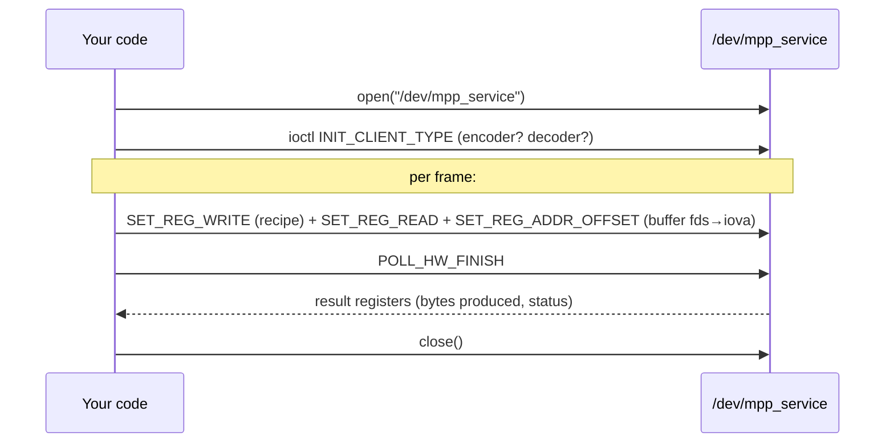
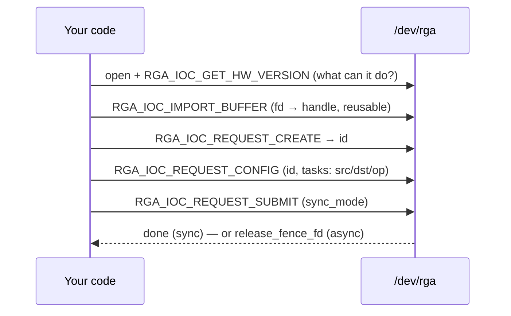

# The `/dev` uAPIs — talking to the hardware directly

A **uAPI** ("userspace API") is the contract between userspace and the kernel: the
device files, the `ioctl()` commands, and the structs passed across. The
libraries in [`docs/02`](02-how-the-userspace-libs-work.md) exist so you *don't*
have to use these directly — but understanding them is invaluable for **debugging**
(what is ffmpeg actually asking the kernel to do?), **writing a minimal client**,
and **security review** (this is the kernel's attack surface — the `docs/11` audit
lives right here). As always: **In plain terms**, then **Under the hood**.

Two device files matter:

| Device | Driver | Wrapped by | Purpose |
|--------|--------|-----------|---------|
| `/dev/mpp_service` | MPP framework (docs/01) | `librockchip_mpp` | video encode/decode |
| `/dev/rga` | RGA driver (docs/01) | `librga` | 2D resize/rotate/convert/blend |

---

## 0. Meet the device files (user-friendly)

**In plain terms.** A device file is a "thing you open like a file, then send
commands to with `ioctl()`." You don't read/write bytes to it like a text file;
you call `ioctl(fd, COMMAND, &struct)` to ask the hardware to do something. The
codec/RGA libraries open these for you and speak the protocol; you'd open them
yourself only to poke around or build something minimal.

**Inspect them on a running board:**

```bash
ls -l /dev/mpp_service /dev/rga          # crw------- root root  (root-only unless the udev rule)
ls -l /dev/dma_heap/                      # system, default_cma_region, reserved — MPP allocates buffers here
ls /proc/mpp_service/                    # rkvenc-core0, rkvdec-core0/1, ... (one dir per bound core)
cat /sys/kernel/debug/rkrga/*            # RGA load, version, scheduler state
dmesg | grep -iE 'mpp|rkvdec|rkvenc|rga' # probe + per-op kernel logs
strace -e ioctl -f ffmpeg …              # SEE the real ioctl stream the library issues
```

`/dev/dma_heap/*` isn't an `ioctl`-recipe device like the others — it's the
**DMA-heap** allocator MPP draws every frame/stream buffer from (one
`DMA_HEAP_IOCTL_ALLOC` → a dma-buf fd it then hands to `/dev/mpp_service`). It's
listed here because it shares the codec's permission story: all of these are
`crw------- root root` by default — that's why the tests need `sudo`; the
[`scripts/99-rockchip-codec.rules`](../scripts/99-rockchip-codec.rules) udev rule
relaxes `mpp_service`, `rga`, **and** `dma_heap` to `video` group `0660`. Granting
the codec node without the heaps still fails — see
[`docs/02` §A5.1](02-how-the-userspace-libs-work.md) for why MPP needs the heap and
which one it lands on.

---

## A. `/dev/mpp_service` — the MPP uAPI

**In plain terms.** One device serves *all* codecs. You open it, declare "I'm a
decoder" (or encoder), then for each frame you send a **register recipe** plus the
buffers, and **poll** until the hardware says done. Every message is the same tiny
envelope with a *command number* and a *pointer to a payload*.

### The message envelope

Every operation is one `MppReqV1` (`osal/inc/mpp_service.h`), issued via the
service's config `ioctl()`; several can be **batched** in one syscall (the last
one flagged to actually start the task):

```c
typedef struct mppReqV1_t {
    RK_U32 cmd;        /* which MPP_CMD_*  (selects the operation)        */
    RK_U32 flag;       /* flags: e.g. "last message of the batch"        */
    RK_U32 size;       /* byte size of the payload                       */
    RK_U32 offset;     /* offset (used when patching register addresses) */
    RK_U64 data_ptr;   /* userspace pointer to the payload               */
} MppReqV1;
```

The **top-level ioctl** that carries these is **`MPP_IOC_CFG_V1`** — magic `'v'`,
`_IOW('v', 1, unsigned int)` → **`0x40047601`** (`rk-mpp.h` ~:15). Its `arg` is a
*packed array* of `MppReqV1`; the kernel walks it one entry at a time
(`msg += sizeof(msg_v1)`, `mpp_common.c` ~:1526). This array-in-one-syscall is the
batching mechanism, driven by the `flag` field:

| `MPP_FLAGS_*` (`rk-mpp.h` ~:58) | value | meaning |
|---|---|---|
| `MULTI_MSG` | `0x1` | this syscall carries several messages — keep walking |
| `LAST_MSG` | `0x2` | the final message of the batch — *now* start the task |
| `REG_FD_NO_TRANS` | `0x4` | don't fd→iova-translate the register block |
| `SCL_FD_NO_TRANS` | `0x8` | don't translate the scaling-list fd |
| `REG_NO_OFFSET` | `0x10` | register addresses carry no patch offset — Rockchip's own userspace names this same bit **`MPP_FLAGS_REG_OFFSET_ALONE`** (libmpp `osal/inc/mpp_service.h:28`; set on `SET_REG_ADDR_OFFSET` messages and OR-ed onto every batch's last message, `osal/driver/mpp_service.c:451,:764`); the rewrite driver's header defines both names as aliases ([`docs/13`](13-rewrite-drivers.md)) |
| `POLL_NON_BLOCK` | `0x20` | **defined by libmpp, not by this port's kernel header** (`osal/inc/mpp_service.h:29`; libmpp's batch server sets it on `POLL_HW_FINISH` requests, `osal/driver/mpp_server.c:460`). The forward-ported BSP driver never tests the bit — its poll always blocks. The rewrite driver honours it: a not-yet-done job returns `-EAGAIN` ([`docs/13`](13-rewrite-drivers.md)) |
| `SECURE_MODE` | `0x10000` | secure-memory path |

(`MPP_IOC_CFG_V2` = `0x40047602` exists too — `rk-mpp.h` ~:16 — but `mpp_collect_msgs`
rejects anything `!= MPP_IOC_CFG_V1` (`mpp_common.c` ~:1516), so V2 is reserved/unused
on this path.)

The kernel dispatches on each message's inner `cmd`, grouped by base value
(`mpp_common.c`):

| Group (base) | Command | What it does |
|--------------|---------|--------------|
| **QUERY** `0x000` | `QUERY_HW_SUPPORT`, `QUERY_HW_ID`, `QUERY_CMD_SUPPORT` | feature/capability negotiation |
| **INIT** `0x100` | `INIT_CLIENT_TYPE` | declare encoder/decoder/jpeg/… — routes the session to a driver |
| | `INIT_DRIVER_DATA`, `INIT_TRANS_TABLE` | driver-private setup, fd→iova translate table |
| **SEND** `0x200` | `SET_REG_WRITE` | the **register recipe** for this task (docs/01 §9) |
| | `SET_REG_READ` | which result registers to read back |
| | `SET_REG_ADDR_OFFSET` | where in the recipe to patch buffer IOVAs |
| | `SET_RCB_INFO` | which row-cache fields go in on-chip SRAM (docs/01 §8) |
| | `SET_SESSION_FD` | **switch to another session** mid-batch (*not* a task-start — see below) |
| **POLL** `0x300` | `POLL_HW_FINISH`, `POLL_HW_IRQ` | block until the task completes |
| **CONTROL** `0x400` | `RESET_SESSION`, `TRANS_FD_TO_IOVA`, `RELEASE_FD`, `SEND_CODEC_INFO` | reset, fd↔iova, buffer release, codec hints |
| | `SET_ERR_REF_HACK` (`CONTROL_BASE + 4`) | **not implemented by this port** — see below |

**`MPP_CMD_SET_ERR_REF_HACK` — one command past this kernel's ceiling.** libmpp
defines a fifth CONTROL command, `MPP_CMD_SET_ERR_REF_HACK = MPP_CMD_CONTROL_BASE + 4`
(`osal/inc/mpp_service.h:80`), an error-resilience toggle its VDPU382 H.264 HAL
wants to send. It **probes before sending**: the HAL checks whether the kernel's
CONTROL-group ceiling (from `QUERY_CMD_SUPPORT`, see below) exceeds the command
number — `cap->ctrl_cmd > MPP_CMD_SET_ERR_REF_HACK`
(`mpp/hal/rkdec/h264d/hal_h264d_vdpu382.c:553`) — and only then issues it. On
this port's kernel `MPP_CMD_CONTROL_BUTT` *equals* `CONTROL_BASE + 4`, so the
probe says "unsupported" and libmpp silently skips the command; the clean-room
rewrite driver accepts it as a validated copy-in/discard for exactly this
probing sequence ([`docs/13`](13-rewrite-drivers.md)).

**`SET_SESSION_FD` — switching sessions mid-batch (easy to misread).** This does
*not* start a task. Inside one batched ioctl that spans **several sessions**, it tells
the kernel "the messages that follow belong to *this* session instead," carried by:

```c
struct mpp_bat_msg {     /* rk-mpp.h ~:76 */
    __u64 flag;          /* MPP_BAT_MSG_DONE (0x1) skips an already-finished slot */
    __u32 fd;            /* fd of the session to switch to                        */
    __s32 ret;           /* out: per-slot error code                              */
};
```

The kernel `fdget`s the target session and flips the active `msgs->session`
(`mpp_common.c` ~:1542). It's how libmpp drives multiple codec contexts through a
single syscall.

### The flow



**Under the hood / notes.**
- Buffers cross as **fds**: the kernel imports them (docs/01 §5), maps them in the
  shared IOMMU, and `SET_REG_ADDR_OFFSET`/`TRANS_FD_TO_IOVA` patch the resulting
  **IOVA** into the recipe — userspace never sees physical addresses.
- The recipe lands in a fixed-size `task->reg[]`; the kernel **bounds-checks** each
  `MppReqV1`'s `size`/`offset` (`mpp_check_req()`). This is the security boundary —
  the `docs/11` audit found real OOB/clamp bugs exactly here, so treat any code
  that builds these requests as trusted-input-only.
- `INIT_CLIENT_TYPE` is mandatory and first: without it the kernel doesn't know
  which hardware block (and which driver) the session targets.
- `MPP_CMD_QUERY_CMD_SUPPORT` is the feature-probe: pass a *group base* (e.g.
  `0x200`) and the kernel returns that group's `*_BUTT` ceiling — the highest command
  number that base supports — via `mpp_get_cmd_butt()` (`mpp_common.c` ~:1206). A
  client can then tell which commands this kernel honours without trial and error.
- `MPP_CMD_RESET_SESSION` is the clean recovery path for a wedged session: it waits
  (with `readx_poll_timeout`, up to **500 ms**) for the session's `task_count` to
  drain to 0, then tears down `session->dma` (`mpp_common.c` ~:1385).

### A minimal MPP client (the syscall shape)

This doc promises "writing a minimal client," so here is the bare bones — open the
device, declare the session type, then submit one task as a batched array and poll.
Error handling and the actual register image are elided; the point is the *shape*:

```c
int fd = open("/dev/mpp_service", O_RDWR);

/* 1. declare which block this session drives (one MppReqV1 = one ioctl).
 *    Full client-type enum: kernel `enum MPP_DEVICE_TYPE`, mpp/mpp_common.h
 *    ~:48 (RKVDEC=9 ~:56, RKVENC=16 ~:60); userspace mirror: libmpp
 *    `enum VPU_CLIENT_TYPE`, osal/inc/mpp_dev_defs.h.                     */
RK_U32 client_type = VPU_CLIENT_RKVDEC;          /* = 9; RKVENC = 16 */
MppReqV1 init = { .cmd = MPP_CMD_INIT_CLIENT_TYPE,
                  .size = sizeof(client_type),
                  .data_ptr = (RK_U64)(uintptr_t)&client_type };
ioctl(fd, MPP_IOC_CFG_V1, &init);

/* 2. one task = a batched ARRAY of MppReqV1 in a single ioctl:
 *    write the register recipe, then poll for completion.            */
MppReqV1 batch[2] = {
  { .cmd = MPP_CMD_SET_REG_WRITE,  .flag = MPP_FLAGS_MULTI_MSG,
    .size = reg_size, .data_ptr = (RK_U64)(uintptr_t)reg_image },
  { .cmd = MPP_CMD_POLL_HW_FINISH,
    .flag = MPP_FLAGS_MULTI_MSG | MPP_FLAGS_LAST_MSG },   /* LAST_MSG starts it */
};
ioctl(fd, MPP_IOC_CFG_V1, batch);                /* whole batch, one syscall */
close(fd);
```

The two things newcomers miss: **every** call is the *same* ioctl request
(`MPP_IOC_CFG_V1`); and a "task" is a **batch** — the kernel walks the array until it
sees `LAST_MSG`, then runs the hardware. Real clients also send `SET_REG_READ` and
`SET_REG_ADDR_OFFSET` in the same batch; see `osal/driver/mpp_service.c`.

---

## B. `/dev/rga` — the RGA uAPI

**In plain terms.** Open `/dev/rga`, describe two images (a *source* and a
*destination*) plus the operation (scale? rotate? convert?), submit, done — either
waiting for completion (**sync**) or getting a **fence** to wait on later
(**async**). There are two generations of this interface; modern librga uses the
newer one but both work.

### How an image is described — `rga_img_info_t`

Both generations describe each image the same way (`rga3/include/rga.h`):

```c
struct rga_img_info_t {
    uint64_t yrgb_addr;       /* Y / RGB plane (fd or address)   */
    uint64_t uv_addr;         /* UV plane (NV12 …)               */
    uint64_t v_addr;          /* V plane (planar YUV)            */
    uint32_t format;          /* RK_FORMAT_* (RGBA8888, NV12, …) */
    uint16_t act_w, act_h;    /* active (visible) size           */
    uint16_t x_offset, y_offset; /* crop origin                  */
    /* + vir_w / vir_h: the stride / "virtual" dimensions        */
};
```

### Generation 1 — legacy blit (fixed ioctl numbers)

| ioctl | value | payload | meaning |
|-------|-------|---------|---------|
| `RGA_BLIT_SYNC` | `0x5017` | `struct rga_req` | do the op, **block** until done |
| `RGA_BLIT_ASYNC` | `0x5018` | `struct rga_req` | do the op, return a **release fence** |
| `RGA_FLUSH` | `0x5019` | — | wait for outstanding async work |
| `RGA_GET_VERSION` | `0x501b` | string | driver version |

`struct rga_req` is the full command descriptor: `render_mode` (the op), `src` /
`dst` / `pat` (`rga_img_info_t` — pattern is for blending/ROP), rotation as a
fixed-point `sina`/`cosa` pair (16.16), an `alpha_rop_flag` bitfield
(alpha/ROP/fading/Porter-Duff/dither enables), a `LUT_addr` and `rop_mask_addr`,
the clip window, and MMU info.

### Generation 2 — request model (`RGA_IOC_*`, magic-based)

| ioctl | nr | payload | meaning |
|-------|----|---------|---------|
| `RGA_IOC_GET_DRVIER_VERSION` *(sic — the vendor header really misspells "DRIVER"; `rga3/include/rga.h:14`)* / `…_HW_VERSION` | 0x1 / 0x2 | version structs | capabilities |
| `RGA_IOC_IMPORT_BUFFER` / `…_RELEASE_BUFFER` | 0x3 / 0x4 | `rga_buffer_pool` | register fds → reusable **handles** |
| `RGA_IOC_REQUEST_CREATE` | 0x5 | returns `id` | open a request |
| `RGA_IOC_REQUEST_CONFIG` | 0x7 | `rga_user_request` | attach task(s) to the request |
| `RGA_IOC_REQUEST_SUBMIT` | 0x6 | `rga_user_request` | run it (sync or async) |
| `RGA_IOC_REQUEST_CANCEL` | 0x8 | `uint32_t` (request id) | drop a created-but-unsubmitted request |

```c
struct rga_user_request {
    uint64_t task_ptr;          /* array of tasks (one "blit" each) */
    uint32_t task_num;          /* batch several ops in one submit  */
    uint32_t id;                /* from REQUEST_CREATE              */
    uint32_t sync_mode;         /* RGA_BLIT_SYNC / RGA_BLIT_ASYNC   */
    uint32_t release_fence_fd;  /* out: the fence (async)           */
    uint32_t mpi_config_flags;
    uint32_t acquire_fence_fd;  /* in: wait on this fence before running */
};
```

### The flow (modern)



**Under the hood / notes.**
- `task_num > 1` lets one submit carry several chained ops — the kernel side of
  IM2D's job batching (docs/02 §B5).
- async returns `release_fence_fd` (`-1` if the kernel lacks fence support); wait on
  it with the usual sync_file/`poll()` machinery.
- The kernel scheduler then picks an idle RGA3/RGA2 core able to do the op (docs/01
  §4); the buffers are IOMMU-mapped exactly like the codecs (docs/01 §6).

---

## C. How the libraries map onto these

This is the bottom edge of [`docs/02`](02-how-the-userspace-libs-work.md):

| Library call | Becomes these ioctls |
|--------------|----------------------|
| `mpi->decode_put_packet` / `encode_put_frame` (libmpp) | `INIT_CLIENT_TYPE` once, then `SET_REG_WRITE`+`SET_REG_READ`+`SET_REG_ADDR_OFFSET`, then `POLL_HW_FINISH` (`osal/driver/mpp_service.c`) |
| `imresize` / `c_RkRgaBlit` (librga) | `RGA_BLIT_SYNC/ASYNC` (legacy) or `REQUEST_CREATE`→`CONFIG`→`SUBMIT` (modern) in `core/NormalRga.cpp` |

**A trap when reading `strace`.** Under MPP, **every** message for *every* codec
shows up as the *same* request number: `ioctl(fd, MPP_IOC_CFG_V1, …)` =
**`0x40047601`**. The `0x200`/`0x300` codes (`SET_REG_WRITE`, `POLL_HW_FINISH`) are
**not** ioctl request numbers — they are the inner `cmd` field of each `mpp_msg_v1`
*inside the payload buffer*, which the kernel copies from userspace separately
(`mpp_collect_msgs`, `mpp_common.c` ~:1523). So `grep 0x200` finds **nothing** on the
codec path; that is the single most common mistake reading an MPP trace. To see the
inner `SET_REG_WRITE`/`POLL_HW_FINISH` stream you need `strace -X`/a buffer dump, the
driver's own `mpp_dev_debug` module param (`mpp_service.c` ~:50), or
`/proc/mpp_service/supports-cmd` (`mpp_service.c` ~:260). RGA is the opposite:
`RGA_BLIT_SYNC` = `0x5017` and `RGA_IOC_REQUEST_SUBMIT` *are* real ioctl request
numbers, so a single 2D op **does** show directly in `strace`.

---

## D. Debugging the uAPIs live

```bash
# Which cores are bound and serving requests right now:
ls /proc/mpp_service/ ; cat /proc/mpp_service/rkvdec-core0/* 2>/dev/null

# Watch the exact ioctl conversation a real workload has with the kernel.
# NOTE: MPP codec ops ALL appear as MPP_IOC_CFG_V1 / 0x40047601 — the inner
# SET_REG_WRITE/POLL_HW_FINISH cmds live INSIDE those buffers (see §C), so don't
# grep for 0x200/0x300. RGA ops (0x5017 / RGA_IOC_*) do show as real requests.
sudo strace -e trace=ioctl,openat -f \
  ffmpeg -hwaccel rkmpp -i in.h264 -c:v hevc_rkmpp out.mp4 2>&1 \
  | grep -E '/dev/(mpp_service|rga)|MPP_IOC_CFG_V1|0x40047601|0x5017|RGA_IOC'

# RGA load / version / scheduler:
cat /sys/kernel/debug/rkrga/load /sys/kernel/debug/rkrga/*version* 2>/dev/null

# Kernel-side per-op detail (enable driver debug if built in):
dmesg -w | grep -iE 'mpp_|rkvenc|rkvdec|rga'
```

Reading the raw ioctl stream is the fastest way to answer "is it really using the
hardware?" and "where did it stall?" — and it's exactly the surface the audit in
[`docs/11`](11-bsp-audit.md) scrutinised for memory-safety bugs.

> The canonical definitions live in the kernel uAPI headers. For RGA:
> `drivers/video/rockchip/rga3/include/rga.h`. For MPP the **kernel ABI source of
> truth is `include/uapi/linux/rk-mpp.h`** — `enum MPP_DEV_COMMAND_TYPE`, `struct
> mpp_request {cmd, flags, size, offset, void __user *data}`, and the
> `MPP_IOC_CFG_V*` macros; the struct the kernel actually parses off the wire is
> `struct mpp_msg_v1` (`mpp_common.c` ~:40). Userspace mirrors these in MPP's
> `osal/inc/mpp_service.h` (the `MppServiceCmdType` enum + `MppReqV1`). Treat the
> headers as the source of truth; this doc is the map. **Both headers exist in
> this repo only inside the forward-port patch** — [`docs/00`](00-source-trees.md)
> says exactly where they live in `patches/rk3588-rkvenc2-01…` and how to
> reconstruct a browsable tree (that also covers the libmpp/librga pins the
> userspace cites above resolve against).
