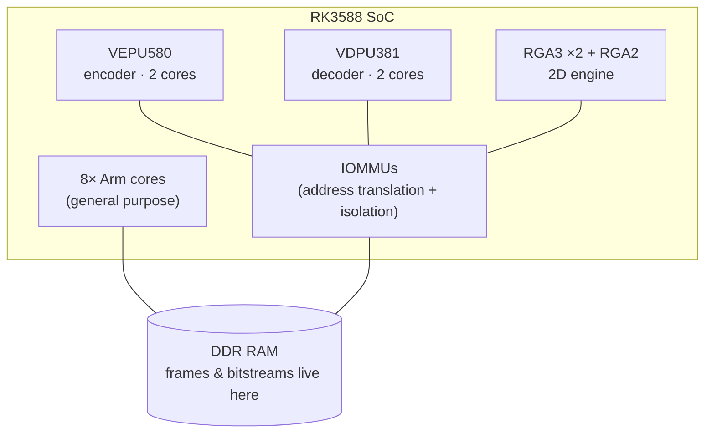
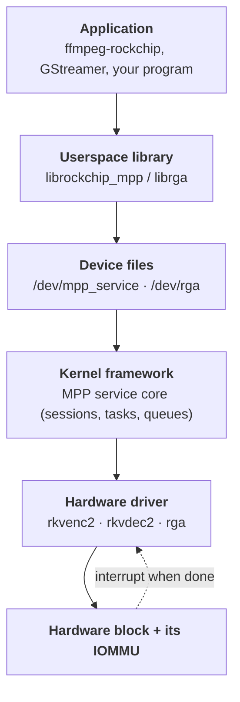
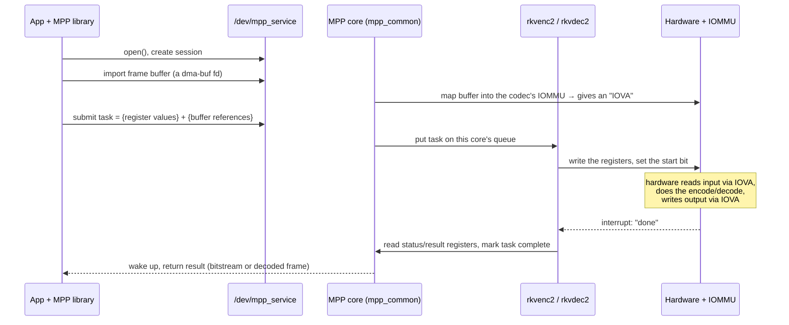
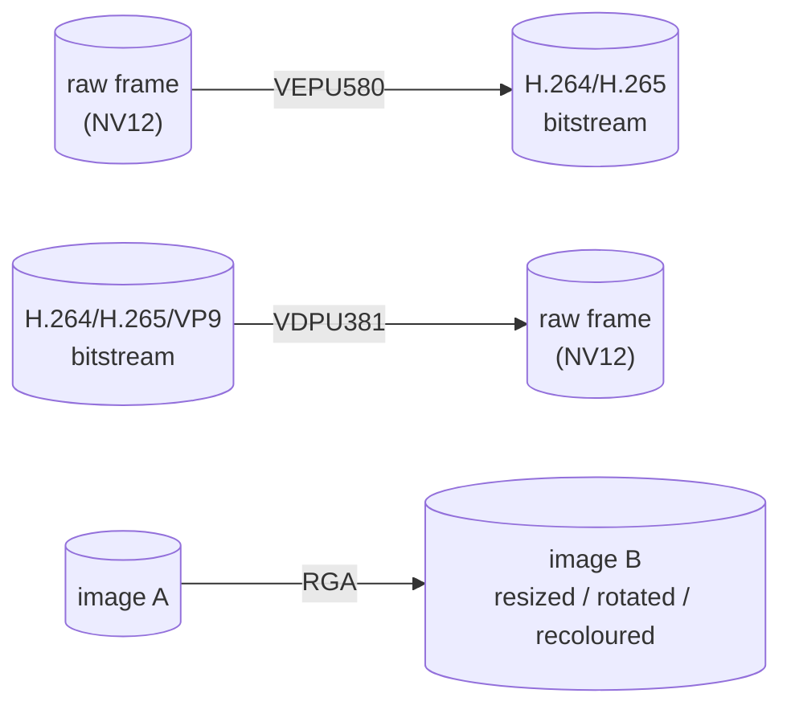
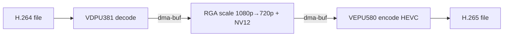
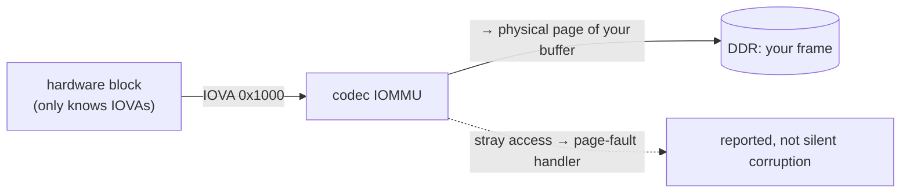
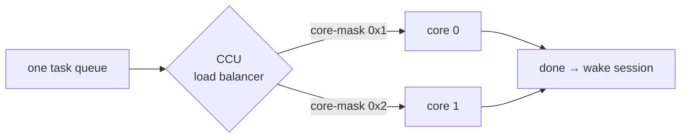

# How the drivers actually work

A guided tour of what the RK3588 video codec + RGA drivers do — written so a
curious user can follow it, with enough depth and code pointers for kernel
developers. Each section starts **In plain terms**, then goes **Under the hood**.

---

## 1. What problem do these solve?

**In plain terms.** Playing, recording, or converting video is a *lot* of math.
Doing it on the CPU is slow, drains the battery, and makes the chip hot. The
RK3588 has dedicated hardware blocks that do this math thousands of times faster
for almost no power — but Linux can't use them without a driver. These drivers
are that missing piece: they let programs like `ffmpeg` hand video work to the
hardware instead of grinding it out on the CPU.

Three jobs, three blocks:

| Block | What it does | Think of it as… |
|-------|--------------|-----------------|
| **VEPU580** (encoder) | turns raw frames → compressed H.264/H.265 | a video *recorder* |
| **VDPU381** (decoder) | turns compressed H.264/H.265/VP9 → raw frames | a video *player* |
| **RGA** (2D engine) | resize / rotate / colour-convert / blend images | a hardware *Photoshop* for simple ops |

**Under the hood.** These are independent IP blocks on the SoC, each with its own
registers, interrupt line, and IOMMU. They're driven through Rockchip's "MPP"
(Media Process Platform) framework (`/dev/mpp_service`) for the codecs, and a
separate driver (`/dev/rga`) for RGA. Userspace does **not** use V4L2 here — it
uses Rockchip's own `librockchip_mpp` / `librga` libraries.



---

## 2. The software stack — who talks to whom

**In plain terms.** Think of it as a chain of command. Your app asks a library,
the library talks to a "device file", that file is the kernel's front door, the
kernel framework figures out *which* hardware and *which* core, the hardware
driver pokes the actual silicon, and the silicon reads/writes your video frames
in memory. Each layer only talks to its neighbours.



**Under the hood — where each layer lives in this repo's code:**

| Layer | Code |
|-------|------|
| device file + char dev + class | `mpp/mpp_service.c` → `/dev/mpp_service` |
| sessions, tasks, queues, ioctl, dma-buf | `mpp/mpp_common.c` |
| address translation / buffer mapping | `mpp/mpp_iommu.c` |
| encoder hardware driver | `mpp/mpp_rkvenc2.c` |
| decoder hardware driver | `mpp/mpp_rkvdec2.c` + `mpp/mpp_rkvdec2_link.c` |
| RGA (separate stack) | `rga3/rga_drv.c`, `rga_job.c`, `rga_mm.c`, `rga_iommu.c`, … |

---

## 3. How one frame gets processed (the lifecycle)

**In plain terms.** To use the hardware, a program: (1) opens a *session* (its
private conversation with the driver), (2) hands over the memory holding the
frame, (3) submits a *task* — basically a filled-in form telling the hardware
exactly what to do, (4) the driver presses "go", (5) the hardware does the work
and raises its hand (an interrupt) when finished, (6) the program gets its result.



**Under the hood.**
- A **session** (`struct mpp_session`) is created per `open()`; it owns its tasks,
  its dma-buf imports, and its place in a *task queue*.
- A **task** is submitted as a batch of messages over an ioctl. The two that
  matter: `SET_REG_WRITE` (the register values that configure the hardware for
  this frame) and `SET_REG_READ` (which result registers to read back). The
  driver `copy_from_user()`s the register block into a fixed-size `task->reg[]`
  buffer, validates offsets/sizes (`mpp_check_req()`), programs the block, starts
  it, then on IRQ copies the requested result registers back.
- **Buffers** are passed as **dma-buf** file descriptors, not copied — see §5.

---

## 4. The three data paths



- **Encode (VEPU580).** Input: a raw NV12 frame. Output: a compressed bitstream.
  Two cores share the load via the CCU (§6). `mpp_rkvenc2.c`.
- **Decode (VDPU381).** Input: a compressed bitstream. Output: raw NV12 frames.
  Uses on-chip SRAM as a scratchpad (§7) and can chain tasks in hardware (§8).
  `mpp_rkvdec2.c` + `_link.c`.
- **2D (RGA).** Input: any image; output: scaled / rotated / format-converted /
  alpha-blended image. Its own queue + scheduler picks one of three engines
  (RGA3 core0, RGA3 core1, RGA2). `rga3/`.

A **full hardware transcode** (e.g. `ffmpeg -hwaccel rkmpp -c:v hevc_rkmpp`)
chains all three with **zero copies** between them (§5):



---

## 5. Key concept: dma-buf (sharing memory without copying)

**In plain terms.** A decoded frame is a few megabytes. If every stage made its
own copy, you'd waste tons of memory bandwidth and power. **dma-buf** is Linux's
way to pass *the same physical buffer* between the decoder, RGA, encoder, and the
display — by passing a little "ticket" (a file descriptor) instead of the data.
Everyone works on the one buffer in place.

**Under the hood.** A buffer is imported into a session with
`mpp_dma_import_fd()` (`mpp_iommu.c`): the driver `dma_buf_get()`s the fd,
attaches, maps it, and caches it on the session's used-list (refcounted with
`kref`). RGA does the equivalent in `rga_mm.c`/`rga_dma_buf.c`. Re-importing the
same fd reuses the existing mapping. This is the zero-copy backbone of the
transcode pipeline above.

---

## 6. Key concept: the IOMMU (and why the hardware sees "fake" addresses)

**In plain terms.** The video hardware reads and writes your frames directly in
RAM (DMA). But you don't want a buggy or malicious request to make the hardware
scribble over *random* memory. The **IOMMU** is a gatekeeper: the hardware is
only given translated "device addresses" (IOVAs), and the IOMMU maps those to the
exact physical pages of *your* buffer — and nothing else. It's like giving a
courier a building-specific keycard instead of a master key.

**Under the hood.** Each codec core (and RGA) sits behind a Rockchip IOMMU.
`mpp_iommu.c` manages the domain, maps imported buffers, and registers a
page-fault handler so a stray access is reported instead of silently corrupting
memory. (The forward-port had to guard `iommu_set_fault_handler()` for a 6.18 API
change — see `docs/02`.) The hardware is programmed with IOVAs; the IOMMU
translates each access back to the buffer's real pages.



---

## 7. Key concept: multi-core + the CCU

**In plain terms.** The encoder and decoder each have **two** hardware cores. A
little coordinator called the **CCU** hands each incoming job to a free core, so
two frames can be in flight at once — like two checkout lanes with one queue.

**Under the hood.** Cores share a `rockchip,taskqueue-node`; the CCU
(`rkvenc_ccu` / `rkvdec_ccu`) load-balances using a logical `rockchip,core-mask`
bitmask (`0x00010001` core 0, `0x00020002` core 1) — *not* addresses. A core node
is always named `*-core@…` and **must** attach to its CCU at probe, or it won't
register (this is baked into the device tree — see `docs/03`). The
coordination/scheduling lives in `mpp_rkvdec2_link.c` for the decoder.



---

## 8. Key concept: on-chip SRAM (the decoder's scratchpad) & hardware "link mode"

**In plain terms.** While decoding, the hardware keeps a running "row cache" of
intermediate data. Parking that in main RAM would eat memory bandwidth, so the
chip has a small, *very* fast on-chip **SRAM** the decoder uses as a scratchpad.
Separately, instead of the CPU feeding the decoder one frame at a time, the
hardware can follow a **linked list** of jobs by itself ("link mode") — like
giving it a playlist instead of pressing play for each song.

**Under the hood.**
- **SRAM/RCB:** each decoder core points at an on-chip SRAM pool via
  `rockchip,sram = <&vdecN_sram>` plus an `rcb-iova`/`rcb-info` map. The driver
  resolves the pool with `of_address_to_resource()` and `iommu_map()`s the
  physical region as the row-cache-buffer (this is why the Armbian
  convert-in-place reuses Armbian's SRAM nodes untouched — `docs/04`).
- **Link mode:** `mpp_rkvdec2_link.c` builds a coherent DMA **descriptor table**
  of tasks the hardware walks autonomously, raising one interrupt per completed
  task — far less CPU overhead than per-frame kicking.

```
   decoder core
       │  reads/writes intermediate "row cache"
       ▼
  ┌─────────────────┐        ◄── tiny + fast, on the chip
  │  on-chip SRAM   │            (saves DDR bandwidth/power)
  │  (RCB pool)     │
  └─────────────────┘

  link mode:  [task]→[task]→[task]→…   hardware follows the list itself
```

---

## 9. How registers actually drive the hardware

**In plain terms.** The hardware is configured by writing numbers into hundreds
of tiny control slots called **registers** — "encode at this resolution, read the
input from here, write the output there, use these quality settings." The
userspace library knows the exact recipe; it ships that block of register values
down with each task, the driver writes them into the hardware, flips the start
bit, and later reads result registers back ("how many bytes did you produce?").

**Under the hood.** Each core exposes two MMIO windows in the device tree:
`reg-names = "regs", "link"` (function registers + the link/control block). A task
carries a register image; `mpp_check_req()` bounds-checks the user-supplied
offset/size against the window before `copy_from_user()` into `task->reg[]`. The
driver writes the bank, requests the threaded IRQ (`mpp_dev_irq`), and on
completion copies the requested result registers back to userspace. *(The audit
in `docs/08` flagged real bounds bugs in exactly this user→register path — it's
the security-sensitive boundary.)*

---

## 10. Putting it together — a mental model

1. **You** run `ffmpeg -hwaccel rkmpp …`.
2. **MPP/librga** open device files and create sessions.
3. **Buffers** are shared as dma-buf fds — no copies (§5).
4. Each **task** is a register recipe + buffer refs; the **MPP core** queues it.
5. The **CCU** picks a free core (§7); the **driver** programs registers (§9).
6. The **hardware** DMAs through its **IOMMU** (§6), using **SRAM** scratch (§8).
7. An **interrupt** signals done; results flow back up the stack.
8. For a transcode, the output dma-buf of one stage is the input of the next (§4)
   — decode → RGA → encode, all on hardware, all zero-copy.

That's the whole machine: a thin, fast path from a user command down to dedicated
silicon and back, with the IOMMU keeping it safe and dma-buf keeping it cheap.

> Want to see it run? `tests/` exercises each path; `docs/01-status.md` has the
> measured results (encode 720p ~300–360 fps, decode ~1200–1600 fps, full
> transcode 17–42× realtime).
