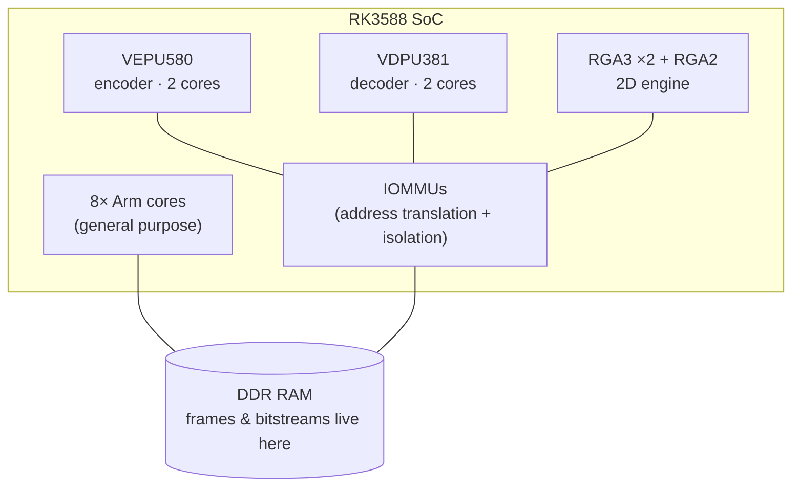
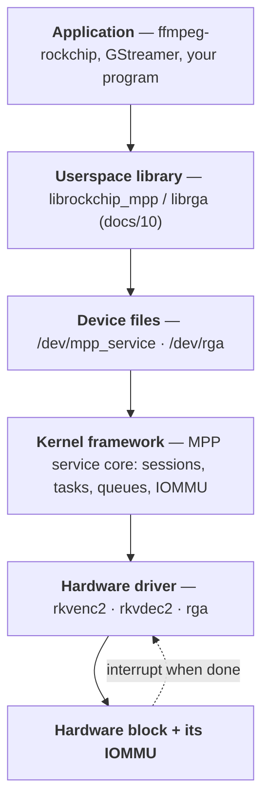
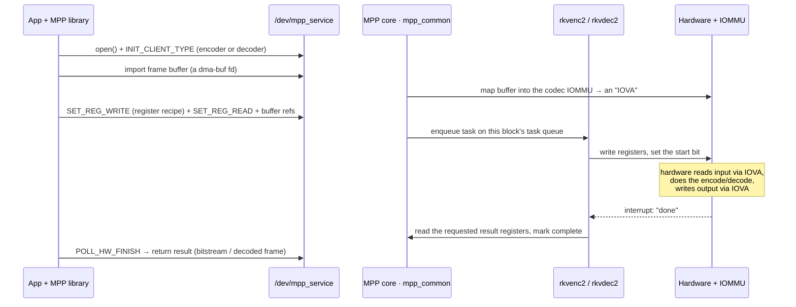
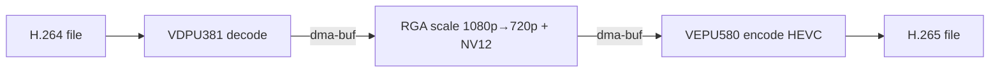
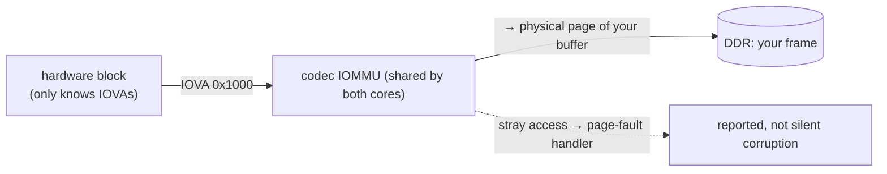
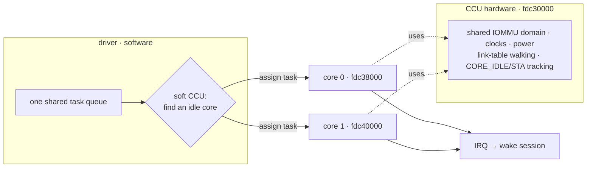

# How the drivers actually work

A guided, in-depth tour of what the RK3588 video codec + RGA **kernel drivers**
do — written so a curious user can follow the big picture, with enough mechanism
and code pointers for kernel developers. Each section opens **In plain terms**,
then goes **Under the hood**. Its companion, [`docs/10`](10-how-the-userspace-libs-work.md),
covers the userspace libraries.

---

## 1. What problem do these solve?

**In plain terms.** Playing, recording, or converting video is a *staggering*
amount of arithmetic. A single 1080p frame is ~3 million pixels; compressing or
decompressing it means searching for motion between frames, transforming blocks
of pixels into frequencies, quantising them, and packing the result bit by bit —
tens of billions of operations per second of video. On a CPU that's slow, hot,
and battery-draining. The RK3588 has **dedicated silicon** that does exactly this
math in fixed-function hardware: ~10–100× faster at a fraction of the power. But
Linux can't touch that silicon without a driver. These drivers are that missing
piece.

Three jobs, three blocks:

| Block | What it does | The heavy math it replaces |
|-------|--------------|----------------------------|
| **VEPU580** (encoder) | raw frames → compressed H.264/H.265 | motion estimation, DCT/transform, quantisation, CABAC entropy coding |
| **VDPU381** (decoder) | compressed H.264/H.265/VP9 → raw frames | entropy decode, inverse transform, motion compensation, in-loop filters |
| **RGA** (2D engine) | resize / rotate / colour-convert / blend | per-pixel scaling kernels, colour-space matrices, alpha compositing |

**Under the hood.** Each is an independent IP block with its own MMIO register
bank, interrupt line(s), clocks, power domain, and IOMMU. The codecs are driven
through Rockchip's **MPP** (Media Process Platform) framework, which presents a
single char device `/dev/mpp_service`; RGA has its own driver and `/dev/rga`.
Userspace does **not** use the mainline V4L2 stateless API here — it uses
Rockchip's `librockchip_mpp` / `librga`, which is what `ffmpeg-rockchip` targets
and what gives the full H.265-encode + full-feature-RGA capability (the mainline
V4L2 path doesn't cover H.265 *encode*, and RGA3-via-V4L2 is a not-yet-merged
subset — see [`docs/05`](05-vanilla-kernel.md)).



---

## 2. The software stack — who talks to whom

**In plain terms.** It's a chain of command. Your app asks a library; the library
talks to a "device file"; that file is the kernel's front door; the kernel
framework decides *which* hardware and *which* core; the hardware driver pokes the
actual silicon; the silicon reads/writes your frames in memory and raises an
interrupt when done. Each layer only talks to its neighbours, which is what makes
it possible to swap, say, ffmpeg for GStreamer without touching the kernel.



**Under the hood — responsibilities, and where each lives in this repo:**

| Layer | Responsibility | Code |
|-------|----------------|------|
| char device / class | create `/dev/mpp_service`, dispatch ioctls | `mpp/mpp_service.c` |
| service core | per-`open()` sessions, task queues, the ioctl protocol, dma-buf import | `mpp/mpp_common.c` |
| IOMMU layer | map buffers, own the shared domain, fault handler | `mpp/mpp_iommu.c` |
| encoder driver | program VEPU580, CCU/DCHS, IRQ | `mpp/mpp_rkvenc2.c` |
| decoder driver | program VDPU381, CCU, SRAM/RCB, link mode | `mpp/mpp_rkvdec2.c` + `…_link.c` |
| RGA (separate stack) | `/dev/rga`, job queue, scheduler, memory | `rga3/rga_drv.c`, `rga_job.c`, `rga_mm.c`, … |

The framework/driver split matters: `mpp_common.c` is **codec-agnostic**
(sessions, queues, buffers, the IOMMU, the ioctl surface); the per-block drivers
only know how to translate a generic task into *their* registers and how to start
and reap *their* hardware. Adding a new codec block is "write a driver", not
"touch the framework".

---

## 3. How one task is processed (the lifecycle & protocol)

**In plain terms.** To use the hardware a program (1) opens a **session** — its
private conversation with the driver, (2) hands over the memory holding the frame,
(3) submits a **task**: a filled-in form telling the hardware exactly what to do,
(4) the driver presses "go", (5) the hardware works and raises its hand (an
interrupt) when finished, (6) the program collects its result. Many tasks can be
queued so the hardware never sits idle.



**Under the hood.**
- A **session** (`struct mpp_session`, created per `open()`) owns its tasks, its
  imported dma-bufs, and its slot in a **task queue** (`mpp_taskqueue`, shared by
  the two cores of a block). The client declares its type up front
  (`MPP_CMD_INIT_CLIENT_TYPE`) so the service knows which driver to route to.
- A **task** is submitted as a small batch of typed messages (`mpp_request`) over
  one ioctl. The load-bearing ones:
  - `MPP_CMD_SET_REG_WRITE` — the block of register values that configures the
    hardware for this frame (the "recipe");
  - `MPP_CMD_SET_REG_READ` — which result registers to read back afterwards;
  - `MPP_CMD_SET_REG_ADDR_OFFSET` / `MPP_CMD_TRANS_FD_TO_IOVA` — patch buffer fds
    into the register image as IOVAs (§6);
  - `MPP_CMD_POLL_HW_FINISH` — block until the task completes.
- The driver `copy_from_user()`s the register block into a fixed-size
  `task->reg[]`, **bounds-checking** each request's offset/size against the
  register window (`mpp_check_req()` — the audit in `docs/08` found real bugs on
  exactly this user→register edge).
- A task walks a **state machine** (`TASK_STATE_*` in `mpp_common.h`):
  `PENDING → RUNNING → START → HANDLE → IRQ → FINISH → DONE`, with `TIMEOUT` and
  `ABORT` escape paths. The queue worker advances it; the threaded IRQ
  (`mpp_dev_irq`) moves it from `START`→`IRQ`; completion wakes the poller.

---

## 4. The three data paths


- **Encode (VEPU580).** Input a raw NV12 frame; output a compressed bitstream. The
  driver organises the per-frame registers into *classes* (§9) and starts the
  core; the two cores cooperate via the DCHS handshake (§7b). `mpp_rkvenc2.c`.
- **Decode (VDPU381).** Input a compressed bitstream; output raw NV12. Uses on-chip
  SRAM as a row-cache scratchpad (§8) and can chain tasks in hardware via link
  mode; the two cores are load-balanced by the CCU (§7a). `mpp_rkvdec2.c` +
  `_link.c`.
- **2D (RGA).** Input any image; output scaled / rotated / format-converted /
  blended. A separate driver with its own queue and a scheduler that picks one of
  three engines (RGA3 core0, RGA3 core1, RGA2) by capability and load (`rga3/`).

A **full hardware transcode** chains all three with **zero copies** between them:



That single dma-buf passed stage-to-stage (§5) is why `ffmpeg -hwaccel rkmpp …`
sustains 17–42× realtime instead of being bottlenecked on memory copies.

---

## 5. Key concept: dma-buf (sharing memory without copying)

**In plain terms.** A decoded frame is a few megabytes. If every stage made its
own copy, you'd burn memory bandwidth and power for nothing. **dma-buf** is
Linux's way to pass *the same physical buffer* between the decoder, RGA, encoder,
and the display — by passing a little "ticket" (a file descriptor) instead of the
data. Everyone operates on the one buffer in place.

**Under the hood.** A buffer is imported into a session with `mpp_dma_import_fd()`
(`mpp_iommu.c`): the driver `dma_buf_get()`s the fd, `dma_buf_attach()`es,
`dma_buf_map_attachment_unlocked()`s it (the 6.18 unlocked variant — `docs/02`),
and records it on the session's **used-list** keyed by the underlying `dma_buf`.
Each import is **reference-counted** (`kref`); re-importing the same fd reuses the
existing mapping and IOVA instead of re-mapping (`mpp_dma_find_buffer_fd()`), and
an LRU trim (`mpp_dma_remove_extra_buffer()`) caps the cache. There's also a
`static_list` for buffers that live for the session's lifetime. (The audit found
refcount subtleties right here — `docs/08` — which is why these paths get extra
scrutiny.) RGA does the equivalent in `rga_mm.c`/`rga_dma_buf.c`. This caching +
refcounting is the zero-copy backbone of the transcode pipeline.

---

## 6. Key concept: the IOMMU (and why the hardware sees "fake" addresses)

**In plain terms.** The video hardware reads and writes your frames directly in
RAM (DMA). You don't want a buggy or malicious request to make the hardware
scribble over *random* memory. The **IOMMU** is a gatekeeper: the hardware is only
ever given translated "device addresses" (IOVAs), and the IOMMU maps those to the
exact physical pages of *your* buffer — and nothing else. It's a building-specific
keycard instead of a master key.

**Under the hood.** Each codec core (and RGA) sits behind a Rockchip IOMMU.
`mpp_iommu.c` owns the domain, maps imported buffers to IOVAs, and installs a
**page-fault handler** so a stray access is *reported* rather than silently
corrupting memory. Two RK3588-specific details:
- **Shared domain.** The two cores of a block share **one** IOMMU domain — the
  CCU's "main core" owns it and the secondary core attaches to the same domain
  (`mpp_iommu_attach`), so a buffer mapped once is visible to whichever core runs
  the task.
- **IOVA patching.** Userspace submits buffer *fds*; `MPP_CMD_TRANS_FD_TO_IOVA` /
  `SET_REG_ADDR_OFFSET` translate each fd to its IOVA and patch it into the right
  slot of the register image, so the recipe the hardware executes contains only
  IOVAs.
- The forward-port had to guard `iommu_set_fault_handler()` for a 6.18 cookie-type
  change and shadow `iommu_dma_cookie` for the `iovad`-offset change (`docs/02`).



---

## 7. Key concept: multi-core coordination — the CCU and the DCHS

**In plain terms.** The encoder and decoder each have **two** identical hardware
cores, so two frames can be worked on at once. Something has to decide *which*
core takes *which* job and keep the two out of each other's way. Is that
"something" hardware or software? The honest answer is **both — and it's a
switch.** There's a real coordinator block on the chip, but this port runs it in a
**software-dispatch** mode: the *driver* picks the core, the *hardware* runs the
shared plumbing. The encoder and decoder even solve it differently.

### 7a. The decoder: a hardware CCU with a soft/hard switch

The decoder's **CCU** (Coordination Unit) is a genuine hardware block — its own
MMIO registers at `fdc30000`, separate from the two cores (`fdc38000`,
`fdc40000`). It exposes `WORK_EN`, `WORK_MODE`, `SEND_NUM`/`DEC_NUM`, and per-core
status (`CORE_WORK`, `CORE_IDLE`, `CORE_STA`, `CORE_ERR`) — so the hardware can
*see* which cores are busy or idle. It supports two task-distribution modes
(`enum RKVDEC2_CCU_MODE`, selected by the device tree's `rockchip,ccu-mode`):

| Mode | DT value | Who picks the core for each task |
|------|----------|----------------------------------|
| **Soft CCU** (`RKVDEC2_CCU_TASK_SOFT`) | `<1>` ← **this port** | the **driver**, in software |
| **Hard CCU** (`RKVDEC2_CCU_TASK_HARD`) | `<2>` | the **CCU hardware**, autonomously |

- **Soft mode (what we use).** The driver (`mpp_rkvdec2_link.c`) keeps both cores
  on one shared task queue, scans for an idle core (literally *"find one core is
  idle"*, comparing each core's `task_index`), and dispatches the task to it
  itself. The CCU hardware is still switched on (`WORK_EN` + `WORK_MODE` are
  written) and still owns the **shared resources**: a single IOMMU domain shared by
  both cores (the "main core" owns it), shared clocks/power, and the link-mode DMA
  table walking (§8). In one line: *software chooses the core; hardware runs the
  shared machinery.*
- **Hard mode.** You hand the CCU a linked list of tasks and it feeds them to idle
  cores by itself — updating `CORE_IDLE`/`SEND_NUM`, raising one interrupt per
  finished task, almost no CPU involvement. The driver keeps these paths
  (`rkvdec2_hard_ccu_reset`, the `CORE_*` registers) but the port runs soft mode
  for predictable scheduling and simpler error recovery.



### 7b. The encoder: a hardware dual-core hand-shake (DCHS)

The encoder has **no separate CCU register block**. Instead the two VEPU580 cores
coordinate through a **hardware Dual-Core Hand-Shake (DCHS)** — a TX/RX channel
mechanism in each core's registers (`DCHS_REG_OFFSET 0x304`, `DCHS_TXE`/`RXE`
bits). Each task carries a `dchs_id` with 2-bit **txid/rxid** channel numbers:

- **Software** allocates the channels: from a pool of 4 (`RKVENC_MAX_DCHS_ID`) the
  driver assigns a task's `txid`, and matches a new task's `rxid` to a *prior
  task's `txid` within the same session* (`mpp_rkvenc2.c`, under `lock_dchs`).
- **Hardware** then performs the actual handshake (TXE→RXE, with a programmable
  delay) so consecutive tasks across the two cores **pipeline with a dependency
  hand-off** instead of racing — a session's frames flow across both cores
  cooperatively, synchronized in silicon.

So the encoder's split is "*software assigns the rendezvous channels; hardware does
the rendezvous*"; the decoder's (soft mode) is "*software assigns whole tasks to
idle cores*."

### 7c. Shared plumbing (both blocks)

- Both cores share one `rockchip,taskqueue-node` (`7` encoder, `9` decoder) — the
  single queue the coordinator pulls from.
- `rockchip,core-mask` (`0x00010001` core 0, `0x00020002` core 1) is a **logical**
  bitmask the framework uses to identify cores — *not* an address.
- A core node is always named `*-core@…`, so it always dispatches to the
  CCU-attaching probe and **must** attach to its (enabled) CCU or it won't register
  (`attach ccu failed`). That's why the device tree enables the CCU and both cores
  together — see `docs/03`.

---

## 8. Key concept: on-chip SRAM (the decoder's scratchpad) & hardware "link mode"

**In plain terms.** While decoding, the hardware keeps a running "row cache" of
intermediate data. Parking that in main RAM would eat memory bandwidth, so the
chip has a small, *very* fast on-chip **SRAM** the decoder uses as a scratchpad.
Separately, instead of the CPU feeding the decoder one frame at a time, the
hardware can follow a **linked list** of jobs by itself ("link mode") — like
giving it a playlist instead of pressing play for each song.

**Under the hood.**
- **SRAM/RCB.** Each decoder core points at an on-chip SRAM pool via
  `rockchip,sram = <&vdecN_sram>` plus an `rcb-iova`/`rcb-info` map (a list of
  which row-cache register fields go on-chip and how big each is). The driver
  resolves the pool with `of_address_to_resource()` and `iommu_map()`s the
  physical region as the row-cache-buffer — *not* a gen_pool, which is why the
  Armbian convert-in-place reuses Armbian's SRAM nodes untouched (`docs/04`). If
  the RCB needs more than the SRAM holds, the overflow spills to a DRAM page mapped
  right after it in IOVA space.
- **Link mode.** `mpp_rkvdec2_link.c` builds a coherent DMA **descriptor table**
  (`table->vaddr`, an array of per-task config blocks) that the hardware walks
  autonomously. Registers like `RKVDEC_LINK_CFG_ADDR_BASE`, `…_MODE_BASE`,
  `…_CFG_CTRL`/`CFG_DONE`, `…_DEC_NUM` arm it; per-task bits like
  `RKVDEC_LINK_BIT_IRQ_RAW`, `…_CORE_WORK_MODE`, `…_CCU_WORK_MODE` control how each
  linked task runs and interrupts. The result: one IRQ per completed task with the
  CPU mostly asleep, instead of a kick-and-wait per frame.

```
   decoder core
       │  reads/writes intermediate "row cache"
       ▼
  ┌─────────────────┐        ◄── tiny + fast, on the chip
  │  on-chip SRAM   │            (saves DDR bandwidth/power; spills to DRAM if full)
  │  (RCB pool)     │
  └─────────────────┘

  link mode:  [task cfg]→[task cfg]→[task cfg]→…   hardware walks the table itself
              one IRQ per task · CPU idle in between
```

---

## 9. How registers actually drive the hardware

**In plain terms.** The hardware is configured by writing numbers into hundreds of
tiny control slots called **registers**: "encode at this resolution, read input
from here, write output there, use these quality settings." The userspace library
knows the exact recipe; it ships that block of register values with each task, the
driver writes it into the hardware and flips the start bit, and afterwards reads
result registers back ("how many bytes did you produce? any error?").

**Under the hood.**
- Each core exposes two MMIO windows in the device tree:
  `reg-names = "regs", "link"` (the function registers and the link/control block).
- A task's register image is **organised into classes** so userspace and driver
  agree on layout. For the encoder (`enum RKVENC_CLASS_TYPE`):
  `BASE`, `PIC` (picture config), `RC` (rate control), `PAR` (parameters),
  `SQI` (subjective quality), `SCL` (scaling lists), `OSD`, `ST` (status/result),
  `DEBUG`. The driver knows which class holds buffer-address fields (to patch
  IOVAs) and which holds results (to read back).
- Submission: `SET_REG_WRITE` carries the write classes, `SET_REG_READ` names the
  result registers; `mpp_check_req()` bounds-checks every offset/size against the
  window before `copy_from_user()` into `task->reg[]`. The driver then writes the
  bank, requests a **threaded IRQ** (`mpp_dev_irq`), and on completion copies the
  requested result registers back to userspace.
- This user→register path is the **security boundary**: it's where attacker-
  controlled offsets/indices meet a fixed-size kernel buffer, and it's exactly
  where the `docs/08` audit found real bounds bugs (e.g. a clamp that computed an
  overflow amount instead of the remaining space).

---

## 10. Putting it together — a mental model

1. **You** run `ffmpeg -hwaccel rkmpp …`.
2. **MPP/librga** open the device files and create sessions (`INIT_CLIENT_TYPE`).
3. **Buffers** are imported as dma-buf fds — cached + refcounted, no copies (§5).
4. Each **task** is a class-organised register recipe + buffer refs; the **MPP
   core** validates it and queues it (§3, §9).
5. The **coordinator** picks a core — the decoder's soft CCU, the encoder's DCHS
   (§7); the **driver** patches IOVAs (§6) and programs the registers.
6. The **hardware** DMAs through its shared **IOMMU** (§6), using on-chip **SRAM**
   scratch and optionally **link mode** (§8).
7. A **threaded IRQ** advances the task's state machine to `DONE`; results flow
   back up and the poller wakes (§3).
8. For a transcode, the output dma-buf of one stage is the input of the next (§4)
   — decode → RGA → encode, all on hardware, all zero-copy.

That's the whole machine: a thin, fast path from a user command down to dedicated
silicon and back, with the IOMMU keeping it safe, dma-buf keeping it cheap, and the
CCU/DCHS keeping both cores busy.

> Want to see it run? `tests/` exercises each path; `docs/01-status.md` has the
> measured results (encode 720p ~300–360 fps, decode ~1200–1600 fps, full
> transcode 17–42× realtime). For the libraries on top, read
> [`docs/10`](10-how-the-userspace-libs-work.md).
