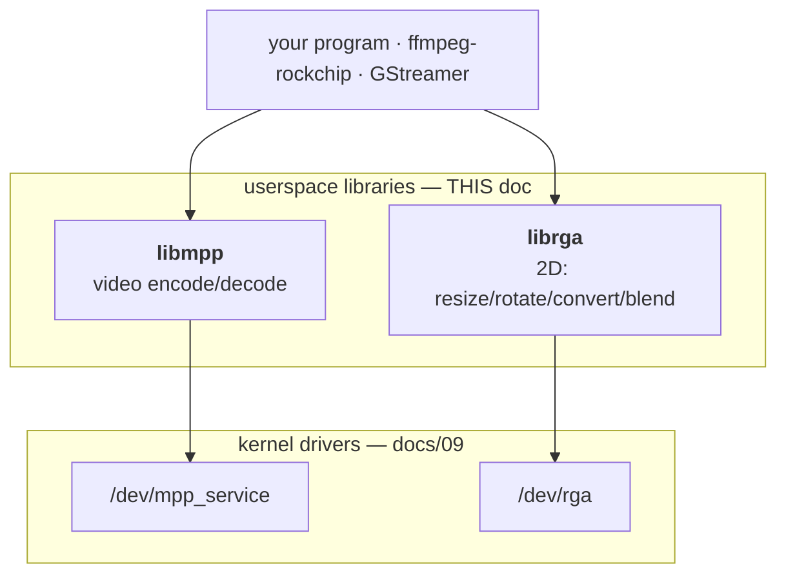
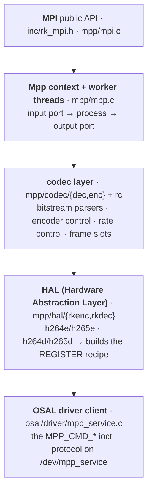
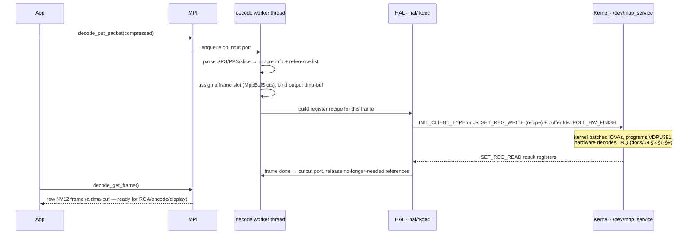
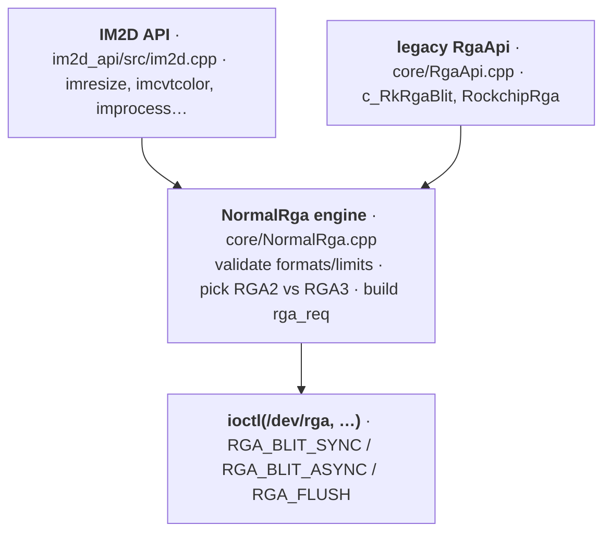
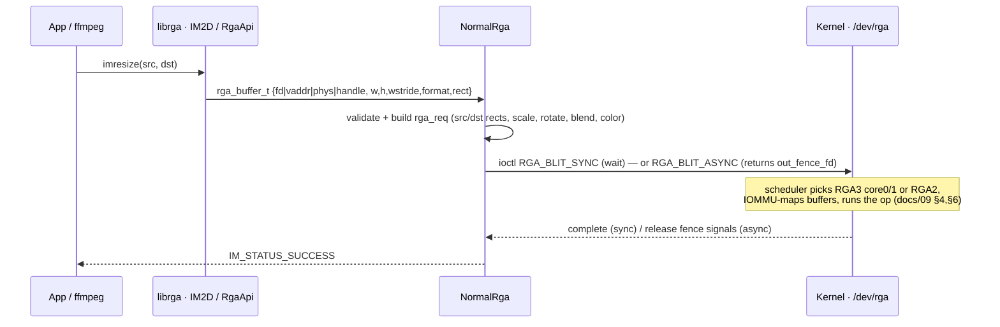
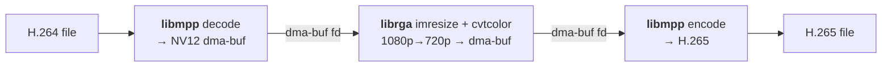

# How the userspace libraries work — libmpp & librga

The in-depth companion to [`docs/09`](09-how-the-drivers-work.md). That one
explained the **kernel drivers**; this one explains the **userspace libraries**
your application actually links against — what they hide, how they're structured,
and exactly where they meet the kernel. Same format: **In plain terms**, then
**Under the hood** with source pointers.

> Sources studied: `rockchip-linux/mpp` (libmpp / `librockchip_mpp`, v1.3.9) and
> the librga implementation from the JeffyCN lineage
> (`tsukumijima/librga-rockchip` — the *real source*, not the prebuilt blob).

---

## 0. Where these libraries sit

**In plain terms.** The kernel drivers (docs/09) are a low-level "front door":
powerful but raw — you'd have to hand-build register tables, translate file
descriptors to device addresses, and manage frame pools yourself. The **userspace
libraries** are the experienced receptionists: your app says `decode this` or
`resize that`, and the library does all of that fiddly work.



**Under the hood.** The division of labour is sharp: **userspace decides *what* to
do, parses the bitstream, manages the frame pool, and builds the exact register
recipe; the kernel safely runs that recipe on the hardware.** docs/09 §9 said "the
userspace library knows the recipe" — these libraries are where the recipe is
built and where every `MPP_CMD_*` / `RGA_*` ioctl is issued. They exist (rather
than using mainline V4L2) because Rockchip's stack exposes the full feature set:
H.265 *encode*, all RGA ops, and the buffer model `ffmpeg-rockchip` expects.

---

# Part A — libmpp (Rockchip Media Process Platform)

## A1. What it is

**In plain terms.** libmpp turns "decode this H.264 stream" or "encode these
frames as H.265" into actual hardware work. It hides four genuinely hard things:
**(1)** parsing the compressed bitstream (SPS/PPS, slice headers, reference
lists); **(2)** managing the pool of decoded frames and which ones are still
needed as references; **(3)** building the hundreds of hardware registers per
frame; **(4)** talking the `/dev/mpp_service` protocol. `ffmpeg-rockchip`'s
`h264_rkmpp`/`hevc_rkmpp`/`mjpeg_rkmpp`/`vp9_rkmpp` are thin wrappers over it — one
library, every codec.

## A2. The API you call (MPI)

**In plain terms.** You create a codec instance, then feed it data and collect
results — a coffee machine with an IN slot and an OUT slot.

```c
mpp_create(&ctx, &mpi);                              // make an instance
mpi->control(ctx, MPP_SET_OUTPUT_BLOCK, &block);     // tune behaviour
mpp_init(ctx, MPP_CTX_DEC, MPP_VIDEO_CodingAVC);     // decoder, H.264
mpi->decode_put_packet(ctx, packet);                 // push compressed data IN
mpi->decode_get_frame(ctx, &frame);                  // pull raw frames OUT
```

**Under the hood** (`inc/rk_mpi.h`, `mpp/mpi.c`). The `MppApi` vtable offers two
styles that bottom out in the same engine:
- **Simple:** `decode` / `decode_put_packet` / `decode_get_frame` (and
  `encode_put_frame` / `encode_get_packet`). Easiest; the library hides the task
  plumbing.
- **Advanced port API:** `poll` / `dequeue` / `enqueue` over an **input port** and
  **output port**. A caller dequeues an `MppTask`, attaches buffers, enqueues it,
  and later reaps it — giving explicit control over buffering and letting you cycle
  your own dma-bufs (the zero-copy transcode path uses this).
- **`control()`** sets/queries hundreds of options (output format, buffer mode,
  rate-control parameters, SEI, …) via a single `MppApi` entry.
- Core data types (`mpp/base/`): **`MppPacket`** (compressed data + flags),
  **`MppFrame`** (a raw picture: format, stride, buffer, and decode metadata),
  **`MppBuffer`** (a dma-buf-backed allocation), **`MppTask`** (a unit of work on a
  port), **`MppCtx`** (the instance, decoder *or* encoder per `MppCtxType`).

## A3. The layers inside libmpp

**In plain terms.** Your call descends through: the public API → a context running
background worker threads → the codec "brain" (parsing/control) → the **HAL** that
writes the hardware recipe → the thin ioctl client that hands it to the kernel.



| Layer | Directory | What it really does |
|-------|-----------|---------------------|
| MPI + context | `inc/`, `mpp/mpi.c`, `mpp/mpp.c` | public API; spawns worker thread(s); owns the input/output ports |
| codec — decode | `mpp/codec/dec` | per-format **parsers** (H.264/H.265/VP9): turn a packet into picture info + a reference list |
| codec — encode | `mpp/codec/enc` | encoder **control**: config, header generation, slice setup |
| rate control | `mpp/codec/rc` (`h264e_rc.c`, `h265e_rc.c`, `rc.c`) | choose **QP/bitrate** per frame to hit the target bitrate |
| HAL | `mpp/hal/rkenc`, `mpp/hal/rkdec` | per-codec **register builders** (`hal_h264e`, `hal_h265e`, `hal_h264d`, `hal_h265d`) — *the recipe* |
| OSAL | `osal/` | buffers, threads, locks, time, SoC/platform detection |
| driver client | `osal/driver/mpp_service.c` | issues `INIT_CLIENT_TYPE`, `SET_REG_WRITE/READ`, `POLL_HW_FINISH` (docs/09 §3) |

**Threading.** The context runs background workers so the API can be async: a
**parse/control** step turns input into a hardware task, a **HAL** step submits it
and waits on the IRQ, and finished work appears on the output port. Decoders track
the frame pool with **`MppBufSlots`** (`mpp/base/mpp_buf_slot.c`) — assigning a
slot per picture and holding reference frames until no longer needed.

## A4. How a decode flows (and where it meets the kernel)



Encode is the mirror image: `encode_put_frame` (raw in) → **rate control** picks
this frame's QP from the bitrate target → HAL builds the VEPU580 recipe → kernel
runs it → `encode_get_packet` (bitstream out). The **key link to docs/09:** the
HAL's register block *is* the `SET_REG_WRITE` payload the kernel `copy_from_user()`s
into `task->reg[]` — libmpp **writes** the recipe; the kernel **runs** it.

## A5. Buffers — where the dma-bufs come from

**In plain terms.** The big frame buffers that get shared zero-copy (docs/09 §5)
are allocated *here*, in libmpp's OSAL — and the decoder keeps a *pool* of them so
it isn't allocating mid-stream.

**Under the hood.**
- `osal/mpp_buffer.c` + `mpp_allocator` + `osal/mpp_dmabuf.c` allocate DMA-able
  memory through the best backend for the platform — **DRM / dma-heap / ION** —
  and expose each as a **dma-buf fd**. Those fds are what go to `/dev/mpp_service`
  and, in a transcode, straight to librga and back, with no copies.
- Buffers live in **`MppBufferGroup`s** (pools), so the decoder recycles a fixed
  set of output frames. **`MppBufSlots`** maps each decoded picture to a slot and
  tracks its reference/display state, so a frame isn't reused while it's still a
  motion-compensation reference or still queued for display.

### A5.1 The dma-heap path — what backend actually serves the buffers

On this port the backend is **dma-heap** (`/dev/dma_heap/*`), and it's worth
knowing exactly how MPP gets there, because it explains a non-obvious runtime
requirement (the udev rule in docs/06) and a harmless `…failed!` log line.

**dma-heap is the normal modern path.** `mpp_allocator` supports three backends —
**ION**, **DRM**, **dma-heap** — and picks at runtime. ION was deleted from
mainline years ago, so on any 6.x kernel the live path is dma-heap (MPP buffer
`type 1`). This is the same allocator Jellyfin / LibreELEC / ffmpeg-rockchip use;
nothing here is exotic.

**MPP asks for a heap by *property*, then remaps if it's missing.**
`osal/allocator/allocator_dma_heap.c` carries a table of named heaps keyed by
cacheable/DMA32/CMA flags; at init it `open()`s every `/dev/dma_heap/<name>` it
can and, for any that are absent, **remaps** to a surviving heap by dropping the
`uncached` then the `dma32` then the `cma` preference:

| MPP wants (in order) | flags | present on *this* kernel? |
|---|---|---|
| `system-uncached` (its default) | — | ❌ |
| `system-uncached-dma32` | DMA32 | ❌ |
| **`system`** | CACHABLE | ✅ ← **remaps here** |
| `cma`, `cma-uncached`, … | CMA (+…) | ❌ (`default_cma_region`/`reserved` exist but aren't named `cma`) |

**Why the preferred heaps are missing — and why that's fine.** We forward-ported
the *codec* drivers (mpp + rga), **not** the vendor *memory* drivers. The Rockchip
6.1 BSP registers extra named heaps via `drivers/dma-buf/heaps/rk_system_heap.c`,
`rk_cma_heap.c` and the `rk_dma_heap` core (`system-uncached`, `system-dma32`,
`cma`, `cma-uncached`); mainline 6.18 ships only `DMABUF_HEAPS_SYSTEM` (→ `system`)
and `DMABUF_HEAPS_CMA` (→ one heap per CMA region: `default_cma_region`,
`reserved`). So on a full vendor kernel MPP opens `system-uncached` directly; on
ours its first choices 404 and it lands on `system` — which is exactly the
graceful fallback the remap table is built for, not a misconfiguration.

**`system` is cacheable, so MPP does cache maintenance — correctly.** The one real
difference: `system-uncached` is write-combine memory (no cache maintenance
needed); `system` is cacheable. MPP marks it `CACHABLE` in the table, which means
the framework issues explicit flush/invalidate (`osal/mpp_dmabuf.c`) around every
hardware DMA. So coherency is handled and output is correct (our transcodes hit
PSNR 47–62 dB on decodable streams). The only cost is a little cache-maintenance
overhead per buffer versus uncached — negligible for HW-only pipelines
(dec → rga → enc) where the CPU never touches the pixels. If you ever wanted
byte-for-byte vendor behavior you'd also port `rk_system_heap`/`rk_dma_heap`, but
it buys nothing for correctness.

**Runtime consequence.** The kernel creates `/dev/dma_heap/*` as `root root 0600`,
so a non-root `video`-group user can't open `system` to allocate — and granting
just `/dev/mpp_service` is **not** enough; MPP init dies at
`MppBufferService get_group failed … type 1`. The fix is the
`SUBSYSTEM=="dma_heap"` udev rule (docs/06), upstreamed as
[armbian/build#10085](https://github.com/armbian/build/pull/10085).

---

# Part B — librga (2D acceleration)

## B1. What it is

**In plain terms.** librga is the library for fast 2D image operations — resize,
rotate, flip, crop, colour-space convert (e.g. RGB↔NV12), alpha-blend/composite,
fill, mosaic, blur, OSD overlay. A hardware "Photoshop for simple ops." In a
transcode it does the **scaling and format conversion** between decode and encode.

## B2. Two APIs — pick your altitude

**In plain terms.** A friendly modern API, and an older low-level one.

```c
/* IM2D — modern, readable */
imresize(src, dst);                                  /* scale src → dst */
imcvtcolor(src, dst, RK_FORMAT_RGBA_8888, RK_FORMAT_YCbCr_420_SP);
improcess(src, dst, pat, srect, drect, prect, ...);  /* the everything-call */

/* legacy RgaApi — what ffmpeg-rockchip links */
c_RkRgaBlit(&src, &dst, NULL);
```

**Under the hood.**
- **IM2D** (`im2d_api/`, impl in `im2d_api/src/im2d.cpp`): `imresize`, `imcrop`,
  `imrotate`, `imflip`, `imcvtcolor`, `imcopy`, `imblend`/`imcomposite`, `imfill`,
  `immosaic`, `imosd`, `imrop`, `immakeBorder`, `imgaussianBlur`, and the umbrella
  `improcess`. Each has a `*Task` variant for batching (§B5). `querystring` reports
  driver/hardware version + capabilities (ffmpeg calls this at probe to decide what
  it can offload).
- **Legacy `RgaApi`/`RockchipRga`** (`core/`): `c_RkRgaInit`, `c_RkRgaBlit`,
  `RkRgaBlit`, the `RockchipRga` C++ singleton, with `NormalRga` as the engine.
  `ffmpeg-rockchip`'s `scale_rkrga` filter links `c_RkRgaBlit` (its `configure`
  test looks for that symbol plus `querystring`).

## B3. The layers inside librga



| Piece | File | Role |
|-------|------|------|
| modern API | `im2d_api/src/im2d.cpp` (+ `im2d_single/task/buffer/job`) | friendly ops, batching, buffer handles |
| legacy API | `core/RgaApi.cpp`, `core/RockchipRga.cpp` | `c_RkRgaBlit`, the singleton |
| engine | `core/NormalRga.cpp`, `NormalRgaApi.cpp` | validate, **choose engine**, build the kernel `rga_req`, ioctl |
| format/version | `core/RgaUtils.cpp` | format tables, alignment rules, `querystring` |
| fences | `core/rga_sync.cpp` | async-mode dma-fence / `out_fence_fd` |

**Choosing the engine.** RGA isn't one device — it's RGA3 ×2 + RGA2, with
*different* capabilities (max scale ratio, supported formats, tiling/AFBC).
`NormalRga` checks the request's formats and limits and selects which engine class
can do it; the **kernel's** scheduler (`rga3/rga_policy.c`, docs/09 §4) then picks
a specific *idle* core of that class. (The `docs/08` audit found a real bug in that
kernel core-selection — it could accept a core supporting only a subset of the
requested features.)

## B4. How a 2D op flows — sync vs async



**In plain terms.** You describe two images and an operation; librga packs that
into a command and hands it to `/dev/rga`. **Sync** (`RGA_BLIT_SYNC`) waits for the
result. **Async** (`RGA_BLIT_ASYNC`) returns immediately with a **release fence**
(`out_fence_fd`) you can wait on later — so the CPU keeps working and several RGA
ops can pipeline. (`out_fence_fd` comes back `-1` if the kernel build lacks fence
support.) This is the same dma-fence machinery the kernel side documents in
docs/09; it's also where the audit found a leaked fence reference (`docs/08`).

## B5. Describing memory, and batching jobs

**Four ways to point at an image.** The fastest and most common is a dma-buf fd —
zero-copy, same buffer as docs/09 §5:

| Mode | When | Helper |
|------|------|--------|
| **dma-buf fd** | shared buffers (decode→RGA→encode) | `importbuffer_fd` / `wrapbuffer_fd` |
| **handle** | an imported buffer reused across many ops | `importbuffer_*` → a handle the driver remembers |
| virtual address | plain CPU memory | `wrapbuffer_virtualaddr` |
| physical address | special/reserved regions | `wrapbuffer_physicaladdr` |

`importbuffer_*` registers the buffer with the driver once and returns a **handle**
(in `im2d_api/src/im2d.cpp`); reusing the handle avoids re-importing per op.

**Batching (jobs).** Submitting one op per ioctl has per-call overhead. IM2D's
**job** API (`im2d_api/src/im2d_job.cpp`) batches several ops:

```c
im_job_handle_t job = imbeginJob();
imresizeTask(job, src, mid);
imcvtcolorTask(job, mid, dst, ...);
imendJob(job);     // one submission for the whole chain (imcancelJob to drop it)
```

`improcess` itself uses this internally (`imbeginJob` → configure → `imendJob`).

---

# Part C — How they fit together (the transcode)

**In plain terms.** A hardware transcode is just these two libraries handing the
*same* dma-buf back and forth (zero copies), each calling its own kernel driver:



**Under the hood.** `ffmpeg-rockchip` runs `h264_rkmpp` (libmpp) → `scale_rkrga`
(librga) → `hevc_rkmpp` (libmpp). With `-hwaccel_output_format drm_prime`, each
frame stays a **`drm_prime`/dma-buf** the whole way: libmpp's decoder output buffer
is imported by librga as a source fd, librga's output buffer is fed to libmpp's
encoder as an input fd. No frame ever touches the CPU. See
[`tests/transcode-test.sh`](../tests/transcode-test.sh).

---

# Part D — Mental model

1. Your app links **libmpp** and/or **librga** (directly or via ffmpeg).
2. You call a friendly function (`decode_get_frame`, `imresize`).
3. The library **parses/validates**, **allocates/pools dma-bufs**, runs **rate
   control** (encode) or **frame-slot/reference tracking** (decode), and **builds
   the hardware recipe** (MPP's HAL / RGA's `NormalRga`).
4. A thin ioctl client (`mpp_service.c` / `NormalRga`) speaks the kernel protocol
   (`SET_REG_WRITE`+`POLL_HW_FINISH` / `RGA_BLIT_SYNC`/`ASYNC`).
5. The **kernel** (docs/09) patches IOVAs, picks a core (CCU/DCHS or RGA
   scheduler), programs the hardware, and returns results (or signals a fence).
6. Buffers are **dma-buf fds** throughout, so chaining decode → RGA → encode costs
   no copies.

So: **userspace builds the recipe and manages the memory; the kernel runs it on
silicon.** docs/09 + docs/10 together trace the complete path from your function
call down to the hardware and back.

> Provenance: librga's source is open (Apache-2.0) in the JeffyCN lineage above;
> Rockchip's official `airockchip/librga` ships only prebuilt binaries (see
> [`docs/06`](06-gotchas.md)). libmpp is open source (`rockchip-linux/mpp`).
