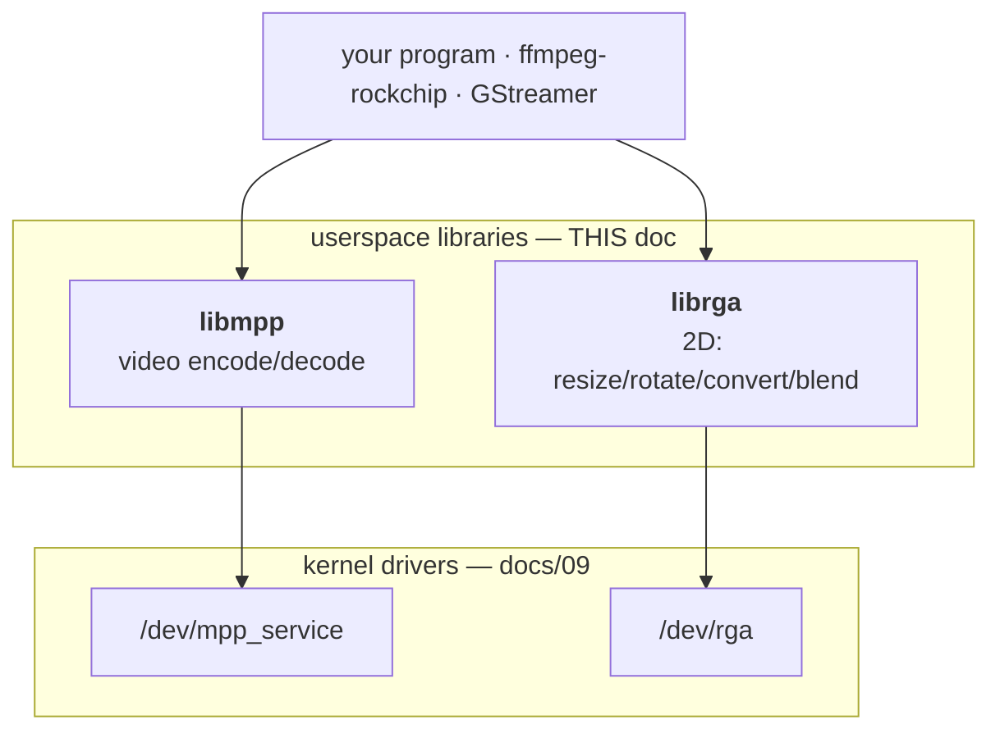
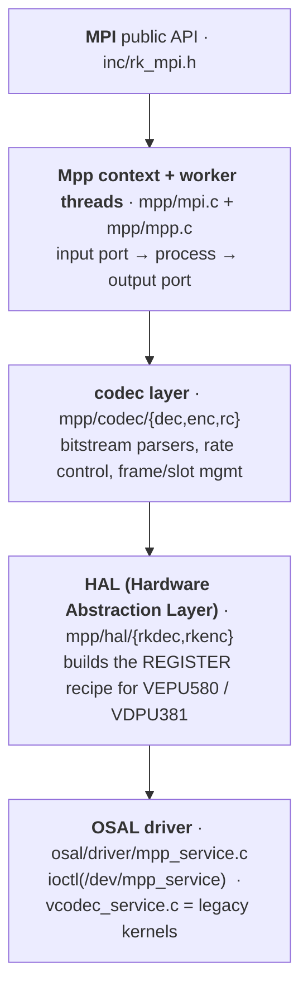
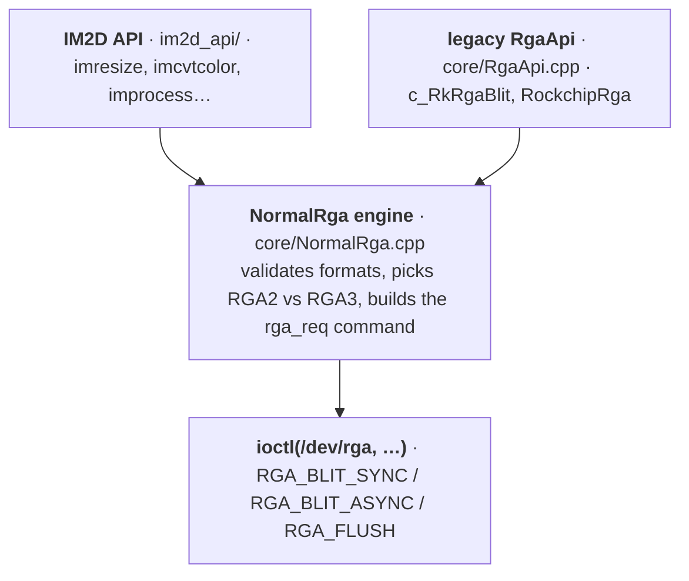
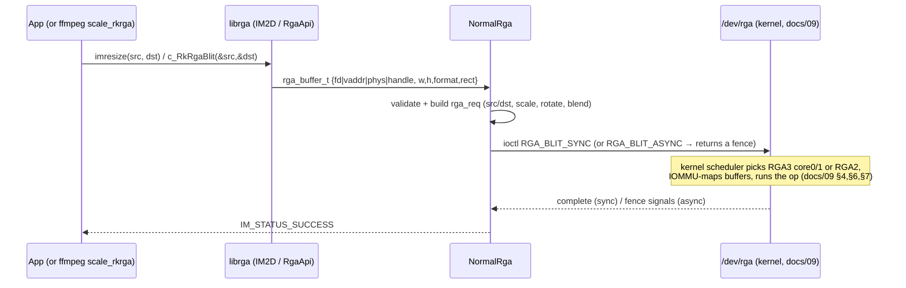
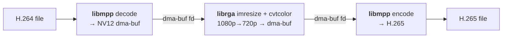

# How the userspace libraries work — libmpp & librga

The companion to [`docs/09`](09-how-the-drivers-work.md). That one explained the
**kernel drivers**; this one explains the **userspace libraries** that sit on top
of them — the code your application actually links against. Same format: each
section opens **In plain terms**, then **Under the hood** with source pointers.

> Sources studied: `rockchip-linux/mpp` (libmpp, the `librockchip_mpp` library,
> v1.3.9) and the librga implementation from the JeffyCN lineage
> (`tsukumijima/librga-rockchip` — the *real source*, not the prebuilt blob).

---

## 0. Where these libraries sit

**In plain terms.** The kernel drivers (docs/09) are a low-level "front door" —
powerful but raw: you'd have to hand-build register tables and juggle memory. The
**userspace libraries** are the friendly receptionists: your app calls
`decode this` or `resize that`, and the library does all the fiddly work of
talking to the kernel front door.



The division of labour: **userspace decides *what* to do and builds the exact
register recipe; the kernel safely runs it on the hardware.** Docs/09 §9 said "the
userspace library knows the recipe" — these libraries are where that recipe is
built.

---

# Part A — libmpp (Rockchip Media Process Platform)

## A1. What it is

**In plain terms.** libmpp is the library that turns "decode this H.264 stream"
or "encode these frames as H.265" into actual hardware work. It hides four hard
things: parsing the bitstream, allocating the right buffers, building the
hardware register settings, and talking to `/dev/mpp_service`. `ffmpeg-rockchip`'s
`h264_rkmpp`/`hevc_rkmpp` codecs are thin wrappers around it.

## A2. The API you call (MPI)

**In plain terms.** You create a codec instance, then feed it data and collect
results — like a coffee machine: put beans in one slot, take coffee from another.

```c
mpp_create(&ctx, &mpi);              // make an instance
mpp_init(ctx, MPP_CTX_DEC, MPP_VIDEO_CodingAVC);   // decoder, H.264
mpi->decode_put_packet(ctx, packet);   // push compressed data IN
mpi->decode_get_frame(ctx, &frame);    // pull raw frames OUT
```

**Under the hood** (`inc/rk_mpi.h`). The `MppApi` vtable offers two styles:
- **Simple:** `decode` / `decode_put_packet` / `decode_get_frame` and the encode
  equivalents (`encode_put_frame` / `encode_get_packet`).
- **Advanced port API:** `poll` / `dequeue` / `enqueue` over input/output ports,
  for apps that want explicit task control and zero-copy buffer cycling.
- Core data types (`mpp/base/`): **`MppPacket`** (compressed data), **`MppFrame`**
  (raw picture), **`MppBuffer`** (a dma-buf-backed allocation), **`MppTask`** (a
  unit of work on a port), **`MppCtx`** (the instance).

## A3. The layers inside libmpp

**In plain terms.** Your call descends through: the public API → a context with
background worker threads → the codec brain (parsing + control) → the "HAL" that
writes the hardware recipe → the thin ioctl layer that hands it to the kernel.



| Layer | Directory | Role |
|-------|-----------|------|
| MPI | `inc/`, `mpp/mpi.c`, `mpp/mpp.c` | public API + context |
| codec | `mpp/codec/dec`, `…/enc`, `…/rc` | parsers, encoder control, **rate control** |
| HAL | `mpp/hal/rkdec`, `mpp/hal/rkenc` | per-codec register-set builders (the "recipe") |
| OSAL | `osal/` | buffers, threads, locks, time; SoC detection |
| driver glue | `osal/driver/mpp_service.c` | the `/dev/mpp_service` client (talks to docs/09) |

## A4. How a decode flows (and where it meets the kernel)

```mermaid
sequenceDiagram
  participant A as App
  participant M as MPI
  participant T as decode worker thread
  participant H as HAL (hal/rkdec)
  participant K as /dev/mpp_service (kernel, docs/09)
  A->>M: decode_put_packet(compressed)
  M->>T: enqueue on input port
  T->>T: parse SPS/PPS/slice → picture info, manage frame slots
  T->>H: build register config for this frame
  H->>K: ioctl SET_REG_WRITE (the recipe) + buffer fds; start
  Note over K: kernel programs VDPU381, IOMMU-maps buffers,<br/>hardware decodes, raises IRQ (docs/09 §3–§9)
  K-->>H: SET_REG_READ result registers
  H->>T: frame done → output port
  A->>M: decode_get_frame()
  M-->>A: raw NV12 frame (a dma-buf — ready for RGA/encode/display)
```

Encode is the mirror image: `encode_put_frame` (raw in) → rate control picks QP →
HAL builds the VEPU580 recipe → kernel → `encode_get_packet` (bitstream out).

**The key link to docs/09:** the HAL's register block is exactly the
`SET_REG_WRITE` payload the kernel `copy_from_user()`s into `task->reg[]`. libmpp
*writes* the recipe; the kernel *runs* it.

## A5. Buffers — where the dma-bufs come from

**In plain terms.** The big frame buffers that get shared zero-copy (docs/09 §5)
are allocated *here*, in libmpp's OSAL.

**Under the hood.** `osal/mpp_buffer` + `mpp_allocator` + `mpp_dmabuf.c` allocate
DMA-able memory (via DRM/dma-heap/ION depending on the platform) and expose it as
**dma-buf fds**. Those fds are what get handed to `/dev/mpp_service` and, in a
transcode, passed straight to librga and back — no copies.

---

# Part B — librga (2D acceleration)

## B1. What it is

**In plain terms.** librga is the library for fast 2D image operations — resize,
rotate, flip, crop, colour-space convert (e.g. RGB↔NV12), alpha-blend, fill,
mosaic/blur. It's a hardware "Photoshop for simple ops." In a transcode it does
the **scaling and format conversion** between decode and encode.

## B2. Two APIs — pick your altitude

**In plain terms.** There's a friendly modern API and an older low-level one.

```c
/* IM2D — modern, readable */
imresize(src, dst);                 /* scale src → dst                     */
imcvtcolor(src, dst, RK_FORMAT_RGBA_8888, RK_FORMAT_YCbCr_420_SP);
improcess(src, dst, pat, srect, drect, prect, ...);  /* the everything-call */

/* legacy RgaApi — what ffmpeg-rockchip links */
c_RkRgaBlit(&src, &dst, NULL);
```

**Under the hood.**
- **IM2D** (`im2d_api/`, `im2d.h`): `imresize`, `imcrop`, `imrotate`, `imflip`,
  `imcvtcolor`, `imcopy`, `imblend`/`imcomposite`, `imfill`, `immosaic`, `imosd`,
  `imrop`, `immakeBorder`, `imgaussianBlur`, and the umbrella `improcess`. Each
  has a `*Task` variant to **batch** several ops into one submission. Buffer
  helpers: `importbuffer_fd/virtualaddr/physicaladdr`, `wrapbuffer_*`. `querystring`
  reports driver/hardware version+capabilities (ffmpeg calls this at probe).
- **Legacy `RgaApi`/`RockchipRga`** (`core/`): `c_RkRgaInit`, `c_RkRgaBlit`,
  `RkRgaBlit`, the `RockchipRga` C++ singleton. `ffmpeg-rockchip`'s `scale_rkrga`
  uses `c_RkRgaBlit` (the `configure` check looks for that symbol).

## B3. The layers inside librga



| Piece | File | Role |
|-------|------|------|
| modern API | `im2d_api/src/im2d.cpp` (+ headers in `im2d_api/`) | friendly ops + batching + buffer handles |
| legacy API | `core/RgaApi.cpp`, `core/RockchipRga.cpp` | `c_RkRgaBlit`, the singleton |
| engine | `core/NormalRga.cpp`, `NormalRgaApi.cpp` | build the kernel `rga_req`, choose engine, ioctl |
| version/format helpers | `core/RgaUtils.cpp` | format tables, `querystring` |
| fences | `core/rga_sync.cpp` | async-mode dma-fence/sync_file |

## B4. How a 2D op flows



**In plain terms.** You describe two images (source and destination) and an
operation; librga packs that into a command, hands it to `/dev/rga`, and the
kernel runs it on whichever 2D engine is free. **Sync** waits for the result;
**async** returns immediately with a "fence" you can wait on later (so the CPU
keeps working).

## B5. Describing memory — four ways

**In plain terms.** You tell librga where an image lives in one of four ways; the
fastest and most common is a dma-buf fd (zero-copy, same as docs/09 §5):

| Mode | When | Helper |
|------|------|--------|
| **dma-buf fd** | shared buffers (decode→RGA→encode) | `importbuffer_fd` / `wrapbuffer_fd` |
| handle | an imported buffer reused across ops | `importbuffer_*` returns a handle |
| virtual address | plain CPU memory | `wrapbuffer_virtualaddr` |
| physical address | special/reserved regions | `wrapbuffer_physicaladdr` |

---

## C. How they fit together — the transcode

**In plain terms.** A hardware transcode is just these two libraries handing the
*same* dma-buf back and forth (zero copies), each calling its own kernel driver:



`ffmpeg-rockchip` orchestrates exactly this: `h264_rkmpp` (libmpp) →
`scale_rkrga` (librga) → `hevc_rkmpp` (libmpp), with `-hwaccel_output_format
drm_prime` keeping the buffers as dma-bufs the whole way. See
[`tests/transcode-test.sh`](../tests/transcode-test.sh).

---

## D. Mental model

1. Your app links **libmpp** and/or **librga** (directly or via ffmpeg).
2. You call a friendly function (`decode_get_frame`, `imresize`).
3. The library **parses/validates**, **allocates dma-bufs**, and **builds the
   hardware recipe** (MPP's HAL / RGA's NormalRga).
4. A thin ioctl layer (`mpp_service.c` / `NormalRga`) hands it to the kernel front
   door (`/dev/mpp_service` / `/dev/rga`).
5. The **kernel** (docs/09) maps buffers through the IOMMU, programs the hardware,
   and returns results.
6. Buffers are **dma-buf fds** throughout, so chaining decode → RGA → encode costs
   no copies.

So: **userspace builds the recipe and manages the memory; the kernel runs it on
silicon.** docs/09 + docs/10 together cover the whole path from your function call
down to the hardware and back.

> Provenance note: librga's source is open (Apache-2.0) in the JeffyCN lineage
> above; Rockchip's official `airockchip/librga` ships only prebuilt binaries
> (see [`docs/06`](06-gotchas.md)). libmpp is BSD/Apache-style open source
> (`rockchip-linux/mpp`).
