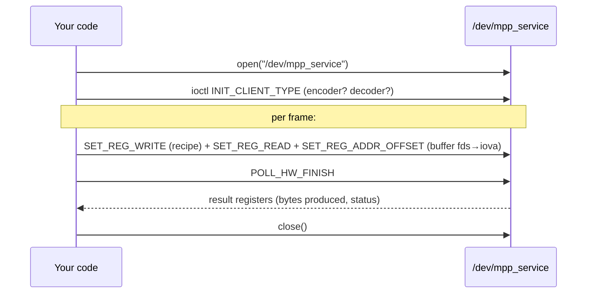
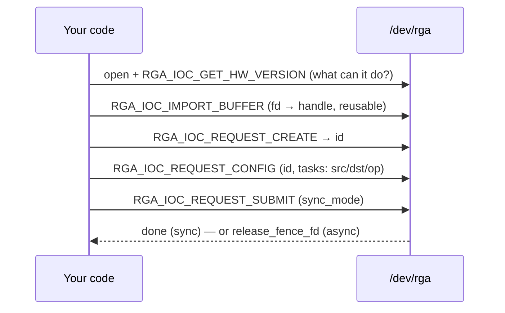

# The `/dev` uAPIs — talking to the hardware directly

A **uAPI** ("userspace API") is the contract between userspace and the kernel: the
device files, the `ioctl()` commands, and the structs passed across. The
libraries in [`docs/10`](10-how-the-userspace-libs-work.md) exist so you *don't*
have to use these directly — but understanding them is invaluable for **debugging**
(what is ffmpeg actually asking the kernel to do?), **writing a minimal client**,
and **security review** (this is the kernel's attack surface — the `docs/08` audit
lives right here). As always: **In plain terms**, then **Under the hood**.

Two device files matter:

| Device | Driver | Wrapped by | Purpose |
|--------|--------|-----------|---------|
| `/dev/mpp_service` | MPP framework (docs/09) | `librockchip_mpp` | video encode/decode |
| `/dev/rga` | RGA driver (docs/09) | `librga` | 2D resize/rotate/convert/blend |

---

## 0. Meet the device files (user-friendly)

**In plain terms.** A device file is a "thing you open like a file, then send
commands to with `ioctl()`." You don't read/write bytes to it like a text file;
you call `ioctl(fd, COMMAND, &struct)` to ask the hardware to do something. The
codec/RGA libraries open these for you and speak the protocol; you'd open them
yourself only to poke around or build something minimal.

**Inspect them on a running board:**

```bash
ls -l /dev/mpp_service /dev/rga          # crw------- root root  (root-only unless the udev rule)
ls -l /dev/dma_heap/                      # system, default_cma_region, reserved — MPP allocates buffers here
ls /proc/mpp_service/                    # rkvenc-core0, rkvdec-core0/1, ... (one dir per bound core)
cat /sys/kernel/debug/rkrga/*            # RGA load, version, scheduler state
dmesg | grep -iE 'mpp|rkvdec|rkvenc|rga' # probe + per-op kernel logs
strace -e ioctl -f ffmpeg …              # SEE the real ioctl stream the library issues
```

`/dev/dma_heap/*` isn't an `ioctl`-recipe device like the others — it's the
**DMABUF-heaps** allocator MPP draws every frame/stream buffer from (one
`DMA_HEAP_IOCTL_ALLOC` → a dma-buf fd it then hands to `/dev/mpp_service`). It's
listed here because it shares the codec's permission story: all of these are
`crw------- root root` by default — that's why the tests need `sudo`; the
[`scripts/99-rockchip-codec.rules`](../scripts/99-rockchip-codec.rules) udev rule
relaxes `mpp_service`, `rga`, **and** `dma_heap` to `video` group `0660`. Granting
the codec node without the heaps still fails — see
[`docs/10` §A5.1](10-how-the-userspace-libs-work.md) for why MPP needs the heap and
which one it lands on.

---

## A. `/dev/mpp_service` — the MPP uAPI

**In plain terms.** One device serves *all* codecs. You open it, declare "I'm a
decoder" (or encoder), then for each frame you send a **register recipe** plus the
buffers, and **poll** until the hardware says done. Every message is the same tiny
envelope with a *command number* and a *pointer to a payload*.

### The message envelope

Every operation is one `MppReqV1` (`osal/inc/mpp_service.h`), issued via the
service's config `ioctl()`; several can be **batched** in one syscall (the last
one flagged to actually start the task):

```c
typedef struct mppReqV1_t {
    RK_U32 cmd;        /* which MPP_CMD_*  (selects the operation)        */
    RK_U32 flag;       /* flags: e.g. "last message of the batch"        */
    RK_U32 size;       /* byte size of the payload                       */
    RK_U32 offset;     /* offset (used when patching register addresses) */
    RK_U64 data_ptr;   /* userspace pointer to the payload               */
} MppReqV1;
```

The kernel dispatches on `cmd`, grouped by base value (`mpp_common.c`):

| Group (base) | Command | What it does |
|--------------|---------|--------------|
| **QUERY** `0x000` | `QUERY_HW_SUPPORT`, `QUERY_HW_ID`, `QUERY_CMD_SUPPORT` | feature/capability negotiation |
| **INIT** `0x100` | `INIT_CLIENT_TYPE` | declare encoder/decoder/jpeg/… — routes the session to a driver |
| | `INIT_DRIVER_DATA`, `INIT_TRANS_TABLE` | driver-private setup, fd→iova translate table |
| **SEND** `0x200` | `SET_REG_WRITE` | the **register recipe** for this task (docs/09 §9) |
| | `SET_REG_READ` | which result registers to read back |
| | `SET_REG_ADDR_OFFSET` | where in the recipe to patch buffer IOVAs |
| | `SET_RCB_INFO` | which row-cache fields go in on-chip SRAM (docs/09 §8) |
| | `SET_SESSION_FD` | batch-start a task for a session |
| **POLL** `0x300` | `POLL_HW_FINISH`, `POLL_HW_IRQ` | block until the task completes |
| **CONTROL** `0x400` | `RESET_SESSION`, `TRANS_FD_TO_IOVA`, `RELEASE_FD`, `SEND_CODEC_INFO` | reset, fd↔iova, buffer release, codec hints |

### The flow



**Under the hood / notes.**
- Buffers cross as **fds**: the kernel imports them (docs/09 §5), maps them in the
  shared IOMMU, and `SET_REG_ADDR_OFFSET`/`TRANS_FD_TO_IOVA` patch the resulting
  **IOVA** into the recipe — userspace never sees physical addresses.
- The recipe lands in a fixed-size `task->reg[]`; the kernel **bounds-checks** each
  `MppReqV1`'s `size`/`offset` (`mpp_check_req()`). This is the security boundary —
  the `docs/08` audit found real OOB/clamp bugs exactly here, so treat any code
  that builds these requests as trusted-input-only.
- `INIT_CLIENT_TYPE` is mandatory and first: without it the kernel doesn't know
  which hardware block (and which driver) the session targets.

---

## B. `/dev/rga` — the RGA uAPI

**In plain terms.** Open `/dev/rga`, describe two images (a *source* and a
*destination*) plus the operation (scale? rotate? convert?), submit, done — either
waiting for completion (**sync**) or getting a **fence** to wait on later
(**async**). There are two generations of this interface; modern librga uses the
newer one but both work.

### How an image is described — `rga_img_info_t`

Both generations describe each image the same way (`rga3/include/rga.h`):

```c
struct rga_img_info_t {
    uint64_t yrgb_addr;       /* Y / RGB plane (fd or address)   */
    uint64_t uv_addr;         /* UV plane (NV12 …)               */
    uint64_t v_addr;          /* V plane (planar YUV)            */
    uint32_t format;          /* RK_FORMAT_* (RGBA8888, NV12, …) */
    uint16_t act_w, act_h;    /* active (visible) size           */
    uint16_t x_offset, y_offset; /* crop origin                  */
    /* + vir_w / vir_h: the stride / "virtual" dimensions        */
};
```

### Generation 1 — legacy blit (fixed ioctl numbers)

| ioctl | value | payload | meaning |
|-------|-------|---------|---------|
| `RGA_BLIT_SYNC` | `0x5017` | `struct rga_req` | do the op, **block** until done |
| `RGA_BLIT_ASYNC` | `0x5018` | `struct rga_req` | do the op, return a **release fence** |
| `RGA_FLUSH` | `0x5019` | — | wait for outstanding async work |
| `RGA_GET_VERSION` | `0x501b` | string | driver version |

`struct rga_req` is the full command descriptor: `render_mode` (the op), `src` /
`dst` / `pat` (`rga_img_info_t` — pattern is for blending/ROP), rotation as a
fixed-point `sina`/`cosa` pair (16.16), an `alpha_rop_flag` bitfield
(alpha/ROP/fading/Porter-Duff/dither enables), a `LUT_addr` and `rop_mask_addr`,
the clip window, and MMU info.

### Generation 2 — request model (`RGA_IOC_*`, magic-based)

| ioctl | nr | payload | meaning |
|-------|----|---------|---------|
| `RGA_IOC_GET_DRVIER_VERSION` / `…_HW_VERSION` | 0x1 / 0x2 | version structs | capabilities |
| `RGA_IOC_IMPORT_BUFFER` / `…_RELEASE_BUFFER` | 0x3 / 0x4 | `rga_buffer_pool` | register fds → reusable **handles** |
| `RGA_IOC_REQUEST_CREATE` | 0x5 | returns `id` | open a request |
| `RGA_IOC_REQUEST_CONFIG` | 0x7 | `rga_user_request` | attach task(s) to the request |
| `RGA_IOC_REQUEST_SUBMIT` | 0x6 | `rga_user_request` | run it (sync or async) |

```c
struct rga_user_request {
    uint64_t task_ptr;          /* array of tasks (one "blit" each) */
    uint32_t task_num;          /* batch several ops in one submit  */
    uint32_t id;                /* from REQUEST_CREATE              */
    uint32_t sync_mode;         /* RGA_BLIT_SYNC / RGA_BLIT_ASYNC   */
    uint32_t release_fence_fd;  /* out: the fence (async)           */
    uint32_t mpi_config_flags;
};
```

### The flow (modern)



**Under the hood / notes.**
- `task_num > 1` lets one submit carry several chained ops — the kernel side of
  IM2D's job batching (docs/10 §B5).
- async returns `release_fence_fd` (`-1` if the kernel lacks fence support); wait on
  it with the usual sync_file/`poll()` machinery.
- The kernel scheduler then picks an idle RGA3/RGA2 core able to do the op (docs/09
  §4); the buffers are IOMMU-mapped exactly like the codecs (docs/09 §6).

---

## C. How the libraries map onto these

This is the bottom edge of [`docs/10`](10-how-the-userspace-libs-work.md):

| Library call | Becomes these ioctls |
|--------------|----------------------|
| `mpi->decode_put_packet` / `encode_put_frame` (libmpp) | `INIT_CLIENT_TYPE` once, then `SET_REG_WRITE`+`SET_REG_READ`+`SET_REG_ADDR_OFFSET`, then `POLL_HW_FINISH` (`osal/driver/mpp_service.c`) |
| `imresize` / `c_RkRgaBlit` (librga) | `RGA_BLIT_SYNC/ASYNC` (legacy) or `REQUEST_CREATE`→`CONFIG`→`SUBMIT` (modern) in `core/NormalRga.cpp` |

So when `strace` shows ffmpeg issuing a burst of `ioctl(…, 0x200, …)` (that's
`SET_REG_WRITE`) followed by `0x300` (`POLL_HW_FINISH`), that's one frame being
encoded/decoded; `0x5017`/`RGA_IOC_REQUEST_SUBMIT` is one 2D op.

---

## D. Debugging the uAPIs live

```bash
# Which cores are bound and serving requests right now:
ls /proc/mpp_service/ ; cat /proc/mpp_service/rkvdec-core0/* 2>/dev/null

# Watch the exact ioctl conversation a real workload has with the kernel:
sudo strace -e trace=ioctl,openat -f \
  ffmpeg -hwaccel rkmpp -i in.h264 -c:v hevc_rkmpp out.mp4 2>&1 | grep -E '/dev/(mpp_service|rga)|0x(200|300|5017)'

# RGA load / version / scheduler:
cat /sys/kernel/debug/rkrga/load /sys/kernel/debug/rkrga/*version* 2>/dev/null

# Kernel-side per-op detail (enable driver debug if built in):
dmesg -w | grep -iE 'mpp_|rkvenc|rkvdec|rga'
```

Reading the raw ioctl stream is the fastest way to answer "is it really using the
hardware?" and "where did it stall?" — and it's exactly the surface the audit in
[`docs/08`](08-bsp-audit.md) scrutinised for memory-safety bugs.

> The canonical definitions live in the kernel uAPI headers
> (`drivers/video/rockchip/rga3/include/rga.h` for RGA; the `MppServiceCmdType`
> enum + `MppReqV1` in MPP's `osal/inc/mpp_service.h`, mirrored kernel-side). Treat
> those as the source of truth; this doc is the map.
