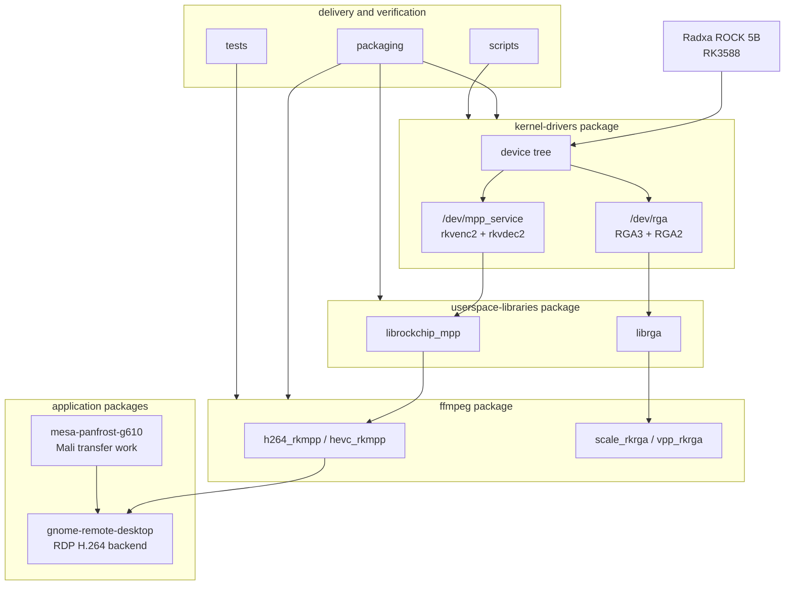

# Work packages - how this repo is organized

This page is the package-oriented reading map. The numbered `docs/` files are
still the deep references, but the main split of the project is the set of work
packages below: kernel drivers, userspace libraries, FFmpeg, GNOME Remote
Desktop, Mesa/Panfrost, packaging, and validation tools.

Every package page should answer the same questions near the top:

| Field | Meaning |
|-------|---------|
| User outcome | What a board user can accomplish from this package. |
| Developer focus | What someone changing, reviewing, or upstreaming code should learn here. |
| Owns | The files, patches, or docs for which this package is the front door. |
| Depends on | The lower layers or external projects that must already work. |
| Current state | The dated validation or known caveat, with [`../STATUS.md`](../STATUS.md) as the rollup. |

## Stack diagram

## Package map

| Package | User outcome | Developer focus | Canonical entry |
|---------|--------------|-----------------|-----------------|
| Kernel drivers | Boot and validate `/dev/mpp_service` + `/dev/rga` on RK3588. | MPP/RGA driver model, DT, forward-port deltas, audit fixes, rewrite track. | [`../kernel-drivers/`](../kernel-drivers/README.md) |
| Userspace libraries | Build or install `librockchip_mpp` and `librga` for apps. | Library/kernel responsibility split, ioctls, dma-buf imports, ABI facts. | [`../userspace-libraries/`](../userspace-libraries/README.md) |
| FFmpeg | Build and use rkmpp codecs plus RGA filters. | FFmpeg hardware frames, fork vs upstream behavior, rebase fixes. | [`../ffmpeg/`](../ffmpeg/README.md) |
| GNOME Remote Desktop | Use the codec stack in a real RDP application. | Backend design, RDP frame flow, zero-copy encode, panvk conversion, greeter ACL. | [`../gnome-remote-desktop/`](../gnome-remote-desktop/README.md) |
| Mesa/Panfrost | Understand the Mali-G610 transfer investigation behind GRD fallback performance. | Panfrost BLIT/COMPUTE transfer correctness, validation, reproducers. | [`../mesa-panfrost-g610/`](../mesa-panfrost-g610/README.md) |
| Packaging | Choose and operate installable delivery channels. | DKMS, udev ACLs, PPA source packages, rollback, binary policy. | [`../packaging/`](../packaging/README.md) |
| Scripts | Build, install, and validate the combined kernel. | PHASH pinning, Armbian wrapper assumptions, validation checks. | [`../scripts/`](../scripts/README.md) |
| Tests | Prove codec/RGA behavior on real hardware. | What each smoke test isolates and how inputs are regenerated. | [`../tests/`](../tests/README.md) |

## User reading paths

| Goal | Path |
|------|------|
| Get codecs working on a board | [`../INSTALL.md`](../INSTALL.md) -> [`../kernel-drivers/`](../kernel-drivers/README.md) -> [`../scripts/`](../scripts/README.md) -> [`../tests/`](../tests/README.md) |
| Build a command-line media stack | [`../userspace-libraries/`](../userspace-libraries/README.md) -> [`../ffmpeg/`](../ffmpeg/README.md) -> [`../tests/transcode-test.sh`](../tests/transcode-test.sh) |
| Run accelerated RDP | [`../INSTALL.md`](../INSTALL.md) -> [`../packaging/`](../packaging/README.md) -> [`../gnome-remote-desktop/`](../gnome-remote-desktop/README.md) |
| Recover from a failure | [`../STATUS.md`](../STATUS.md) -> [`10-gotchas.md`](10-gotchas.md) -> [`14-debug-kernel.md`](14-debug-kernel.md) |

## Developer reading paths

| Goal | Path |
|------|------|
| Review the kernel port | [`../kernel-drivers/`](../kernel-drivers/README.md) -> [`01-how-the-drivers-work.md`](01-how-the-drivers-work.md) -> [`05-vendor-forward-port.md`](05-vendor-forward-port.md) -> [`06-vendor-delta.md`](06-vendor-delta.md) |
| Review userspace ABI compatibility | [`../userspace-libraries/`](../userspace-libraries/README.md) -> [`02-how-the-userspace-libs-work.md`](02-how-the-userspace-libs-work.md) -> [`03-dev-uapis.md`](03-dev-uapis.md) -> [`13-rewrite-drivers.md`](13-rewrite-drivers.md) |
| Maintain the package set | [`../packaging/`](../packaging/README.md) -> [`08-armbian-packaging.md`](08-armbian-packaging.md) -> [`12-resyncing.md`](12-resyncing.md) |
| Upstream or rebase application work | [`../ffmpeg/REBASE-NOTES.md`](../ffmpeg/REBASE-NOTES.md), [`../ffmpeg/FIX-CANDIDATES.md`](../ffmpeg/FIX-CANDIDATES.md), [`../gnome-remote-desktop/patches/`](../gnome-remote-desktop/patches/README.md), [`../mesa-panfrost-g610/validation.md`](../mesa-panfrost-g610/validation.md) |

## Maintenance rule

When a package gains a new user-facing file, update that package's `README.md`.
When a new top-level package is added, update this page and the repository map
in [`../README.md`](../README.md). When status changes, update
[`../STATUS.md`](../STATUS.md) with a real verification date rather than only
changing prose elsewhere.
