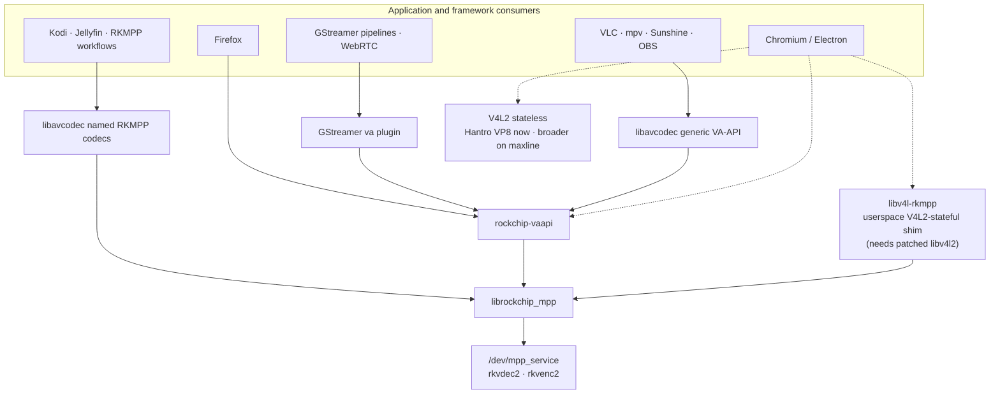

# Application hardware-video enablement map

How desktop applications (Firefox, Chromium, VLC, HandBrake, mpv, OBS, …) could
reach the RK3588 BSP hardware decode/encode stack, and roughly how much work
each would be.

**Assessed:** 2026-07-21; revised after the
[ubuntu-rockchip piggyback survey](../findings/2026-07-21-ubuntu-rockchip-piggyback-survey.md)
overturned the "no V4L2 bridge exists" premise, and again after the
[rockchip-vaapi driver review](../findings/2026-07-21-rockchip-vaapi-driver-review.md)
overturned the "no VA-API driver exists" premise. As of 2026-07-26 the
implemented bridge has its own canonical
[`video-libraries/vaapi/`](../video-libraries/vaapi/README.md) owner. This page
now stays a per-application planning assessment: an app absent from the
dashboard remains **untracked** until a dated finding captures real runtime
evidence and sustained work earns an `apps/` project/status track. The
[2026-08-04 consumer assessment](../findings/2026-08-04-rockchip-vaapi-consumer-assessment.md)
revises the encode priorities after GRD's native VA-API path proved permanently
incompatible with MPP packed-slice-header ownership. The
[Chromium 151 measurement](../findings/2026-08-04-chromium-151-gpu-working-v4l2-only.md)
then closes the old ANGLE startup blocker and moves Chromium to a bounded
mixed-backend package gate. The
[Google Chrome follow-up](../findings/2026-08-04-google-chrome-rockchip-vaapi-green-stable-export.md)
shows that Google's build already reaches the driver and relocates its green
Vimeo frame to a retained-export lifetime now fixed in installed ysp13. H.264
presentation is correct after installation, and a 640x480 VP9 Profile 0 source
selects VA-API.

## The structural fact that sorts every app

Desktop apps do not talk to codec hardware directly — each binds to one of five
plumbing layers. Which layer an app speaks decides its cost almost entirely:

| Layer | State on this stack |
|-------|---------------------|
| **libavcodec named codecs** (`h264_rkmpp`, `hevc_rkmpp`, …) | ✅ Shipped: [`ffmpeg-rockchip`](../video-libraries/ffmpeg/README.md) fork, built and Published in the [normal PPA](../packaging/ppa/README.md) as the system FFmpeg replacement. |
| **libavcodec generic VA-API codecs** (`h264_vaapi`, `hevc_vaapi`, VA hwaccel decoders) | ✅ Installed and measured through FFmpeg, VLC and mpv. This is also the standard application boundary used by Sunshine and current OBS, so those apps do not need to learn the named RKMPP codecs. |
| **GStreamer elements** (`vah264dec`, `vah265dec`, `vavp9dec`, `vah264enc`, `vah265enc`) | ✅ The standard `va` plugin is measured through decode, encode and a complete H.264 WebRTC peer path. Rockchip's separate `mppvideodec`/`mpph26xenc` plugin remains an alternative direct-MPP route but is not the only GStreamer path. |
| **Direct VA-API applications** | 🚧 Installed and hardware-measured in [`video-libraries/vaapi/`](../video-libraries/vaapi/README.md): Firefox is green with its RDD sandbox disabled; the enabled-sandbox gate remains. Direct clients still need contract inspection: GRD, for example, requires packed slice headers MPP cannot provide. |
| **V4L2** (stateful M2M or stateless request API) | ⚠️ This kernel exposes a real Hantro stateless decoder at `/dev/video1`, with MPEG-2/VP8 input, plus a VEPU121 encoder at `/dev/video2`; Chromium 151 enumerates the Hantro VP8 profile. H.264/HEVC/VP9 decode still lives behind vendor `/dev/mpp_service`. JeffyCN's userspace `libv4l-rkmpp` V4L2-stateful-over-MPP bridge and a maximum-mainline rkvdec2 kernel remain broader Chromium alternatives; see the [survey](../findings/2026-07-21-ubuntu-rockchip-piggyback-survey.md) and [`kernel-maxline`](../packaging/ppa/kernel-maxline/README.md). |

The standard GStreamer and libavcodec routes give one driver integration many
consumers. Named RKMPP codecs remain the better route for applications already
integrated with them. Direct VA-API clients still require contract inspection,
while Chromium additionally has a limited Hantro V4L2 device today and broader
V4L2 alternatives through the userspace shim or maximum-mainline kernel.

## Per-app assessment

| App | Binds via | Estimated work on this stack |
|-----|-----------|------------------------------|
| ffmpeg CLI | libavcodec | ✅ shipped (PPA `+rkmpp` packages) |
| mpv | libavcodec + DRM PRIME hwdec | ✅ Stock mpv 0.41.0 presents H.264, HEVC Main, VP9 Profile 0, HEVC Main10, and VP9 Profile 2 through installed ysp8 in an isolated Mutter virtual monitor; Main10 performs the expected P010 conversions/exports and accepts BT.2020/PQ input. Physical HDR passthrough remains unproven. |
| Kodi | libavcodec + DRM PRIME | Already tracked: [`apps/kodi`](../apps/kodi/README.md); build/tty1 gate remains |
| GStreamer `va` | Standard VA-API plugin | ✅ Decode, encode and a WebRTC peer path are measured; treat this as a framework consumer rather than separate per-app integrations |
| Sunshine | FFmpeg VA-API encoders + exported VA surfaces | Best unmeasured encode target: current source matches H.264 High/CBR/no-B-frame and separate-layer linear NV12 export; qualify SDR H.264 first |
| OBS | Native FFmpeg VA-API encoders + exported VA surfaces | Strong unmeasured fit; current OBS already registers H.264/HEVC VA-API and texture encoders, so the old `h264_rkmpp` whitelist estimate is obsolete |
| RustDesk | Bundled hwcodec/FFmpeg RAM encoder discovery | Plausible remote-desktop target; driver/package discovery and arm64 runtime selection remain unmeasured |
| WayVNC / NeatVNC | FFmpeg `h264_vaapi` + VA filter graph | ❌ Blocked by both hard-coded H.264 Constrained Baseline and required `scale_vaapi`; the driver offers neither that profile nor `VAEntrypointVideoProc` |
| GNOME Remote Desktop native VA-API | Direct VA-API encode | ❌ Declined on this backend: GRD requires packed slice headers and MPP cannot accept an application-authored slice header |
| HandBrake | bundled FFmpeg + own encoder registry | Days; encode is the realistic value |
| VLC | libavcodec VAAPI hwaccel | ✅ Stock VLC 3.0.23 hardware-decodes H.264, HEVC Main, VP9 Profile 0, HEVC Main10, and VP9 Profile 2 through installed ysp8 in the isolated Mutter display. Gated by `tests/check-vlc-display.sh`. |
| Firefox | **VA-API only** on Rockchip | ✅ Installed Firefox 153.0.1 hardware-decodes H.264, HEVC Main, VP9 Profile 0, HEVC Main10, and VP9 Profile 2 through installed ysp8, with DMA-BUF export and successful 10-bit plane import in the isolated Mutter display. The run used the documented RDD sandbox disable, so the sandbox row remains open. Firefox cannot ride mainline V4L2 (only stateful M2M, no request-API), the libv4l-rkmpp shim, or the FFmpeg RKMPP wrapper decoders (not a hwaccel) — see the [installed ysp8 finding](../findings/2026-08-02-rockchip-vaapi-ysp8-installed-runtime-validation.md) and [browser landscape](../findings/2026-07-21-mainline-v4l2-vs-vaapi-browser-decode-landscape.md). |
| Chromium / Google Chrome / Electron | Compiled VA-API and/or V4L2 backend | ✅/🚧 Wayland/ANGLE/Panfrost is healthy. XtraDeb Chromium 151 lacks libva and exposes Hantro VP8. Google Chrome 151 with installed ysp13 renders H.264 correctly and selects `VaapiVideoDecoder` for 640x480 VP9 Profile 0; 384x240 VP9 intentionally selects software below Chromium's 360p cutoff. The stock Google deb uses no sandbox-disabling flags, but its GPU process has no seccomp filter and reports unsandboxed. Automated replay and the GPU sandbox remain open. |

### mpv — virtual-display proof is complete; physical HDR remains

mpv links the system libavcodec and can also consume the standard VA-API path.
Stock 0.41.0 now presents all five installed-ysp8 decode cases through a fresh
Mutter/Panfrost virtual monitor: 20 frames each for H.264, HEVC Main, VP9
Profile 0, HEVC Main10, and VP9 Profile 2. Main10 logged 20 conversions and 21
exports and accepted BT.2020/PQ input. This proves compositor/GPU DMA-BUF
presentation, but not a physical connector or HDR link.

Concrete starting material exists: ubuntu-rockchip's mpv needed exactly one
functional patch (reordering `add_all_hwdec_methods()` so
`AV_CODEC_HW_CONFIG_METHOD_INTERNAL` is preferred — without it
`--hwdec=rkmpp` never registers), NV16/P010/P210 drmprime format additions
(possibly upstream by now), and a shipped `/etc/mpv/mpv.conf` with
`hwdec=rkmpp` and `vf-add=scale_rkrga=force_yuv=auto` as the 10-bit/HDR
workaround — the same conversion layer as the RGA W13 work. Re-diff against
current mpv (hwdec selection was reworked after 0.37) and re-evaluate their
`gpu-context=x11egl` choice for a Wayland desktop.

### Kodi — already a tracked project

[`apps/kodi`](../apps/kodi/README.md) established that stock Kodi needs no
patch: decoder selection plus the fork's `libavcodec63` packages cover it. The
remaining work is exactly the existing status gate (GBM/GLES build, `kodi-gbm`
tty1 playback). If that gate hits DRM-plane or crop problems, ubuntu-rockchip
carried two boogie/hbiyik Kodi patches aimed at exactly those: GBM dynamic
plane selection by format/modifier with zpos ordering, and AFBC crop-offset
passthrough to the `SRC_X`/`SRC_Y` plane properties — check Kodi 22 for
upstream absorption before porting.

### Sunshine — first new VA-API encode gate

Current Sunshine already selects `h264_vaapi`/`hevc_vaapi`, accepts ordinary
`VAEntrypointEncSlice`, queries rate-control and slice limits, and renders into
VA-created surfaces exported as write-only separate layers. That shape matches
the driver's H.264 High, CBR/VBR/CQP, no-B-frame, linear NV12 contract and its
R8/GR88 separate-layer export. It also avoids the unresolved tiled-import gap:
the application renders into a driver-owned surface instead of importing an
unknown compositor modifier.

Start with H.264 High SDR/NV12 CBR at 1080p60. Require hardware markers, client
decode, initial/reconnect forced IDR, live bitrate changes, GPU-write-to-MPP-read
synchronization and a soak. HEVC Main SDR can follow. Main10/HDR encode is out
because MPP cannot accept P010. This is source-inspected compatibility, not a
runtime result; see the
[consumer assessment](../findings/2026-08-04-rockchip-vaapi-consumer-assessment.md).

### OBS — native VA-API is now the likely cheap path

The prior assessment on this page is obsolete. Current OBS already contains
native FFmpeg VA-API H.264/HEVC encoders and GPU-texture variants; no
`h264_rkmpp` whitelist patch is shown necessary. Its texture path exports a
VA-created target with the same write-only, separate-layer call as Sunshine,
while the H.264 defaults are High profile and zero B-frames. That is a strong
match for the driver's existing contract.

No OBS package or session was tested here. After Sunshine, qualify recording,
streaming, CBR, force-keyframe/reconnect behavior, live bitrate changes and the
GPU-texture path before promoting it from inferred to measured.

### RustDesk — plausible remote desktop, packaging unproven

RustDesk's hardware-codec layer discovers RAM encoders through its bundled
hwcodec/FFmpeg integration and recognizes VA-API codec names. That is a
plausible match for the driver's checked NV12/I420 software-frame upload path,
without GRD's packed-header contract. The arm64 build, system libva driver
discovery and actual codec selection are all unmeasured; probe those before
planning integration work.

### WayVNC / NeatVNC — not a current consumer

NeatVNC finds `h264_vaapi`, but its FFmpeg backend hard-codes H.264 Constrained
Baseline and builds a filter graph containing
`hwmap=...derive_device=vaapi,scale_vaapi=format=nv12`. The driver advertises
only H.264 Main/High encode and no `VAEntrypointVideoProc`, so the current path
is blocked twice. Do not add a profile or VPP solely for WayVNC without a named
deployment and a new runtime gate.

### HandBrake — the interesting encode case

The only app in the list where *encode* is the point, and RKVENC is arguably
the board's most differentiated capability. HandBrake bundles its own FFmpeg
via contrib and registers hardware encoders explicitly (QSV, NVENC,
VideoToolbox) — there is no generic VA-API path to piggyback on. Work: swap
contrib FFmpeg for the fork (or build against the system libavcodec), add
`h264_rkmpp`/`hevc_rkmpp` entries to libhb's encoder table, and plumb minimal
settings. The fork's encoders accept ordinary software frames (RGA handles
upload/conversion internally), which keeps the integration shallow: a few days
for a working CLI build, more for GUI polish. Pragmatic alternative: skip
HandBrake and script the ffmpeg CLI, which already does hardware transcode
today — HandBrake is a convenience project, not an enabler.

### VLC — hardware-decoding, unpatched

Stock VLC 3.0.23 hardware-decodes H.264 High, HEVC Main, VP9 Profile 0, HEVC
Main10, and VP9 Profile 2 through installed ysp8 in the isolated Mutter
display, logging `using hw decoder module
"vaapi"` and `Using Rockchip MPP VA-API Driver 0.1 for hardware decoding`. No
VLC source change was needed.

The 2026-07-26 headless run was only half the explanation. Repeating it in a
real session showed VLC still falling back — after creating 38 surfaces through
this driver — because its OpenGL VA-API converter derives an image from the
decoded surface and imports the buffer handle as an EGLImage, and both
`vaDeriveImage` and `vaAcquireBufferHandle` were unimplemented. Implementing
them over the surface's own DMA-BUF closed the row. Completed linear P010 and
the aligned provisional P010 layout used by VLC's converter probe are
supported without weakening imported/stale/compressed-layout refusals. The
session was a
precondition, the driver gap was the cause. `tests/check-vlc-display.sh` in the
fork gates it and refuses to run headless. See the
[shipping-stack gates finding](../findings/2026-07-28-vaapi-shipping-stack-gates-hevc-main-and-vlc-firefox-decode.md)
and the [VA-API project boundary](../video-libraries/vaapi/README.md).

### Firefox — installed driver and 10-bit import work; sandbox proof remains

Firefox uses VA-API for Linux hardware decode on this BSP-style kernel.
Firefox 153.0.1 now hardware-decodes all five installed-ysp8 display cases:
H.264, HEVC Main, VP9 Profile 0, HEVC Main10, and VP9 Profile 2. The two 10-bit
plane imports succeed, superseding the former invalid-GR1616 failure. This run
used the documented one-off RDD sandbox disable, so it proves
decode/export/Panfrost presentation but not the broker/seccomp policy.

Firefox 152.0.6's RDD process separately enforces broker paths and seccomp
ioctl requests. Source-hash-pinned 152.0.6 and 153.0 patches grant the measured
MPP/RGA/DMA-heap surface without disabling the RDD sandbox. The former
companion chroma-retry patches were deleted after the driver was found to emit
a VA-style `GR16` literal instead of the real `DRM_FORMAT_GR1616`; ysp8 carries
the corrected export. Both exact-source sandbox-policy contracts pass and the
affected 152.0.6 release object compiles, but no sandbox-enabled installed
runtime result exists yet.

Finish that package, inspect/install it, and require live hardware decode with
`MOZ_DISABLE_RDD_SANDBOX` unset, the RDD process observed in seccomp mode 2, a
real display path, and rockchip-vaapi/MPP frame markers. The libv4l-rkmpp shim does not help
Firefox, and its V4L2 support is stateful-M2M rather than the mainline stateless
request API. Canonical driver state and the exact browser gate live in
[`video-libraries/vaapi/`](../video-libraries/vaapi/README.md).

### Chromium and Electron apps — Google Chrome reaches VA-API

Chromium 151 supersedes the earlier Chromium 150 ANGLE failure. Its
out-of-process GPU is healthy on GNOME Wayland through ANGLE/Panfrost, with
hardware compositing, rasterization, OpenGL, WebGL and WebGPU and zero GPU
crashes. `chrome://gpu` says video decode is accelerated but enumerates only
VP8, exactly matching the MPEG-2/VP8 Hantro stateless decoder at `/dev/video1`.
No playback was run, so this is capability enumeration rather than decoded-frame
proof.

The installed XtraDeb arm64 binary contains the V4L2 implementation but no
`libva.so.2`, `vaInitialize`, `vaGetDisplayDRM` or `VaapiWrapper` strings. That
binary cannot load `rockchip-vaapi`; flags alone cannot repair a backend omitted
at build time.

Google Chrome 151 is different. Its GPU report enumerates `rockchip-vaapi`'s
H.264 Main/High, VP9 Profile 0 and HEVC Main/still-picture profiles, and Vimeo
selected `VaapiVideoDecoder` for 1920x1080 H.264 High. Presentation was entirely
green because Chrome exports each empty surface into a persistent NativePixmap
before decode, while the driver replaced that placeholder with MPP's output
allocation. Ysp13 keeps the exported NV12/P010 allocation stable and copies
completed output into it. The exact 24-frame retained-export worker gate,
NV12/P010 lifecycle tests, ASan/UBSan, 17 conformance cases and the 1,440-frame
complementary zero-copy audit pass.

The locally built ysp13 driver/config packages are now installed, the installed
driver matches the deb payload, and the operator confirms H.264 presents
correctly instead of green. Media Internals selects `VaapiVideoDecoder` for a
640x480 VP9 Profile 0 source. Its `VpxVideoDecoder` selection for a separate
384x240 source matches Chromium's intentional below-360p software priority,
not a VP9 driver failure. Automated browser output checking, stable-copy marker
capture, HEVC playback and sandbox qualification remain; see the
[stable-export finding](../findings/2026-08-04-google-chrome-rockchip-vaapi-green-stable-export.md).

The functional result did not require custom Chrome options, which closes an
important configuration question but not the security gate. The stock browser
and GPU-child command lines contain neither `--no-sandbox` nor
`--disable-gpu-sandbox`; nevertheless, `chrome://gpu` says `Sandboxed: false`
and the live GPU process reports `Seccomp: 0`, zero filters, and an unconfined
LSM label. Chrome's warning that `InitializeSandbox()` ran with multiple
threads is the next discriminator, but the thread owner is not yet attributed.

Upstream Chromium 151 has removed the old mutual exclusion between VA-API and
V4L2. For XtraDeb distribution parity, the next road remains a mixed package with
`use_vaapi=true use_v4l2_codec=true`, keeping Hantro VP8 as an A/B control while
making VA-API the default. Add `VaapiIgnoreDriverChecks` for the first Rockchip
probe, require the driver's H.264/HEVC/VP9 profiles in `chrome://gpu`, then
require `GpuVideoDecoder` plus driver/MPP markers during playback. The exported
GPU process is not sandboxed; broker/seccomp qualification for MPP/RGA/DMA-heap
access follows the unsandboxed functional gate. Exact evidence and source pins
are in the
[Chromium 151 finding](../findings/2026-08-04-chromium-151-gpu-working-v4l2-only.md).

Two broader V4L2 alternatives remain if the working Google Chrome VA-API road
exposes a hard
application mismatch: retarget `libv4l-rkmpp` onto modern Chromium's stateful
decoder, accepting permanent browser patches, or boot maximum-mainline rkvdec2
and use Chromium's stateless request-API path. Neither is the next experiment
now that one mixed package cleanly discriminates the standard VA-API route.

## Cross-cutting observations

### The shared VA-API↔MPP bridge now has a project owner

The highest-leverage project is no longer a proposal. The maintained
`rockchip-vaapi` fork, its implemented decode/encode surface, measured gates,
packaging boundary, and browser sandbox contract now live in
[`video-libraries/vaapi/`](../video-libraries/vaapi/README.md). Keep this page
focused on which applications can consume that layer.

Chromium's immediate choice is no longer architectural: automate the now-green
installed Google Chrome H.264/VP9 replay, then sandbox it. A mixed
VA-API/V4L2 XtraDeb build remains a separate distribution gate. The
`libv4l-rkmpp` shim still carries
a per-browser rebase burden, while a maximum-mainline kernel offers Chromium a
stateless-V4L2 route but does not give Firefox the stateful API it expects.
Those alternatives remain comparison branches rather than the next gate. The
source-level comparison remains in the
[ubuntu-rockchip survey](../findings/2026-07-21-ubuntu-rockchip-piggyback-survey.md)
and [browser landscape](../findings/2026-07-21-mainline-v4l2-vs-vaapi-browser-decode-landscape.md).

### Every playback app depends on the dmabuf display path already under repair

Zero-copy playback means DRM PRIME NV12/NV15 buffers imported into
Panfrost/EGL or KMS planes. The recent RGA work (forward-port fixes
`0046`–`0049`, the NV15/P010 10-bit conversion fixes tracked as
[`status.md` W13](../status.md#watch-w13)) is exactly the layer 10-bit
HEVC/AV1 content hits when the GPU cannot sample NV15 directly. See the
[conformance root-cause finding](../findings/2026-07-21-rga-ffmpeg-librga-conformance-root-causes.md)
and [librga 10-bit shipping guidance](../vendor-libraries/rga/docs/librga-p010-p210-rkrga.md).

### Suggested sequencing

De-risk in this order:

1. **Finish the pinned Firefox live RDD gate** — the installed driver and all
   five decode/display cases are green; enable the sandbox and verify its
   broker/ioctl policy without a source-tree driver override.
2. **Qualify Sunshine H.264 SDR** — it is the strongest source-contract match
   for the existing encoder and exported-surface path.
3. **Qualify OBS H.264** — current OBS has native VA-API and should not need the
   previously proposed RKMPP whitelist patch.
4. **Probe RustDesk** if remote-desktop utility remains the goal; establish its
   arm64 build, system-driver discovery and selected encoder before hardening.
5. **mpv Main10/HDR on a physical output** — virtual Mutter/Panfrost
   presentation is green; now validate connector metadata and the HDR link.
6. **Google Chrome automation and sandbox** — installed ysp13 already presents
   H.264 correctly and selects VA-API for 640x480 VP9; turn those manual results
   into an output-checked gate with stable-export markers, add HEVC, identify
   what precedes the stock launch's multiple-thread sandbox warning, then prove
   a live sandboxed GPU process.
7. **Chromium mixed-backend deb** — rebuild 151 with VA-API and V4L2, retain
   Hantro VP8 as the control, then qualify Rockchip H.264/HEVC/VP9 playback and
   the GPU sandbox.
8. **Finish the existing Kodi gate or HandBrake work** only when those
   applications, rather than the shared media layers, become the goal.

## Related pages

- [`../video-libraries/vaapi/README.md`](../video-libraries/vaapi/README.md) — canonical `rockchip-vaapi` capability, evidence, and sandbox boundary
- [`../video-libraries/ffmpeg/README.md`](../video-libraries/ffmpeg/README.md) — the shipped libavcodec layer
- [`../apps/kodi/README.md`](../apps/kodi/README.md) — the tracked libavcodec consumer
- [`../apps/gnome-remote-desktop/README.md`](../apps/gnome-remote-desktop/README.md) — the tracked encode consumer
- [`../packaging/ppa/kernel-maxline/README.md`](../packaging/ppa/kernel-maxline/README.md) — the mainline/V4L2 fork in the road
- [`../findings/2026-07-11-kodi-ffmpeg-rockchip-hwaccel.md`](../findings/2026-07-11-kodi-ffmpeg-rockchip-hwaccel.md) — decoder-selection evidence backing the "no app patch needed" pattern
- [`../findings/2026-07-21-ubuntu-rockchip-piggyback-survey.md`](../findings/2026-07-21-ubuntu-rockchip-piggyback-survey.md) — source-level survey of the archived ubuntu-rockchip stack this page's first revision is based on
- [`../findings/2026-07-21-rockchip-vaapi-driver-review.md`](../findings/2026-07-21-rockchip-vaapi-driver-review.md) — full review of the PoC VA-API-over-MPP driver: fork-and-renovate verdict, Chromium/app reach, sandbox gate analysis
- [`../findings/2026-07-21-vaapi-mpp-bitstream-reconstruction-av1.md`](../findings/2026-07-21-vaapi-mpp-bitstream-reconstruction-av1.md) — the bitstream-reconstruction spectrum and why AV1 is scoped out of the driver's v1 (VP9 fallback)
- [`../findings/2026-08-04-rockchip-vaapi-consumer-assessment.md`](../findings/2026-08-04-rockchip-vaapi-consumer-assessment.md) — framework consumer model and the source-inspected Sunshine/OBS/RustDesk/WayVNC assessment
- [`../findings/2026-08-04-chromium-151-gpu-working-v4l2-only.md`](../findings/2026-08-04-chromium-151-gpu-working-v4l2-only.md) — measured Chromium 151 GPU recovery, Hantro VP8 enumeration, and missing-VAAPI package boundary
- [`../findings/2026-08-04-google-chrome-rockchip-vaapi-green-stable-export.md`](../findings/2026-08-04-google-chrome-rockchip-vaapi-green-stable-export.md) — Google Chrome VA-API enumeration, retained pre-decode export root cause, installed ysp13 H.264 visual pass, and VP9 decoder-selection discriminator
- [`../video-libraries/vaapi/docs/av1-direct-mpp-service-backend.md`](../video-libraries/vaapi/docs/av1-direct-mpp-service-backend.md) — the direct vendor-kernel AV1 design, surface-keyed state model, transferred HAL responsibilities, and first replay proof
- [`../findings/2026-07-21-mainline-v4l2-vs-vaapi-browser-decode-landscape.md`](../findings/2026-07-21-mainline-v4l2-vs-vaapi-browser-decode-landscape.md) — mainline is V4L2-stateless not VA-API; why Firefox can use neither the mainline V4L2 route nor the ffmpeg rkmpp wrapper decoders, making VA-API its only path
