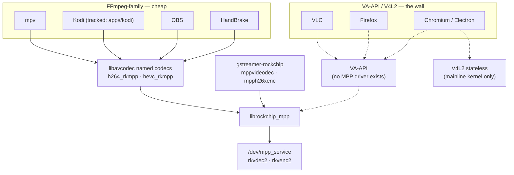

# Application hardware-video enablement map

How desktop applications (Firefox, Chromium, VLC, HandBrake, mpv, OBS, …) could
reach the RK3588 BSP hardware decode/encode stack, and roughly how much work
each would be.

**Assessed:** 2026-07-21. This page is a planning assessment, not runtime
evidence — nothing here is hardware-validated except where it links to an
existing tracked project. Per [`../status.md`](../status.md), an app absent from
the dashboard stays **untracked** until a `findings/` entry captures real
runtime evidence; promote an app to its own `apps/` project (and a status
track) only at that point.

## The structural fact that sorts every app

Desktop apps do not talk to codec hardware directly — each binds to one of four
plumbing layers. Which layer an app speaks decides its cost almost entirely:

| Layer | State on this stack |
|-------|---------------------|
| **libavcodec named codecs** (`h264_rkmpp`, `hevc_rkmpp`, …) | ✅ Shipped: [`ffmpeg-rockchip`](../video-libraries/ffmpeg/README.md) fork, built and Published in the [normal PPA](../packaging/ppa/README.md) as the system FFmpeg replacement. |
| **GStreamer elements** (`mppvideodec`, `mpph26xenc`) | ⚠️ Rockchip's external `gstreamer-rockchip` plugin exists upstream but is not packaged here; the kernel track's GStreamer test suite is still dependency-blocked. |
| **VA-API** (the de-facto Linux desktop hwaccel API) | ❌ No maintained VA-API driver over MPP exists anywhere, to current knowledge. |
| **V4L2** (stateful M2M or stateless request API) | ❌ On the BSP kernel the codecs are exposed only via the vendor `/dev/mpp_service` ioctl interface, not V4L2. Only a mainline kernel ([`kernel-maxline`](../packaging/ppa/kernel-maxline/README.md), mainline rkvdec2 work) exposes V4L2 stateless nodes. |

Apps on the left column are nearly free because the fork already ships. The
right column is blocked on a bridge that does not exist (VA-API→MPP) or on a
kernel path this repo's BSP forward-port deliberately does not take (V4L2).

## Per-app assessment

| App | Binds via | Estimated work on this stack |
|-----|-----------|------------------------------|
| ffmpeg CLI | libavcodec | ✅ shipped (PPA `+rkmpp` packages) |
| mpv | libavcodec + DRM PRIME hwdec | Hours — cheapest end-to-end display-path proof |
| Kodi | libavcodec + DRM PRIME | Already tracked: [`apps/kodi`](../apps/kodi/README.md); build/tty1 gate remains |
| OBS | libavcodec encoders | Hours–a day; cheapest encode win after the CLI |
| HandBrake | bundled FFmpeg + own encoder registry | Days; encode is the realistic value |
| VLC | libavcodec *hwaccels*, not named wrappers | Days–weeks of patching; recommend skipping |
| Firefox | VA-API (or stateful V4L2-M2M) | Weeks of fork-patching, or blocked on a VA-API bridge |
| Chromium / Electron | VA-API or stateless V4L2 | Hardest; weeks–months, or a kernel-path change to maxline |

### mpv — essentially free, and the right first proof

mpv links the system libavcodec (already replaced by the PPA `+rkmpp`
packages) and supports DRM PRIME hwdec of the rkmpp wrapper decoders
(`--hwdec=auto` / `--hwdec=rkmpp` depending on build flags). Beyond being a
free win, it is the cheapest end-to-end proof of the **display** path — dmabuf
import of decoder output into the GL/Vulkan output via Panfrost — which every
other playback app also depends on (see cross-cutting notes below).

### Kodi — already a tracked project

[`apps/kodi`](../apps/kodi/README.md) established that stock Kodi needs no
patch: decoder selection plus the fork's `libavcodec63` packages cover it. The
remaining work is exactly the existing status gate (GBM/GLES build, `kodi-gbm`
tty1 playback).

### OBS — cheapest encode win

OBS drives libavcodec encoders through its FFmpeg output; registering the
rkmpp encoders is a small patch or even just a custom-output configuration
against the already-installed fork.

### HandBrake — the interesting encode case

The only app in the list where *encode* is the point, and RKVENC is arguably
the board's most differentiated capability. HandBrake bundles its own FFmpeg
via contrib and registers hardware encoders explicitly (QSV, NVENC,
VideoToolbox) — there is no generic VA-API path to piggyback on. Work: swap
contrib FFmpeg for the fork (or build against the system libavcodec), add
`h264_rkmpp`/`hevc_rkmpp` entries to libhb's encoder table, and plumb minimal
settings. The fork's encoders accept ordinary software frames (RGA handles
upload/conversion internally), which keeps the integration shallow: a few days
for a working CLI build, more for GUI polish. Pragmatic alternative: skip
HandBrake and script the ffmpeg CLI, which already does hardware transcode
today — HandBrake is a convenience project, not an enabler.

### VLC — poor fit; recommend skipping

VLC's avcodec module selects hardware via *hwaccel* contexts
(VAAPI/VDPAU/NVDEC) and does not naturally pick named wrapper decoders like
`h264_rkmpp`. Making it work means patching the avcodec module to prefer the
rkmpp wrappers and teaching a video output to consume DRM PRIME frames —
days to weeks against a codebase not structured for it. mpv and Kodi cover the
playback use case; VLC only earns the effort if its ecosystem (streaming
server features, …) is specifically needed.

### Firefox — hard on the BSP kernel

Firefox's Linux hardware-decode paths are VA-API (main) and an experimental
stateful V4L2-M2M path added for the Raspberry Pi. The BSP kernel offers
neither. Options, in ascending ambition:

1. Patch Firefox's `FFmpegVideoDecoder` to instantiate the rkmpp named
   decoders and import DRM PRIME frames into WebRender — done in one-off
   community forks for other SoCs, but weeks of work plus a permanent rebase
   burden.
2. Build a VA-API-over-MPP bridge (below) — unlocks Firefox with zero Firefox
   patches.
3. Wait for / bet on the mainline V4L2 path (which Firefox's stateless story
   still would not cover; its V4L2 support is stateful-only today).

### Chromium and Electron apps — same wall, different shape

Desktop Chromium's hardware decode is `VaapiVideoDecoder`; its
`V4L2VideoDecoder` (stateless request API) is real and maintained but is a
ChromeOS/ARM build-flag path — and it needs V4L2 stateless nodes, which the
mainline kernel is growing for RK3588 (rkvdec2 upstreaming) and the BSP kernel
does not provide. Chromium is therefore the one app where the
[`kernel-maxline`](../packaging/ppa/kernel-maxline/README.md) track is the
natural road rather than the BSP: mainline kernel + Chromium built with V4L2
decode enabled is the community-proven direction. On the BSP stack, Chromium
means either Rockchip's own heavily patched Chromium forks (Android/BSP
lineage, painful to maintain) or the VA-API bridge.

## Cross-cutting observations

### The highest-leverage single project is a VA-API↔MPP bridge

One `libva` backend translating to MPP would unlock Firefox, Chromium,
Electron apps, and VLC simultaneously, with zero per-app patches. It is a
serious project — VA-API's slice-level parameter surface has to be mapped onto
MPP's packet-level API. That impedance mismatch is actually *helpful* in this
direction: MPP does its own parsing, so a bridge can largely ignore VA's
parsed slice parameters for decode and feed reconstructed bitstream — the
trick the libva-v4l2-request-era projects struggled with in reverse. Rough
order: months for H.264/HEVC decode. It converts the two hardest apps from
"fork and rebase forever" into "install a driver", and is the honest path if
browsers must run on the BSP kernel.

### Every playback app depends on the dmabuf display path already under repair

Zero-copy playback means DRM PRIME NV12/NV15 buffers imported into
Panfrost/EGL or KMS planes. The recent RGA work (forward-port fixes
`0046`–`0049`, the NV15/P010 10-bit conversion fixes tracked as
[`status.md` W13](../status.md#watch-w13)) is exactly the layer 10-bit
HEVC/AV1 content hits when the GPU cannot sample NV15 directly. See the
[conformance root-cause finding](../findings/2026-07-21-rga-ffmpeg-librga-conformance-root-causes.md)
and [librga 10-bit shipping guidance](../vendor-libraries/rga/docs/librga-p010-p210-rkrga.md).

### Suggested sequencing

De-risk in this order:

1. **mpv** (hours) — proves the display path cheaply.
2. **Finish the Kodi gate** — already tracked.
3. **OBS / HandBrake encode** (days) — no display path needed.
4. **Decide the browser question** — really "VA-API bridge on BSP" vs. "bet on
   the maxline kernel + Chromium V4L2". Given the maxline track is already
   maintained, prototype Chromium's V4L2 decoder against whatever codec nodes
   the pinned 7.2-rc3 tree actually exposes *before* committing to a bridge.

## Related pages

- [`../video-libraries/ffmpeg/README.md`](../video-libraries/ffmpeg/README.md) — the shipped libavcodec layer
- [`../apps/kodi/README.md`](../apps/kodi/README.md) — the tracked libavcodec consumer
- [`../apps/gnome-remote-desktop/README.md`](../apps/gnome-remote-desktop/README.md) — the tracked encode consumer
- [`../packaging/ppa/kernel-maxline/README.md`](../packaging/ppa/kernel-maxline/README.md) — the mainline/V4L2 fork in the road
- [`../findings/2026-07-11-kodi-ffmpeg-rockchip-hwaccel.md`](../findings/2026-07-11-kodi-ffmpeg-rockchip-hwaccel.md) — decoder-selection evidence backing the "no app patch needed" pattern
