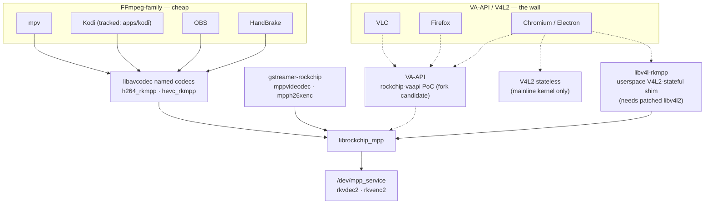

# Application hardware-video enablement map

How desktop applications (Firefox, Chromium, VLC, HandBrake, mpv, OBS, …) could
reach the RK3588 BSP hardware decode/encode stack, and roughly how much work
each would be.

**Assessed:** 2026-07-21; revised the same day after the
[ubuntu-rockchip piggyback survey](../findings/2026-07-21-ubuntu-rockchip-piggyback-survey.md)
overturned the "no V4L2 bridge exists" premise, and again after the
[rockchip-vaapi driver review](../findings/2026-07-21-rockchip-vaapi-driver-review.md)
overturned the "no VA-API driver exists" premise. This page is a planning
assessment, not runtime evidence — nothing here is hardware-validated except
where it links to an existing tracked project. Per [`../status.md`](../status.md), an app absent from
the dashboard stays **untracked** until a `findings/` entry captures real
runtime evidence; promote an app to its own `apps/` project (and a status
track) only at that point.

## The structural fact that sorts every app

Desktop apps do not talk to codec hardware directly — each binds to one of four
plumbing layers. Which layer an app speaks decides its cost almost entirely:

| Layer | State on this stack |
|-------|---------------------|
| **libavcodec named codecs** (`h264_rkmpp`, `hevc_rkmpp`, …) | ✅ Shipped: [`ffmpeg-rockchip`](../video-libraries/ffmpeg/README.md) fork, built and Published in the [normal PPA](../packaging/ppa/README.md) as the system FFmpeg replacement. |
| **GStreamer elements** (`mppvideodec`, `mpph26xenc`) | ⚠️ Rockchip's external `gstreamer-rockchip` plugin exists upstream but is not packaged here; ubuntu-rockchip shipped a working (if crudely packaged) build of it — one clean repackage away. The kernel track's GStreamer test suite is still dependency-blocked. |
| **VA-API** (the de-facto Linux desktop hwaccel API) | ⚠️ A PoC driver now exists: woodyst/rockchip-vaapi (LGPL, reviewed in the [driver review finding](../findings/2026-07-21-rockchip-vaapi-driver-review.md)) — the right architecture, effectively Firefox H.264+VP9 today, upstream inactive; verdict is fork-and-renovate (~4–8 weeks to desktop grade). |
| **V4L2** (stateful M2M or stateless request API) | ⚠️ The BSP kernel exposes the codecs only via the vendor `/dev/mpp_service` ioctl interface, not V4L2 — but a **userspace** V4L2-stateful-over-MPP bridge exists: JeffyCN's `libv4l-rkmpp` (a libv4l2 plugin emulating a stateful M2M decoder/encoder in-process, no kernel device), proven in Joshua Riek's archived ubuntu-rockchip images as the engine behind Chromium 4K playback. It is kernel-agnostic and only reachable through a patched libv4l2, which in practice makes it a Chromium-only bridge. See the [survey finding](../findings/2026-07-21-ubuntu-rockchip-piggyback-survey.md). A real kernel V4L2 stateless path still needs a mainline kernel ([`kernel-maxline`](../packaging/ppa/kernel-maxline/README.md), mainline rkvdec2 work). |

Apps on the left column are nearly free because the fork already ships. The
right column is blocked on a bridge that does not exist (VA-API→MPP) or on a
kernel path this repo's BSP forward-port deliberately does not take (V4L2).

## Per-app assessment

| App | Binds via | Estimated work on this stack |
|-----|-----------|------------------------------|
| ffmpeg CLI | libavcodec | ✅ shipped (PPA `+rkmpp` packages) |
| mpv | libavcodec + DRM PRIME hwdec | Hours — cheapest end-to-end display-path proof |
| Kodi | libavcodec + DRM PRIME | Already tracked: [`apps/kodi`](../apps/kodi/README.md); build/tty1 gate remains |
| OBS | libavcodec encoders | Hours–a day; cheapest encode win after the CLI |
| HandBrake | bundled FFmpeg + own encoder registry | Days; encode is the realistic value |
| VLC | libavcodec *hwaccels*, not named wrappers | Days–weeks of patching; recommend skipping |
| Firefox | VA-API (or stateful V4L2-M2M) | H.264+VP9 works **today** via rockchip-vaapi (sandbox off); solid via the fork-and-renovate plan. The libv4l-rkmpp shim does not reach it |
| Chromium / Electron | VA-API, stateless V4L2, or the libv4l-rkmpp shim | Renovated rockchip-vaapi + a 1–3 week hardening pass (stock builds, runtime flags); or ~3–6 weeks re-targeting the libv4l-rkmpp shim (custom builds forever); or maxline |

### mpv — essentially free, and the right first proof

mpv links the system libavcodec (already replaced by the PPA `+rkmpp`
packages) and supports DRM PRIME hwdec of the rkmpp wrapper decoders
(`--hwdec=auto` / `--hwdec=rkmpp` depending on build flags). Beyond being a
free win, it is the cheapest end-to-end proof of the **display** path — dmabuf
import of decoder output into the GL/Vulkan output via Panfrost — which every
other playback app also depends on (see cross-cutting notes below).

Concrete starting material exists: ubuntu-rockchip's mpv needed exactly one
functional patch (reordering `add_all_hwdec_methods()` so
`AV_CODEC_HW_CONFIG_METHOD_INTERNAL` is preferred — without it
`--hwdec=rkmpp` never registers), NV16/P010/P210 drmprime format additions
(possibly upstream by now), and a shipped `/etc/mpv/mpv.conf` with
`hwdec=rkmpp` and `vf-add=scale_rkrga=force_yuv=auto` as the 10-bit/HDR
workaround — the same conversion layer as the RGA W13 work. Re-diff against
current mpv (hwdec selection was reworked after 0.37) and re-evaluate their
`gpu-context=x11egl` choice for a Wayland desktop.

### Kodi — already a tracked project

[`apps/kodi`](../apps/kodi/README.md) established that stock Kodi needs no
patch: decoder selection plus the fork's `libavcodec63` packages cover it. The
remaining work is exactly the existing status gate (GBM/GLES build, `kodi-gbm`
tty1 playback). If that gate hits DRM-plane or crop problems, ubuntu-rockchip
carried two boogie/hbiyik Kodi patches aimed at exactly those: GBM dynamic
plane selection by format/modifier with zpos ordering, and AFBC crop-offset
passthrough to the `SRC_X`/`SRC_Y` plane properties — check Kodi 22 for
upstream absorption before porting.

### OBS — cheapest encode win

OBS drives libavcodec encoders through its FFmpeg output; registering the
rkmpp encoders is a small patch or even just a custom-output configuration
against the already-installed fork. ubuntu-rockchip never solved this
natively (its obs-studio upload claims rockchip patches but verifiably
contains none; encode there meant hand-built `mpph264enc` GStreamer pipeline
strings via obs-gstreamer), so an obs-ffmpeg whitelist patch would be new
work, not a port.

### HandBrake — the interesting encode case

The only app in the list where *encode* is the point, and RKVENC is arguably
the board's most differentiated capability. HandBrake bundles its own FFmpeg
via contrib and registers hardware encoders explicitly (QSV, NVENC,
VideoToolbox) — there is no generic VA-API path to piggyback on. Work: swap
contrib FFmpeg for the fork (or build against the system libavcodec), add
`h264_rkmpp`/`hevc_rkmpp` entries to libhb's encoder table, and plumb minimal
settings. The fork's encoders accept ordinary software frames (RGA handles
upload/conversion internally), which keeps the integration shallow: a few days
for a working CLI build, more for GUI polish. Pragmatic alternative: skip
HandBrake and script the ffmpeg CLI, which already does hardware transcode
today — HandBrake is a convenience project, not an enabler.

### VLC — poor fit; recommend skipping

VLC's avcodec module selects hardware via *hwaccel* contexts
(VAAPI/VDPAU/NVDEC) and does not naturally pick named wrapper decoders like
`h264_rkmpp`. Making it work means patching the avcodec module to prefer the
rkmpp wrappers and teaching a video output to consume DRM PRIME frames —
days to weeks against a codebase not structured for it. mpv and Kodi cover the
playback use case; VLC only earns the effort if its ecosystem (streaming
server features, …) is specifically needed. Independently confirmed:
ubuntu-rockchip's VLC is a plain rebuild with zero rockchip patches — nobody
in that ecosystem solved VLC either. **Except**: a working VA-API driver
(rockchip-vaapi road) flips VLC to nearly free via its stock libavcodec
VAAPI + GL-interop path — no VLC patches at all.

### Firefox — hard on the BSP kernel

Firefox's Linux hardware-decode paths are VA-API (main) and an experimental
stateful V4L2-M2M path added for the Raspberry Pi. The BSP kernel offers
neither. Options, in ascending ambition:

1. Patch Firefox's `FFmpegVideoDecoder` to instantiate the rkmpp named
   decoders and import DRM PRIME frames into WebRender — done in one-off
   community forks for other SoCs, but weeks of work plus a permanent rebase
   burden.
2. The VA-API road (below) — **works today** for H.264+VP9 via
   rockchip-vaapi with `MOZ_DISABLE_RDD_SANDBOX=1`; shipping-grade needs the
   fork-and-renovate plan plus a small RDD sandbox-policy patch (Firefox's
   seccomp filters ioctls by request family, so device-node aliasing cannot
   sidestep it — see the [driver review](../findings/2026-07-21-rockchip-vaapi-driver-review.md) §7).
3. Wait for / bet on the mainline V4L2 path (which Firefox's stateless story
   still would not cover; its V4L2 support is stateful-only today).

Note that the `libv4l-rkmpp` shim does **not** help Firefox: its ARM V4L2
path is FFmpeg `v4l2m2m`, which raw-`open()`s `/dev/video*` char devices and
never routes through libv4l2 plugins, while the shim only attaches to its
non-char-device config files. Both ends would need modification.

### Chromium and Electron apps — same wall, different shape

Desktop Chromium's hardware decode is `VaapiVideoDecoder`; its V4L2 decoders
are ChromeOS/ARM build-flag paths needing either real V4L2 nodes or a shim.
Three roads now exist, ordered by proof level:

1. **Revive the ubuntu-rockchip approach on the BSP kernel** — the
   [survey finding](../findings/2026-07-21-ubuntu-rockchip-piggyback-survey.md)
   established that their "4K Chromium" is `libv4l-rkmpp` (userspace
   V4L2-stateful-over-MPP, kernel-agnostic, runs on this stack by
   construction) plus ~20 Chromium patches and a patched libv4l2. The
   Chromium patches target the legacy VDA path deleted upstream (~M121–126),
   so this is a **re-target** onto the modern `V4L2StatefulVideoDecoder`
   (which conveniently speaks exactly the stateful contract the shim
   emulates): roughly 2–4 weeks Chromium-side plus 1–2 weeks shim-side (real
   `V4L2_DEC_CMD_STOP`/`FLAG_LAST` flush semantics instead of the Chromium-114
   magic-timestamp hack), plus a permanent per-milestone rebase tax on
   hours-long arm64 builds.
2. **The maxline road** — mainline kernel + Chromium with stateless V4L2
   enabled, zero Chromium patches once mainline rkvdec2 covers the codecs.
3. **The VA-API road** (below) — no longer "most work": stock Chromium
   supports VA-API behind runtime flags, so a renovated rockchip-vaapi plus a
   1–3 week Chromium hardening pass needs zero Chromium patches; the sandbox
   question may even be sidesteppable for deb Chromium via device-node
   aliasing under `/dev/dri/` (snap Chromium adds a major:minor device-cgroup
   gate — see the [driver review](../findings/2026-07-21-rockchip-vaapi-driver-review.md) §7).

## Cross-cutting observations

### The highest-leverage single project is a VA-API↔MPP bridge

One `libva` backend translating to MPP unlocks Firefox, Chromium, Electron
apps, VLC, mpv, the GStreamer `va` world, and **stock distro FFmpeg**
simultaneously, with zero per-app patches. The two hard parts are mapping
VA's slice-level surface onto MPP's packet-level API (feed reconstructed
bitstream; MPP re-parses) and lashing MPP's internally managed DPB/buffer
lifecycle to VA's caller-owned surfaces. **This is no longer hypothetical**:
woodyst/rockchip-vaapi proves the architecture end-to-end (Firefox H.264+VP9
today), and the [driver review](../findings/2026-07-21-rockchip-vaapi-driver-review.md)
concludes fork-and-renovate — replace its per-frame CPU copy with an
external-buffer-group zero-copy model and its polling sync with a drain
thread, add a spec-honest HEVC header writer and RGA-backed NV15→P010 —
lands a desktop-grade H.264+HEVC+VP9 driver in ~4–8 weeks instead of months.
Encode (`VAEntrypointEncSlice` over MPP) is a coherent phase-2 that would add
OBS/GStreamer/WebRTC encode. The remaining structural cost of any MPP-backed
VA driver is the **browser sandbox tax**: pathname-broker checks can be
sidestepped by aliasing device nodes under `/dev/dri/` (plus an MPP
path-override patch), which plausibly suffices for deb Chromium, but
Firefox's RDD seccomp filters ioctls by request family (`MPP_IOC_CFG_V1`
magic `'v'` is not whitelisted) and needs a small sandbox-policy patch —
gate-by-gate analysis in the review finding.

The trade against the now-known V4L2-stateful shim is exactly inverted
effort placement: `libv4l-rkmpp` is thin (~4k lines, near-1:1 semantics with
MPP) but reaches only Chromium, only via a patched libv4l2, and costs a
Chromium patch stack forever; a VA-API bridge is thick to build but is
libva's *sanctioned* plugin mechanism (one driver `.so`, no fake device
nodes, no patched system libraries), after which the entire desktop works
unpatched. Full comparison table in the
[survey finding](../findings/2026-07-21-ubuntu-rockchip-piggyback-survey.md).
With rockchip-vaapi as a head start, the VA-API road is now the likely
winner even for Chromium-soonish goals; the shim road's remaining edge is
only that its Chromium integration was once proven end-to-end.

### Every playback app depends on the dmabuf display path already under repair

Zero-copy playback means DRM PRIME NV12/NV15 buffers imported into
Panfrost/EGL or KMS planes. The recent RGA work (forward-port fixes
`0046`–`0049`, the NV15/P010 10-bit conversion fixes tracked as
[`status.md` W13](../status.md#watch-w13)) is exactly the layer 10-bit
HEVC/AV1 content hits when the GPU cannot sample NV15 directly. See the
[conformance root-cause finding](../findings/2026-07-21-rga-ffmpeg-librga-conformance-root-causes.md)
and [librga 10-bit shipping guidance](../vendor-libraries/rga/docs/librga-p010-p210-rkrga.md).

### Suggested sequencing

De-risk in this order:

1. **mpv** (hours) — proves the display path cheaply.
2. **Finish the Kodi gate** — already tracked.
3. **OBS / HandBrake encode** (days) — no display path needed.
4. **Decide the browser question** — three roads: "fork-and-renovate
   rockchip-vaapi" (VA-API; whole desktop; now the likely winner), "modernize
   libv4l-rkmpp + re-target Chromium" (Chromium-only, custom builds forever),
   "maxline kernel + stock Chromium V4L2". Cheap first probes, in order:
   build rockchip-vaapi v1.0.11 unmodified on the 6.18 board and smoke-test
   Firefox H.264/VP9 (~1 day, also the regression baseline for any fork);
   mpv `--hwdec=vaapi` against it; the deb-Chromium `/dev/dri/` alias
   experiment; and optionally the libv4l-rkmpp 1.8.0 build as the comparison
   point — all before committing to fork work.

## Related pages

- [`../video-libraries/ffmpeg/README.md`](../video-libraries/ffmpeg/README.md) — the shipped libavcodec layer
- [`../apps/kodi/README.md`](../apps/kodi/README.md) — the tracked libavcodec consumer
- [`../apps/gnome-remote-desktop/README.md`](../apps/gnome-remote-desktop/README.md) — the tracked encode consumer
- [`../packaging/ppa/kernel-maxline/README.md`](../packaging/ppa/kernel-maxline/README.md) — the mainline/V4L2 fork in the road
- [`../findings/2026-07-11-kodi-ffmpeg-rockchip-hwaccel.md`](../findings/2026-07-11-kodi-ffmpeg-rockchip-hwaccel.md) — decoder-selection evidence backing the "no app patch needed" pattern
- [`../findings/2026-07-21-ubuntu-rockchip-piggyback-survey.md`](../findings/2026-07-21-ubuntu-rockchip-piggyback-survey.md) — source-level survey of the archived ubuntu-rockchip stack this page's first revision is based on
- [`../findings/2026-07-21-rockchip-vaapi-driver-review.md`](../findings/2026-07-21-rockchip-vaapi-driver-review.md) — full review of the PoC VA-API-over-MPP driver: fork-and-renovate verdict, Chromium/app reach, sandbox gate analysis
- [`../findings/2026-07-21-vaapi-mpp-bitstream-reconstruction-av1.md`](../findings/2026-07-21-vaapi-mpp-bitstream-reconstruction-av1.md) — the bitstream-reconstruction spectrum and why AV1 is scoped out of the driver's v1 (VP9 fallback)
