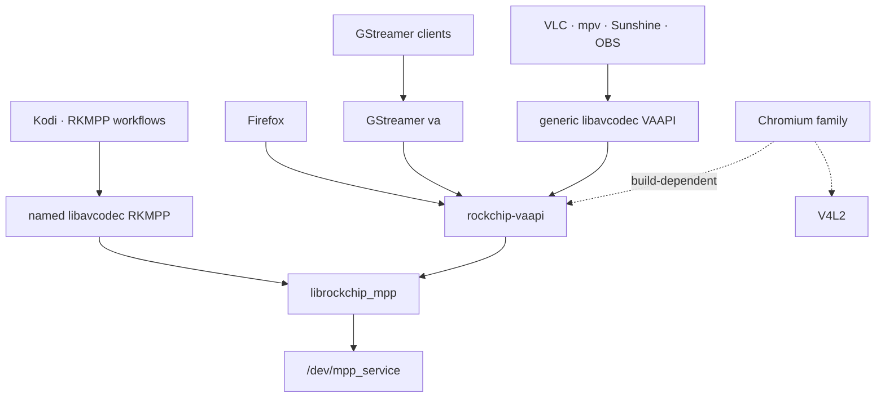

# Application hardware-video enablement map

This map owns the compatibility question: which RK3588 hardware-video
interface each desktop application speaks, how well that contract matches the
maintained stack, and the first discriminating integration proof. It does not
own package publication, installed versions, remote tips, or the dated browser
verdict; those route to [status track 14](../status.md),
[W05](../status.md#watch-w05), and [W18](../status.md#watch-w18).

Applications without a sustained project remain assessments here. Promote one
to `apps/` and the dashboard only when runtime evidence and ongoing work justify
their own owner.

## The structural fact that sorts every app

An application's media boundary decides most of the integration cost:

| Boundary | Compatibility on this stack |
|----------|-----------------------------|
| Named libavcodec codecs (`h264_rkmpp`, `hevc_rkmpp`) | Shipped by the maintained [FFmpeg fork](../video-libraries/ffmpeg/README.md); best for software already integrated with codec names and DRM PRIME frames |
| Generic libavcodec VAAPI | Uses the standard [rockchip-vaapi](../video-libraries/vaapi/README.md) bridge; fits ordinary decode hwaccels and H.264/HEVC VAAPI encoders |
| GStreamer `va` elements | Uses the same bridge; decode, encode, upload/readback, RTP, and WebRTC-shaped contracts have evidence |
| Direct VA-API | Requires client-by-client contract inspection, especially export timing, image APIs, packed headers, and sandbox policy |
| V4L2 | The BSP exposes limited stateless Hantro/VEPU devices; broader Rockchip codecs require a userspace MPP shim or a maximum-mainline stateless-request kernel |

## Per-app assessment

| App | Binds via | Durable compatibility verdict | First missing proof |
|-----|-----------|-------------------------------|---------------------|
| ffmpeg CLI | Named RKMPP or generic VAAPI | Directly supported by the maintained media libraries | Choose the intended codec boundary and replay its package/runtime gate |
| mpv | libavcodec + DRM PRIME | Compatible with named RKMPP and generic VAAPI decode; HDR adds a physical-output contract | Connector/link metadata and image quality on a physical HDR display |
| Kodi | libavcodec + DRM PRIME | Named RKMPP path fits; tracked separately | Follow the [Kodi project](../apps/kodi/README.md) build and tty gate |
| GStreamer `va` | Standard VA-API plugin | Compatible; unfamiliar vendors require the documented opt-in | Replay the relevant decode/encode/application gate |
| Sunshine | FFmpeg VAAPI + exported VA surfaces | Strong H.264 High SDR fit: CBR, no B-frames, driver-owned linear NV12 | Client decode, IDR/reconnect, bitrate change, GPU synchronization, and soak |
| OBS | Native FFmpeg VAAPI + exported VA surfaces | Strong H.264 fit; no RKMPP codec whitelist is implied | Build/runtime selection and texture-path proof |
| RustDesk | Bundled hwcodec/FFmpeg | Plausible RAM-frame VAAPI encode fit | arm64 build, system-driver discovery, and selected encoder |
| WayVNC / NeatVNC | FFmpeg VAAPI + VA filter graph | Incompatible today: requires Constrained Baseline and `VAEntrypointVideoProc` | Reconsider only for a named deployment with a changed client or driver contract |
| GNOME Remote Desktop native VAAPI | Direct VA-API encode | Incompatible with MPP: requires client-authored packed slice headers | None on this backend; use its maintained FFmpeg/RKMPP route |
| HandBrake | Bundled FFmpeg + private registry | Integration project, not automatic: generic codec discovery is insufficient | Decide whether convenience justifies a bundled-FFmpeg/registry change |
| VLC | libavcodec VAAPI + EGL image import | Compatible when `vaDeriveImage` and `vaAcquireBufferHandle` are present; headless output is not evidence | Real display-session replay for the intended artifact |
| Firefox | Direct VA-API in RDD | Compatible decode/export contract; only native Rockchip browser path on this BSP stack | Enabled RDD broker/seccomp proof through the intended artifact |
| Chromium / Chrome / Electron | Build-dependent VAAPI and/or V4L2 | Compatibility depends on compiled backend, decoder policy, stable pre-decode export, GPU presentation, and GPU sandbox | Use status track 14 for the current exact package/browser gate |

### mpv — virtual-display proof is complete; physical HDR remains

mpv can consume both system libavcodec VAAPI and named RKMPP codecs. DRM PRIME
presentation through a compositor establishes buffer import, not connector HDR
metadata or link behavior. Keep physical HDR as a distinct display proof and
route exact completed measurements through the VA-API/FFmpeg evidence owners.

### Kodi — already a tracked project

Kodi's FFmpeg/DRM PRIME boundary fits the named RKMPP path, but GBM/DRM-master
startup, plane selection, modifiers, crop offsets, and distribution packaging
make it more than a row in this map. Its build and runtime contract lives in
the [Kodi project](../apps/kodi/README.md).

### Sunshine — first new VA-API encode gate

Sunshine selects standard H.264/HEVC VAAPI encoders, queries rate control and
slice limits, and renders into VA-created surfaces exported as separate
write-only layers. That matches the driver's H.264 High, CBR/VBR/CQP,
progressive NV12, no-B-frame contract and avoids importing an arbitrary tiled
surface.

Qualify H.264 High SDR first. Require hardware markers, client decode,
initial/reconnect IDR, live bitrate changes, GPU-write-to-MPP-read
synchronization, and a soak. HEVC Main SDR can follow. Main10/HDR encode is
outside the backend because MPP cannot accept P010.

### OBS — native VA-API is now the likely cheap path

OBS already has native FFmpeg VAAPI H.264/HEVC encoders and GPU-texture
variants. Its texture path exports a VA-created target in the same shape as
Sunshine, while its H.264 defaults match High profile without B-frames.
Confirm arm64 build/runtime selection and the texture path before treating the
source-level match as measured support.

### RustDesk — plausible remote desktop, packaging unproven

RustDesk's bundled hwcodec/FFmpeg integration recognizes VAAPI codec names and
can supply RAM frames, which plausibly matches checked NV12/I420 upload. Its
arm64 build, system libva discovery, and runtime encoder selection require a
probe before any integration plan.

### WayVNC / NeatVNC — not a current consumer

NeatVNC's FFmpeg path hard-codes H.264 Constrained Baseline and includes
`scale_vaapi`. The driver advertises Main/High encode and no
`VAEntrypointVideoProc`, so it fails two independent contract checks. Do not
add either capability solely for this client without a named deployment and a
new validation plan.

### HandBrake — the interesting encode case

HandBrake bundles FFmpeg and registers encoders in its own tables, so neither a
system FFmpeg replacement nor generic VAAPI presence automatically enables it.
A project would need to choose the bundled/system FFmpeg boundary, add an
encoder registry path, and define UI/CLI settings. The FFmpeg CLI already
provides the underlying function; HandBrake is convenience work, not an
enabler.

### VLC — hardware-decoding, unpatched

VLC reaches generic libavcodec VAAPI but its OpenGL converter also derives an
image and acquires a buffer handle for EGL import. Surface creation or decoded
frame counts alone therefore do not prove playback. A valid gate needs a real
display session, `vaDeriveImage`, `vaAcquireBufferHandle`, and observed
hardware output; headless dummy output is an invalid substitute.

The stable mechanism belongs to the
[VA-API architecture](../video-libraries/vaapi/docs/architecture.md#9-application-and-sandbox-contracts);
dated player measurements remain evidence, not compatibility policy.

### Firefox — installed driver and 10-bit import work; sandbox proof remains

Firefox is a direct VA-API consumer inside the RDD process. On this BSP-style
stack it cannot use the named RKMPP codecs or Chromium's stateless V4L2 route.
Its compatible path needs PRIME 2 export, correct multi-plane P010 metadata,
stable surface backing, ordinary device permissions, broker path access, and a
narrow seccomp ioctl allowlist.

An RDD-disabled run proves codec/export/presentation only. Shipping evidence
requires the broker and ioctl policy with `MOZ_DISABLE_RDD_SANDBOX` unset and
the intended packaged driver. Exact current completion belongs to
[status track 14](../status.md), not this map.

### Chromium and Electron apps — Google Chrome reaches VA-API

Treat Chromium-family compatibility as a conjunction:

1. the distribution binary includes the VAAPI backend;
2. decoder-selection policy admits the driver/profile/geometry;
3. a surface exported before decode retains its backing identity;
4. the GPU media path imports and visibly presents the completed frame; and
5. the GPU process reaches MPP, RGA, and DMA heaps under its sandbox.

V4L2-only builds cannot be repaired with flags. A mixed VAAPI/V4L2 build can
retain Hantro as a control while testing the standard bridge. Electron apps
inherit the backend and sandbox properties of the Chromium they embed, so a
Chrome result is useful architectural evidence but not a universal package
verdict. [Status track 14](../status.md) owns the current tested browser,
artifact identity, result, and next proof.

## Cross-cutting observations

### The shared VA-API↔MPP bridge now has a project owner

The maintained [VA-API project](../video-libraries/vaapi/README.md) owns what
the bridge can advertise, and its architecture guide owns how the bridge
works. This page stays focused on consumer contracts. Named RKMPP codecs,
VAAPI, limited BSP V4L2, a userspace V4L2-over-MPP shim, and maximum-mainline
stateless V4L2 are alternatives with different application and maintenance
costs, not interchangeable green signals.

### Every playback app depends on the dmabuf display path already under repair

Hardware decode is useful only when the resulting DMA-BUF can cross into EGL,
Panfrost, a compositor, or KMS with correct format, modifier, plane, crop,
stride, synchronization, and lifetime. Byte-exact readback proves codec
correctness but not display import; a display frame proves presentation but
not physical HDR signaling. Consumer gates must state which boundary they
exercise.

### Suggested sequencing

Order new consumer work by contract fit and discriminating value:

1. Finish whichever browser/package proof
   [status track 14](../status.md#next-gates) names; do not copy that moving
   gate here.
2. Qualify Sunshine H.264 SDR as the strongest unmeasured encode fit.
3. Qualify OBS H.264 through its native VAAPI texture path.
4. Probe RustDesk discovery before committing integration effort.
5. Prove mpv physical HDR only when a suitable display path is in scope.
6. Treat a mixed Chromium VAAPI/V4L2 package as a distribution-parity project,
   separate from another browser's functional result.
7. Revisit WayVNC or HandBrake only for a named user need; each requires a
   deliberate contract or integration change.

## Related pages

- [VA-API capability policy](../video-libraries/vaapi/README.md)
- [VA-API architecture](../video-libraries/vaapi/docs/architecture.md)
- [FFmpeg project](../video-libraries/ffmpeg/README.md)
- [Kodi project](../apps/kodi/README.md)
- [GNOME Remote Desktop project](../apps/gnome-remote-desktop/README.md)
- [Maximum-mainline project](../kernel-versions/maxline/README.md)
- [Consumer source and evidence assessment](../video-libraries/vaapi/docs/validation.md#consumer-and-sandbox-conclusions)
- [Browser backend landscape](../findings/2026-07-21-mainline-v4l2-vs-vaapi-browser-decode-landscape.md)
- [Chromium V4L2-only measurement](../video-libraries/vaapi/docs/validation.md#consumer-and-sandbox-conclusions)
- [Chrome retained-export measurement](../findings/2026-08-04-google-chrome-rockchip-vaapi-green-stable-export.md)
