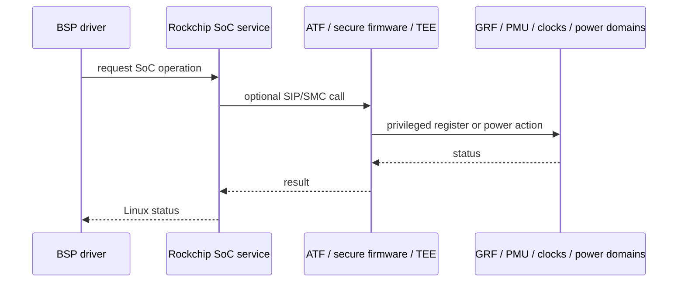
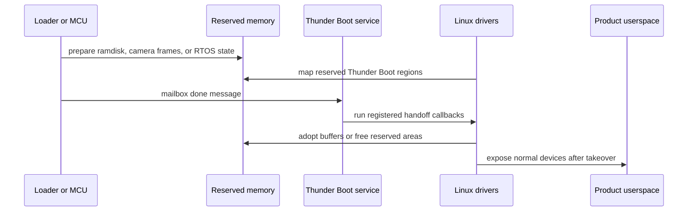

# Area 2: Firmware, SoC services, power, and boot control

## Normal-user view

This area is the platform machinery beneath normal device drivers. It lets the
BSP kernel talk to secure firmware, program SoC control registers, choose power
and clock policy, handle IO voltage domains, record crash data, and support
product boot/suspend behavior.

A user usually notices it indirectly:

- the board boots with the expected clocks and voltages,
- IO pins use the correct 1.8 V or 3.3 V domain,
- suspend and resume work for the product profile,
- accelerators stay stable under load,
- crash or minidump data survives reboot on supported products.

## Kernel-developer view

The BSP expands `drivers/soc/rockchip/` into a platform service layer. It also
adds firmware support such as `ROCKCHIP_SIP` under `drivers/firmware/`. These
pieces connect ordinary Linux drivers to GRF registers, IO-domain state, PM
domains, OPP/PVTM policy, AMP/RPMsg support, vendor storage, suspend modes, and
secure firmware calls.

Source areas and examples:

- `drivers/soc/rockchip/Kconfig`
- `drivers/soc/rockchip/Kconfig.cpu`
- `drivers/soc/rockchip/pm_domains.c`
- `drivers/firmware/rockchip_sip.c`
- `ROCKCHIP_GRF`, `ROCKCHIP_IODOMAIN`, `ROCKCHIP_OPP`, `ROCKCHIP_PVTM`
- `ROCKCHIP_PM_DOMAINS`, `ROCKCHIP_SYSTEM_MONITOR`, `ROCKCHIP_VENDOR_STORAGE`
- `ROCKCHIP_AMP`, RPMsg shared-memory/timesync helpers
- lite/ultra suspend and suspend-debug options

## What the BSP adds beyond stock Linux

| Area | BSP behavior |
|------|--------------|
| Firmware calls | Rockchip SIP wrappers for secure operations that normal Linux cannot perform directly. |
| GRF/PMU access | SoC register helpers used by display, IO-domain, power, and accelerator code. |
| IO-domain control | Board voltage-domain setup for pads that can run at different voltages. |
| OPP/PVTM | Voltage/frequency and process/temperature/leakage policy used by performance islands. |
| PM domains | Rockchip-specific domain tables, including RK3588 media domains such as RKVDEC, RKVENC, VDPU, VENC, and AV1. |
| AMP/RPMsg | Multi-core or auxiliary-processor coordination for products that use remote processors. |
| Suspend policy | Product suspend modes and debug paths beyond generic PM. |
| Boot policy | Thunder Boot/async initcall style product-boot optimizations. |

## Thunder Boot platform handoff

Thunder Boot sits partly in this area because it coordinates Linux with work that
may have started before normal Linux driver ownership. The BSP adds Rockchip SoC
drivers for:

- early ramdisk decompression with optional hardware crypto validation,
- MMC or SPI-flash handoff nodes that point at compressed and decompressed
  ramdisk reserved-memory regions,
- mailbox-based MCU/AP handoff through `rockchip,thunder-boot-service`,
- optional freeing of RTOS or transfer buffers after Linux has safely taken over.

The firmware/platform risk is ownership. A normal driver may assume hardware is
idle at probe. A Thunder Boot product may require the driver to preserve clock,
GPIO, DMA, or camera state until a handoff marker says it is safe to take over.
That is why Thunder Boot should be treated as product policy plus firmware
contract, not as a generic boot-speed option.

## Developer notes

Some BSP drivers compile without the full service layer, but their runtime
behavior changes. For example, an accelerator may run at a fixed assigned clock
if OPP/PVTM/devfreq policy is absent, while the full BSP can change rates based
on load, voltage, leakage, or thermal policy.

Keep three categories separate:

- **Required control path:** clocks, resets, power domains, firmware calls, or
  register writes needed for correctness.
- **Performance policy:** OPP, PVTM, devfreq, bandwidth shaping, system monitor.
- **Product policy:** boot-speed shortcuts, suspend modes, crash capture, vendor
  factory data.

## Common failure signs

| Symptom | Likely area |
|---------|-------------|
| Device probes but hangs | reset, clock, power domain, or firmware dependency |
| Works at fixed speed only | OPP/PVTM/devfreq path missing or disabled |
| IO peripheral unreliable | IO-domain voltage mismatch |
| Suspend/resume fails | PM-domain or product suspend-mode mismatch |
| Crash logs absent | pstore/minidump/reserved-memory setup missing |
