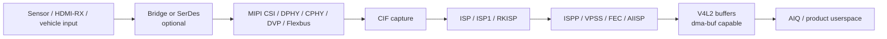

# Area 4: Camera, ISP, and image input

## Normal-user view

This BSP area supports camera capture and image-input products. It is why vendor
kernels often support many sensors, MIPI CSI receivers, bridge chips,
deserializers, HDMI capture, ISP tuning, and multi-camera boards before all of
those pieces are upstream.

A user sees it as:

- camera devices appearing in applications,
- autofocus/exposure/white-balance working through vendor tuning,
- multiple sensors routing through the correct CSI lanes,
- HDMI-RX or vehicle camera input producing frames,
- low-latency preview and capture pipelines.

## Kernel-developer view

The BSP adds a large Rockchip media-platform stack under
`drivers/media/platform/rockchip/` and many sensor/bridge/deserializer drivers
under `drivers/media/i2c/`.

Major Rockchip platform directories include:

- `aiisp/`
- `avsp/`
- `cif/`
- `fec/`
- `flexbus_cif/`
- `hdmirx/`
- `isp1/`
- `isp/`
- `ispp/`
- `ooc/`
- `rga/`
- `rkisp1/`
- `tsp/`
- `vpss/`

## What the BSP adds beyond stock Linux

| Component | What it does |
|-----------|--------------|
| Sensor drivers | Adds many board-product camera sensors and serializer/deserializer chips. |
| CIF drivers | Capture front-end paths for DVP/MIPI/Flexbus inputs. |
| ISP/ISP1/RKISP | Image signal processing, statistics, parameters, capture nodes, bridge versions. |
| ISPP/VPSS/FEC/AIISP | Post-processing, scaling, stabilization/fisheye-style correction, AI image processing blocks. |
| HDMI-RX | HDMI input capture, CEC/HDCP support pieces. |
| procfs/debug hooks | Product debugging and status reporting for capture pipelines. |

## Developer notes

Camera bring-up is graph-oriented. The kernel must bind every subdevice, then
userspace must configure a coherent media graph. The BSP often assumes vendor
AIQ/tuning userspace will drive controls and load calibration data.

The hard parts are not only driver probe. They are:

- endpoint matching between sensors, CSI receivers, CIF, and ISP,
- lane count and lane order,
- link frequencies and pixel clocks,
- power sequencing and reset GPIOs,
- V4L2 controls for exposure, gain, blanking, and HDR modes,
- statistics and parameter buffers consumed by vendor AIQ,
- dma-buf export/import when frames feed RGA, display, or codecs.

## Common failure signs

| Symptom | Likely area |
|---------|-------------|
| Sensor missing | I2C, regulator, reset GPIO, external clock |
| Media graph incomplete | endpoint mismatch or async notifier issue |
| Stream starts then stops | CSI errors, bandwidth, buffer queue starvation |
| Frames are black or tinted | power sequence, exposure/gain, Bayer order, format mismatch |
| Vendor app works but generic app fails | private AIQ/tuning or control expectations |
