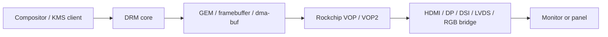

# Area 5: Display, panels, and DRM

## Normal-user view

This area drives screens and display connectors. It affects HDMI, DisplayPort,
MIPI DSI panels, LVDS/RGB panels on embedded products, TV encoder output,
backlights, hotplug, color/HDR behavior, and protected-content paths.

A user sees it as:

- the desktop appearing at the right resolution,
- HDMI/DP/DSI panels powering on correctly,
- hotplug and suspend/resume behavior,
- video scanout without corruption,
- panel brightness and timing being correct.

## Kernel-developer view

The BSP expands the Rockchip DRM stack under `drivers/gpu/drm/rockchip/` and
adds many bridge, panel, PHY, and helper pieces. Its Kconfig exposes downstream
features such as VOP/VOP2, DP/HDMI/DSI/DSI2/DW-DP, dimming panels, TVE, LVDS,
panel notifier, RGB, VCONN, VKMS, HDCP2, DP MST AUX, and RK618.

## What the BSP adds beyond stock Linux

| Area | BSP additions |
|------|---------------|
| CRTC/plane support | Expanded Rockchip VOP/VOP2 feature tables and downstream debug options. |
| Connector support | HDMI, DP, DSI, DSI2, LVDS, RGB, TV encoder, and bridge integrations. |
| Panel support | Product panels, dimming panel features, panel notifier behavior. |
| Protected content | HDCP2 support paths. |
| Companion chips | RK618 and display SerDes/MFD-related support. |
| Debug/test | DRM debug, direct-show, self-test, and VKMS-style options. |

## Developer notes

Display bring-up is a chain. A failure can sit in any link: DT graph, power,
PHY, PLL/clock, bridge attach, panel prepare/enable, DRM atomic state, fb
format, modifier, or userspace mode choice.

Media and display overlap through shared buffers. A video frame that decodes
successfully is not automatically scanout-compatible. Check format, modifier,
plane layout, color range, and cache synchronization when passing buffers from
codec/RGA/camera paths into DRM.

## Common failure signs

| Symptom | Likely area |
|---------|-------------|
| Connector missing | DT graph, bridge probe, PHY, panel node |
| Connector exists but blank | panel enable sequence, bridge mode set, clock/PHY |
| Wrong colors | format, RGB/YUV conversion, color range, CSC |
| Flicker or unstable mode | PLL/lane rate, bandwidth, vblank/atomic timing |
| dmabuf import fails | unsupported modifier, format, or attachment path |
