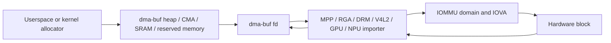
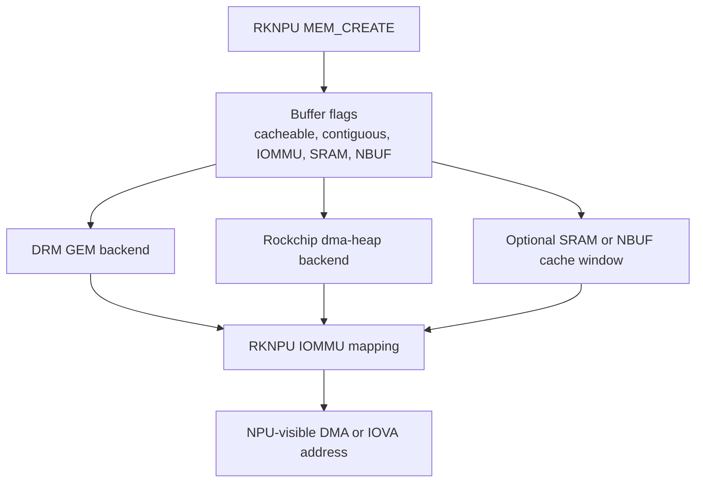

# Area 6: Shared memory, dma-buf, CMA, and IOMMU

## Normal-user view

This area lets large image and video buffers move between hardware blocks
without copying through the CPU. It is the hidden reason video decode, camera,
RGA, display, GPU, and NPU paths can be fast.

A user sees it as:

- high-resolution video jobs succeeding,
- low CPU usage for hardware pipelines,
- fewer frame copies between decoder, scaler, encoder, and display,
- fewer corrupted frames when cache synchronization is correct.

## Kernel-developer view

The BSP adds Rockchip-specific memory plumbing and extends generic paths:

- Rockchip dma-buf heaps under `drivers/dma-buf/rk_heaps/`.
- SRAM heap support.
- CMA options such as inactive CMA handling and debugfs bitmap helpers.
- Rockchip IOMMU changes, including the AV1D-specific IOMMU path.
- Cache synchronization and dma-buf import/export assumptions in media drivers.
- Per-block IOMMU nodes in DTS for MPP, JPEG, AV1, RGA, ISP, display, GPU, and
  NPU blocks.

## What the BSP adds beyond stock Linux

| Component | Purpose |
|-----------|---------|
| Rockchip heaps | Product-specific dma-buf allocation pools. |
| CMA changes | Improve or debug contiguous-memory behavior for media products. |
| IOMMU hooks | Support Rockchip media blocks and special cases such as AV1D. |
| SRAM heaps | Use on-chip SRAM for blocks that benefit from or require it. |
| Cache helpers | Keep CPU and device views coherent for shared buffers. |

## Developer notes

The common failure mode is assuming a buffer fd is enough. Every hardware block
must be able to attach, map, use, unmap, and release the buffer correctly. The
format metadata must also survive the handoff: width, height, stride, modifier,
plane count, color format, and cache state.

AV1 on RK3588 is a good example of why memory plumbing is architectural. The BSP
adds `rockchip-iommu-av1d.c` because the AV1D block uses a different IOMMU model
than normal Rockchip `iommu-v2` nodes.

RKNPU is another example. Its default DRM GEM memory manager can allocate
contiguous buffers, fall back to non-contiguous pages when IOMMU is available,
and return one NPU-visible DMA or IOVA address to RKNN userspace. The alternate
dma-heap path imports or allocates dma-bufs from Rockchip CMA heap support. Both
paths use the RKNPU private memory ioctls rather than a generic accelerator ABI.

The RKNPU IOMMU code can manage multiple domains and switches domains only when
its active-domain refcount reaches zero. That is different from the simpler
"map this dma-buf for this device" model used by many peripheral drivers, and it
is a reason RKNPU buffer lifetime, job lifetime, and domain id must be debugged
together.

## Common failure signs

| Symptom | Likely area |
|---------|-------------|
| Allocation failure | CMA size, heap choice, reserved-memory setup |
| IOMMU fault | wrong device domain, stale IOVA, bad attachment lifetime |
| Corrupt frame | stride, modifier, cache sync, plane layout |
| Slow path | userspace copied through CPU memory instead of sharing dmabuf |
| Crash after job completion | dma-buf reference-count or release-order bug |
