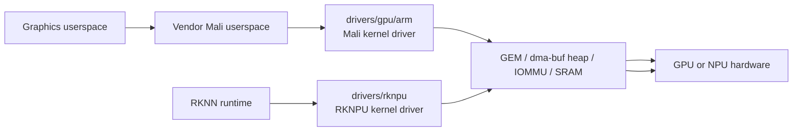

# Area 7: GPU and NPU accelerators

## Normal-user view

This area provides vendor accelerator stacks for graphics and AI inference. It
is separate from the video codec stack, but it shares memory-management and
IOMMU concerns with media and display.

A user sees it as:

- GPU acceleration for graphics or compute when using the matching Mali stack,
- NPU acceleration when using Rockchip's RKNN runtime,
- vendor debug counters and device nodes appearing for accelerator workloads.

## Kernel-developer view

The BSP adds large vendor Mali driver drops under `drivers/gpu/arm/` and the
Rockchip NPU driver under `drivers/rknpu/`.

The Mali vendor drivers are not the same as the upstream Mesa/Panfrost model.
They expect matching vendor userspace and carry their own memory, scheduling,
firmware, and debug assumptions.

RKNPU exposes a vendor character-device style interface with debugfs/procfs,
optional fences, SRAM support, and memory-manager choices such as DRM GEM or
Rockchip dma-heap behavior.

## What the BSP adds beyond stock Linux

| Area | BSP additions |
|------|---------------|
| Mali GPU | Vendor driver trees for multiple ARM Mali generations. |
| RKNPU | Rockchip neural-processing driver with vendor ABI and debug paths. |
| Memory integration | dma-buf, GEM, heap, SRAM, and IOMMU integration for accelerator buffers. |
| Debug hooks | procfs/debugfs counters and product diagnostics. |

## Developer notes

Do not mix kernel/userspace assumptions across stacks. Panfrost, vendor Mali,
RKNPU, MPP, and DRM can all touch dma-buf objects, but their ABIs and scheduling
models are different.

When porting, decide first whether the goal is vendor userspace compatibility or
an upstream-style stack. That decision determines whether preserving the vendor
ABI is the requirement or whether a subsystem rewrite is acceptable.
