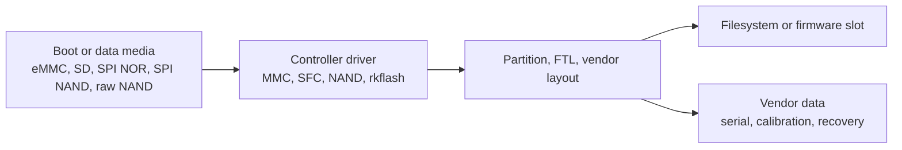

# Area 8: Storage, flash, and vendor storage

## Normal-user view

This area supports boot media, raw flash, factory data, recovery partitions, and
product update layouts. Users notice it when boards boot from the expected media
or when vendor data such as serial numbers and calibration survives updates.

## Kernel-developer view

The BSP adds Rockchip-specific storage and flash support beyond the stock
kernel. Main areas include:

- `drivers/rkflash/`
- `drivers/rk_nand/`
- SPI flash/SFC and NOR support paths
- MTD integrations
- vendor storage helpers
- boot/recovery metadata and product partition assumptions

## What the BSP adds beyond stock Linux

| Area | Purpose |
|------|---------|
| rkflash/rk_nand | Vendor flash abstractions for Rockchip product storage. |
| SFC/NOR support | SPI flash boot and data paths. |
| MTD/partition helpers | Product flash layouts and recovery/update flows. |
| Vendor storage | Factory data and board identity used by bootloader or userspace. |

## Developer notes

Separate board requirements from SoC requirements. An RK3588 board booting from
standard eMMC does not need the same storage delta as a raw-NAND appliance.
Preserve vendor storage only when a bootloader, factory tool, or userspace
component actually depends on it.

## Common failure signs

| Symptom | Likely area |
|---------|-------------|
| Rootfs not found | bootargs, partition layout, controller driver |
| Vendor serial/calibration missing | vendor storage helper or partition missing |
| SPI flash absent | SFC clock, chip select, pinctrl, compatible string |
| NAND corruption | ECC, bad-block table, FTL, power-loss handling |
