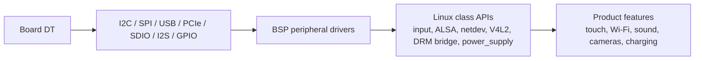

# Area 9: Connectivity and product peripherals

## Normal-user view

This BSP area is the product hardware inventory: Wi-Fi, Bluetooth, touch,
audio, USB gadget modes, PCIe cards, display SerDes, CAN, LTE, RTCs, regulators,
batteries, and other board peripherals.

A user sees it as a product that works without separately hunting for every
vendor driver or board quirk.

## Kernel-developer view

The BSP carries a broad set of peripheral drivers and board integrations. Major
examples from the diff include:

- `drivers/net/wireless/rockchip_wlan/` and Broadcom `bcmdhd`,
- many `drivers/input/touchscreen/` vendor drivers,
- Rockchip ASoC additions under `sound/soc/rockchip/`,
- many audio codec additions under `sound/soc/codecs/`,
- `drivers/mfd/display-serdes/`,
- `drivers/mfd/rkx110_x120/`,
- USB gadget/UVC changes,
- PCIe host/endpoint/DMA changes,
- CAN, LTE, RTC, PWM, regulator, and power-supply additions.

## What the BSP adds beyond stock Linux

| Peripheral type | BSP role |
|-----------------|----------|
| Wi-Fi/Bluetooth | Vendor chip drivers, firmware/NVRAM expectations, SDIO/PCIe power sequencing. |
| Touchscreens | Product panel/touch controller drivers and coordinate quirks. |
| Audio | Rockchip machine drivers, codecs, routing, clocks, jack/headset support. |
| SerDes/bridges | Camera/display serializer-deserializer and bridge MFD support. |
| USB gadget/UVC | Product gadget modes and camera-style USB behavior. |
| PCIe | Endpoint, host, DMA, and board reset/power quirks. |

## Developer notes

Many drivers in this area are not Rockchip IP. They are third-party chips carried
because Rockchip supports complete products. Before porting, classify the driver:
SoC glue, board quirk, generic third-party chip, Android appliance feature, or
vendor userspace dependency.

## Common failure signs

| Symptom | Likely area |
|---------|-------------|
| Wi-Fi interface missing | firmware, NVRAM, SDIO/PCIe power, driver match |
| Audio card absent | ASoC route, codec probe, clock, machine driver |
| Touch axes wrong | DT properties or input transform |
| USB gadget mode missing | configfs/gadget patch, role-switch, UDC driver |
| PCIe flaky | reset GPIO, regulator, PHY, ASPM, clock request |
