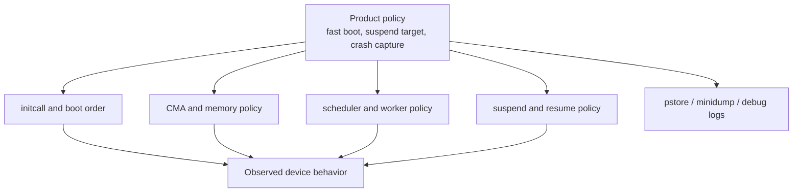

# Area 10: Common-kernel behavior changes

## Normal-user view

Not all BSP changes are device drivers. Some change generic kernel behavior so a
product image boots faster, suspends differently, keeps crash logs, handles
memory pressure differently, or works around product-specific storage and USB
behavior.

A user sees this as boot speed, suspend behavior, crash-data availability, and
differences from stock distro kernels.

## Kernel-developer view

Examples observed in the BSP include:

- `INITCALL_ASYNC` support for Thunder Boot,
- CMA inactive-page and CMA debugfs bitmap helpers,
- deferred memblock behavior,
- scheduler/schedutil tuning and RT worker priority changes,
- lite/ultra suspend and suspend-debug options,
- pstore/minidump/debug capture,
- UVC, MMC, MTD, USB, and other subsystem quirks,
- product-specific boot and resume shortcuts.

## What the BSP adds beyond stock Linux

| Change type | Why it exists |
|-------------|---------------|
| Boot ordering | Product boot-time reduction and early-display/product UX. |
| Memory policy | Media/camera contiguous-memory reliability and debugging. |
| Scheduler policy | Product latency/performance tuning. |
| Suspend policy | Appliance-style low-power modes and debug visibility. |
| Crash capture | Field diagnostics and vendor support workflows. |
| Subsystem quirks | Product compatibility for USB, MMC, MTD, UVC, and similar areas. |

## Developer notes

Common-kernel deltas are high-risk because they affect every driver. Treat them
as product policy until proven to be hardware architecture. If a media driver
requires a common-kernel change, document the exact call path. If it only
improves boot speed or product polish, keep it separate from hardware enablement.

## Common failure signs

| Symptom | Likely area |
|---------|-------------|
| Random probe race | async initcall or boot-order change |
| High-resolution allocation failure | CMA policy, heap choice, memory pressure |
| Latency change | scheduler or RT worker tuning |
| Suspend works only on BSP | vendor PM/suspend policy |
| Crash log missing | pstore/minidump/reserved-memory configuration |
