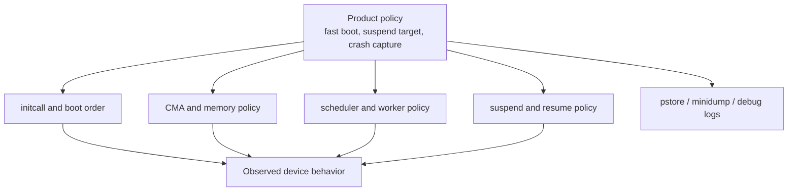
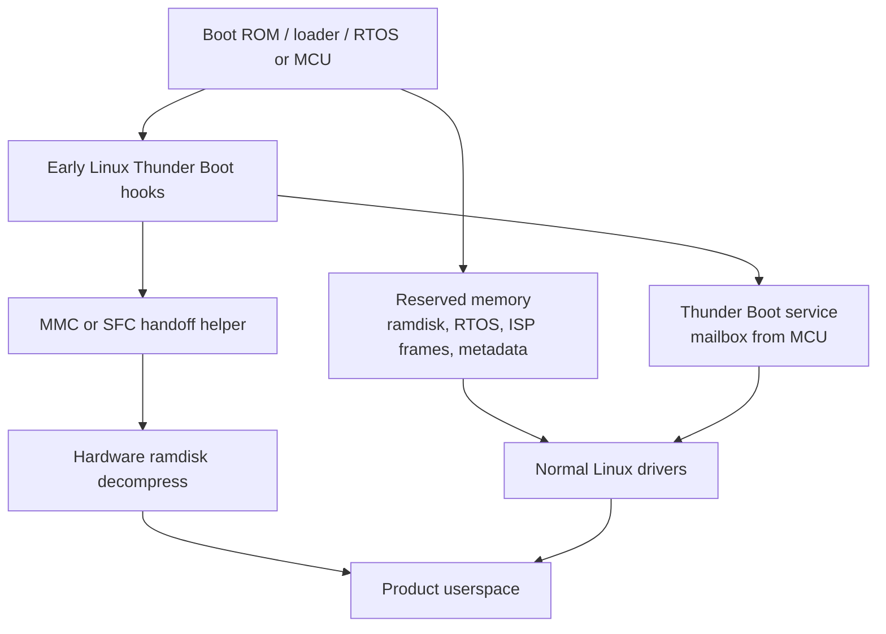
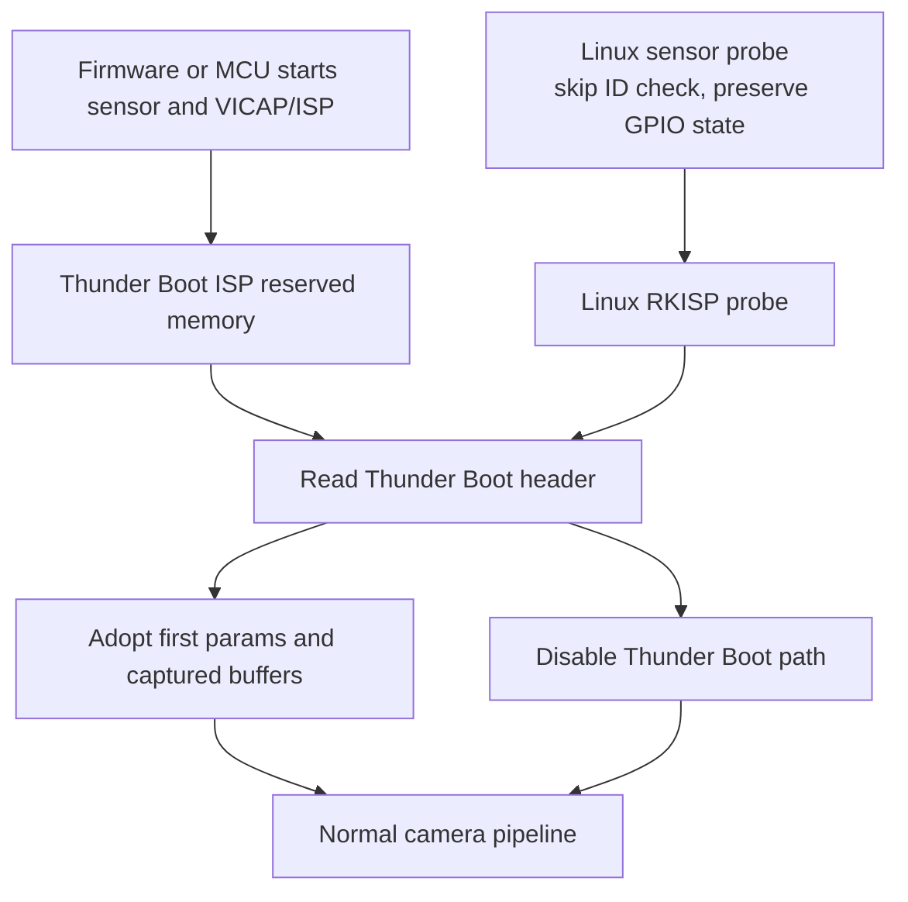

# Area 10: Common-kernel behavior changes

## Normal-user view

Not all BSP changes are device drivers. Some change generic kernel behavior so a
product image boots faster, suspends differently, keeps crash logs, handles
memory pressure differently, or works around product-specific storage and USB
behavior.

A user sees this as boot speed, suspend behavior, crash-data availability, and
differences from stock distro kernels.

## Kernel-developer view

Examples observed in the BSP include:

- `INITCALL_ASYNC` support for Thunder Boot,
- CMA inactive-page and CMA debugfs bitmap helpers,
- deferred memblock behavior,
- scheduler/schedutil tuning and RT worker priority changes,
- lite/ultra suspend and suspend-debug options,
- pstore/minidump/debug capture,
- UVC, MMC, MTD, USB, and other subsystem quirks,
- product-specific boot and resume shortcuts.

## What the BSP adds beyond stock Linux

| Change type | Why it exists |
|-------------|---------------|
| Boot ordering | Product boot-time reduction and early-display/product UX. |
| Memory policy | Media/camera contiguous-memory reliability and debugging. |
| Scheduler policy | Product latency/performance tuning. |
| Suspend policy | Appliance-style low-power modes and debug visibility. |
| Crash capture | Field diagnostics and vendor support workflows. |
| Subsystem quirks | Product compatibility for USB, MMC, MTD, UVC, and similar areas. |

## Thunder Boot in this BSP

Thunder Boot is Rockchip's product fast-boot path. It is not one driver and it is
not required for every Rockchip board. In this BSP it is a set of Kconfig
options, initcall-order changes, reserved-memory handoffs, storage helpers,
camera/ISP shortcuts, and optional MCU coordination. It appears most clearly in
RV1106/RV1126-family `*-tb` and `*-fastboot` configs, but the common-kernel
pieces affect any build that enables the symbols.

For a normal user, the goal is simple: show useful product behavior sooner after
power-on. For example, an appliance camera product can let firmware or a small
MCU start early capture while Linux is still booting, then Linux adopts the
state and buffers once the full driver stack is ready.

For a kernel developer, the important point is that Thunder Boot changes the
usual Linux assumption that every driver owns its hardware from reset. Some
hardware may already be configured by earlier firmware, a boot MCU, or a
pre-Linux transfer path. Linux must detect that handoff, avoid disturbing it too
early, then take ownership later.

### Main Kconfig pieces

| Symbol | What it changes |
|--------|-----------------|
| `ROCKCHIP_THUNDER_BOOT` | Top-level switch under `drivers/soc/rockchip`; selects deferred memblock freeing on SMP builds. |
| `INITCALL_ASYNC` | Lets same-level initcalls run through kthread workers when `initcall_nr_threads` is non-zero. |
| `ROCKCHIP_THUNDER_BOOT_DEFER_FREE_MEMBLOCK` | Defers freeing large memblock ranges to a later `defer_mem` kthread. |
| `ROCKCHIP_THUNDER_BOOT_MMC` | Enables early MMC handoff helper for boot-from-eMMC/SD products. |
| `ROCKCHIP_THUNDER_BOOT_SFC` | Enables early SPI-flash controller handoff helper. |
| `ROCKCHIP_THUNDER_BOOT_CRYPTO` | Enables the SHA-256 check path used with hardware crypto during ramdisk handling. |
| `ROCKCHIP_THUNDER_BOOT_SERVICE` | Enables mailbox-based MCU/AP handoff callbacks. |
| `VIDEO_ROCKCHIP_THUNDER_BOOT_ISP` | Enables camera/ISP adoption of pre-captured Thunder Boot state and buffers. |
| `VIDEO_ROCKCHIP_THUNDER_BOOT_SETUP` | Builds camera setup helpers used by Thunder Boot camera products. |

### Where the code lives

The BSP implements Thunder Boot across common boot code, Rockchip SoC services,
camera drivers, and product device trees:

| Source area | Thunder Boot role |
|-------------|-------------------|
| `init/main.c` | Adds the async initcall worker path and starts the deferred memblock worker. |
| `mm/memblock.c` | Records large memory ranges for later freeing when deferred memblock is enabled. |
| `drivers/soc/rockchip/rockchip_thunderboot.c` | Prepares reserved ramdisk source/destination memory and starts hardware decompression. |
| `drivers/soc/rockchip/rockchip_thunderboot_mmc.c` | Takes over an already-used MMC/eMMC controller and finishes the compressed-ramdisk handoff. |
| `drivers/soc/rockchip/rockchip_thunderboot_sfc.c` | Does the same handoff for SPI flash through the SFC controller. |
| `drivers/soc/rockchip/rockchip_thunderboot_service.c` | Receives the MCU done message, resets the MCU side, frees optional RTOS memory, and runs client callbacks. |
| `drivers/soc/rockchip/rockchip_decompress.c` | Registers the hardware decompressor early enough for the ramdisk path. |
| `drivers/media/platform/rockchip/isp/rkisp*.c` | Adopts or abandons camera/ISP Thunder Boot state. |
| `drivers/media/i2c/` sensor drivers | Preserve sensor GPIO/reset state and skip some cold-probe assumptions when ISP Thunder Boot is enabled. |
| `arch/arm/boot/dts/*thunder-boot*.dtsi` and related board `.dts` files | Define reserved memory, storage handoff nodes, MCU service nodes, camera handoff nodes, and bootargs. |

### Runtime contract

A working Thunder Boot product is a contract between loader/RTOS/MCU firmware,
Linux DT, kernel config, bootargs, and userspace. The common pieces in this BSP
expect these names and conventions:

| Contract item | BSP expectation |
|---------------|-----------------|
| Bootargs | Product DTS examples commonly use `initcall_nr_threads=-1`; `defer_free_block_size=` can tune deferred memblock. |
| Reserved memory | Ramdisk source/destination, RTOS memory, MCU log, metadata, and RKISP Thunder Boot buffers must match the loader or RTOS layout. |
| Storage nodes | `rockchip,thunder-boot-mmc` and `rockchip,thunder-boot-sfc` use `memory-region-src` and `memory-region-dst` to find compressed and decompressed ramdisk buffers. |
| Decompress node | `rockchip,hw-decompress` is the hardware path used before `init/initramfs.c` unpacks the rootfs. |
| MCU service node | `rockchip,thunder-boot-service` consumes mailbox/reset resources and can use `memory-no-free` when RTOS memory must remain reserved. |
| MCU done message | The service waits for command `0x0000f00d` with data `0xdeadbeef` before running callbacks. |
| Shared devices | Drivers can register `rk_tb_client_register_cb()` callbacks; RK3x I2C uses this for DT nodes marked `rockchip,amp-shared`. |
| Camera handoff | `rockchip,thunder-boot-rkisp`, `memory-region-thunderboot`, sensor `is_thunderboot`, and RKISP private ioctls must agree. |

### Async initcalls

`INITCALL_ASYNC` adds a threaded version of the normal initcall loop. The boot
parameter `initcall_nr_threads=` controls it:

- `0` is the default and disables async execution,
- `-1` uses an automatic worker count based on online CPUs,
- a positive number creates that many `init/N` kthread workers.

The BSP keeps the standard initcall levels, but splits each level into normal
and `_sync` ranges. Normal entries in a level can be queued to workers, then the
kernel flushes workers before processing the sync part. This can reduce elapsed
boot time, but it also exposes hidden ordering assumptions. Any driver that
relied on another same-level initcall having already completed can race.

### Early storage and ramdisk path

Thunder Boot has small early platform drivers for boot storage:

- `rockchip,thunder-boot-mmc` for MMC/eMMC,
- `rockchip,thunder-boot-sfc` for SPI flash through the SFC controller.

These nodes point at reserved memory for the compressed ramdisk source and
decompressed ramdisk destination. The MMC helper checks whether the controller
and its internal DMA are idle, disables the controller DMA path, sends CMD12 to
stop the old transfer, signals that compressed ramdisk input is ready, starts
hardware decompression, and can free the reserved IDMAC descriptor region. The
SFC helper waits for the flash controller to go idle, checks DMA completion,
then triggers the same ramdisk-decompression path.

The decompressor path uses `rockchip,hw-decompress` and reserved `ramdisk_c` and
`ramdisk_r` regions. When the crypto option is enabled, the driver can check a
SHA-256 digest before starting decompression. `init/initramfs.c` waits for the
hardware decompressor before unpacking rootfs data, so the CPU does not have to
do all decompression work synchronously on the critical path.

### Deferred memblock freeing

`ROCKCHIP_THUNDER_BOOT_DEFER_FREE_MEMBLOCK` changes early memory bring-up. Large
free memory ranges above `defer_free_block_size` are recorded instead of being
immediately released to the buddy allocator. The default threshold is 256 MiB,
and the boot parameter `defer_free_block_size=` can override it.

After SMP and workqueue setup, the kernel starts a `defer_mem` thread before
normal driver setup. That thread frees the recorded ranges and high pages in
parallel with the rest of boot. This shortens the serialized early-boot section,
but it means early memory availability can differ from a stock kernel until the
deferred worker completes.

### MCU service handoff

`ROCKCHIP_THUNDER_BOOT_SERVICE` adds a `rockchip,thunder-boot-service` platform
driver. The matching DT node names a mailbox receive channel, reset line, and
reserved RTOS memory region. When the MCU sends the expected done message, Linux
briefly waits for the MCU to enter a safe state, asserts the MCU reset, optionally
frees the RTOS reserved memory, and runs registered callbacks.

Drivers can register callbacks through `rk_tb_client_register_cb()`. The RK3x
I2C driver uses this when a controller is marked `rockchip,amp-shared`: it keeps
the IRQ from auto-enabling and delays normal clock/IRQ ownership until the
Thunder Boot service says the MCU side is done.

### Camera and ISP handoff

The camera Thunder Boot path is more than initcall reordering. Product DT files
reserve `memory-region-thunderboot` buffers for RKISP/VICAP output and define a
`rockchip,thunder-boot-rkisp` node with the clocks needed by the early camera
path. Several sensor drivers set `is_thunderboot` from
`VIDEO_ROCKCHIP_THUNDER_BOOT_ISP`; in that mode they can skip sensor ID checks
and request reset or powerdown GPIOs as `GPIOD_ASIS` so Linux does not disrupt a
sensor that firmware already started.

The RKISP driver can expose Thunder Boot reserved-memory headers and shared
buffers through private ioctls. It polls the reserved header for completion,
imports first ISP parameters when present, validates camera count and structure
size, registers the normal IRQ after the handoff, unprotects clocks, and then
marks Thunder Boot state as complete or failed. If the header reports failure or
times out, the driver disables the Thunder Boot path and continues through the
normal Linux ownership path.

## Developer notes

Common-kernel deltas are high-risk because they affect every driver. Treat them
as product policy until proven to be hardware architecture. If a media driver
requires a common-kernel change, document the exact call path. If it only
improves boot speed or product polish, keep it separate from hardware enablement.

When porting Thunder Boot, preserve the complete product tuple or leave it out:
Kconfig symbols, bootargs, DT reserved-memory layout, storage node, MCU service
node, mailbox/reset providers, ISP/camera private ioctls, and userspace that
knows how to consume the handoff metadata. Carrying only the async-initcall
piece is usually not enough and can add races without delivering the intended
product boot behavior.

## Common failure signs

| Symptom | Likely area |
|---------|-------------|
| Random probe race | async initcall or boot-order change |
| High-resolution allocation failure | CMA policy, heap choice, memory pressure |
| Rootfs or initramfs hangs | Thunder Boot storage/decompress handoff or reserved ramdisk regions |
| Camera starts then resets during boot | Thunder Boot ISP handoff, sensor GPIO state, or MCU service timing |
| Latency change | scheduler or RT worker tuning |
| Suspend works only on BSP | vendor PM/suspend policy |
| Crash log missing | pstore/minidump/reserved-memory configuration |
