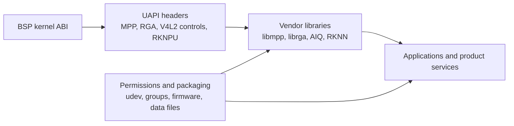

# Area 11: Userspace ABI and library expectations

## Normal-user view

The BSP kernel is designed to run with Rockchip userspace. The driver may be in
the kernel, but userspace still needs the matching library, headers, device node,
permissions, and data files.

A user sees this as packages and device nodes:

- `/dev/mpp_service` for MPP codecs and related media tasks,
- `/dev/rga` for RGA jobs,
- V4L2 nodes for camera/ISP paths,
- DRM nodes for display,
- `/dev/dma_heap/*` for shared buffer allocation,
- RKNPU device nodes and RKNN userspace for NPU products,
- camera AIQ userspace for ISP tuning.

## Kernel-developer view

The BSP adds UAPI and ABI surfaces that are stable because Rockchip userspace
expects them, not necessarily because they are upstream Linux ABIs. Important
source areas include:

- `include/uapi/linux/rk-mpp.h`
- RGA UAPI headers under the Rockchip video driver stack
- V4L2 private controls and media graph assumptions for camera/ISP
- RKNPU UAPI and debug/procfs paths
- dma-buf heap device-node expectations
- procfs/debugfs status files for BSP media and accelerator drivers

## What the BSP adds beyond stock Linux

| ABI surface | Meaning |
|-------------|---------|
| MPP service | Vendor codec/task ABI, including register-message submission. |
| RGA | Vendor 2D engine job ABI. |
| Camera/ISP | V4L2/media graph plus vendor controls and AIQ expectations. |
| dma-buf heaps | Allocation nodes used by media/graphics/accelerator userspace. |
| RKNPU | Vendor NPU runtime ABI. |
| procfs/debugfs | Product diagnostics and status reporting. |

## Developer notes

Userspace registration is not the same as a working hardware path. For example,
a library may expose a codec name only if the matching kernel subdriver, DT node,
IOMMU, clock/reset path, and userspace task format are all present. The kernel
ABI, library version, and DT must be treated as one tuple.

When documenting or testing BSP behavior, record:

- kernel commit and config,
- loaded DTB,
- UAPI header version,
- library version,
- device-node permissions,
- exact test command and input/output artifacts.

## Common failure signs

| Symptom | Likely area |
|---------|-------------|
| ioctl returns `EINVAL` | userspace/header/kernel struct mismatch |
| device opens but first job fails | missing subdriver, DT node, IOMMU, or heap access |
| codec name appears but hardware does not run | userspace advertises more than the enabled kernel path |
| works only as root | udev/ACL/group/heap permissions |
| behavior changes after package update | library/header/runtime mismatch |
