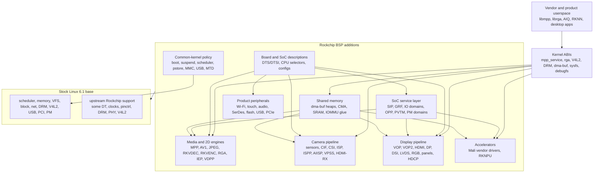

# Rockchip BSP architecture

This folder documents what the Rockchip `develop-6.1` BSP kernel adds on top of
the stock Linux 6.1 stable kernel it is based on. It is intentionally about the
BSP kernel itself: its source directories, Kconfig symbols, device-tree nodes,
user ABIs, and driver relationships. It is not a status report for a downstream
forward-port.

Each area has two layers:

- **Normal-user view:** what the BSP area makes possible on a board.
- **Kernel-developer view:** what source code, Kconfig, device tree, and Linux
  subsystem contracts the BSP adds or changes.

The source comparison behind this folder used Rockchip's `develop-6.1` at
`b4ef083dc0c3` against the local upstream-stable base commit `58485ff1a74f`
(`Linux 6.1.141`). At that point the BSP overlay contained about **5,939 changed
files**, **5,194 added files**, and **3.5M added lines**. The numbers matter
because they show the BSP is a product kernel, not a single board patch.

## Section map

| Area | Page | What the page explains |
|------|------|------------------------|
| SoC and board descriptions | [`01-soc-and-board-descriptions.md`](01-soc-and-board-descriptions.md) | SoC selectors, DTS/DTSI files, board enablement, bindings, configs. |
| Firmware, power, and boot | [`02-firmware-power-boot.md`](02-firmware-power-boot.md) | Rockchip firmware calls, GRF/IO-domain, OPP/PVTM, PM domains, boot policy. |
| Media codecs and RGA | [`03-media-codecs-rga.md`](03-media-codecs-rga.md) | MPP service, RKVDEC/RKVENC, JPEG, AV1, IEP/VDPP, RGA, device-tree topology. |
| Camera and image input | [`04-camera-isp-image-input.md`](04-camera-isp-image-input.md) | Sensor drivers, CIF, CSI, ISP, ISPP, AIISP, VPSS, HDMI-RX. |
| Display and DRM | [`05-display-panels-drm.md`](05-display-panels-drm.md) | Rockchip DRM extensions, VOP/VOP2, bridges, panels, HDCP, TVE, RK618. |
| Shared memory | [`06-memory-dmabuf-cma-iommu.md`](06-memory-dmabuf-cma-iommu.md) | dma-buf heaps, CMA changes, SRAM heaps, IOMMU glue, cache synchronization. |
| GPU and NPU | [`07-gpu-npu-accelerators.md`](07-gpu-npu-accelerators.md) | Vendor Mali driver drops, RKNPU, memory-manager choices. |
| Storage and flash | [`08-storage-flash-vendor-storage.md`](08-storage-flash-vendor-storage.md) | rkflash, NAND, SFC/NOR, MTD, vendor storage, boot/recovery storage. |
| Product peripherals | [`09-connectivity-product-peripherals.md`](09-connectivity-product-peripherals.md) | Wi-Fi, touch, audio, SerDes, USB gadget, PCIe, CAN, LTE, regulators. |
| Common kernel behavior | [`10-common-kernel-behavior.md`](10-common-kernel-behavior.md) | Thunder Boot, suspend, pstore, scheduler, CMA, MMC/USB/MTD quirks. |
| Userspace ABI | [`11-userspace-abi-library-expectations.md`](11-userspace-abi-library-expectations.md) | Device nodes, ioctl surfaces, UAPI headers, vendor userspace expectations. |
| Forward-porting | [`forward-porting.md`](forward-porting.md) | How to decide which BSP pieces are architectural dependencies. |
| Troubleshooting | [`troubleshooting.md`](troubleshooting.md) | Symptom-to-area map for BSP bring-up. |

## One-sentence summary

The stock kernel provides generic Linux infrastructure and some upstream
Rockchip support. The Rockchip BSP adds a vendor product layer around it:
expanded SoC/board descriptions, firmware and power services, large media,
camera, display, GPU/NPU, storage, and peripheral driver stacks, product boot and
suspend behavior, memory/IOMMU glue, and userspace ABIs expected by Rockchip
libraries.

## Bird's-eye view

## What "BSP" means here

The BSP is a downstream kernel tree that Rockchip uses to support SoCs and
products across many boards. Some changes are reusable hardware support. Some
are board files. Some are user ABI compatibility. Some are debug aids or product
policy. A maintainer should not treat all BSP changes the same way.

| BSP content type | Example | Porting implication |
|------------------|---------|---------------------|
| SoC IP support | RKVDEC, RKVENC, AV1D, RGA, ISP, VOP2 | Usually required for the hardware feature. |
| Board description | RK3588 EVB, tablet, NVR, vehicle DTS files | Required only for matching boards or board families. |
| Service layer | Rockchip SIP, IO-domain, GRF, PVTM, OPP, PM domains | Required when a driver calls it or when product power policy depends on it. |
| Vendor ABI | `/dev/mpp_service`, `/dev/rga`, RKNPU ioctls | Required to run matching Rockchip userspace. |
| Product policy | Thunder Boot, lite suspend, pstore/minidump tuning | Carry only when the product goal requires it. |
| Peripheral inventory | Wi-Fi, touch, audio codecs, SerDes chips | Relevant to products using those components. |

## How to read these pages

Start with the area that matches the symptom or feature. For each area, read the
normal-user section first to understand the purpose, then the kernel-developer
section for exact BSP files and subsystem wiring. For RK3588 media, the most
important page is [`03-media-codecs-rga.md`](03-media-codecs-rga.md), especially
the AV1 and JPEG diagrams.
