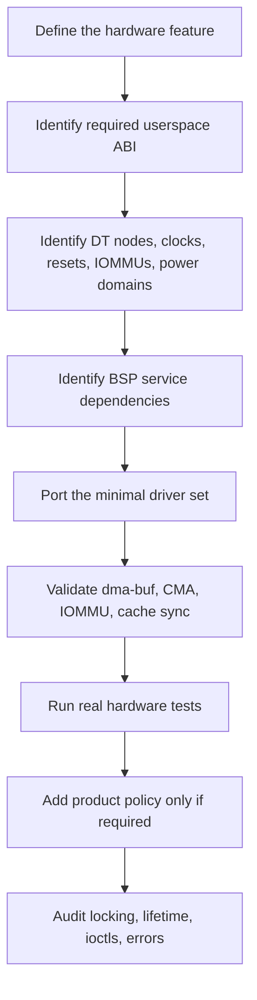

# Forward-porting the BSP

This page is about deciding which BSP pieces are architectural dependencies and
which are product policy. The BSP kernel is large enough that importing a whole
directory is usually the wrong unit of work.

## Rules

1. Start with a hardware feature, not a source directory.
2. Preserve the ABI only when matching Rockchip userspace is part of the goal.
3. Treat DT properties such as `rockchip,srv`, taskqueue nodes, CCU phandles,
   and special IOMMUs as architectural when the driver consumes them.
4. Separate correctness dependencies from OPP/PVTM/devfreq/performance policy.
5. Separate SoC IP support from board/product peripheral inventory.
6. Keep common-kernel behavior changes isolated until a concrete dependency is
   proven.
7. Validate with real hardware jobs, not only probe logs.
8. Record source pins and verification dates.

## Dependency questions

| Question | Why it matters |
|----------|----------------|
| Which userspace ABI is required? | MPP/RGA/RKNPU vendor ABI and V4L2/DRM upstream ABI imply different ports. |
| Which DT node matches the driver? | Compatible strings often distinguish similar hardware blocks. |
| Does the block need a special IOMMU? | AV1D on RK3588 is not normal `iommu-v2`. |
| Is there a shared CCU or task queue? | Multi-core media blocks may need service-level coordination. |
| Does the code call SoC services? | Missing GRF/OPP/PVTM/firmware hooks can change runtime behavior. |
| Is this product policy? | Boot/suspend/debug behavior should not be mixed into hardware enablement accidentally. |
