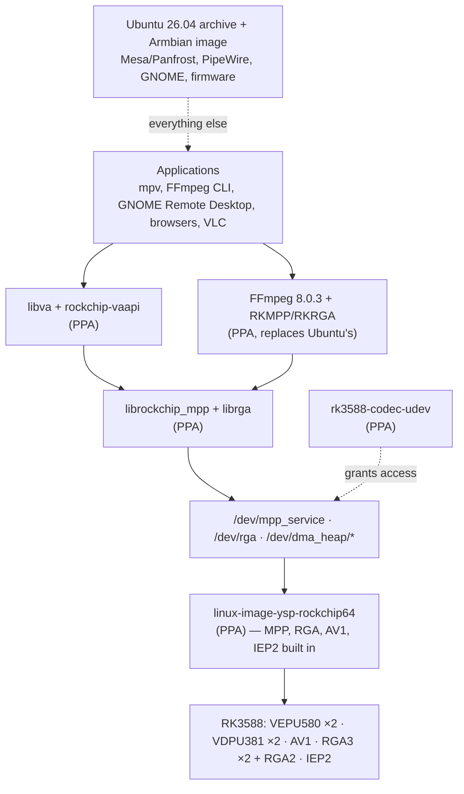

# ROCK 5B PPA — support statement

What `ppa:yi-ding/ubuntu-rock-5b` and its forward-port kernel **do** support,
what they **do not**, and how both compare to a Rockchip BSP distribution.

This is the page to read before adding the archive to a board. It is written for
someone deciding whether this stack fits their use, not for someone maintaining
it — the maintenance view is [`../status.md`](../status.md) and
[`../packaging/ppa/`](../packaging/ppa/README.md).

> **What "supported" means here.** This archive is a personal engineering
> project, not a vendor product. A row below says *supported* when this
> repository holds a dated hardware result for it on this board, and *not
> supported* when the capability is absent, deliberately declined, or has no
> runtime evidence at all. §6 states the evidence behind each claim and where it
> stops. Nothing here carries a warranty, a response time, or a security-update
> commitment.

Use this PPA if you have a ROCK 5B running Armbian's Ubuntu 26.04 Resolute
image, want the RK3588 H.264/HEVC/VP9/AV1 and RGA path on a Linux 6.18 base,
and are willing to prepare the documented SD-card recovery path before changing
the booted kernel. Do not use it if camera/ISP, NPU, hardware JPEG, vendor-wide
peripheral coverage, or a supported production image matters more than the
newer kernel and the media fixes summarized in §7.

The archive is public at
[`ppa:yi-ding/ubuntu-rock-5b`](https://launchpad.net/~yi-ding/+archive/ubuntu/ubuntu-rock-5b).
You do not need every package in it: §2 maps each one to the reason a reader
would actually choose it.

## 1. What it targets

| Axis | Supported | Not supported |
|------|-----------|---------------|
| Board | Radxa **ROCK 5B** (RK3588). The ROCK 5B+ shares the same device-tree include, so it receives the same codec enablement — untested. | Every other RK3588 board, every other Rockchip SoC. The kernel package ships Armbian's whole `rockchip64` DTB set, but codec enablement lands only in `rk3588-rock-5b.dtsi` (§3.3). |
| Distribution | **Armbian's Ubuntu 26.04 "Resolute" image** for ROCK 5B. | Debian-based Armbian, Radxa's own OS images, stock Ubuntu Server/Desktop images, any release other than Resolute. The archive publishes for `resolute` only; the kernel package assumes Armbian's `/boot` layout, `armbianEnv.txt`, and boot-script conventions. |
| Architecture | **arm64** only. | Everything else. The PPA is configured with the `arm64` processor alone; `Architecture: all` packages are built on arm64. |
| Kernel | The archive's own `linux-image-ysp-rockchip64` (§3). | Armbian's stock `current`/`edge`/`vendor` kernels — the userspace works on them, but no codec device nodes exist without a kernel that carries the drivers. The out-of-tree [DKMS channel](../packaging/dkms/README.md) exists for that case and is **not boot-validated**. |

## 2. What the archive publishes

All nine source packages and their current binaries were rechecked against the
live Launchpad API on **2026-08-05**. Publication state can change without an
edit here, so re-read [`status.md` W05](../status.md#watch-w05) before trusting a
version string.

| Source and current version | Binary package choices | Why you might install it | Choice boundary |
|----------------------------|------------------------|--------------------------|-----------------|
| `linux-rockchip64-ysp`<br>`6.18.42+rk3588av1fwport20260804-0ubuntu1~rk1` | `linux-image-ysp-rockchip64`, `linux-dtb-ysp-rockchip64`, `linux-headers-ysp-rockchip64` | Install the image/DTB pair when you want the actual MPP, AV1, IEP2, and RGA kernel drivers. Without a kernel that exposes `/dev/mpp_service` and `/dev/rga`, none of the acceleration packages below can work. Install headers only to build DKMS or another external module. | The image makes YSP the selected boot kernel even though its package name is co-installable. Prepare recovery first. Never install this archive's separate codec DKMS experiment on it. |
| `mpp`<br>`1.5.0+git20260805.a8b19653+ds-0ubuntu1~rk1` | `librockchip-mpp1`, `librockchip-vpu1`, `rockchip-mpp-demos`, `librockchip-mpp-dev` | Install the runtime for every RKMPP decoder/encoder, including FFmpeg, VA-API, and GRD. Add the demos to test hardware directly; add `-dev` only to compile MPP consumers. This release fixes the VP9 repeated-reference ownership defect and passed installed-package replay. | It is the userspace codec library, not a player and not a kernel driver. `librockchip-vpu1` is compatibility ABI; most users receive it as a dependency rather than selecting it. |
| `librga`<br>`2.2.0+git20260725.26a50ef-0ubuntu1~rk1` | `librga2`, `librga-dev` | Install `librga2` for hardware scale, crop, rotate, blit, and colour conversion, including zero-copy decode→RGA→encode pipelines. Add `-dev` only to compile RGA consumers. | Treat it as a versioned pair with the YSP kernel: mixing unvalidated forward-port versions across the 10-bit stride/offset transition can silently corrupt chroma. |
| `ffmpeg`<br>`7:8.0.3+rockchip+git20260729.33a651a55b-0ubuntu1~rk1` | `ffmpeg` plus the normal Resolute `libav*62/60/11/9/6` runtime and development split | Use this for the ordinary `ffmpeg`/`ffprobe` commands, RKMPP codecs, RKRGA filters, and applications built against Ubuntu 26.04's FFmpeg ABI. It is the most integrated CLI and library path. | It replaces Ubuntu's system FFmpeg in place. This remains the last confirmed live build. The validated `c9428bedaa` successor was signed and transferred to Launchpad on 2026-08-05, but acceptance, build, and publication were deliberately not awaited or rechecked. Install/package replay and the GRD fallback/recreation gate remain open. |
| `rockchip-vaapi`<br>`1.0.11+ysp13-0ubuntu1~rk1` | `rockchip-vaapi`, optional `rockchip-vaapi-config` | Add the driver for software that speaks VA-API instead of selecting `h264_rkmpp` directly: mpv, VLC, GStreamer `va`, and VA-API-capable browser builds. Add the config package only when you want this driver selected system-wide. Ysp13 fixes Chrome's retained pre-decode export presenting green H.264 frames. | Optional for direct FFmpeg/RKMPP use. Application selection and sandboxes still matter: XtraDeb Chromium lacks libva, Chrome's GPU sandbox is unproven here, and VLC 3.x cannot select standalone RKMPP codecs without this bridge. |
| `gnome-remote-desktop`<br>`50.2+rkmpp+git20260729.15.c4ef3c9-0ubuntu1~rk2` | `gnome-remote-desktop` | Choose it when this ROCK 5B is a GNOME RDP host and you want H.264 sessions encoded by RKMPP instead of the CPU. | Not needed for local playback or FFmpeg. Use the native PipeWire audio stack; hardware encoding at the GDM login screen needs a separate unpublished ACL package. |
| `rk3588-codec-udev`<br>`1.1` | `rk3588-codec-udev` | Install this for any non-root media use. It grants the `video` group access to MPP, RGA, and DMA heaps and retriggers existing devices, then verifies their permissions. | The user must also belong to `video` and start a new login session. The package deliberately does not grant the GDM greeter access. |
| `ffmpeg-rockchip`<br>`6.1+git20260423.40c412dacc-0ubuntu1~rk1` | `ffmpeg-rockchip` | Choose the private `/opt/ffmpeg-rockchip` tools to compare or retain nyanmisaka's established 6.1 Rockchip behavior without replacing the system FFmpeg. Commands are named `ffmpeg-rockchip`, `ffprobe-rockchip`, and `ffplay-rockchip`. | Optional compatibility/comparison tool, not the normal stack. Its older private ABI does not satisfy Resolute applications linked to FFmpeg 8. |
| `plymouth`<br>`24.004.60+git20250831.4a3c171d-0ubuntu8.1~rk1` | Ubuntu's normal Plymouth binary split at the patched version | Install it only if the board can stall in `plymouthd` when serial input ends partway through a CSI escape sequence. It is the distro source plus the one upstream parser fix. | Unrelated to codecs. If the machine never shows this boot stall, leave Ubuntu's Plymouth alone. Installing it regenerates initramfs. |

For a typical hardware-video CLI or service, the useful base is the kernel
image/DTB, codec udev rule, MPP runtime, librga runtime, and system FFmpeg. Add
VA-API for desktop applications, GRD plus `pipewire-audio` for RDP hosting, and
the `-dev`, demo, and kernel-header packages only for development or direct
diagnosis. The full installer in §9 intentionally installs that broader
development/diagnostic set; the manual profiles there make the initial package
choice narrower.

Adding an APT archive is not a permanent per-package opt-in. While the PPA is
enabled, any higher-version replacement it publishes becomes an upgrade
candidate for an already-installed Ubuntu package. That especially matters for
system `ffmpeg`, `gnome-remote-desktop`, and `plymouth`. Use APT preferences or
disable the PPA after the chosen install if you need a durable exception; do not
assume that omitting a package from one `apt install` command pins Ubuntu's
version forever.

Four sibling archives exist for incompatible lines — FFmpeg 8.1 (upstream and
Rockchip), and the experimental clean-room rewrite kernels. **Do not add them
for ordinary use;** they are comparison and research targets, described in
[`packaging/ppa/`](../packaging/ppa/README.md) § PPA Layout.



## 3. What the forward-port kernel supports

### 3.1 Accelerator blocks

| Block | State | Notes |
|-------|-------|-------|
| **H.264 decode** | Supported | VDPU381, two cores behind the CCU. Bit-exact against software reference in the repo's decode differential. |
| **HEVC (H.265) decode** | Supported | Same cores. Main and Main10. |
| **VP9 decode** | Supported | Same cores; bit-exact as of 2026-07-04. |
| **AV1 decode** | Supported | The separate Verisilicon AV1 block, driven through an upstream-style VSI IOMMU provider this port adds. Bit-exact on hardware 2026-07-04. |
| **AVS2 decode** | Present, untested | VDPU381 covers it and the driver registers the cases, but no AVS2 asset exists in this repo's harness, so there is no result. |
| **H.264 encode** | Supported | VEPU580, two cores with CCU/DCHS. PSNR-gated in the FFmpeg suite. |
| **HEVC encode** | Supported | Same cores. Main profile, NV12 input, RK3588's CTU64 contract. |
| **RGA 2D** | Supported | Both RGA3 cores plus RGA2: scale, crop, rotate, colour convert, blit. |
| **10-bit paths** | Supported, paired | P010/P210 raster plus compact NV15 raster/TILE paths are hardware-validated. Uncompressed 10-bit virtual widths and plane offsets use byte units. P010/P210 TILE is not claimed. The kernel and `librga` must be installed **as a pair**. |
| **IEP2 deinterlacing** | New, narrow evidence | The hardware deinterlacer, introduced by the `20260803` predecessor and retained by the current `20260804` / `0092` kernel. It was confirmed working standalone on 2026-08-04. It is **not** reachable through VA-API (§5), and libmpp's decoder-internal use of it is deliberately disabled by the VA-API driver. |

Encoder **B-frames and P010 encode input are permanent hardware/MPP walls**, not
open work. They are not coming.

### 3.2 What the kernel does *not* carry

| Capability | Why |
|------------|-----|
| **JPEG encode / decode (hardware)** | RK3588 has the blocks; this port deliberately left `mpp_jpgdec.c`/`mpp_jpgenc.c` behind. Visible consequence: the GStreamer suite's JPEG cases fail as expected diagnostics and libmpp logs benign `client N driver is not ready!` probes. Mainline's own Hantro V4L2 JPEG driver is enabled as a module and is a separate, unrelated path. |
| **VP8 hardware decode** | Its VPU block is not ported. FFmpeg still advertises a `vp8_rkmpp` decoder; there is no evidence it works on this kernel, so treat it as unsupported. |
| **NPU (RKNPU / RKNN / RKLLM)** | The 8,598-line vendor NPU driver is not ported. Scoped, not started — see the [RKNPU scoping finding](../findings/2026-07-24-rknpu-forward-port-scoping.md). No NPU inference of any kind runs on this kernel. |
| **Camera: MIPI CSI, CIF, ISP, ISPP, AIISP, VPSS** | Not ported. No sensor pipeline. |
| **HDMI input / capture (HDMI-RX)** | Not ported. |
| **VDPP post-processor** | RK3588 does not have one; the BSP driver binds VDPP on RK3528/RK3576 instead. Not a gap. |
| **Legacy VPU1/VPU2, RKVDEC-v1, RKVENC-v1** | Silicon absent on RK3588. Not a gap. |
| **Per-die CPU voltage binning (PVTM/eFuse OPP)** | Substituted with a stub that returns `-EOPNOTSUPP`, so the CPU runs mainline's worst-die voltage table. On this board that is **37.5–87.5 mV higher than the die's entitlement on nine of ten non-trivial CPU OPPs** (measured, [W22](../status.md#watch-w22)). A power/thermal cost, not a correctness one. |
| **Codec devfreq, system monitor, DMC coupling** | Codec-core dynamic frequency scaling is compiled out; the thermal/voltage coupling shims return "not available" and mainline thermal cooling substitutes. |

The whole-board picture — Wi-Fi, GPIO, suspend/resume, USB, display outputs,
audio, storage — is **not** claimed by this archive at all; it is whatever the
Armbian image provides. [`support-coverage.md`](support-coverage.md) inventories
which of those areas this repository has evidence for (many: none).

### 3.3 Board scope, precisely

The MPP service, both encoder cores, both decoder cores, the AV1 block, and
IEP2 are declared `status = "disabled"` in `rk3588-base.dtsi` and enabled only in
`rk3588-rock-5b.dtsi`, which `rk3588-rock-5b.dts` and `rk3588-rock-5b-plus.dts`
include. On any other RK3588 board's DTB the codec nodes stay disabled and no
codec device appears. The RGA nodes *are* enabled in the shared base file, so
`/dev/rga` would come up more widely — untested, and not a supported
configuration.

### 3.4 How the kernel package behaves on the board

- **Co-installable names, one boot slot.** The binaries are
  `linux-image-ysp-rockchip64`, `linux-dtb-ysp-rockchip64`, and
  `linux-headers-ysp-rockchip64`, so they never replace Armbian's own kernel
  packages. But installing repoints `/boot/Image` and `/boot/dtb` at the YSP
  kernel — **it becomes the booted kernel.** Removing it repoints them at the
  highest remaining kernel in `/boot`, or removes the dangling links if there is
  none.
- **No boot menu.** Armbian's ROCK 5B U-Boot flow has no kernel picker; keeping
  a second kernel under `/boot` does not make it selectable after a failed boot.
  Prepare a rescue path *before* installing —
  [`install.md` §3](../install.md) is the runbook.
- **Successive builds of the same version replace each other.** The package
  name and release string are stable across rebuilds, so a newer upload
  overwrites a known-good install of the same version.
- **Never install the DKMS package on this kernel.** The drivers are built in
  (`=y`); the out-of-tree build fails `modpost` with `exported twice`.

## 4. Device access is not automatic

No kernel path makes the device nodes usable without root. `rk3588-codec-udev`
installs the rule, and **the user must be in the `video` group**. The
`dma_heap` grant matters as much as the codec node: RKMPP allocates its buffers
there, so an otherwise-correct setup dies at MPP init without it.

The GDM login greeter is deliberately excluded — hardware-encoding the greeter
needs the separate opt-in
[`gdm-hwenc`](../packaging/gdm-hwenc/README.md) package, which widens codec
access to the whole `gdm` group and is not published.

## 5. What the userspace stack supports

| Component | Supported | Boundary |
|-----------|-----------|----------|
| **FFmpeg 8.0.3 (`+rockchip`)** | `h264_rkmpp` / `hevc_rkmpp` decode and encode, `vp9_rkmpp` and `av1_rkmpp` decode, `scale_rkrga` and the zero-copy decode→RGA→encode transcode path. | Replaces Ubuntu's FFmpeg in place (same ABI family). Not co-installable with the FFmpeg 8.1 archives. |
| **Player selection** | `mpv --hwdec=rkmpp` or `--vd=h264_rkmpp`; `ffmpeg -c:v h264_rkmpp`. | The RKMPP decoders are **standalone AVCodecs, not `AVHWAccel`** — a generic "enable hardware decoding" toggle will not find them, and **VLC 3.x cannot select them at all**. |
| **`rockchip-vaapi`** | Default: H.264, HEVC Main, and VP9 Profile 0 decode. Opt-in (documented environment switch): HEVC Main10, VP9 Profile 2, and H.264/HEVC encode. Ysp13 preserves surfaces exported before decode, fixing Chrome's green H.264 presentation. | **No deinterlacing** — the driver advertises no `VAEntrypointVideoProc`. **No AV1** through VA-API. 10-bit below 68 pixels wide is [permanently declined](../video-libraries/vaapi/README.md#declined-narrow-afbc-10-bit-below-68-pixels). Picture size is capped at 8192×8192. Automated Chrome output and its GPU sandbox, XtraDeb Chromium's missing libva, and sandbox-enabled Firefox remain open. |

> **Interlaced H.264: fixed in `ysp12`, upgrade if you installed `ysp10`.** The
> published kernel enables IEP2 for the first time, which un-masked a
> long-standing defect: the driver never opted out of MPP's decoder-internal
> deinterlacer, which emits two frames per field pair with synthesized
> timestamps and cannot route through VA-API decode's 1:1 surface contract. On
> `ysp10` that made interlaced H.264 fail with `internal decoding error`;
> progressive content was unaffected. **`ysp12` disables that path and restores
> all 17 pinned conformance vectors to bit-exact on kernel `6.18.42`**
> (re-run 2026-08-04 on the installed package). `ysp11` was prepared with the
> picture-size change only, and was superseded before publication. Detail:
> [the regression finding](../findings/2026-08-04-vaapi-interlaced-decode-broken-by-iep2-enablement.md).
| **`librga`** | 8-bit and 10-bit blit/scale/convert on both RGA3 cores and RGA2. | RGA3 will not accept a visible width below 68; RGA2 cannot read AFBC; over-4G buffers with ≥1 MiB exporter chunks fall back with `EOPNOTSUPP` rather than corrupting. Must match the kernel (§3.1). |
| **GNOME Remote Desktop** | RDP with hardware H.264 encode, full-range BT.709 signalling, bounded encode recovery. | Reconnect replay, sustained focus/resume, and compressed-audio interoperability remain unproven. Needs the PipeWire audio stack, not standalone PulseAudio. |

Not in the archive at all: **Kodi** (no source published, no build evidence),
any NPU runtime, any camera stack, and any browser package — browsers use the
distro build plus `rockchip-vaapi`, which the install script does **not** pull
in; install it explicitly if you want browser decode.

## 6. Evidence behind the claims

This is the part a support statement usually omits. Read it as the boundary of
every "supported" above.

| Claim | Strongest evidence | Date | What is still open |
|-------|--------------------|------|--------------------|
| The codec/RGA stack works end to end from the current PPA install | Exact `…20260804~rk1` / `0092` image, DTB, and headers were installed from the PPA and booted. ABI, 12/12 MPP, 21/21 required plus 3/3 diagnostic FFmpeg, direct librga/RGA, decoder liveness/quality, IOMMU machinery, VP9/RGA recovery, broad VA-API, and bounded kernel-log gates pass. GStreamer is 100/102 with two classified userspace semantics failures and no kernel fault. | 2026-08-04 | The production config has no KASAN/lockdep. Root-only debugfs counters, the remaining targeted hostile paths, and authenticated RDP/physical-display integration are open. |
| The current kernel sustains production-profile media load | The two-hour dual H.264+HEVC encode soak passes with flat RSS/fds and an empty kernel delta. The two-hour 4K H.264 decode workload completes and its kernel window is clean. | 2026-08-04 | The committed decode resource oracle is still red: four loop-boundary transients produce a 36-fd span against the 32-fd limit even though head/tail medians fall 56→54. Repeat it without unrelated desktop activity; do not raise the threshold. |
| AV1 decode is bit-exact | Hardware decode differential on the AV1 forward-port build. | 2026-07-04 | AV1 from MP4/MKV containers has not been re-tested since the extradata fix. |
| The published ysp13 VA-API driver fixes Chrome's retained-export green frame | Release commit `70f26d9` passes the retained pre-decode NV12/P010 lifecycle, 24-frame hardware, 17-vector conformance, sanitizer/static-analysis, and 1,440-frame zero-copy gates. The locally built ysp13 package presents H.264 correctly in Google Chrome 151 and selects `VaapiVideoDecoder` for 640×480 VP9; the matching source, successful arm64 build, and both binary packages are Published. | 2026-08-05 | The Published binary has not been reinstalled over the same-version local ysp13 build. Chrome replay is manual, HEVC browser playback and checked-output automation remain open, and the live GPU process was unsandboxed. |
| Rollback works | The operator has repeatedly used the documented SD rescue path and the exact `kernel-revert.sh` commands successfully ([dated finding](../findings/2026-08-04-forward-port-sd-rescue-rollback-used.md)). | 2026-08-04 | This is user-reported operational evidence without a retained identity/log bundle or an independent second-reader replay. Automatic boot fallback, clean migration, and stale-package cleanup are separate open gates. |
| Clean migration from an earlier test stack | The `clean-install-system-stack.sh` transaction is written and simulated. | — | The exact transaction has not passed a board gate. |

Two consequences worth stating plainly:

1. **The kernel that `apt` installs today is broadly functionally and
   recovery-validated, but it is not exact-tail memory-safety qualified.** The
   production result closes the current-package runtime campaign; it does not
   substitute for the still-open `0092` KASAN/lockdep and hostile-path gates,
   and its strict decode resource oracle remains red.
2. **Rollback has an operator-validated SD rescue path.** The remaining package
   gate is clean migration/stale-package cleanup, not whether the documented
   recovery mechanism works.

## 7. Compared with a Rockchip BSP distribution

"BSP distribution" here means an OS image built on Rockchip's downstream
`develop-6.1` kernel — Radxa's own Debian/Ubuntu images, or Armbian's `vendor`
branch, which *is* the BSP. That kernel is a product tree: measured against
stock Linux 6.1 it changes about **5,939 files and adds ~3.5M lines**.

### 7.1 Area by area

| Area | Rockchip BSP distribution | This PPA + forward-port kernel |
|------|---------------------------|-------------------------------|
| Kernel base | Linux **6.1** vendor branch, diverged from stable | Linux **6.18** LTS (projected EOL Dec 2028), Armbian `rockchip64-current`, mainline IOMMU/DMA/DRM cores |
| Distro userspace | Vendor image, often pinned and slow-moving | **Ubuntu 26.04** archive with its ordinary security updates; only FFmpeg, GNOME Remote Desktop, and Plymouth are replaced, the rest is added alongside |
| Video decode | H.264, HEVC, VP9, AVS2, AV1, **JPEG** | H.264, HEVC, VP9, AV1 (AVS2 present but untested). **No JPEG.** |
| Video encode | H.264, HEVC, **JPEG** | H.264, HEVC. **No JPEG.** |
| Deinterlacing | IEP2, long-standing | IEP2, added 2026-08-03, narrow evidence, not exposed through VA-API |
| 2D / RGA | RGA3 + RGA2 | RGA3 + RGA2, **plus 20 vendor RGA commits the 6.1 BSP never received** (§7.2) |
| Camera / ISP | Full sensor, CIF, CSI, ISP, ISPP, AIISP, VPSS stack | **None** |
| HDMI input | Supported | **None** |
| NPU | RKNPU driver + RKNN runtime | **None** |
| GPU | Vendor **Mali blob** kernel driver + matching proprietary userspace | Upstream **Mesa/Panfrost**, plus four open Mesa MRs from this project fixing a G610 blit-precision erratum |
| CPU power | Per-die PVTM/eFuse voltage binning, codec devfreq, system-monitor thermal coupling | Worst-die voltage table (+37.5–87.5 mV on 9/10 OPPs on this die), no codec devfreq |
| Peripherals | Large product inventory: Wi-Fi modules, touch, SerDes, CAN, LTE, vendor storage, Thunder Boot | Whatever mainline/Armbian provides |
| Userspace ABI | `/dev/mpp_service`, `/dev/rga`, RKNPU ioctls | **Same `/dev/mpp_service` and `/dev/rga` ABI** — vendor libmpp/librga run unmodified. No RKNPU. |
| Security/correctness posture | Vendor code as shipped | 25 defect fixes in code byte-identical to the BSP's, several unprivileged-reachable (§7.2) |
| Validation | Vendor-internal | Public: conformance harness, KASAN/lockdep/DMA-debug builds, bit-exact PSNR gates, ABI replay, IOMMU fuzzer, dated findings |

### 7.2 Where this stack is ahead of the BSP

The forward port is **≈90% Rockchip-authored code** (34,382 lines carried
verbatim from `develop-6.1`, 1,175 cherry-picked from `develop-5.10`, 3,978
ours). The 10% is where the advantage lives.

- **Twenty vendor RGA commits the 6.1 BSP never got.** Rockchip kept developing
  RGA on `develop-5.10` through June 2026 — hardware batching, RK3588
  low-voltage workarounds, `shadow_page` for cache-line-unaligned addresses,
  request-lifetime and IOMMU-prefetch fixes, CSC/scale/rotate/tile corrections.
  None of it reached `develop-6.1` or `develop-6.6`. **Anyone running the 6.1
  BSP is missing these.**
- **Twenty-three fixes for defects in Rockchip's own code** — 12 patches classed
  `BSP-BUG` plus an 11-patch audit port (`0058`–`0068`) — found under KASAN,
  lockdep, DMA-debug, and hostile-ioctl replay against code byte-identical to the
  BSP, so they are latent there too:
  - *Memory corruption / use-after-free*: register-translation OOB write over a
    `work_struct`; `SET_SESSION_FD` type confusion; a double
    `INIT_CLIENT_TYPE` that frees and then reads an `mpp_session`; RGA request
    double-drop; job-versus-session-close UAF; `RESET_SESSION` double-free.
    **Several are reachable by any process in the `video` group** — that is,
    by any user allowed to decode video.
  - *NULL-deref / hard lock*: client-less `RELEASE_FD`, and a device-less
    session on the wait-result path — the proven root cause of a VP9
    `show_existing_frame` board hard-lock.
  - *Bounds*: RCB register indexes, class request arrays, staged request tasks,
    physical import pages, multi-plane handles.
- **A published, content-checked 10-bit delivery pair.** The PPA ships the
  kernel and `librga` together and validates P010/P210 raster plus compact NV15
  raster/TILE paths on hardware. This matches the BSP kernel's byte-stride and
  byte-offset contract; it is **not** evidence that the BSP kernel misprograms
  10-bit. The exact BSP distro userspace package has not been run through the
  same gate. The source reconciliation is recorded in the
  [TILE byte-stride finding](../findings/2026-07-24-rga-10bit-tile-byte-stride-and-fbc-exception.md).
- **AV1 through the standard IOMMU framework.** The BSP has its own private
  `rockchip-iommu-av1d` provider, integrated through Rockchip's
  `third_iommu_ops` hook; it does not have the standard VSI provider. This port
  keeps the BSP MPP AV1 frontend but uses the upstream-style standalone VSI
  provider against the 6.18 IOMMU core, avoiding the private hook layer. The
  two provider models are compared in the
  [AV1 kernel note](../kernel-drivers/av1/docs/av1-rk3588.md#av1-iommu-comparison).
- **Fail-closed hardening the BSP lacks**: RGA3 rejects a 16-misaligned IOMMU
  window base instead of silently returning zero pixels; the RGA2 page-table
  builder refuses above-4G entries with `EOPNOTSUPP` instead of programming a
  truncated page and bus-erroring.
- **A supported distro underneath.** Ubuntu 26.04 with archive security
  updates and an LTS kernel base, rather than a frozen vendor image on a 6.1
  branch — plus an open GPU stack that receives upstream Mesa fixes instead of
  a blob tied to specific userspace.
- **Public evidence.** Every claim above has a dated finding, a named test, and
  a reproduction path in this repository.

### 7.3 Where the BSP is ahead

Honest and unambiguous — if any of these matter, the BSP image is the better
choice:

- **Camera and ISP.** If you need MIPI CSI sensors, the ISP pipeline, or
  HDMI input capture, this stack has nothing.
- **NPU.** RKNN/RKLLM inference needs the vendor kernel driver. Not here.
- **Hardware JPEG.** Thumbnailing and MJPEG pipelines lose their accelerator.
- **CPU power efficiency.** Per-die voltage binning is real and measured: this
  board's silicon is entitled to 37.5–87.5 mV below what it will actually run
  at here on nine of ten non-trivial OPPs. Codec-core devfreq is also absent.
- **Peripheral breadth.** Wi-Fi modules, touch controllers, SerDes, CAN, LTE,
  vendor storage, and product boot/suspend behaviour are a vendor-kernel
  strength.
- **Someone to ask.** Rockchip and Radxa support their combination. Nobody
  supports this one.

### 7.4 The ABI is the same

The vendor MPP and RGA userspace ABIs are unchanged: `include/uapi/linux/rk-mpp.h`
and `rga.h` are byte-identical between Rockchip's 6.1 and 6.6 branches, and this
port preserves them. Vendor `libmpp`/`librga` builds, and applications written
against them, run without modification. Migrating between a BSP image and this
one is a kernel and distro decision, not an application-rewrite decision.

## 8. Known traps

| Trap | What happens | Where it is owned |
|------|--------------|-------------------|
| Unvalidated kernel/`librga` versions straddling the 10-bit transition | 10-bit output can be wrong with no error | [W13](../status.md#watch-w13) |
| DKMS package on this kernel | Build fails `modpost … exported twice` | [`packaging/dkms/`](../packaging/dkms/README.md) |
| Missing `video` group or udev rule | MPP init fails even for a group peer, because `dma_heap` is denied | [`packaging/codec-udev/`](../packaging/codec-udev/README.md) |
| Intermittent Plymouth boot stall | Boot never reaches `sysinit.target`; needs a power cycle | [W20](../status.md#watch-w20) — mitigate with `plymouth.enable=0` |
| A third-party `ffmpeg` earlier in `PATH` | An FFmpeg build without the backpressure fix deadlocks `rkmpp` transcodes and looks like a kernel bug | [W21](../status.md#watch-w21) |
| VLC 3.x "hardware decoding" | Silently stays on software | §5 |
| Interlaced H.264 through VA-API on `ysp10` | `internal decoding error` once the kernel enables IEP2 | §5 — fixed in `ysp12`; upgrade rather than pin |

## 9. Installing

Before any command that installs `linux-image-ysp-rockchip64`, complete the
recovery preparation in [`install.md` §3](../install.md). Adding the archive is
ordinary APT configuration; installing its kernel changes `/boot/Image` and
`/boot/dtb` to select YSP on the next boot.

Add the archive once:

```bash
sudo apt update
sudo apt install software-properties-common
sudo add-apt-repository ppa:yi-ding/ubuntu-rock-5b
sudo apt update
```

Then choose the smallest profile that matches the reason you came here:

```bash
# Direct FFmpeg/RKMPP media path. linux-image pulls in the matching DTB.
sudo apt install \
  linux-image-ysp-rockchip64 rk3588-codec-udev \
  librockchip-mpp1 librga2 ffmpeg
sudo usermod -aG video "$USER"

# Desktop applications that use VA-API; config makes the driver system-wide.
sudo apt install rockchip-vaapi rockchip-vaapi-config

# GNOME RDP host with hardware encode and native PipeWire audio.
sudo apt install gnome-remote-desktop pipewire-audio

# Direct diagnostics and local consumer/module builds.
sudo apt install \
  rockchip-mpp-demos librockchip-mpp-dev librga-dev \
  linux-headers-ysp-rockchip64

# Optional co-installable FFmpeg 6.1 comparison tools.
sudo apt install ffmpeg-rockchip

# Optional serial-console Plymouth parser fix; unrelated to media.
sudo apt install plymouth
```

Log out and back in after the `video`-group change. Do not reboot into YSP until
the recovery path is ready and you have checked the selected boot links as
described in the runbook.

For a clean Resolute machine where you deliberately want the full integrated
development/diagnostic stack—including GRD, PipeWire audio, demos, development
headers, and kernel headers—the repository helper installs it in one
transaction:

```bash
git clone https://github.com/yisding/rock-5b-ysp.git
cd rock-5b-ysp
bash packaging/ppa/install-system-stack.sh
```

Inspect the helper before running it. It does not install `rockchip-vaapi`,
`ffmpeg-rockchip`, or the Plymouth fix because those remain use-case choices.

If the machine already carries an earlier FFmpeg 8.1, rewrite-kernel, private
GRD, or incompatible 10-bit kernel/librga test stack, use the migration helper
from a current repository checkout instead:

```bash
# Simulates first, rejects unexpected removals, and asks before applying.
bash packaging/ppa/clean-install-system-stack.sh
```

Both helpers refuse a non-arm64 or non-Resolute host, retain the existing
Armbian kernel package as a recovery artifact, and add the invoking user to
`video`. The clean-migration transaction is safety-checked but has not yet been
completed on a board; §6 records that evidence boundary.

## 10. Boundary

- This page states **scope and support posture**. Dated validation state is
  [`status.md`](../status.md) (tracks 1, 9, and 14); live archive publication is
  [W05](../status.md#watch-w05); package-by-package detail is
  [`packaging/ppa/`](../packaging/ppa/README.md).
- Version strings and publication states in §2 were read from Launchpad on
  2026-08-05 and go stale silently. Re-read rather than trust.
- The BSP comparison rests on `rockchip-linux/kernel develop-6.1@b4ef083dc0c3`
  measured 2026-07-24, and on the area inventory in
  [`kernel-versions/bsp/`](../kernel-versions/bsp/README.md). It compares
  *kernels and what a distribution built on them can do* — it is not a
  benchmark, and no side-by-side performance measurement exists.
- What this repository has **not** assessed about the board at all is inventoried
  in [`support-coverage.md`](support-coverage.md). An area absent from this page
  is untested, not implicitly working.
