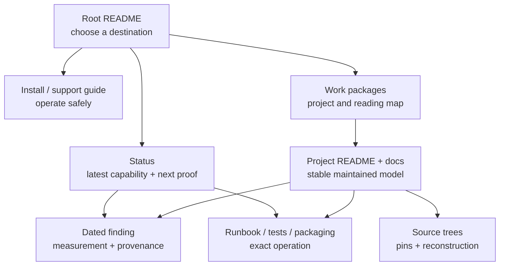

# Proposal: make the repository easier to read, navigate, and maintain

> **Status:** draft for discussion, 2026-08-05
>
> **Scope:** documentation and evidence organization in `rock-5b-ysp`
>
> **Authority:** this is a proposal, not the current repository contract.
> [`CONTRIBUTING.md`](../CONTRIBUTING.md) remains authoritative until a later
> change explicitly adopts parts of this proposal.

## Executive proposal

Organize the repository around one rule:

> **One mutable assertion has one maintained owner. Multiple immutable,
> dated observations may support it. Other documents may summarize the
> assertion for a distinct audience, but they link to its owner instead of
> maintaining another mutable copy.**

This distinction is load-bearing. A current package verdict, intended build
pin, or next gate is a mutable assertion. A dated board run, source inspection,
or upload transcript is an immutable observation. Consolidation should reduce
competing mutable assertions without forcing independent evidence into one
mega-record or making historical reconstruction depend on Git archaeology.

The repository should keep its evidence-backed character and its useful
learning material. The cleanup should not flatten everything into one giant
manual or delete repetition merely because two pages discuss the same subject.
It should remove competing copies of moving facts, clarify the role of every
major document, and give each reader a short route to the information they
need.

The proposed target has seven document roles:

1. **Front doors** route readers without carrying detailed state.
2. **Status** states the latest public capability, boundary, and next proof.
3. **Findings** preserve dated observations and experiment evidence.
4. **Project documentation** owns stable technical explanations.
5. **Runbooks and package recipes** own exact operations and artifact creation.
6. **Source maps** own pins and reconstruction, not validation history.
7. **Teaching guides** explain concepts for a deliberate audience without
   becoming another status or source-pin ledger.

The migration should proceed in reviewable slices. It should preserve links
with stable anchors and evidence-preserving promotion markers, avoid mass
renames, and add reporting before new hard lint rules.

## Why change is needed

The repository already has the right high-level lifecycle in
[`CONTRIBUTING.md`](../CONTRIBUTING.md): observations enter through findings,
mature explanations move to project docs, public state rolls up into status,
and external drift belongs in a watchlist. The problem is that recent work has
often updated every related page at once, turning summaries into parallel
sources of truth.

The current scale makes that expensive. The following 2026-08-05 snapshot is
reproducible with `git ls-files '*.md'`, `git ls-files '*README.md'`, and
`find findings -maxdepth 1 -type f -name '20??-??-??-*.md'`:

- 428 tracked Markdown files include the root README and 77 nested `README.md`
  front doors;
- 187 top-level dated findings record the evidence history;
- [`status.md`](../status.md) is 903 lines;
- [`source-trees.md`](source-trees.md) is 845 lines;
- [`packaging/ppa/README.md`](../packaging/ppa/README.md) is 622 lines; and
- rewrite validation state is spread across an index, a plan, a gap audit, a
  conformance guide, a runbook, project status, findings, and the dashboard.

Line count is not itself the problem. These documents are hard to maintain
because they mix roles:

- exact commit IDs, package versions, publication state, test counts, and open
  gates appear in several files;
- a source-pin map also carries implementation history and runtime verdicts;
- project front doors contain long release ledgers that duplicate status and
  findings;
- dated audits continue receiving live addenda instead of becoming frozen
  evidence;
- plans, validation indexes, and runbooks each describe the same execution
  sequence; and
- resolved findings sometimes continue as mutable competing explanations after
  their durable explanation has moved elsewhere.

This creates three practical failures:

1. **Drift:** two plausible pages disagree about the current version or gate.
2. **Poor re-entry:** a reader must scan chronology before reaching the present
   boundary or the next command.
3. **High update cost:** closing one gate requires editing many files, which
   encourages still more copied prose.

## Goals

The cleanup should make these outcomes true:

- A newcomer can find the supported install path, safety boundary, and first
  verification command without reading developer history.
- A returning maintainer can find the current state and next proof before
  reading the evidence that produced them.
- A developer can find one maintained explanation for a subsystem, then follow
  links to dated evidence or runnable tests.
- A package maintainer can distinguish build inputs, publication state, upload
  chronology, and runtime qualification without reconciling several tables.
- Kernel, library, application, and packaging projects use a recognizable
  documentation structure, evidence vocabulary, and validation-result format.
- Updating a moving fact normally changes one canonical document and, when
  public state changes, one compact status/ledger pair.
- Historical evidence remains reconstructible after consolidation.
- Repository checks identify likely duplication and stale ownership before it
  becomes a correctness problem.

## Non-goals

This proposal does not aim to:

- reduce the repository to a minimal set of documents;
- remove newcomer explanations, developer teaching modules, or useful safety
  warnings;
- merge all project documentation into `docs/`;
- rewrite technical content merely to make files shorter;
- erase incident chronology or measured evidence;
- move or delete existing external source, ignored scratch, or build workspaces
  as part of this documentation migration; or
- change the public/private security boundary defined in
  [`CONTRIBUTING.md`](../CONTRIBUTING.md#what-does-not-belong-here).

Workspace hygiene still needs an explicit follow-up. New build state remains
subject to [`AGENTS.md`](../AGENTS.md#build-workspace): it belongs under
`../rock-5b/build/`, not in this repository. Phase 0 should record any existing
ignored in-repository build/scratch roots for a separate operator-approved
cleanup; this proposal does not authorize moving or deleting them.

## The target information architecture

### Reader flow

The root README should answer “where do I start?” It should not answer every
question itself. `work-packages.md` should own the detailed project taxonomy and
reading paths. Project front doors should answer what the layer owns, its proven
boundary, where the maintained mechanism lives, and what proof comes next.

### Canonical roles

| Information | Definitive owner | What other pages may contain | What other pages should not copy |
|-------------|------------------|------------------------------|----------------------------------|
| Public capability and material boundary | `status.md` dashboard | A one-line link from a front door | Build fingerprints, case-by-case results, chronology |
| Next proof | `status.md` next-gate row for tracked work; project plan for the full ladder | A link naming the gate | A second multi-step backlog |
| Dated cross-track audit summary | `docs/status-ledger.md` | Dashboard link | Full finding contents or package upload transcript |
| External facts that can drift silently | The external service or remote is authoritative; the `status.md` watchlist owns the dated observation, recheck recipe, and freshness boundary | A link or stable warning | An undated claim that the cached observation is live now |
| Fresh observation or experiment | One dated finding | Index title and curated trail link | A second finding summarizing the same run |
| Stable technical explanation | Owning project's `docs/` | Audience-specific summary with a link | Moving pins, publication state, repeated test ledger |
| Immutable source snapshot used by documentation or a comparison | `docs/source-trees.md` | A stable source name and link | Runtime verdict, package state, implementation history, or an unpinned “current branch” claim |
| Intended/default machine build input | The build script or checked-in input manifest | Human explanation of the variable and why it matters | Independently maintained literal pin tables |
| Actual input used for a particular artifact | Generated build manifest, source package metadata, `.buildinfo`, or equivalent retained evidence | A link plus the human-readable artifact identity | An inference from a changelog version or script default |
| Installed and runtime-qualified artifact | One or more dated findings; `status.md` owns only the public rollup | A compact project link to the rollup | A claim that publication alone proves installation or runtime behavior |
| PPA publication observation | Launchpad is authoritative; `status.md` W05 owns the last-checked query result and freshness boundary | User-facing statement that the normal archive is the supported channel | Publication IDs or matrices presented as timeless/live repository truth |
| Upload chronology | `packaging/ppa/history/` | Link from package documentation | Repeated chronological narrative in current-state docs |
| Exact operational command | Owning runbook, test README, or package README | A short first-use example for a different audience | Forked copies of recovery or destructive procedures |
| Whole-board evidence scope | `docs/support-coverage.md` | Status/project link to the coverage row | Live validation chronology |
| Shared vocabulary | `glossary.md` | Brief local reminder where needed | Repeated full definitions |

### Front-door contract

Each project `README.md` should stay a front door, not grow into a history book.
Near the top it should answer:

1. What does this project own?
2. What can a user or developer do with it?
3. Where does the latest proven boundary live? Use stable routing language and
   link status or a finding; do not copy mutable versions, counts, or verdicts.
4. Which maintained document explains the mechanism?
5. Which runbook or test performs the next useful operation?

A front door may list its files and provide one quick example. Detailed
architecture, long procedures, validation chronology, and release history
belong in the linked owners. A brief boundary sentence is acceptable only when
it remains useful without changing alongside the linked status row; otherwise
it is another mutable copy.

The current discoverability check requires the nearest README to name every
tracked document and tool. Busy project and test directories cannot stay useful
front doors if that requirement produces an enormous inline inventory. Before
shortening those READMEs, Phase 0 must choose and teach one supported escape
hatch: a linked subordinate README, a generated inventory, or a smaller nested
directory front door. The consistency check must recognize that mechanism; a
cleanup must not trade readability for invisible entry points.

### Cross-project consistency contract

Canonical ownership solves drift; a shared document shape makes the canonical
owner easier to recognize and use. Kernel drivers, vendor libraries, video
libraries, applications, and packages should use the same concepts in roughly
the same order even when their technical depth differs.

This is consistency of interface, not forced uniformity. An RGA memory guide,
an FFmpeg build recipe, and a GNOME Remote Desktop architecture document should
not contain identical sections. A reader should nevertheless be able to find
scope, evidence, boundaries, operations, and related material in predictable
places.

#### Project README pattern

Every project front door should use this common order where applicable:

1. **Outcome and scope** — what the project enables and what it does not own.
2. **Project brief** — user outcome, developer focus, owned material,
   dependencies, external source location, and a stable current-boundary route.
3. **Entry points** — a compact file/doc/runbook/test index.
4. **Technical model** — the shortest useful architecture summary, linking the
   maintained deep explanation.
5. **Build or operate** — the primary path, or a link to its runbook.
6. **Validate** — the canonical test entry point and the kind of evidence a
   pass establishes.
7. **Boundaries and next proof** — stable limitations plus links to the live
   status row or plan; no copied backlog.
8. **Related layers** — explicit upstream and downstream project links.

Not every README needs all eight headings. The same information should use the
same names and order when it is present. Category hubs can remain indexes rather
than pretending to be projects.

#### Technical explanation pattern

A maintained architecture or mechanism document should make these items easy
to locate:

- scope and intended reader;
- result or model first;
- source/pin owner for code-dependent claims;
- mechanism and interfaces;
- evidence level (`MEASURED`, `CODE-INSPECTED`, `SOURCE-CONFIRMED`, `INFERRED`,
  or `UNVERIFIED` as appropriate);
- known boundary and rejected interpretations; and
- links to operations, current status, and dated evidence.

It should not embed a moving release ledger merely to show that the mechanism
was exercised once.

#### Runbook pattern

Build, install, recovery, and validation runbooks should consistently present:

1. purpose and risk;
2. prerequisites and authority level;
3. exact input/artifact identity;
4. commands in execution order;
5. pass and fail signals;
6. cleanup or rollback;
7. evidence to retain; and
8. the owner of the next decision.

This makes destructive and root-required procedures reviewable across projects
without copying the commands into multiple guides.

#### Plan and audit pattern

Live plans should use a common shape: objective, non-goals, current gap pointer,
phases, dependencies, risks, and definition of done. Dated audits should use:
date, scope, inspected pins, trust level, result, findings, and final
disposition. An audit marked frozen must link to the live plan or status rather
than receiving current-state addenda.

“Frozen” does not forbid correction. A typo or factual correction gets an
explicit dated erratum without silently rewriting the observed result; a
material reinterpretation gets a new finding or superseding audit linked from
the original.

#### Validation-result pattern

Whenever a project records a build or runtime result, use the same evidence
fields whether the subject is a kernel, library, application, or package:

| Field | Question answered |
|-------|-------------------|
| Date | When was this exact state checked? |
| Identity | Which board, kernel, source, package, config, and artifact were exercised? |
| Command/workload | What exactly ran? |
| Expected signal | What would constitute a pass or a meaningful failure? |
| Result | What happened, including counts only when they aid reconstruction? |
| Logs/artifacts | Where is the retained evidence or reconstruction path? |
| Trust | Was the claim measured, inspected, inferred, or left unverified? |
| Boundary | What does this result not establish? |

The fields may be prose, a table, or a finding header; the semantic contract is
the same. This will make results from MPP, librga, FFmpeg, VA-API, Mesa, GRD,
kernel packages, and boot firmware comparable without pretending their tests
are interchangeable.

For a build or package result, **Identity** must distinguish the intended/default
input from the retained manifest or metadata for the artifact actually built or
exercised. A script default, changelog version, publication record, installed
package, and runtime-qualified binary are different identity claims.

#### Shared naming and style

- Use `README.md` for a directory front door, `docs/` for maintained
  explanations, and the owning `scripts/` or `tests/` README for operations.
- Use the same layer names defined by the project taxonomy and glossary.
- Define cross-cutting terms in `glossary.md`; keep local terms in
  `keywords.md` without recreating a second glossary.
- Lead with the result, separate current from historical state, use exact dates
  for evidence, and reserve “current” for a linked dated owner.
- Use “boundary” for what evidence does not establish and “next proof” for the
  smallest result that advances the work. Avoid a mix of “TODO,” “remaining,”
  “open,” “roadmap,” and “next steps” sections that all carry partial backlogs.

After acceptance, add small templates for a project README, technical
explanation, runbook, live plan, and dated audit. The templates should live in
one documented location and illustrate these contracts without making every
document mechanically identical.

### Status contract

Keep the dashboard and ledger pairing, but make their distinction stronger:

- A **dashboard row** contains the latest proven capability and one material
  boundary. It should be readable without decoding build hashes.
- A **next-gate row** names only the smallest proof that materially advances the
  track. Later phases live in the linked plan.
- A **ledger row** records the exact current identity, evidence basis at summary
  level, and unresolved boundary. It is not a copy of the full finding.
- A **watchlist item** exists only when the fact can change without a commit to
  this repository. Closed defects, internal test gaps, and stable decisions are
  retired without renumbering the remaining IDs.

The dashboard and ledger are a deliberate field-level partition, not two
canonical owners of the same prose: the dashboard owns the public capability;
the ledger owns exact identity and the compact audit basis. Their stable track
ID, name, and verification date agree, but neither should retype the other's
payload.

Every watchlist detail must say which external system is authoritative, how to
recheck it, when the last successful check ran, and when the cached observation
should be treated as stale or unknown. “Live” means observed live on that exact
date, not guaranteed live when a later reader opens the file. Retiring a W-item
leaves its `#watch-wNN` anchor and a short dated successor/tombstone; old
findings and external links must not be rewritten merely to hide the retirement.

This makes status a reliable re-entry point instead of a second technical
manual.

### Evidence contract

Findings should remain numerous and dated; that is useful evidence, not clutter.
The cleanup applies a revised lifecycle consistently:

- capture a new result once;
- link it from relevant status or project docs;
- promote the stable explanation when it matures;
- freeze the original observation in place with a distinct promoted-explanation
  banner, or move its complete immutable evidence into a durable evidence
  bundle before reducing the finding to a tombstone; and
- keep the chronological index entry so historical links survive.

A finding should not be promoted merely because it is old. It should be
promoted when another maintained document carries its useful mechanism,
evidence boundary, and any still-relevant next proof.

This deliberately revises the current content-replacing tombstone convention
when the target is a mutable maintained guide. A bare tombstone is sufficient
only when the target or retained bundle preserves the exact dated identity,
command, result, trust classification, and boundary. The tombstone records a
stable target anchor and the promotion commit so reconstruction does not depend
on guessing through Git history. One experiment still gets one finding; a
current verdict may cite the smallest set of independent findings that supports
it.

The promoted-explanation banner must not be confused with the existing bare
`promoted →` tombstone marker. Phase 0 must update the finding/topic-index
contract and checker to distinguish a frozen full finding from a content-free
tombstone before the first such promotion lands.

### Plans, audits, and runbooks

These three document types need explicit separation:

- A **plan** defines future phases, dependencies, and definition of done. There
  should be one canonical plan entry point per sustained workstream; it may
  delegate to explicitly scoped child plans rather than becoming a mega-plan.
- A **dated audit** records what an inspection found at that time. It becomes
  frozen after corrections and links to the live plan/status for current work.
- A **runbook** provides exact executable steps, prerequisites, pass/fail
  signals, cleanup, and recovery. It should not maintain a competing project
  backlog.

Validation indexes should route readers to the right plan, runbook, test, and
latest evidence. They should not restate every matrix and gap.

Likewise, a workstream needs one canonical operational entry point, not
necessarily one command document. The entry point may delegate to generic,
flavor-specific, privileged, or private-security runbooks whose scopes are
materially different.

## Duplication to preserve deliberately

Not all repetition is waste. Preserve it when the audience or safety need is
genuinely different:

- The newcomer PPA guide may explain packages and application verification in
  plain language even though developer package docs describe the mechanism.
- Teaching guides may restate foundational concepts before leading into a
  subsystem, but should link deep internals and omit moving state.
- A destructive-operation warning may appear both at the decision point and in
  the canonical runbook.
- A project front door may provide stable routing context for a status verdict
  in one sentence, without copying its mutable literals or state.
- The dashboard and ledger intentionally describe the same track at different
  resolution.
- A dated finding and a stable project model may coexist permanently as
  immutable evidence and maintained explanation. After promotion, the finding
  is frozen and marked promoted; it becomes a tombstone only when its exact
  dated evidence is durably retained elsewhere.

The test is not “does this sentence appear twice?” The test is “would these two
copies reasonably change on different schedules for different readers?” If the
answer is no, one should be a link.

## Proposed decisions for current hotspots

| Area | Proposed definitive split | Consolidation action |
|------|---------------------------|----------------------|
| Root navigation | Root README = short task router; `work-packages.md` = taxonomy, stack diagram, and reading paths | Remove detailed maps or commands that compete with those owners; keep one-line category summaries. |
| Status and watchlist | Dashboard = public verdict; ledger = exact audit note; external service = authority; watchlist = dated observation/recheck cache | Retire resolved/internal W-items behind stable anchor tombstones, keep rows compact, and route detailed evidence to findings/projects. |
| `source-trees.md` | Immutable documentation/comparison pins, relationships needed to interpret them, and reconstruction commands | Remove package publication, runtime results, feature inventories, commit-by-commit project history, and unpinned “current branch” claims. |
| Rewrite validation | `rewrite-validation-plan.md` = canonical plan entry; `tests/rewrite-conformance.md` = operational entry delegating to the kernel/private runbooks; findings = individual runs; `validation-index.md` = router | Freeze the dated gap audit under the erratum/supersession policy, remove live addenda, and delete duplicated state/gap ladders from the index and architecture guide. |
| Forward-port state | Patch README = mechanical order; patch catalog = provenance/backport; status = current public boundary; findings = campaigns | Replace the long forward-port status/history document with a concise capability scorecard and links, or retire it after callers are migrated. |
| PPA documentation | Build script/checked-in manifest = intended inputs; retained artifact manifest = actual inputs; PPA README = archive topology and package mechanics; Launchpad = publication authority; W05 = dated publication observation; history = uploads; PPA support = newcomer operation | Remove timeless “live” publication matrices and validation chronology from the PPA README; keep ABI/co-installability and build procedure. |
| Userspace patch map | `build-source-packages.sh` = pins it actually owns; `userspace-patches.md` = fork/quilt policy and maintenance traps | Remove live PPA state and literal package-version columns; link source reconstruction and publication owners. |
| FFmpeg branches | Remote = moving branch head; watchlist = dated head observation when needed; `source-trees.md` = immutable citation pins; rebase docs = roles/history; comparison docs = frozen measured pins | Stop describing a literal tip as “current” in several project pages. |
| VA-API and applications | VA-API README = durable capability policy; architecture = mechanism; app map = consumer compatibility; status = dated browser/package verdict | Remove release chronology and duplicated next-gate lists; leave stable successor stubs for superseded closure plans. |
| Mesa | Remote service = MR authority; W06 = dated MR/rebase observation; validation doc = test chronology; review doc = findings; README = project front door | Remove duplicate MR tables and long dated lifecycle from the README. |
| Support coverage | Stable scope, owner, and first missing evidence | Remove package versions, test counts, and incident chronology from coverage rows. |
| Mature findings | Owning project doc = maintained explanation; finding or evidence bundle = immutable dated observation | Run a promotion sweep that freezes and marks findings, using tombstones only after exact evidence is retained elsewhere. |
| Cross-library teaching | Combined guide = layer model and end-to-end flow; project guides = internals | Keep the different audience, but replace duplicated internal chapters with directed links. |
| Project consistency | Shared README, explanation, runbook, plan, audit, and validation-result contracts | Normalize section purpose, evidence language, and link direction across kernel, library, application, and packaging projects without forcing identical depth; support subordinate/generated inventories for large directories. |

## Migration plan

### Phase 0 — inventory, pilot, and agree on roles before moving text

Do not begin with templates or a broad rewrite. First create a temporary,
tracked `docs/repository-organization-migration.md` ledger. Give every migration
slice an ID and record:

- document and current role;
- each mutable assertion it carries and the proposed owner;
- immutable observations that must remain directly reconstructible;
- duplicate locations and their keep/link/freeze/remove disposition;
- inbound file/heading/W-ID anchors and the compatibility action;
- public/private security-boundary review when the slice touches kernel safety,
  fuzzing, reproducers, or upstream-submission material; and
- validation status and commit.

The ledger is the resumable execution state that ordinary commit history cannot
provide. It is temporary: after every row closes, replace it with a short dated
closure summary and keep the accepted proposal as the design decision.

Generate the proposed duplication/owner report now as informational baseline,
before deleting copies. Record its exact command and summary counts so the
closure report can demonstrate improvement. Also inventory existing ignored
in-repository build/scratch roots for a separate, operator-approved workspace
cleanup; do not move or delete them in this migration.

Next, define compatibility rules before changing structure:

- retired stable IDs keep tombstone anchors;
- externally visible headings remain stable or retain explicit old anchors;
- dated findings are not rewritten merely to point around a retired ID;
- large directories use one agreed subordinate/generated inventory mechanism;
  and
- every relevant slice explicitly rechecks the public/private security boundary.

Then run one vertical pilot across intended source input, actual artifact
identity, external publication observation, installed/runtime evidence, and the
public status rollup. Measure the number of files that must change, confirm the
reader route still works, and adjust the role table from the result. Only after
the pilot should the final rules be folded into `CONTRIBUTING.md` and small
templates be created for a project README, technical explanation, runbook,
live plan, and dated audit. Templates capture the tested interface; they are not
authorization for mechanical bulk rewrites.

Exit gate:

- every major document type has one agreed role;
- intentional audience-specific duplication is named;
- the migration ledger, baseline report, compatibility policy, and one vertical
  pilot exist;
- the pilot proves actual artifact identity can be reconstructed separately
  from intended inputs and external state; and
- no cleanup commit is justified only by line-count reduction.

### Phase 1 — clean status and the watchlist

1. Review every dashboard/ledger pair for capability-versus-detail separation.
2. Reduce every next gate to one advancing proof.
3. Classify every watchlist entry as external drift, stable project state,
   resolved history, or active internal work.
4. Retire entries outside the external-drift class behind stable `#watch-wNN`
   tombstones; repoint maintained summaries without rewriting dated findings.
5. Move unique history to a finding or owning project before deletion.
6. Add authoritative service, exact recheck recipe, last-success date, and
   freshness/unknown behavior to every surviving watchlist detail.

Exit gate:

- a status-only reader can understand every track quickly;
- the ledger contains exact identity without copying entire findings;
- every remaining W-item can change without a repository commit, identifies
  the external authority, and has an executable recheck path; and
- every retired W-ID still resolves to its successor or dated disposition.

### Phase 2 — separate source, package, and publication truth

1. Cut `source-trees.md` down to pins and reconstruction.
2. Make build scripts/checked-in manifests authoritative for intended/default
   machine inputs they own.
3. Retain a generated manifest or equivalent package metadata for the actual
   inputs of each artifact whose identity supports a verdict.
4. Treat Launchpad as authoritative and make W05 own the dated query result,
   recheck recipe, and freshness boundary.
5. Keep PPA upload chronology only in `packaging/ppa/history/`.
6. Simplify the PPA README to topology, package shape, build, signing, upload,
   co-installability, and migration mechanics.
7. Simplify `userspace-patches.md` to delta ownership and maintenance policy.

Exit gate:

- one lookup answers “what input is intended by default?”;
- one retained record answers “what exact input produced this artifact?”;
- one lookup answers “what did the external service report, when, and how can I
  recheck it?”;
- one lookup answers “how was it uploaded?”

### Phase 3 — consolidate validation workstreams

Start with rewrite validation, then apply the pattern to forward-port, VA-API,
Mesa, FFmpeg, and GRD:

1. Choose one canonical plan entry point and name any legitimately scoped child
   plans.
2. Freeze dated audits.
3. Choose one canonical operational entry point and let it delegate to generic,
   flavor-specific, privileged, or private runbooks as needed.
4. Keep each run in one finding; let the status rollup cite the smallest set of
   independent findings that supports the current verdict.
5. Turn validation indexes into navigation tables.
6. Remove moving source tips from teaching and architecture documents.

Exit gate:

- each workstream has one plan entry point, one operational entry point, and one
  current public verdict, without forbidding scoped child documents;
- an audit can be read historically without pretending to be current; and
- validation results are not retyped into architecture guides.

### Phase 4 — standardize project documentation and promote findings

For each project:

1. Map the existing front door to the common project README pattern.
2. Normalize terminology, evidence labels, boundary language, and link direction.
3. Preserve old heading anchors when normalization would break stable links.
4. Move long mechanism prose into a maintained project document where needed.
5. Bring runbooks, plans, audits, and recorded validation results into their
   shared semantic contracts without erasing project-specific detail.
6. Move dated histories to findings or existing validation history pages.
7. Replace literal moving pins and versions with links.
8. Identify findings whose maintained explanation is ready for promotion.
9. Freeze and mark those findings as promoted. Use a tombstone only when a
   retained target/bundle preserves their exact evidence fields, and update
   topic counts according to the accepted lifecycle.

Exit gate:

- every project can be oriented from its README without scanning chronology;
- equivalent information is named and ordered consistently across projects;
- every project-specific doc is discoverable from that README;
- large directories remain completely inventoried without turning their front
  door into an unreadable file list; and
- no promoted finding competes as a maintained explanation, while its dated
  observation remains directly reconstructible.

### Phase 5 — improve navigation after consolidation

Preserve working routes during every earlier slice. After canonical owners are
stable, perform a final navigation pass:

1. Review the root task router for the most common user and maintainer goals.
2. Review `work-packages.md` for complete project and reading paths.
3. Remove redundant navigation tables elsewhere.
4. Add missing “see current status,” “see maintained model,” and “run this” links
   to project front doors.
5. Check that key answers are reachable in at most two deliberate hops from the
   root README or the relevant project README.

Exit gate:

- newcomers, operators, maintainers, and subsystem developers each have a
  clear entry route; and
- adding another index would not make a common task easier.

### Phase 6 — add lightweight enforcement

The informational report begins in Phase 0. Mature it before adding blocking
rules:

1. Tune the baseline documentation-duplication report that finds identical long
   sentences, highly similar normalized paragraphs, repeated version/SHA
   concentrations, and “current/as of” language outside designated owners.
2. Run it in the repository check as informational output and classify false
   positives.
3. Add targeted blocking assertions only for high-risk facts with known owners,
   such as packaging pins, artifact-manifest identity, and public installer
   versions. Prefer these structured owner checks over similarity scores.
4. Add consistency checks for promoted/frozen findings, evidence-preserving
   tombstones, retired W-ID anchors, and live watchlist entries whose reason is
   not external drift.
5. Report missing project-brief concepts and inconsistent validation-result
   fields before deciding whether any should become blocking checks.
6. Keep judgement-heavy prose rules in review guidance rather than encoding
   arbitrary style limits.

Exit gate:

- the report is useful enough to catch real drift without training maintainers
  to ignore it;
- high-risk literal pins have explicit owners; and
- `bash scripts/check-repo.sh` remains the single handoff command.

## How to execute safely

Use small, ownership-based commits rather than a repository-wide rewrite:

- one status/watchlist slice;
- one source-pin/package-publication slice;
- one validation workstream at a time;
- one project front door at a time; and
- one findings-promotion batch at a time.

For every slice:

1. Open or update its migration-ledger row and name the maintained owner for
   every mutable assertion before deleting a copy.
2. Map every unique identity, command, trust classification, result, and
   boundary to retained immutable evidence.
3. Replace deleted prose with a useful link, not a vague “see elsewhere.”
4. Preserve dated history in a frozen finding, evidence bundle, or package
   history; do not rewrite a historical finding merely to repair navigation.
5. Preserve retired IDs and externally visible heading anchors with a useful
   successor/disposition stub.
6. Update the nearest README or its accepted subordinate/generated inventory
   for any added, moved, or removed file.
7. If the slice touches kernel safety, fuzzing, reproducers, or upstream work,
   recheck the public/private boundary in `CONTRIBUTING.md` explicitly; the
   ordinary repository check does not prove content is safe to publish.
8. Review the semantic before/after mapping, search for inbound links and stale
   anchors, and record the result in the ledger.
9. Run `bash scripts/check-repo.sh`.

Avoid mass file moves early. Git history already preserves old paths, but stable
in-repo links and reader muscle memory are more valuable than a cosmetically
perfect directory tree. Move a file only when ownership is genuinely wrong and
the new location makes its front door clearer.

## Success criteria

The cleanup is complete when all of the following are true:

### Canonicality

- Every mutable package version, intended input, public verdict, and next gate
  has one named maintained owner.
- Immutable documentation pins, intended inputs, actual artifact inputs,
  external publication observations, installed artifacts, and runtime verdicts
  are classified separately.
- External services remain authoritative for their own state; repository
  watchlist entries are dated caches with recheck and freshness rules.
- No project README or architecture guide maintains a second live publication
  ledger.
- Every sustained workstream has one canonical plan and operational entry point;
  any child plan/runbook has an explicit non-overlapping scope.
- Dated audits are frozen and point to current state rather than receiving live
  addenda.
- Every retired stable ID and renamed externally visible heading still resolves.

### Readability

- Dashboard rows state capability plus boundary without incident chronology.
- Next-gate rows state one proof.
- Project front doors answer the five front-door questions near the top.
- Front doors use stable status routes rather than copied mutable verdicts.
- Comparable project front doors, runbooks, plans, audits, and validation
  records use the shared concepts and terminology.
- Large directories remain completely inventoried through an accepted
  subordinate/generated index without overwhelming their front door.
- Source maps, coverage inventories, and indexes contain only information that
  serves their declared role.

### Findability

- The root README routes the common tasks.
- `work-packages.md` owns detailed reading paths.
- Every maintained project explanation, runbook, and tool is reachable from its
  nearest README.
- A reader can move from current verdict to evidence, or from mechanism to
  runnable test, through explicit links.
- The newcomer install/safety/first-verification route, maintainer
  state/next-proof/evidence route, package intended-input/artifact/publication
  route, and developer model/runbook route are each walked and recorded at
  closure; key answers remain within two deliberate hops of the root or relevant
  project front door.

### Evidence preservation

- No unique command, trust classification, boundary, or measured result is lost.
- Promoted findings remain frozen readable evidence, or use a standard tombstone
  only when a stable target/bundle preserves their exact dated evidence; all
  remain in the chronological index.
- Package upload history remains available without appearing in current-state
  documents.

### Maintenance cost

- Sampled post-pilot gate updates change the evidence owner and, only when the
  public verdict changes, the compact dashboard/ledger pair; they do not require
  unrelated front-door, architecture, source-map, or package-history edits.
- High-risk moving facts are covered by targeted consistency checks.
- The baseline and closure reports show zero known conflicting owners for
  high-risk moving literals; similarity-report changes and accepted exceptions
  are recorded rather than treated as an unexplained score.
- Every migration-ledger row is closed before the ledger becomes a dated closure
  summary.
- The full repository handoff gate passes after every slice.

## Recommended first implementation batch

After this proposal is accepted, the first batch should establish and test the
pattern without touching every hotspot:

1. Create the temporary migration ledger and record the reproducible structural
   and duplication/owner baseline.
2. Record the compatibility policy, artifact-identity classes, representative
   reader journeys, and public/private review field in that ledger.
3. Select one package with a reconstructible source and runtime record, then map
   one vertical chain: intended build pin → actual artifact manifest → dated
   Launchpad observation → installed/runtime finding → public status rollup.
4. Consolidate only that chain, retaining old anchors and immutable evidence.
5. Measure update fan-out, replay the package and reader lookups, run the full
   repository check, and record what the pilot exposed.
6. Refine the contract from the pilot, fold the accepted rules into
   `CONTRIBUTING.md`, and only then add the shared templates.

Status/watchlist cleanup, broad `source-trees.md` and PPA consolidation, rewrite
validation, and FFmpeg branch cleanup become separate later batches with a stop
and review point between them. This keeps the first implementation genuinely
low-ambiguity while preserving the newcomer guide, teaching modules, package
history, stable links, and dated evidence.
