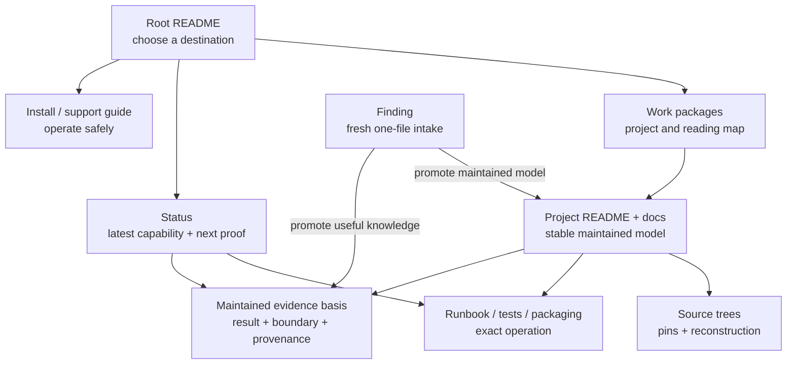

# Proposal: make the repository easier to read, navigate, and maintain

> **Status:** implemented and retired, 2026-08-06
>
> **Scope:** documentation and evidence organization in `rock-5b-ysp`
>
> **Authority:** this is the historical design and completion record, not the
> current repository contract. [`CONTRIBUTING.md`](../CONTRIBUTING.md) and the
> named project/status/package owners are authoritative.

## Implementation outcome

The proposal was executed in handoff-gated slices from baseline commit
`a6f9d05ff389b1f11b0c28efb2e7f1f3ddbb5831`. The final organization has one
compact root task router, one detailed work-package map, project-local front
doors, direct dashboard evidence/action routes, a source map limited to
identity and reconstruction, and a live findings inbox with no promotion
tombstones. Useful observations moved into project, package, runbook, test, or
status owners; temporary promoted evidence moved with them.

The baseline 430-Markdown/188-finding inventory finishes at 367 maintained
Markdown files and 116 live dated findings. All five maintained
`findings/evidence/` bundles have an active finding owner. The informational
owner report runs inside the sole handoff gate, while structured checks block
only proven high-risk owner drift and lifecycle violations. The temporary
migration ledger was removed after every slice closed; Git history retains its
per-slice mappings, reader replays, security reviews, and validation records.
The final `bash scripts/check-repo.sh` handoff gate passed on 2026-08-06 across
367 Markdown files, 3,431 local links, 495 anchors, all 67 regression tests,
the informational owner report, ShellCheck, documentation consistency, and
whitespace.

## Executive proposal

Organize the repository around one rule:

> **One mutable assertion has one maintained owner. Multiple dated
> observations may support it. Other documents may summarize the
> assertion for a distinct audience, but they link to its owner instead of
> maintaining another mutable copy.**

This distinction is load-bearing. A current package verdict, intended build
pin, or next gate is a mutable assertion. A dated board run, source inspection,
or upload transcript is an observation. A finding is the temporary capture
record for such an observation, not its permanent archive. Consolidation should
reduce competing mutable assertions without forcing independent evidence into
one mega-record; evidence that remains useful is promoted into the durable
owner appropriate to its role.

The repository should keep its evidence-backed character and its useful
learning material. The cleanup should not flatten everything into one giant
manual or delete repetition merely because two pages discuss the same subject.
It should remove competing copies of moving facts, clarify the role of every
major document, and give each reader a short route to the information they
need.

The repository accumulates useful knowledge, not proof that work happened. A
date or commit belongs when it bounds a claim, identifies the source or artifact
actually exercised, distinguishes evidence that no longer carries forward, or
enables reproduction. It should not organize a maintained explanation merely
because investigation happened in that order. Promotion keeps the durable
result, mechanism, boundary, and decisive evidence while dropping routine work
chronology.

The proposed target has seven document roles:

1. **Front doors** route readers without carrying detailed state.
2. **Status** states the latest public capability, boundary, and next proof.
3. **Findings** provide a temporary, one-file inbox for dated observations and
   experiment evidence.
4. **Project documentation** owns stable technical explanations.
5. **Runbooks and package recipes** own exact operations and artifact creation.
6. **Source maps** own pins and reconstruction, not validation results.
7. **Teaching guides** explain concepts for a deliberate audience without
   becoming another status or source-pin ledger.

The migration should proceed in reviewable slices. It should update maintained
routes as findings are promoted, avoid mass renames, and add reporting before
new hard lint rules.

## Why change is needed

The repository already has the right high-level lifecycle in
[`CONTRIBUTING.md`](../CONTRIBUTING.md): observations enter through findings,
mature explanations move to project docs, public state rolls up into status,
and external drift belongs in a watchlist. The problem is that recent work has
often updated every related page at once, turning summaries into parallel
sources of truth.

The current scale makes that expensive. The following 2026-08-05 snapshot is
reproducible with `git ls-files '*.md'`, `git ls-files '*README.md'`, and
`git ls-files 'findings/20??-??-??-*.md'`:

- 428 tracked Markdown files include the root README and 77 nested `README.md`
  front doors;
- 187 tracked top-level dated findings currently occupy the capture inbox;
- [`status.md`](../status.md) is 903 lines;
- [`source-trees.md`](source-trees.md) is 845 lines;
- [`packaging/ppa/README.md`](../packaging/ppa/README.md) is 622 lines; and
- rewrite validation state is spread across an index, a plan, a gap audit, a
  conformance guide, a runbook, project status, findings, and the dashboard.

Line count is not itself the problem. These documents are hard to maintain
because they mix roles:

- exact commit IDs, package versions, publication state, test counts, and open
  gates appear in several files;
- a source-pin map also carries implementation history and runtime verdicts;
- project front doors contain long release ledgers that duplicate status and
  findings;
- dated audits continue receiving live addenda instead of becoming frozen
  evidence;
- plans, validation indexes, and runbooks each describe the same execution
  sequence; and
- resolved findings sometimes continue as mutable competing explanations after
  their durable explanation has moved elsewhere.

This creates three practical failures:

1. **Drift:** two plausible pages disagree about the current version or gate.
2. **Poor re-entry:** a reader must scan chronology before reaching the present
   boundary or the next command.
3. **High update cost:** closing one gate requires editing many files, which
   encourages still more copied prose.

## Goals

The cleanup should make these outcomes true:

- A newcomer can find the supported install path, safety boundary, and first
  verification command without reading developer history.
- A returning maintainer can find the current state and next proof before
  reading the evidence that produced them.
- A developer can find one maintained explanation for a subsystem, then follow
  links to its evidence basis or runnable tests.
- A package maintainer can distinguish build inputs, publication state, upload
  procedure, necessary artifact traceability, and runtime qualification without
  reconciling several tables.
- Kernel, library, application, and packaging projects use a recognizable
  documentation structure, evidence vocabulary, and validation-result format.
- Updating a moving fact normally changes one canonical document and, when
  public state changes, one compact status row plus its direct evidence route.
- Evidence that still supports a maintained explanation or validation basis,
  package identity, or public verdict remains reconstructible after promotion.
- Findings normally leave the inbox after their useful content has been
  promoted; they do not become a permanent parallel archive.
- Maintained explanations lead with accumulated knowledge rather than a diary
  of dates, commits, uploads, and completed work.
- Repository checks identify likely duplication and stale ownership before it
  becomes a correctness problem.

## Non-goals

This proposal does not aim to:

- reduce the repository to a minimal set of documents;
- remove newcomer explanations, developer teaching modules, or useful safety
  warnings;
- merge all project documentation into `docs/`;
- rewrite technical content merely to make files shorter;
- erase a chronology, counterexample, or measured result that remains necessary
  to understand, reproduce, or bound a maintained conclusion;
- retain routine activity chronology merely to demonstrate that work occurred;
- move or delete existing external source, ignored scratch, or build workspaces
  as part of this documentation migration; or
- change the public/private security boundary defined in
  [`CONTRIBUTING.md`](../CONTRIBUTING.md#what-does-not-belong-here).

Workspace hygiene still needs an explicit follow-up. New build state remains
subject to [`AGENTS.md`](../AGENTS.md#build-workspace): it belongs under
`../rock-5b/build/`, not in this repository. Phase 0 should record any existing
ignored in-repository build/scratch roots for a separate operator-approved
cleanup; this proposal does not authorize moving or deleting them.

## The target information architecture

### Reader flow

The root README should answer “where do I start?” It should not answer every
question itself. `work-packages.md` should own the detailed project taxonomy and
reading paths. Project front doors should answer what the layer owns, its proven
boundary, where the maintained mechanism lives, and what proof comes next.

### Canonical roles

| Information | Definitive owner | What other pages may contain | What other pages should not copy |
|-------------|------------------|------------------------------|----------------------------------|
| Public capability and material boundary | `status.md` dashboard | A one-line link from a front door | Build fingerprints, case-by-case results, chronology |
| Next proof | `status.md` next-gate row for tracked work; project plan for the full ladder | A link naming the gate | A second multi-step backlog |
| Cross-project current-state synthesis that has no single project owner | `docs/status-ledger.md` while such synthesis is genuinely needed; retire it if every row can route directly to project/finding owners | A dashboard link | Mandatory one-row-per-track duplication, full finding contents, or package upload transcript |
| Facts that can drift without a repository commit | The relevant remote, service, host, or board is authoritative; the `status.md` watchlist owns the dated observation, recheck recipe, authority kind, and freshness boundary | A link or stable warning | An undated claim that the cached observation is live now |
| Fresh observation or experiment | One dated finding until promotion or discard | Generated index title and current subsystem-inbox link | A second finding summarizing the same run, or an expectation that the finding is permanent |
| Durable learned knowledge or validation basis | The existing maintained project explanation, runbook/test contract, patch catalog, package documentation, or dated audit whose role fits the knowledge | A finding while the result is still in the inbox; a status/project link after promotion | A second maintained chronology, a work diary, or a special promotion document created without a distinct subject |
| Stable technical explanation | Owning project's `docs/` | Audience-specific summary with a link | Moving pins, publication state, repeated test ledger |
| Immutable source snapshot used by documentation or a comparison | `docs/source-trees.md` | A stable source name and link | Runtime verdict, package state, implementation history, or an unpinned “current branch” claim |
| Intended/default machine build input | The build script or checked-in input manifest | Human explanation of the variable and why it matters | Independently maintained literal pin tables |
| Actual input used for a package artifact | Standard source/build metadata such as `.dsc`, `.buildinfo`, `.changes`, source checksums, and output hashes; add a concise package-owned record only where those are insufficient | A link plus the human-readable artifact identity | An inference from a changelog version or script default, or a universal custom manifest requirement |
| Installed and runtime-qualified artifact | A finding while fresh, then the existing project/package owner that absorbs the useful result after promotion; `status.md` owns only the public rollup | A compact project link to the rollup | A claim that publication alone proves installation or runtime behavior |
| PPA publication observation | Launchpad is authoritative; `status.md` W05 owns the last-checked query result and freshness boundary | User-facing statement that the normal archive is the supported channel | Publication IDs or matrices presented as timeless/live repository truth |
| Upload, signing, and recovery method | The PPA package/runbook documentation | A first-use command in the newcomer guide | A chronological “we uploaded X” ledger |
| Past upload or publication event | Retain under `packaging/ppa/history/` only when it preserves otherwise-unavailable artifact identity, explains a material incident, or teaches a reusable operational lesson | A link from the relevant package or incident owner | Routine activity narrative already represented by the artifact record and external service |
| Technical fix/delta inventory | The public owning project patch catalog, fix-candidate document, or equivalent maintained source map | A project/front-door summary | Upstream destination, submission order, send/withhold disposition, or disclosure planning; those remain in the private `rock-5b-security` repository |
| Exact operational command | Owning runbook, test README, or package README | A short first-use example for a different audience | Forked copies of recovery or destructive procedures |
| Whole-board evidence scope | `docs/support-coverage.md` | Status/project link to the coverage row | Live validation chronology |
| Shared vocabulary | `glossary.md` | Brief local reminder where needed | Repeated full definitions |

### Front-door contract

Each project `README.md` should stay a front door, not grow into a history book.
Near the top it should answer:

1. What does this project own?
2. What can a user or developer do with it?
3. Where does the latest proven boundary live? Use stable routing language and
   link status or its maintained evidence owner; do not copy mutable versions,
   counts, verdicts, or temporary finding paths.
4. Which maintained document explains the mechanism?
5. Which runbook or test performs the next useful operation?

A front door may list its files and provide one quick example. Detailed
architecture, long procedures, validation chronology, and release history
belong in the linked owners. A brief boundary sentence is acceptable only when
it remains useful without changing alongside the linked status row; otherwise
it is another mutable copy.

The current discoverability check requires the nearest README to name every
tracked document and tool. Keep that rule. A busy README should put its curated
orientation and primary entry points first, then keep the exhaustive inventory
in a compact **File index** near the bottom. Create a nested directory README
only when the directory represents a real ownership or task boundary, not
merely to hide a long list. The existing consistency check remains the source
of truth for complete discoverability.

### Cross-project consistency contract

Canonical ownership solves drift; a shared document shape makes the canonical
owner easier to recognize and use. Kernel drivers, vendor libraries, video
libraries, applications, and packages should use the same concepts in roughly
the same order even when their technical depth differs.

This is consistency of interface, not forced uniformity. An RGA memory guide,
an FFmpeg build recipe, and a GNOME Remote Desktop architecture document should
not contain identical sections. A reader should nevertheless be able to find
scope, evidence, boundaries, operations, and related material in predictable
places.

#### Project README pattern

Every project front door should use this common order where applicable:

1. **Outcome and scope** — what the project enables and what it does not own.
2. **Project brief** — user outcome, developer focus, owned material,
   dependencies, external source location, and a stable current-boundary route.
3. **Entry points** — a compact file/doc/runbook/test index.
4. **Technical model** — the shortest useful architecture summary, linking the
   maintained deep explanation.
5. **Build or operate** — the primary path, or a link to its runbook.
6. **Validate** — the canonical test entry point and the kind of evidence a
   pass establishes.
7. **Boundaries and next proof** — stable limitations plus links to the live
   status row or plan; no copied backlog.
8. **Related layers** — explicit upstream and downstream project links.

Not every README needs all eight headings. The same information should use the
same names and order when it is present. Category hubs can remain indexes rather
than pretending to be projects.

#### Technical explanation pattern

A maintained architecture or mechanism document should make these items easy
to locate:

- scope and intended reader;
- result or model first;
- source/pin owner for code-dependent claims;
- mechanism and interfaces;
- evidence level (`MEASURED`, `CODE-INSPECTED`, `SOURCE-CONFIRMED`, `INFERRED`,
  or `UNVERIFIED` as appropriate);
- known boundary and rejected interpretations; and
- links to operations, current status, and the maintained evidence basis.

It should not embed a moving release ledger merely to show that the mechanism
was exercised once.

#### Runbook pattern

Build, install, recovery, and validation runbooks should consistently present:

1. purpose and risk;
2. prerequisites and authority level;
3. exact input/artifact identity;
4. commands in execution order;
5. pass and fail signals;
6. cleanup or rollback;
7. evidence to retain; and
8. the owner of the next decision.

This makes destructive and root-required procedures reviewable across projects
without copying the commands into multiple guides.

#### Plan and audit pattern

Live plans should use a common shape: objective, non-goals, current gap pointer,
phases, dependencies, risks, and definition of done. Dated audits should use:
date, scope, inspected pins, trust level, result, decisive evidence, and final
disposition. An audit marked frozen must link to the live plan or status rather
than receiving current-state addenda.

“Frozen” does not forbid correction. A typo or factual correction gets an
explicit dated erratum without silently rewriting the observed result; a
material reinterpretation may begin in a new finding while it is evaluated, but
ends in a superseding audit or maintained correction linked from the original.

#### Validation-result pattern

Whenever a project records a build or runtime result, use the same evidence
fields whether the subject is a kernel, library, application, or package:

| Field | Question answered |
|-------|-------------------|
| Date | When was this exact state checked? |
| Identity | Which board, kernel, source, package, config, and artifact were exercised? |
| Command/workload | What exactly ran? |
| Expected signal | What would constitute a pass or a meaningful failure? |
| Result | What happened, including counts only when they aid reconstruction? |
| Logs/artifacts | Where is the retained evidence or reconstruction path? |
| Trust | Was the claim measured, inspected, inferred, or left unverified? |
| Boundary | What does this result not establish? |

The fields may be prose, a table, or a finding header; the semantic contract is
the same. This will make results from MPP, librga, FFmpeg, VA-API, Mesa, GRD,
kernel packages, and boot firmware comparable without pretending their tests
are interchangeable.

A maintained validation section or document is not an append-only run ledger.
It states the latest evidence basis and material boundary, replacing or
consolidating earlier run detail when that detail no longer changes the
conclusion. Keep an earlier result only when it is a necessary counterexample,
establishes a still-relevant scope boundary, or is needed to reconstruct the
exercised artifact.

For a build or package result, **Identity** must distinguish the intended/default
input from the standard metadata or package-specific provenance for the artifact
actually built or exercised. A script default, changelog version, publication
record, installed package, and runtime-qualified binary are different identity
claims.

#### Promotion evidence and proportional provenance

Promotion is not a move into a special permanent document type. It incorporates
useful knowledge into whichever existing maintained owners fit it: a technical
explanation for mechanism, a runbook or test contract for operation, a patch
catalog or fix-candidate document for source deltas, package documentation for
artifact identity, and status for the public rollup. Create a new maintained
document only when the promoted knowledge forms a coherent durable subject with
no existing owner.

Retain the minimum evidence that licenses the maintained conclusion:

- the exercised source/package/board identity at the specificity the claim
  requires;
- the method, workload, or canonical reproduction route;
- the meaningful pass/fail signal;
- the trust classification;
- the material boundary; and
- a reconstruction pointer when the result depends on an artifact not retained
  in Git.

Do not promote full transcripts, routine intermediate attempts, obsolete test
counts, or every commit in the path to the result unless one is a necessary
counterexample or discriminator.

For Debian packages, prefer the standard `.dsc`, `.buildinfo`, `.changes`,
source checksums, output hashes, and Launchpad identities. Add a concise
package-owned provenance section or record only when those sources cannot
answer a maintained identity question. There is no universal custom manifest
directory or requirement, and findings and `findings/evidence/` never become
manifest stores.

A public technical fix inventory may list affected behavior, patch identity,
provenance, dependencies, and validation state because those facts help maintain
the source. The upstream destination, submission order, send/withhold decision,
and disclosure coordination remain in the private `rock-5b-security`
repository; a public fix catalog must not grow back into that upstreaming
ledger.

#### Shared naming and style

- Use `README.md` for a directory front door, `docs/` for maintained
  explanations, and the owning `scripts/` or `tests/` README for operations.
- Use the same layer names defined by the project taxonomy and glossary.
- Define cross-cutting terms in `glossary.md`; keep local terms in
  `keywords.md` without recreating a second glossary.
- Lead with the result, separate current from historical state, use exact dates
  for evidence, and reserve “current” for a linked dated owner.
- Use dates and commits as provenance fields or discriminators, not as the
  outline of a maintained explanation. Prefer “the mechanism is X, established
  by Y” over “first we did A, then commit B did C.” Keep chronology only when
  order is causal, changes the interpretation, or is required for package or
  incident traceability.
- Use “boundary” for what evidence does not establish and “next proof” for the
  smallest result that advances the work. Avoid a mix of “TODO,” “remaining,”
  “open,” “roadmap,” and “next steps” sections that all carry partial backlogs.

After acceptance, add small templates for a project README, technical
explanation, runbook, live plan, and dated audit. The templates should live in
one documented location and illustrate these contracts without making every
document mechanically identical.

### Status contract

Keep `status.md` compact by linking directly to the project document or live
finding that owns its evidence. Do not move exact identities, case matrices, or
mechanism prose into the dashboard merely because a redundant ledger row is
removed.

- A **dashboard row** contains the latest proven capability and the smallest
  compact set of material user-visible or safety boundaries. It should be
  readable without decoding build hashes. If independent boundaries cannot be
  stated compactly without hiding their significance, split the track instead
  of selecting one arbitrarily.
- A **next-gate row** names only the smallest proof that materially advances the
  track. Later phases live in the linked plan.
- A **status-ledger row**, if retained, exists only for a genuinely cross-project
  current synthesis that has no single project/finding owner. It is not required
  for every dashboard track. If every row can route cleanly to an existing
  owner, retire `docs/status-ledger.md` rather than preserving the file for its
  own sake.
- A **watchlist item** exists only when the fact can change without a commit to
  this repository. Its authority kind is `remote`, `service`, `host`, or
  `board`. Closed defects, internal test gaps, and stable decisions are retired
  without renumbering the remaining IDs.

This keeps the dashboard short without creating a mandatory second rollup. A
status-only reader gets the capability and boundary; a reader who needs exact
identity or evidence follows the direct owner link. Any surviving ledger row
must justify why direct project/finding links cannot express its cross-project
synthesis.

Every watchlist detail must state its authority kind, identify the authoritative
remote, service, host, or board, explain how to recheck it, record when the last
successful check ran, and say when the cached observation should be treated as
stale or unknown. “Live” means observed live on that exact date, not guaranteed
live when a later reader opens the file. Retiring a W-item leaves its
`#watch-wNN` anchor and a short dated successor/disposition. Move active
internal work to the canonical plan or next gate, resolved defects to the
owning explanation or maintained validation section, stable decisions to
project docs, and any still-useful machine observation to the corresponding
host/board owner.

A watchlist detail is a current cache, not a recheck diary. Replace routine
same-result observations rather than appending them. Keep an earlier state only
when the transition changes the interpretation, freshness rule, or required
response; promote any durable lesson before compacting the cache.

This makes status a reliable re-entry point instead of a second technical
manual.

### Evidence contract

Findings are a temporary, dated, one-file capture inbox. They make a newly
learned result cheap to record before its durable role is clear. They are not a
permanent evidence archive and do not acquire manifests or bundles merely
because they exist.

Use this lifecycle consistently:

- capture one observation or experiment in one finding;
- while it is fresh, link it where the result is being evaluated;
- when a maintainer reviews the inbox and judges the finding ready, incorporate
  its still-useful knowledge and minimum supporting evidence into the existing
  maintained owners identified above;
- repoint maintained repository links and current status evidence to that
  durable owner; then
- remove the finding, regenerate the chronological index, and update the curated
  subsystem index. Do not leave a promotion tombstone.

A public status verdict may cite a live finding while it is the clearest evidence
owner. When that finding is promoted, the same promotion change repoints status
and every other maintained repository link before deleting it. If the verdict
itself did not change, this is a routing cleanup rather than a reason to expand
or otherwise rewrite the status prose.

There is no fixed promotion trigger, age threshold, or review schedule.
Maintainers review findings occasionally and decide which are ready, which still
serve active investigation, and which are obsolete. A finding leaves the inbox
when its useful content has a durable owner, or when no maintained claim depends
on it. A falsified result is retained only when the fact that it was ruled out
still matters; in that case promote the falsification and its basis before
removing the finding.

`findings/evidence/` remains available for an exceptional small artifact that
materially helps reproduce an active finding. Use it sparingly. It is temporary
support material, not a permanent archive, manifest store, or promotion target.
When the finding is promoted or discarded, move any still-needed material to
the existing project or package location that owns and needs it, and remove the
temporary evidence; if no durable owner needs it, remove it with the finding.

The chronological and by-subsystem indexes therefore describe the current
capture inbox, not a permanent history. Git history may recover removed intake
documents, but ordinary repository reconstruction relies only on the durable
owners to which useful evidence was promoted.

### Plans, audits, and runbooks

These three document types need explicit separation:

- A **plan** defines future phases, dependencies, and definition of done. There
  should be one canonical plan entry point per sustained workstream; it may
  delegate to explicitly scoped child plans rather than becoming a mega-plan.
- A **dated audit** records what an inspection found at that time. It becomes
  frozen after corrections and links to the live plan/status for current work.
  Create or retain one only when the inspected pins, temporal snapshot, rejected
  interpretations, or decision basis remains useful; an audit is not a receipt
  proving that review work occurred.
- A **runbook** provides exact executable steps, prerequisites, pass/fail
  signals, cleanup, and recovery. It should not maintain a competing project
  backlog.

Validation indexes should route readers to the right plan, runbook, test, and
maintained evidence basis. They should not restate every matrix and gap or list
runs merely because they happened.

Likewise, a workstream needs one canonical operational entry point, not
necessarily one command document. The entry point may delegate to generic,
flavor-specific, privileged, or private-security runbooks whose scopes are
materially different.

## Duplication to preserve deliberately

Not all repetition is waste. Preserve it when the audience or safety need is
genuinely different:

- The newcomer PPA guide may explain packages and application verification in
  plain language even though developer package docs describe the mechanism.
- Teaching guides may restate foundational concepts before leading into a
  subsystem, but should link deep internals and omit moving state.
- A destructive-operation warning may appear both at the decision point and in
  the canonical runbook.
- A project front door may provide stable routing context for a status verdict
  in one sentence, without copying its mutable literals or state.
- A dashboard row and a surviving status-ledger row may discuss the same track
  only when the ledger contributes necessary cross-project synthesis that no
  direct owner link can provide.
- A live finding and a stable project model may overlap briefly while promotion
  is being reviewed. Once the durable owner carries the useful evidence and
  maintained links are repointed, remove the finding rather than preserving a
  second historical copy.

The test is not “does this sentence appear twice?” The test is “would these two
copies reasonably change on different schedules for different readers?” If the
answer is no, one should be a link.

## Proposed decisions for current hotspots

| Area | Proposed definitive split | Consolidation action |
|------|---------------------------|----------------------|
| Root navigation | Root README = short task router; `work-packages.md` = taxonomy, stack diagram, and reading paths | Remove detailed maps or commands that compete with those owners; keep one-line category summaries. |
| Status, optional ledger, and watchlist | Dashboard = compact public verdict with direct evidence links; ledger = only irreducible cross-project current synthesis; remote/service/host/board = authority; watchlist = dated observation/recheck cache | Retire ledger rows whose detail belongs to a project or finding, keep status compact through direct links, classify watchlist authority kind, and route durable knowledge to explicit owners. |
| `source-trees.md` | Immutable documentation/comparison pins, relationships needed to interpret them, and reconstruction commands | Remove package publication, runtime results, feature inventories, commit-by-commit project history, and unpinned “current branch” claims. |
| Rewrite validation | `rewrite-validation-plan.md` = canonical plan entry; `tests/rewrite-conformance.md` = operational entry delegating to the kernel/private runbooks; findings = fresh run intake; existing maintained project docs = accumulated qualification knowledge; `validation-index.md` = router | Freeze the dated gap audit only as the pin-specific inspection it actually records, remove live addenda, and delete duplicated state/gap ladders and work chronology from the index and architecture guide. |
| Forward-port state | Patch README = mechanical order; patch catalog = provenance/backport; status = current public boundary; findings = fresh observations; existing maintained project docs = durable capability basis | Replace the long forward-port status/history document with a concise capability scorecard and evidence links, or retire it after callers are migrated. |
| PPA documentation | Build script/checked-in input manifest = intended inputs; standard Debian/Launchpad metadata or a package-specific record when needed = actual provenance; PPA README = archive topology and package mechanics; Launchpad = publication authority; W05 = dated publication observation; history = only exceptional incidents or otherwise-unavailable traceability; PPA support = newcomer operation | Remove timeless “live” publication matrices, validation chronology, and routine upload diary from the PPA README; keep ABI/co-installability and build procedure. |
| Userspace patch map | `build-source-packages.sh` = pins it actually owns; `userspace-patches.md` = fork/quilt policy and maintenance traps | Remove live PPA state and literal package-version columns; link source reconstruction and publication owners. |
| FFmpeg branches | Remote = moving branch head; watchlist = dated head observation when needed; `source-trees.md` = immutable citation pins; rebase docs = branch roles and only lineage needed to maintain them; comparison docs = measured pins and conclusions | Stop describing a literal tip as “current” in several project pages and remove commit-by-commit narrative that does not aid rebase decisions. |
| VA-API and applications | VA-API README = durable capability policy; architecture = mechanism; app map = consumer compatibility; status = dated browser/package verdict | Remove release chronology and duplicated next-gate lists; leave stable successor stubs for superseded closure plans. |
| Mesa | Remote service = MR authority; W06 = dated MR/rebase observation; validation doc = accumulated test conclusions and evidence boundary; review doc = maintained review conclusions; README = project front door | Remove duplicate MR tables, run diaries, and long dated lifecycle from the README. |
| Support coverage | Stable scope, owner, and first missing evidence | Remove package versions, test counts, and incident chronology from coverage rows. |
| Findings hub | Deposit instructions plus generated chronology and subsystem views of the live inbox | Promote useful causal investigation trails into the owning project model, then remove permanent trail tables and any expectation that the findings index is repository history. |
| Mature findings | Existing owning project explanation, runbook/test contract, patch catalog, package doc, necessary audit, or status route = durable useful content; finding = temporary intake | During occasional human review, keep conclusions and minimum decisive evidence rather than work chronology, repoint maintained links, and remove promoted findings without tombstones. Do not use `findings/evidence/` as the archive. |
| Cross-library teaching | Combined guide = layer model and end-to-end flow; project guides = internals | Keep the different audience, but replace duplicated internal chapters with directed links. |
| Project consistency | Shared README, explanation, runbook, plan, audit, and validation-result contracts | Normalize section purpose, evidence language, and link direction across kernel, library, application, and packaging projects without forcing identical depth; keep curated orientation first and the exhaustive file index at the bottom of each owning README. |

## Migration plan

### Phase 0 — inventory, pilot, and agree on roles before moving text

Do not begin with templates or a broad rewrite. First create a temporary,
tracked `docs/repository-organization-migration.md` ledger. Give every migration
slice an ID and record:

- document and current role;
- each mutable assertion it carries and the proposed owner;
- observations whose useful content needs promotion before the intake copy is
  removed;
- duplicate locations and their keep/link/promote/remove disposition;
- maintained inbound file/heading/W-ID routes and the compatibility action;
- every existing blocking repository check affected by the slice, with its
  replacement owner and atomic checker/test change;
- public/private security-boundary review when the slice touches kernel safety,
  fuzzing, reproducers, or upstream-submission material; and
- validation result and anything still unresolved.

The ledger is temporary resumable execution state, not a record kept to prove
that the migration happened. After every row closes, incorporate any lasting
contract, exception, or unresolved risk into its maintained owner and remove the
ledger. Put the accepted normative workflow in `CONTRIBUTING.md`; ongoing work
must not depend on a permanently mutable proposal.

Generate the proposed duplication/owner report now as an informational baseline
before deleting copies. Keep its exact command so later slices can detect
conflicting owners without turning score changes into the purpose of the
migration. Also inventory existing ignored in-repository build/scratch roots for
a separate, operator-approved workspace cleanup; do not move or delete them in
this migration.

Next, implement the cross-cutting rules before changing structure:

- retired W-IDs keep short successor/disposition anchors;
- maintained repository links to a finding are repointed before it is removed;
- busy READMEs keep curated orientation first and their exhaustive file index at
  the bottom; nested READMEs are introduced only at real ownership boundaries;
- findings remain one-file intake records and `findings/evidence/` remains
  sparse temporary support material;
- standard package/build metadata is preferred, with package-specific
  provenance added only for an identity question those sources cannot answer;
- public technical fix inventories remain distinct from private upstream
  submission/disclosure planning;
- the current FFmpeg/GRD and other blocking owner checks are inventoried and
  scheduled for atomic replacement in the slice that removes their duplicate
  literals; and
- every relevant slice explicitly rechecks the public/private security boundary.

Then run one vertical pilot across intended source input, actual artifact
identity, external publication observation, installed/runtime evidence, and the
public status rollup. Measure the number of files that must change, confirm the
reader route still works, and adjust the role table from the result. Only after
the pilot should the final rules be folded into `CONTRIBUTING.md` and small
templates be created for a project README, technical explanation, runbook,
live plan, and dated audit. Templates capture the tested interface; they are not
authorization for mechanical bulk rewrites.

Exit gate:

- every major document type has one agreed role;
- intentional audience-specific duplication is named;
- the migration ledger, baseline report, compatibility policy, and one vertical
  pilot are sufficient to execute the remaining slices;
- the pilot proves actual package-artifact identity can be reconstructed
  separately from intended inputs and external state, without imposing a
  universal manifest format;
- a busy README remains useful and completely indexed within its owning README;
- every existing blocking check affected by the pilot has an atomic migration
  disposition; and
- no cleanup commit is justified only by line-count reduction.

### Phase 1 — clean status and the watchlist

1. Review every dashboard row and status-ledger row. Route exact identity and
   evidence detail directly to the owning project document or live finding.
2. Retire ledger rows that only duplicate those owners. Keep a row only when it
   contributes necessary cross-project current synthesis, and update the
   mandatory dashboard/ledger pairing check atomically with the new optional
   ledger contract.
3. Confirm that removing a ledger row leaves the dashboard compact; use direct
   links rather than moving the removed detail into `status.md`.
4. Reduce every next gate to one advancing proof.
5. Classify every watchlist entry by both disposition and authority kind:
   `remote`, `service`, `host`, or `board`; stable project state; resolved
   knowledge; obsolete activity record; or active internal work.
6. Retire entries outside the silent-drift classes behind stable `#watch-wNN`
   successor/disposition anchors.
7. Move active internal work to the canonical plan/next gate, resolved useful
   knowledge to the owning maintained docs, stable decisions to project docs,
   and still-useful machine observations to their host/board owner. Drop
   obsolete activity narrative after preserving any load-bearing conclusion or
   discriminator.
8. Add authority kind, exact authority, recheck recipe, last-success date, and
   freshness/unknown behavior to every surviving watchlist detail.
9. Compact routine recheck history; retain an earlier state only when the
   transition changes interpretation or response.

Exit gate:

- a status-only reader can understand every track quickly;
- exact identity and evidence detail route to their project/finding owners;
- every surviving ledger row states the irreducible cross-project synthesis it
  owns, or `docs/status-ledger.md` is retired entirely;
- every remaining W-item can change without a repository commit, identifies a
  remote/service/host/board authority, and has an executable recheck path; and
- every retired W-ID still resolves to its successor or dated disposition.

### Phase 2 — separate source, package, and publication truth

1. Cut `source-trees.md` down to pins and reconstruction.
2. Make build scripts/checked-in input manifests authoritative for the
   intended/default machine inputs they own.
3. For each maintained package verdict, test whether standard `.dsc`,
   `.buildinfo`, `.changes`, source checksums, output hashes, and Launchpad
   identity reconstruct the actual artifact. Add a concise package-specific
   provenance section or record only for a demonstrated gap; do not create a
   universal manifest layer or commit built payloads.
4. Refactor the existing FFmpeg/GRD pin checks atomically with removal of their
   duplicate documentation literals. The handoff gate must remain green during
   this phase rather than waiting for Phase 6.
5. Treat Launchpad as authoritative and make W05 own the dated query result,
   recheck recipe, and freshness boundary.
6. Review `packaging/ppa/history/`: promote reusable upload, signing, and
   recovery knowledge into the current package/runbook documentation; retain
   only records needed for otherwise-unavailable artifact reconstruction or a
   material incident explanation; remove routine activity chronology.
7. Simplify the PPA README to topology, package shape, build, signing, upload,
   co-installability, and migration mechanics.
8. Simplify `userspace-patches.md` to delta ownership and maintenance policy.
9. Consolidate each public technical fix inventory around affected behavior,
   patch identity and provenance, dependencies, and validation state. Keep
   upstream destination, submission order, send/withhold disposition, and
   disclosure planning in the private repository.

Exit gate:

- one lookup answers “what input is intended by default?”;
- standard metadata, or one justified package-specific record, answers “what
  exact input produced this artifact?”;
- one lookup answers “what did the external service report, when, and how can I
  recheck it?”;
- one lookup answers “how do I upload, sign, and recover safely?”; and
- each upstreaming workstream has a maintained public technical fix inventory
  without exposing its private submission or disclosure plan.

### Phase 3 — consolidate validation workstreams

Start with rewrite validation, then apply the pattern to forward-port, VA-API,
Mesa, FFmpeg, and GRD:

1. Choose one canonical plan entry point and name any legitimately scoped child
   plans.
2. Retain and freeze a dated audit only when its pin-specific snapshot,
   rejected interpretation, or decision basis remains useful; otherwise extract
   the durable knowledge and remove the activity record.
3. Choose one canonical operational entry point and let it delegate to generic,
   flavor-specific, privileged, or private runbooks as needed.
4. Capture each fresh run in one finding. During an occasional findings review,
   incorporate useful completed knowledge and the minimum supporting evidence
   into the existing maintained owners, repoint any status citation, and remove
   the intake finding. Until then, status may cite the live finding directly.
5. Turn validation indexes into navigation tables.
6. Remove moving source tips from teaching and architecture documents.

Exit gate:

- each workstream has one plan entry point, one operational entry point, and one
  current public verdict, without forbidding scoped child documents;
- an audit can be read historically without pretending to be current; and
- validation results are not retyped into architecture guides.

### Phase 4 — standardize project documentation and promote findings

For each project:

1. Map the existing front door to the common project README pattern.
2. Normalize terminology, evidence labels, boundary language, and link direction.
3. Preserve old heading anchors when normalization would break stable links.
4. Move long mechanism prose into a maintained project document where needed.
5. Bring runbooks, plans, audits, and recorded validation results into their
   shared semantic contracts without erasing project-specific detail.
6. Extract durable conclusions and minimum decisive evidence from dated
   histories into the existing owning explanation, runbook/test contract, patch
   catalog, or package documentation. Retain a dated audit or package history
   only when its snapshot or operational traceability is itself useful;
   otherwise drop the work chronology.
7. Replace literal moving pins and versions with links.
8. Classify findings as active intake, ready for promotion, or obsolete with no
   maintained dependent claim.
9. For each promotion, incorporate the still-useful evidence fields into the
   appropriate existing owners, repoint every maintained repository link and
   current status citation, remove the finding and any temporary
   `findings/evidence/` material that no longer has an owner, regenerate the
   chronological index, and update the curated subsystem index. Leave no finding
   tombstone.
10. Replace curated investigation trails in `findings/README.md` with links to
    maintained project explanations where the causal chain remains useful; the
    findings hub retains only deposit guidance and views of the live inbox.

Exit gate:

- every project can be oriented from its README without scanning chronology;
- equivalent information is named and ordered consistently across projects;
- every project-specific doc is discoverable from that README;
- large directories remain completely inventoried by their owning README, with
  curated orientation first and a compact file index near the bottom; and
- every removed finding is either promoted into a named durable owner or
  confirmed to have no maintained dependent claim.

### Phase 5 — improve navigation after consolidation

Preserve working routes during every earlier slice. After canonical owners are
stable, perform a final navigation pass:

1. Review the root task router for the most common user and maintainer goals.
2. Review `work-packages.md` for complete project and reading paths.
3. Remove redundant navigation tables elsewhere.
4. Add missing “see current status,” “see maintained model,” and “run this” links
   to project front doors.
5. Check that key answers are reachable in at most two deliberate hops from the
   root README or the relevant project README.

Exit gate:

- newcomers, operators, maintainers, and subsystem developers each have a
  clear entry route; and
- adding another index would not make a common task easier.

### Phase 6 — add lightweight enforcement

The informational report begins in Phase 0. Mature it before adding blocking
rules:

1. Tune the baseline documentation-duplication report that finds identical long
   sentences, highly similar normalized paragraphs, repeated version/SHA
   concentrations, and “current/as of” language outside designated owners.
2. Run it in the repository check as informational output and classify false
   positives.
3. Add targeted blocking assertions only for high-risk facts with known owners,
   such as packaging pins, a demonstrated package-specific artifact-identity
   gap, and public installer versions. Prefer structured owner checks over
   similarity scores, but do not require a universal manifest. Existing
   blocking checks are migrated atomically in their owning earlier slice; this
   phase adds new enforcement rather than repairing a gate broken by the
   migration.
4. Check retired W-ID anchors and report live W-items without a recognized
   authority kind. Report temporary `findings/evidence/` material with no active
   owning finding; finding promotion itself remains a manual judgement with no
   age or schedule check.
5. Report dashboard rows that appear to accumulate several independent material
   boundaries so reviewers can decide whether to split the track.
6. Report missing project-brief concepts and inconsistent validation-result
   fields before deciding whether any should become blocking checks.
7. Keep judgement-heavy prose rules in review guidance rather than encoding
   arbitrary style limits.

Exit gate:

- the report is useful enough to catch real drift without training maintainers
  to ignore it;
- high-risk literal pins have explicit owners; and
- `bash scripts/check-repo.sh` remains the single handoff command.

## How to execute safely

Use small, ownership-based commits rather than a repository-wide rewrite:

- one status/watchlist slice;
- one source-pin/package-publication slice;
- one validation workstream at a time;
- one project front door at a time; and
- one findings-promotion batch at a time.

For every slice:

1. Open or update its migration-ledger row and name the maintained owner for
   every mutable assertion before deleting a copy.
2. Map every unique identity, command, trust classification, result, and
   boundary that still matters to a named durable owner.
3. Replace deleted prose with a useful link, not a vague “see elsewhere.”
4. Incorporate still-useful conclusions and minimum decisive evidence into the
   existing owning explanation, runbook/test contract, patch catalog, package
   documentation, necessary dated audit, or status route. Do not preserve work
   chronology, a finding, or its temporary evidence merely because it once
   existed.
5. Preserve retired IDs and externally visible heading anchors with a useful
   successor/disposition stub.
6. Update the nearest README for any added, moved, or removed file, keeping its
   curated orientation before the exhaustive file index.
7. If the slice touches kernel safety, fuzzing, reproducers, or upstream work,
   recheck the public/private boundary in `CONTRIBUTING.md` explicitly; the
   ordinary repository check does not prove content is safe to publish.
8. Review the semantic before/after mapping, search for inbound links and stale
   anchors, and update the migration row with anything that remains unresolved.
9. Run `bash scripts/check-repo.sh`.

Avoid mass file moves early. Git history already preserves old paths, but stable
in-repo links and reader muscle memory are more valuable than a cosmetically
perfect directory tree. Move a file only when ownership is genuinely wrong and
the new location makes its front door clearer.

## Success criteria

The cleanup is complete when all of the following are true:

### Canonicality

- Every mutable package version, intended input, public verdict, and next gate
  has one named maintained owner.
- Immutable documentation pins, intended inputs, actual package-artifact
  inputs, publication observations, installed artifacts, and runtime verdicts
  are classified separately.
- Remotes, services, hosts, and boards remain authoritative for their own state;
  repository watchlist entries are dated caches with authority kind, recheck,
  and freshness rules.
- No project README or architecture guide maintains a second live publication
  ledger.
- Every surviving status-ledger row owns necessary cross-project synthesis that
  cannot be replaced by a direct project/finding link; otherwise the ledger is
  retired.
- Every sustained workstream has one canonical plan and operational entry point;
  any child plan/runbook has an explicit non-overlapping scope.
- Only dated audits with a still-useful snapshot or decision basis remain; they
  are frozen and point to current state rather than receiving live addenda.
- Every retired stable ID and renamed externally visible heading still resolves.

### Readability

- Dashboard rows state capability plus a compact set of material boundaries
  without incident chronology; tracks split when independent boundaries cannot
  be represented safely in one row.
- Next-gate rows state one proof.
- Project front doors answer the five front-door questions near the top.
- Front doors use stable status routes rather than copied mutable verdicts.
- Comparable project front doors, runbooks, plans, audits, and recorded
  validation results use the shared concepts and terminology.
- Large directories remain completely inventoried in their owning README,
  without letting the file index delay the curated front door.
- Source maps, coverage inventories, and indexes contain only information that
  serves their declared role.

### Findability

- The root README routes the common tasks.
- `work-packages.md` owns detailed reading paths.
- Every maintained project explanation, runbook, and tool is reachable from its
  nearest README.
- A reader can move from current verdict to evidence, or from mechanism to
  runnable test, through explicit links.
- The newcomer install/safety/first-verification route, maintainer
  state/next-proof/evidence route, package intended-input/artifact/publication
  route, and developer model/runbook route each pass at handoff; key answers
  remain within two deliberate hops of the root or relevant project front door.

### Knowledge and evidence

- No unique command, trust classification, boundary, or measured result that
  still supports a maintained claim is lost during promotion.
- Findings are temporary one-file intake records. Promoted findings are removed
  without tombstones after maintained links are repointed; the chronological
  and topic indexes contain only the live inbox.
- `findings/evidence/` is used sparingly for temporary reproduction aids and
  contains no permanent manifest or unowned promotion archive.
- Every package artifact supporting a maintained verdict is identifiable from
  standard metadata or a justified package-specific provenance record, without
  a universal manifest requirement or committed built payload.
- Package history retains only otherwise-unavailable artifact traceability,
  material incident explanation, and reusable operational lessons; routine
  upload activity is not preserved as proof of work.

### Maintenance cost

- Sampled post-pilot gate updates change the evidence owner and, only when the
  public verdict changes, the compact dashboard row. Finding promotion may also
  repoint its direct evidence link without rewriting the verdict; neither case
  requires unrelated front-door, architecture, source-map, ledger, or
  package-history edits.
- High-risk moving facts are covered by targeted consistency checks.
- The final duplication/owner report shows zero known conflicting owners for
  high-risk moving literals; accepted exceptions have a named owner and useful
  rationale rather than serving as unexplained score adjustments.
- Every migration-ledger row is closed, any lasting knowledge is incorporated
  into a maintained owner, and the temporary ledger is removed.
- The full repository handoff gate passes after every slice.

## Recommended first implementation batch

After this proposal is accepted, the first batch should establish and test the
pattern without touching every hotspot:

1. Create the temporary migration ledger and record the reproducible structural
   and duplication/owner baseline.
2. Record the compatibility policy, artifact-identity classes, representative
   reader journeys, and public/private review field in that ledger.
3. Select MPP as the first package and test whether standard Debian and
   Launchpad metadata reconstruct the actual artifact. Add package-specific
   provenance only if that test exposes a concrete identity gap. Map one
   vertical chain: intended build pin → actual artifact metadata → dated
   Launchpad observation → fresh runtime finding → existing maintained
   owner(s) → public status rollup.
4. Consolidate only that chain. Incorporate any still-useful finding content into
   the existing owners, repoint maintained links and the status citation, and
   remove the intake file without a tombstone. Then use the VA-API same-version
   local-versus-PPA distinction as the negative check that version equality is
   not artifact identity.
5. Audit the affected status-ledger row. Move project-owned detail to its direct
   owner, retain only irreducible cross-project synthesis, and remove the row if
   direct links keep the dashboard compact. Update the pairing check atomically
   if its mandatory-row assumption no longer holds.
6. Measure update fan-out, replay the package and reader lookups, run the full
   repository check, and record only contract changes or unresolved risks that
   the pilot exposed.
7. Refine the contract from the pilot, fold the accepted rules into
   `CONTRIBUTING.md`, and only then add the shared templates.

Status/watchlist cleanup, broad `source-trees.md` and PPA consolidation, rewrite
validation, and FFmpeg branch cleanup become separate later batches with a stop
and review point between them. This keeps the first implementation genuinely
low-ambiguity while preserving the newcomer guide, teaching modules, package
history where it remains operationally necessary, stable maintained routes, and
useful evidence.
