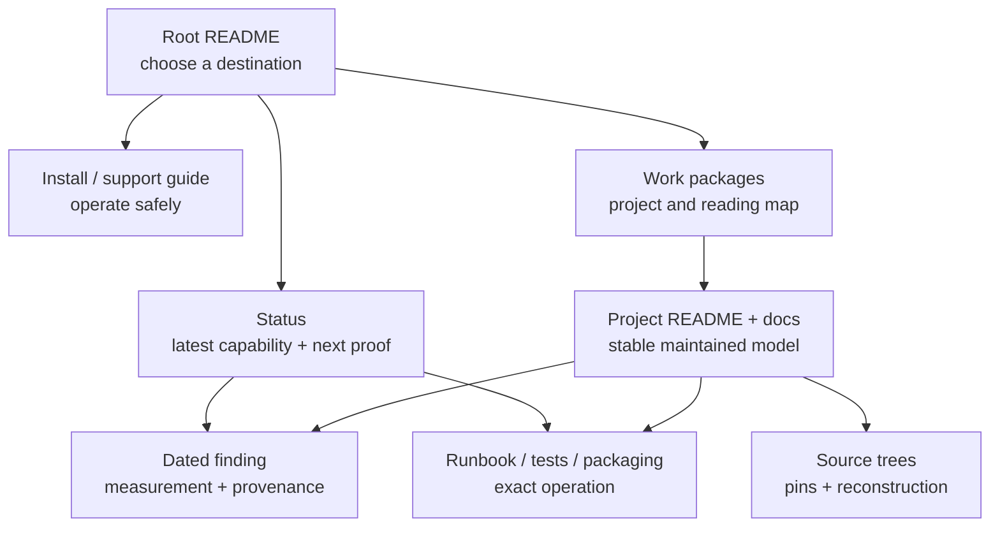

# Proposal: make the repository easier to read, navigate, and maintain

> **Status:** draft for discussion, 2026-08-05
>
> **Scope:** documentation and evidence organization in `rock-5b-ysp`
>
> **Authority:** this is a proposal, not the current repository contract.
> [`CONTRIBUTING.md`](../CONTRIBUTING.md) remains authoritative until a later
> change explicitly adopts parts of this proposal.

## Executive proposal

Organize the repository around one rule:

> **One fact has one definitive owner. Other documents may summarize it for a
> distinct audience, but they link to the owner instead of maintaining another
> copy.**

The repository should keep its evidence-backed character and its useful
learning material. The cleanup should not flatten everything into one giant
manual or delete repetition merely because two pages discuss the same subject.
It should remove competing copies of moving facts, clarify the role of every
major document, and give each reader a short route to the information they
need.

The proposed target has seven document roles:

1. **Front doors** route readers without carrying detailed state.
2. **Status** states the latest public capability, boundary, and next proof.
3. **Findings** preserve dated observations and experiment evidence.
4. **Project documentation** owns stable technical explanations.
5. **Runbooks and package recipes** own exact operations and artifact creation.
6. **Source maps** own pins and reconstruction, not validation history.
7. **Teaching guides** explain concepts for a deliberate audience without
   becoming another status or source-pin ledger.

The migration should proceed in reviewable slices. It should preserve links
with finding tombstones, avoid mass renames, and add reporting before new hard
lint rules.

## Why change is needed

The repository already has the right high-level lifecycle in
[`CONTRIBUTING.md`](../CONTRIBUTING.md): observations enter through findings,
mature explanations move to project docs, public state rolls up into status,
and external drift belongs in a watchlist. The problem is that recent work has
often updated every related page at once, turning summaries into parallel
sources of truth.

The current scale makes that expensive:

- 425 Markdown files are exposed through 77 `README.md` front doors;
- 188 top-level dated findings record the evidence history;
- [`status.md`](../status.md) is 903 lines;
- [`source-trees.md`](source-trees.md) is 845 lines;
- [`packaging/ppa/README.md`](../packaging/ppa/README.md) is 622 lines; and
- rewrite validation state is spread across an index, a plan, a gap audit, a
  conformance guide, a runbook, project status, findings, and the dashboard.

Line count is not itself the problem. These documents are hard to maintain
because they mix roles:

- exact commit IDs, package versions, publication state, test counts, and open
  gates appear in several files;
- a source-pin map also carries implementation history and runtime verdicts;
- project front doors contain long release ledgers that duplicate status and
  findings;
- dated audits continue receiving live addenda instead of becoming frozen
  evidence;
- plans, validation indexes, and runbooks each describe the same execution
  sequence; and
- resolved findings sometimes remain full live documents after their durable
  explanation has moved elsewhere.

This creates three practical failures:

1. **Drift:** two plausible pages disagree about the current version or gate.
2. **Poor re-entry:** a reader must scan chronology before reaching the present
   boundary or the next command.
3. **High update cost:** closing one gate requires editing many files, which
   encourages still more copied prose.

## Goals

The cleanup should make these outcomes true:

- A newcomer can find the supported install path, safety boundary, and first
  verification command without reading developer history.
- A returning maintainer can find the current state and next proof before
  reading the evidence that produced them.
- A developer can find one maintained explanation for a subsystem, then follow
  links to dated evidence or runnable tests.
- A package maintainer can distinguish build inputs, publication state, upload
  chronology, and runtime qualification without reconciling several tables.
- Kernel, library, application, and packaging projects use a recognizable
  documentation structure, evidence vocabulary, and validation-result format.
- Updating a moving fact normally changes one canonical document and, when
  public state changes, one compact status/ledger pair.
- Historical evidence remains reconstructible after consolidation.
- Repository checks identify likely duplication and stale ownership before it
  becomes a correctness problem.

## Non-goals

This proposal does not aim to:

- reduce the repository to a minimal set of documents;
- remove newcomer explanations, developer teaching modules, or useful safety
  warnings;
- merge all project documentation into `docs/`;
- rewrite technical content merely to make files shorter;
- erase incident chronology or measured evidence;
- reorganize external source and build workspaces; or
- change the public/private security boundary defined in
  [`CONTRIBUTING.md`](../CONTRIBUTING.md#what-does-not-belong-here).

## The target information architecture

### Reader flow

The root README should answer “where do I start?” It should not answer every
question itself. `work-packages.md` should own the detailed project taxonomy and
reading paths. Project front doors should answer what the layer owns, its proven
boundary, where the maintained mechanism lives, and what proof comes next.

### Canonical roles

| Information | Definitive owner | What other pages may contain | What other pages should not copy |
|-------------|------------------|------------------------------|----------------------------------|
| Public capability and material boundary | `status.md` dashboard | A one-line link from a front door | Build fingerprints, case-by-case results, chronology |
| Next proof | `status.md` next-gate row for tracked work; project plan for the full ladder | A link naming the gate | A second multi-step backlog |
| Dated cross-track audit summary | `docs/status-ledger.md` | Dashboard link | Full finding contents or package upload transcript |
| External facts that can drift silently | `status.md` watchlist | A link or stable warning | Runtime history, resolved internal defects |
| Fresh observation or experiment | One dated finding | Index title and curated trail link | A second finding summarizing the same run |
| Stable technical explanation | Owning project's `docs/` | Audience-specific summary with a link | Moving pins, publication state, repeated test ledger |
| Source commit and reconstruction | `docs/source-trees.md` | A stable source name and link | Runtime verdict, package state, implementation history |
| Machine build input | Build script, manifest, or package changelog | Human explanation of the variable and why it matters | Independently maintained literal pin tables |
| PPA publication state | `status.md` W05 | User-facing statement that the normal archive is the supported channel | Publication IDs and live version matrices |
| Upload chronology | `packaging/ppa/history/` | Link from package documentation | Repeated chronological narrative in current-state docs |
| Exact operational command | Owning runbook, test README, or package README | A short first-use example for a different audience | Forked copies of recovery or destructive procedures |
| Whole-board evidence scope | `docs/support-coverage.md` | Status/project link to the coverage row | Live validation chronology |
| Shared vocabulary | `glossary.md` | Brief local reminder where needed | Repeated full definitions |

### Front-door contract

Each project `README.md` should stay a front door, not grow into a history book.
Near the top it should answer:

1. What does this project own?
2. What can a user or developer do with it?
3. What is the latest proven boundary, in one short paragraph linked to status
   or a finding?
4. Which maintained document explains the mechanism?
5. Which runbook or test performs the next useful operation?

A front door may list its files and provide one quick example. Detailed
architecture, long procedures, validation chronology, and release history
belong in the linked owners.

### Cross-project consistency contract

Canonical ownership solves drift; a shared document shape makes the canonical
owner easier to recognize and use. Kernel drivers, vendor libraries, video
libraries, applications, and packages should use the same concepts in roughly
the same order even when their technical depth differs.

This is consistency of interface, not forced uniformity. An RGA memory guide,
an FFmpeg build recipe, and a GNOME Remote Desktop architecture document should
not contain identical sections. A reader should nevertheless be able to find
scope, evidence, boundaries, operations, and related material in predictable
places.

#### Project README pattern

Every project front door should use this common order where applicable:

1. **Outcome and scope** — what the project enables and what it does not own.
2. **Project brief** — user outcome, developer focus, owned material,
   dependencies, external source location, and a short current-boundary link.
3. **Entry points** — a compact file/doc/runbook/test index.
4. **Technical model** — the shortest useful architecture summary, linking the
   maintained deep explanation.
5. **Build or operate** — the primary path, or a link to its runbook.
6. **Validate** — the canonical test entry point and the kind of evidence a
   pass establishes.
7. **Boundaries and next proof** — stable limitations plus links to the live
   status row or plan; no copied backlog.
8. **Related layers** — explicit upstream and downstream project links.

Not every README needs all eight headings. The same information should use the
same names and order when it is present. Category hubs can remain indexes rather
than pretending to be projects.

#### Technical explanation pattern

A maintained architecture or mechanism document should make these items easy
to locate:

- scope and intended reader;
- result or model first;
- source/pin owner for code-dependent claims;
- mechanism and interfaces;
- evidence level (`MEASURED`, `CODE-INSPECTED`, `SOURCE-CONFIRMED`, `INFERRED`,
  or `UNVERIFIED` as appropriate);
- known boundary and rejected interpretations; and
- links to operations, current status, and dated evidence.

It should not embed a moving release ledger merely to show that the mechanism
was exercised once.

#### Runbook pattern

Build, install, recovery, and validation runbooks should consistently present:

1. purpose and risk;
2. prerequisites and authority level;
3. exact input/artifact identity;
4. commands in execution order;
5. pass and fail signals;
6. cleanup or rollback;
7. evidence to retain; and
8. the owner of the next decision.

This makes destructive and root-required procedures reviewable across projects
without copying the commands into multiple guides.

#### Plan and audit pattern

Live plans should use a common shape: objective, non-goals, current gap pointer,
phases, dependencies, risks, and definition of done. Dated audits should use:
date, scope, inspected pins, trust level, result, findings, and final
disposition. An audit marked frozen must link to the live plan or status rather
than receiving current-state addenda.

#### Validation-result pattern

Whenever a project records a build or runtime result, use the same evidence
fields whether the subject is a kernel, library, application, or package:

| Field | Question answered |
|-------|-------------------|
| Date | When was this exact state checked? |
| Identity | Which board, kernel, source, package, config, and artifact were exercised? |
| Command/workload | What exactly ran? |
| Expected signal | What would constitute a pass or a meaningful failure? |
| Result | What happened, including counts only when they aid reconstruction? |
| Logs/artifacts | Where is the retained evidence or reconstruction path? |
| Trust | Was the claim measured, inspected, inferred, or left unverified? |
| Boundary | What does this result not establish? |

The fields may be prose, a table, or a finding header; the semantic contract is
the same. This will make results from MPP, librga, FFmpeg, VA-API, Mesa, GRD,
kernel packages, and boot firmware comparable without pretending their tests
are interchangeable.

#### Shared naming and style

- Use `README.md` for a directory front door, `docs/` for maintained
  explanations, and the owning `scripts/` or `tests/` README for operations.
- Use the same layer names defined by the project taxonomy and glossary.
- Define cross-cutting terms in `glossary.md`; keep local terms in
  `keywords.md` without recreating a second glossary.
- Lead with the result, separate current from historical state, use exact dates
  for evidence, and reserve “current” for a linked dated owner.
- Use “boundary” for what evidence does not establish and “next proof” for the
  smallest result that advances the work. Avoid a mix of “TODO,” “remaining,”
  “open,” “roadmap,” and “next steps” sections that all carry partial backlogs.

After acceptance, add small templates for a project README, technical
explanation, runbook, live plan, and dated audit. The templates should live in
one documented location and illustrate these contracts without making every
document mechanically identical.

### Status contract

Keep the dashboard and ledger pairing, but make their distinction stronger:

- A **dashboard row** contains the latest proven capability and one material
  boundary. It should be readable without decoding build hashes.
- A **next-gate row** names only the smallest proof that materially advances the
  track. Later phases live in the linked plan.
- A **ledger row** records the exact current identity, evidence basis at summary
  level, and unresolved boundary. It is not a copy of the full finding.
- A **watchlist item** exists only when the fact can change without a commit to
  this repository. Closed defects, internal test gaps, and stable decisions are
  retired without renumbering the remaining IDs.

This makes status a reliable re-entry point instead of a second technical
manual.

### Evidence contract

Findings should remain numerous and dated; that is useful evidence, not clutter.
The cleanup applies the existing lifecycle consistently:

- capture a new result once;
- link it from relevant status or project docs;
- promote the stable explanation when it matures;
- replace the original finding with the standard `promoted → ...` tombstone;
  and
- keep the chronological index entry so historical links survive.

A finding should not be promoted merely because it is old. It should be
promoted when another maintained document carries its useful mechanism,
evidence boundary, and any still-relevant next proof.

### Plans, audits, and runbooks

These three document types need explicit separation:

- A **plan** defines future phases, dependencies, and definition of done. There
  should be one live plan per sustained workstream.
- A **dated audit** records what an inspection found at that time. It becomes
  frozen after corrections and links to the live plan/status for current work.
- A **runbook** provides exact executable steps, prerequisites, pass/fail
  signals, cleanup, and recovery. It should not maintain a competing project
  backlog.

Validation indexes should route readers to the right plan, runbook, test, and
latest evidence. They should not restate every matrix and gap.

## Duplication to preserve deliberately

Not all repetition is waste. Preserve it when the audience or safety need is
genuinely different:

- The newcomer PPA guide may explain packages and application verification in
  plain language even though developer package docs describe the mechanism.
- Teaching guides may restate foundational concepts before leading into a
  subsystem, but should link deep internals and omit moving state.
- A destructive-operation warning may appear both at the decision point and in
  the canonical runbook.
- A project front door may summarize a status verdict in one sentence.
- The dashboard and ledger intentionally describe the same track at different
  resolution.
- A dated finding and a stable project model coexist until promotion is
  complete; afterward the finding becomes a tombstone.

The test is not “does this sentence appear twice?” The test is “would these two
copies reasonably change on different schedules for different readers?” If the
answer is no, one should be a link.

## Proposed decisions for current hotspots

| Area | Proposed definitive split | Consolidation action |
|------|---------------------------|----------------------|
| Root navigation | Root README = short task router; `work-packages.md` = taxonomy, stack diagram, and reading paths | Remove detailed maps or commands that compete with those owners; keep one-line category summaries. |
| Status and watchlist | Dashboard = public verdict; ledger = exact audit note; watchlist = external drift only | Retire resolved/internal W-items, keep rows compact, and route detailed evidence to findings/projects. |
| `source-trees.md` | Pins, relationships needed to interpret pins, and reconstruction commands | Remove package publication, runtime results, feature inventories, and commit-by-commit project history. |
| Rewrite validation | `rewrite-validation-plan.md` = one live plan; `tests/rewrite-conformance.md` and the kernel runbook = commands; findings = runs; `validation-index.md` = router | Freeze the dated gap audit, remove live addenda, and delete duplicated state/gap ladders from the index and architecture guide. |
| Forward-port state | Patch README = mechanical order; patch catalog = provenance/backport; status = current public boundary; findings = campaigns | Replace the long forward-port status/history document with a concise capability scorecard and links, or retire it after callers are migrated. |
| PPA documentation | Build script/changelogs = inputs; PPA README = archive topology and package mechanics; W05 = publication; history = uploads; PPA support = newcomer operation | Remove live publication matrices and validation chronology from the PPA README; keep ABI/co-installability and build procedure. |
| Userspace patch map | `build-source-packages.sh` = pins it actually owns; `userspace-patches.md` = fork/quilt policy and maintenance traps | Remove live PPA state and literal package-version columns; link source reconstruction and publication owners. |
| FFmpeg branches | `source-trees.md` = current branch pins; rebase docs = roles/history; comparison docs = frozen measured pins | Stop describing a literal tip as “current” in several project pages. |
| VA-API and applications | VA-API README = durable capability policy; architecture = mechanism; app map = consumer compatibility; status = live browser/package verdict | Remove release chronology and duplicated next-gate lists; tombstone superseded closure plans. |
| Mesa | W06 = live MR/rebase state; validation doc = test chronology; review doc = findings; README = project front door | Remove duplicate MR tables and long dated lifecycle from the README. |
| Support coverage | Stable scope, owner, and first missing evidence | Remove package versions, test counts, and incident chronology from coverage rows. |
| Mature findings | Owning project doc | Run a promotion sweep, preserving tombstones and curated investigation trails. |
| Cross-library teaching | Combined guide = layer model and end-to-end flow; project guides = internals | Keep the different audience, but replace duplicated internal chapters with directed links. |
| Project consistency | Shared README, explanation, runbook, plan, audit, and validation-result contracts | Normalize section purpose, evidence language, and link direction across kernel, library, application, and packaging projects without forcing identical depth. |

## Migration plan

### Phase 0 — agree on roles before moving text

Adopt the canonical-role table above as the decision boundary. Fold the final
rules into `CONTRIBUTING.md`; do not make this proposal a second permanent
contract. Once accepted, freeze this file as the design decision and track
execution in ordinary commits rather than appending live status here.

Also adopt the cross-project consistency contract and create the small document
templates before rewriting front doors. The templates establish a common
interface; they are not authorization for mechanical bulk rewrites.

Exit gate:

- every major document type has one agreed role;
- intentional audience-specific duplication is named; and
- no cleanup commit is justified only by line-count reduction.

### Phase 1 — clean status and the watchlist

1. Review every dashboard/ledger pair for capability-versus-detail separation.
2. Reduce every next gate to one advancing proof.
3. Classify every watchlist entry as external drift, stable project state,
   resolved history, or active internal work.
4. Retire entries outside the external-drift class and repair inbound links.
5. Move unique history to a finding or owning project before deletion.

Exit gate:

- a status-only reader can understand every track quickly;
- the ledger contains exact identity without copying entire findings; and
- every remaining W-item can change without a repository commit.

### Phase 2 — separate source, package, and publication truth

1. Cut `source-trees.md` down to pins and reconstruction.
2. Make build scripts/manifests authoritative for machine inputs they own.
3. Make W05 authoritative for live Launchpad state.
4. Keep PPA upload chronology only in `packaging/ppa/history/`.
5. Simplify the PPA README to topology, package shape, build, signing, upload,
   co-installability, and migration mechanics.
6. Simplify `userspace-patches.md` to delta ownership and maintenance policy.

Exit gate:

- one lookup answers “what source is built?”;
- one lookup answers “what is live?”; and
- one lookup answers “how was it uploaded?”

### Phase 3 — consolidate validation workstreams

Start with rewrite validation, then apply the pattern to forward-port, VA-API,
Mesa, FFmpeg, and GRD:

1. Choose one live plan.
2. Freeze dated audits.
3. Keep exact commands in runbooks/test READMEs.
4. Keep latest result in one finding and status rollup.
5. Turn validation indexes into navigation tables.
6. Remove moving source tips from teaching and architecture documents.

Exit gate:

- each workstream has one plan, one command path, and one current public
  verdict;
- an audit can be read historically without pretending to be current; and
- validation results are not retyped into architecture guides.

### Phase 4 — standardize project documentation and promote findings

For each project:

1. Map the existing front door to the common project README pattern.
2. Normalize terminology, evidence labels, boundary language, and link direction.
3. Move long mechanism prose into a maintained project document where needed.
4. Bring runbooks, plans, audits, and recorded validation results into their
   shared semantic contracts without erasing project-specific detail.
5. Move dated histories to findings or existing validation history pages.
6. Replace literal moving pins and versions with links.
7. Identify findings whose complete durable content is already maintained.
8. Promote those findings with standard tombstones and update topic counts.

Exit gate:

- every project can be oriented from its README without scanning chronology;
- equivalent information is named and ordered consistently across projects;
- every project-specific doc is discoverable from that README; and
- no promoted explanation remains live in two places.

### Phase 5 — improve navigation after consolidation

Only after canonical owners are stable:

1. Review the root task router for the most common user and maintainer goals.
2. Review `work-packages.md` for complete project and reading paths.
3. Remove redundant navigation tables elsewhere.
4. Add missing “see current status,” “see maintained model,” and “run this” links
   to project front doors.
5. Check that key answers are reachable in at most two deliberate hops from the
   root README or the relevant project README.

Exit gate:

- newcomers, operators, maintainers, and subsystem developers each have a
  clear entry route; and
- adding another index would not make a common task easier.

### Phase 6 — add lightweight enforcement

Add reporting before blocking rules:

1. Create a documentation-duplication report that finds identical long
   sentences, highly similar normalized paragraphs, repeated version/SHA
   concentrations, and “current/as of” language outside designated owners.
2. Run it in the repository check as informational output and tune false
   positives.
3. Add targeted blocking assertions only for high-risk facts with known owners,
   such as packaging pins and public installer versions.
4. Add consistency checks for standard finding tombstones and for watchlist
   entries whose reason is not external drift.
5. Report missing project-brief concepts and inconsistent validation-result
   fields before deciding whether any should become blocking checks.
6. Keep judgement-heavy prose rules in review guidance rather than encoding
   arbitrary style limits.

Exit gate:

- the report is useful enough to catch real drift without training maintainers
  to ignore it;
- high-risk literal pins have explicit owners; and
- `bash scripts/check-repo.sh` remains the single handoff command.

## How to execute safely

Use small, ownership-based commits rather than a repository-wide rewrite:

- one status/watchlist slice;
- one source-pin/package-publication slice;
- one validation workstream at a time;
- one project front door at a time; and
- one findings-promotion batch at a time.

For every slice:

1. Name the definitive owner before deleting a copy.
2. Confirm that the owner preserves all unique evidence and boundaries.
3. Replace deleted prose with a useful link, not a vague “see elsewhere.”
4. Preserve dated history in findings or package history.
5. Update the nearest README for any added, moved, or removed file.
6. Search for inbound links and stale anchors.
7. Run `bash scripts/check-repo.sh`.

Avoid mass file moves early. Git history already preserves old paths, but stable
in-repo links and reader muscle memory are more valuable than a cosmetically
perfect directory tree. Move a file only when ownership is genuinely wrong and
the new location makes its front door clearer.

## Success criteria

The cleanup is complete when all of the following are true:

### Canonicality

- Every current package version, source pin, public verdict, and next gate has
  one named definitive owner.
- No project README or architecture guide maintains a second live publication
  ledger.
- Every sustained workstream has one live plan.
- Dated audits are frozen and point to current state rather than receiving live
  addenda.

### Readability

- Dashboard rows state capability plus boundary without incident chronology.
- Next-gate rows state one proof.
- Project front doors answer the five front-door questions near the top.
- Comparable project front doors, runbooks, plans, audits, and validation
  records use the shared concepts and terminology.
- Source maps, coverage inventories, and indexes contain only information that
  serves their declared role.

### Findability

- The root README routes the common tasks.
- `work-packages.md` owns detailed reading paths.
- Every maintained project explanation, runbook, and tool is reachable from its
  nearest README.
- A reader can move from current verdict to evidence, or from mechanism to
  runnable test, through explicit links.

### Evidence preservation

- No unique command, trust classification, boundary, or measured result is lost.
- Promoted findings use standard tombstones and remain in the chronological
  index.
- Package upload history remains available without appearing in current-state
  documents.

### Maintenance cost

- Closing a normal gate does not require updating a broad set of unrelated
  project docs.
- High-risk moving facts are covered by targeted consistency checks.
- The full repository handoff gate passes after every slice.

## Recommended first implementation batch

After this proposal is accepted, the first batch should establish the pattern
with high-value, low-ambiguity work:

1. Fold the agreed roles and consistency contract into `CONTRIBUTING.md`, then
   add the shared document templates.
2. Retire closed/internal watchlist items and repair their inbound links.
3. Reduce `source-trees.md` sections to pin/reconstruction content.
4. Remove live publication and validation state from the PPA README and
   userspace patch map.
5. Freeze the rewrite conformance-gap audit and make the validation index a
   router.
6. Remove stale literal FFmpeg branch tips from project and comparison docs,
   leaving frozen measurement pins clearly labelled.

That batch addresses the most frequent drift sources while preserving the
newcomer PPA guide, developer teaching modules, package history, and dated
evidence—the kinds of duplication that still earn their place.
