# Rockchip BSP architecture

This page explains what the Rockchip 6.1 BSP adds on top of a stock Linux
kernel, in two layers:

- **Normal-user view:** what the area does for someone booting a board,
  running a desktop, using cameras, or accelerating video.
- **Kernel-developer view:** where the code sits, which Linux subsystems it
  touches, and what tends to matter during forward-porting or debugging.

The measurement behind this page compared Rockchip's `develop-6.1` BSP at
`b4ef083dc0c3` against the local upstream-stable base commit `58485ff1a74f`
(`Linux 6.1.141`). At that point the BSP overlay was about **5,939 changed
files**, **5,194 added files**, and **3.5M added lines**. Treat those numbers
as a scale indicator, not as a package list for this repo. The ROCK 5B work in
this repo forward-ports only the subset needed for RK3588 video/RGA support.

## One-sentence summary

Stock Linux gives a generic kernel and some upstream Rockchip support. The
Rockchip BSP adds the vendor product stack around it: board descriptions,
firmware calls, clocks and power policy, media/video/camera/display drivers,
GPU/NPU drivers, vendor storage, debug and crash-capture tools, boot-speed
tuning, and userspace ABIs expected by Rockchip libraries.

## Bird's-eye view

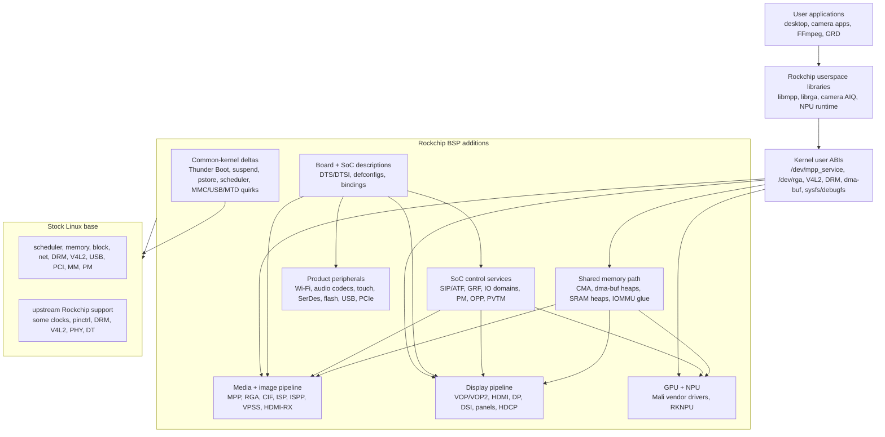

The important thing to notice is that the BSP is not one driver. It is a
product kernel. Most added code is hardware enablement, but some code changes
generic kernel behavior to match Rockchip's boot, power, memory, and Android or
embedded product expectations.

## What matters for ROCK 5B

| BSP area | Relevance to this repo | Why |
|----------|------------------------|-----|
| RK3588 device tree and clocks | **Critical** | The codec/RGA blocks do not exist to Linux until DT describes their MMIO, IRQ, IOMMU, power, and clock relationships. |
| MPP codec and RGA drivers | **Critical** | This is the stack used for H.264/H.265 encode/decode and RGA scaling/color conversion. |
| dma-buf, CMA, IOMMU glue | **Critical** | Video and graphics blocks exchange frame buffers by fd and IOVA, not by copying pixels through userspace. |
| Rockchip userspace UAPI | **Critical** | `librockchip_mpp`, `librga`, and `ffmpeg-rockchip` expect the vendor ioctls and device names. |
| Display/DRM | **Useful context** | The board's display path uses DRM/KMS, but the shipped ROCK 5B video work does not forward-port the whole Rockchip display BSP. |
| Camera/ISP | **Mostly context here** | The BSP has a large camera stack; this repo focuses on codec/RGA, not full camera capture/AIQ bring-up. |
| Mali vendor GPU | **Context only here** | This repo investigates Mesa/Panfrost instead of shipping the vendor Mali kernel stack. |
| RKNPU | **Context only here** | The BSP has an NPU driver, but this repo does not package an RKNN runtime path. |
| Vendor flash, touch, audio, Wi-Fi, SerDes | **Board/product context** | Useful when understanding the size of the BSP, but not central to ROCK 5B codec validation. |
| Thunder Boot, minidump, pstore, scheduler changes | **Porting risk** | These are common-kernel changes that can surprise maintainers if pulled in blindly. |

## Area 1: SoC and board descriptions

### Normal-user view

This is the part that tells Linux what board it is running on. Without it, the
kernel can boot but will miss hardware: no codec device, no camera, no display
connector, wrong clocks, wrong regulators, or missing GPIOs.

A normal user sees this area indirectly:

- The right `.dtb` is installed for the board.
- Devices appear under `/dev`, `/sys`, and `dmesg`.
- Power rails, clocks, SD/eMMC, USB ports, display connectors, and accelerator
  blocks probe without manual setup.
- Board variants get their own configuration instead of a one-size-fits-all
  kernel.

### Kernel-developer view

Rockchip's BSP adds a broad SoC matrix through explicit CPU selectors such as
`CPU_RK3588`, `CPU_RK3576`, `CPU_RK3568`, `CPU_RV1126B`, and many older SoCs.
Drivers then gate feature support on those symbols. The BSP also adds hundreds
of DTS/DTSI files and many product config fragments.

Typical paths in the BSP:

- `drivers/soc/rockchip/Kconfig.cpu`
- `arch/arm64/boot/dts/rockchip/`
- `arch/arm/boot/dts/`
- `arch/arm64/configs/`
- `arch/arm/configs/`
- `Documentation/devicetree/bindings/`
- `include/dt-bindings/`

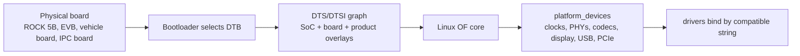

Developer notes:

- Treat DTS as the hardware contract. If a driver requires a magic runtime
  quirk that should have been a property, forward-porting gets harder.
- Rockchip BSP DTS files often describe product families, not just one board.
  Watch for includes such as Android, AMP, vehicle, NVR, IPC, robotic, and
  thunder-boot variants.
- DT bindings in the BSP may be older `.txt` style or vendor-specific YAML.
  Do not assume mainline binding acceptance.
- The ROCK 5B work in this repo uses a small RK3588 DT subset, documented in
  [`../kernel-drivers/docs/device-tree.md`](../kernel-drivers/docs/device-tree.md).

Common failure signs:

- Driver does not probe: missing `compatible`, `reg`, `interrupts`, clocks, or
  power-domain.
- Driver probes but jobs hang: IOMMU, reset, SRAM, or assigned-clock mismatch.
- Same driver works on one board and not another: product `.dtsi` include
  order or regulator/GPIO differences.

## Area 2: Firmware, SoC services, power, and boot control

### Normal-user view

This area is the "platform control room." It handles things the kernel cannot
do alone because the secure firmware or SoC control registers own them:

- entering suspend states,
- asking firmware for secure operations,
- setting up DDR and clock details,
- recording board serial information,
- preserving crash logs,
- coordinating AMP systems where Linux shares the chip with an MCU,
- making the board boot faster in product images.

Most users only notice this area when suspend, reboot, watchdog, serial
number, or crash logs behave differently than a stock kernel.

### Kernel-developer view

The BSP grows `drivers/soc/rockchip/` into a large platform service layer and
adds `drivers/firmware/rockchip_sip.c` for ARM SMCCC/SIP calls into ATF or
TEE firmware. That service layer includes:

- `ROCKCHIP_SIP` firmware calls,
- GRF and IO-domain control,
- OPP, PVTM, IPA, DMC debug, and performance policy,
- suspend-mode programming,
- vendor storage,
- FIQ debugger,
- minidump and pstore integration,
- AMP/RPMsg shared memory and time sync,
- Thunder Boot fast-boot features.

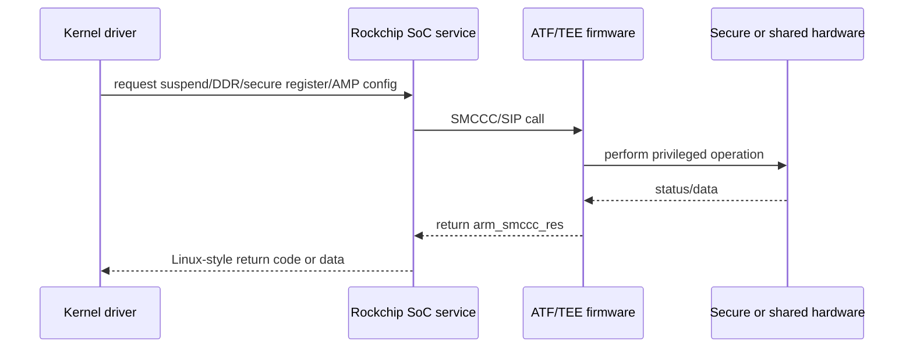

Developer notes:

- SIP calls are a hard dependency for some board features. If firmware does
  not implement the vendor call, the driver can fail even when the Linux code
  is correct.
- `NO_GKI` gates many vendor features. That is a sign the behavior is not
  Android GKI ABI-safe.
- Thunder Boot changes initcall and memory-initialization behavior. Treat it
  as a system policy, not as an isolated driver optimization.
- AMP support reserves or protects resources used by a co-processor. Removing
  it can break boards where Linux is not the only OS on the SoC.

Common failure signs:

- `SMC` or `SIP` errors in `dmesg`.
- suspend states listed but resume fails.
- crash logs missing after reboot.
- device probes differ between vendor firmware and mainline firmware.

## Area 3: Media codecs and 2D video processing

### Normal-user view

This is the area most relevant to this repo. It makes hardware video
acceleration usable:

- **MPP codec blocks** encode and decode compressed video such as H.264 and
  H.265.
- **RGA** scales, crops, rotates, blends, and converts pixel formats.
- Userspace normally reaches these through `librockchip_mpp`, `librga`, and
  `ffmpeg-rockchip`.

A user sees this as lower CPU usage and higher throughput for video decode,
video encode, transcode, remote desktop streaming, and format conversion.

### Kernel-developer view

The Rockchip BSP keeps its vendor codec framework under
`drivers/video/rockchip/mpp/`, not under mainline V4L2 codec APIs. RGA lives
under `drivers/video/rockchip/rga*`. The kernel exposes character devices and
vendor ioctls expected by Rockchip userspace.

Important interfaces:

- `/dev/mpp_service`
- `/dev/rga`
- `include/uapi/linux/rk-mpp.h`
- RGA uAPI headers under the RGA driver tree
- dma-buf fd import/export
- IOMMU mappings for hardware-visible addresses

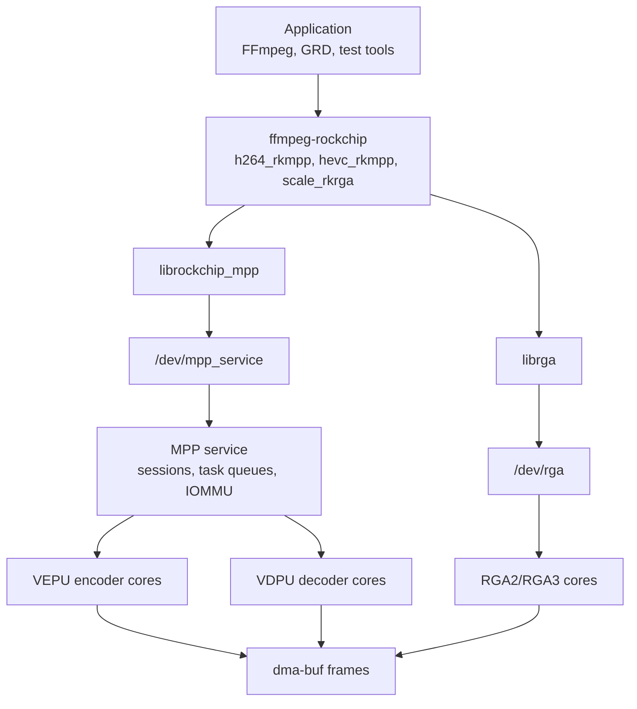

Developer notes:

- The userspace library prepares codec register payloads. The kernel mostly
  validates, maps buffers, schedules work, handles interrupts, and reports
  completion.
- This model is powerful but less self-describing than V4L2 stateless codec
  APIs. The ABI contract lives in headers and vendor library behavior.
- Forward-porting must preserve ioctl numbers, command meanings, device names,
  and buffer semantics expected by `librockchip_mpp` and `librga`.
- Hardware jobs usually fail late. Probe success only means clocks, MMIO, and
  IRQs looked plausible; it does not prove IOMMU, buffer layout, register
  recipes, or firmware expectations are correct.

Common failure signs:

- `/dev/mpp_service` exists but encode returns invalid output: likely
  userspace/kernel ABI or register recipe mismatch.
- Jobs time out: clock, reset, interrupt, IOMMU, or MMU mapping problem.
- RGA works for small buffers but fails for real video frames: stride,
  alignment, format modifier, or dma-buf cache issue.

## Area 4: Camera, ISP, and image input

### Normal-user view

This area is for products with cameras: IPC cameras, NVRs, robotics, vehicle
cameras, USB-camera-like devices, and AI vision boards. It connects image
sensors and HDMI/SerDes inputs to Rockchip's capture and image-processing
hardware.

Users see this as:

- camera sensors appearing as video devices,
- multi-camera capture working,
- ISP features such as auto exposure/white balance/noise reduction being
  available to vendor camera stacks,
- HDMI input or GMSL/FPD-Link style camera boards working.

### Kernel-developer view

This is one of the largest BSP areas. The BSP adds or expands:

- `drivers/media/platform/rockchip/cif/`
- `drivers/media/platform/rockchip/isp/`
- `drivers/media/platform/rockchip/isp1/`
- `drivers/media/platform/rockchip/ispp/`
- `drivers/media/platform/rockchip/vpss/`
- `drivers/media/platform/rockchip/aiisp/`
- `drivers/media/platform/rockchip/hdmirx/`
- many `drivers/media/i2c/` sensor, serializer, deserializer, bridge, VCM,
  flash, and EEPROM drivers.

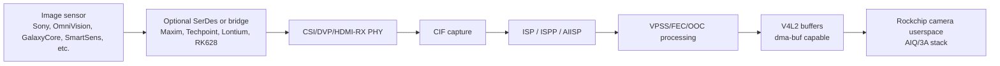

Developer notes:

- Camera support is a graph, not a single node. Sensor subdevs, PHYs, CIF,
  ISP, and memory outputs all need matching DT endpoints.
- Vendor ISP UAPI headers are large because they expose detailed per-block
  ISP parameter and statistics layouts.
- Sensor drivers often carry product-specific mode tables. Mainline-quality
  cleanup usually requires splitting common sensor behavior from board tuning.
- SerDes stacks are especially product-specific. They may combine MFD, media,
  GPIO, regulator, and display/camera behavior.

Common failure signs:

- `/dev/video*` nodes appear but no frames arrive: endpoint graph, MIPI lane,
  power sequence, or clock mismatch.
- Frames are corrupted: bayer order, bit depth, packing mode, stride, or ISP
  parameter mismatch.
- Only one camera in a multi-camera setup works: shared clock, reset, I2C
  address, or SerDes routing issue.

## Area 5: Display, panels, and DRM

### Normal-user view

This is the screen-output side. It drives HDMI, DisplayPort, MIPI DSI, LVDS,
RGB panels, eDP-style panels, virtual connectors, and sometimes e-book panels.

Users see it as:

- monitors lighting up,
- display resolution and refresh-rate selection,
- touchscreen and panel power sequencing behaving correctly,
- boot logos or early display paths,
- HDCP or specialized product display features.

### Kernel-developer view

The BSP expands the Rockchip DRM driver with many downstream display features:

- VOP and VOP2 CRTC support across SoC generations,
- Synopsys DW HDMI, DSI, DSI2, and DP extensions,
- CDN DP and Analogix DP paths,
- HDCP2 support,
- panel notifier hooks,
- virtual connectors and VKMS-style Rockchip DRM support,
- RK618 display bridge support,
- debugfs/direct-show/self-test helpers.

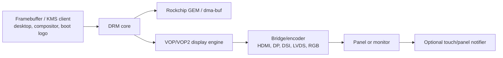

Developer notes:

- Display bugs are often ordering bugs: clocks, power domains, PHY setup,
  bridge attach, panel prepare/enable, and connector state must line up.
- Downstream panel notifiers are convenient for products but are not a
  mainline DRM pattern everywhere. Keep them isolated when forward-porting.
- DRM buffer allocation may be coupled to Rockchip GEM and dma-buf behavior.
  That matters if RGA, codecs, and display exchange buffers zero-copy.
- Some vendor display features are test or production aids, not generally
  reusable upstream APIs.

Common failure signs:

- Blank display with no probe errors: bridge/panel sequencing or PHY timing.
- Works at one resolution only: clock tree, PLL, or mode validation mismatch.
- Touchscreen wakes at wrong time: panel notifier or GPIO polarity mismatch.

## Area 6: Shared memory, dma-buf, CMA, and IOMMU

### Normal-user view

This is the plumbing that lets video, display, GPU, camera, and NPU hardware
share frames without copying them through the CPU.

Users notice this area when:

- hardware video works only as root or not at all,
- an app says it cannot allocate dma-buf memory,
- video acceleration starts but frames are corrupted,
- large frame sizes fail while small tests pass.

### Kernel-developer view

The BSP adds Rockchip-specific heap paths and extends generic memory plumbing:

- Rockchip dma-buf heaps, including CMA/system heap choices,
- SRAM heap support,
- optional inactive CMA behavior,
- dma-buf cache and partial CPU-access hooks,
- exported CMA helpers and debug/procfs surfaces,
- IOMMU glue used by MPP, RGA, display, camera, and NPU blocks.

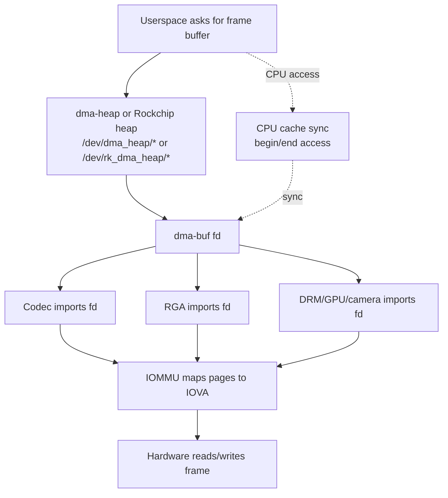

Developer notes:

- dma-buf fd lifetime and IOMMU mapping lifetime are different. Bugs appear
  when drivers assume one implies the other.
- CMA behavior affects reliability under memory pressure. `CMA_INACTIVE`
  changes how reserved pages participate in normal memory use.
- Cache maintenance matters whenever CPU and hardware touch the same buffer.
  Partial-sync APIs are attractive but must match exporter behavior exactly.
- Device permissions are part of the stack. Granting `/dev/mpp_service`
  without heap access can still break video.

Common failure signs:

- `-ENOMEM` or allocation failure at high resolutions: CMA size, heap choice,
  or fragmentation.
- Green/purple/corrupt frames: format, stride, cache sync, or IOMMU mapping.
- Use-after-free style crashes: dma-buf reference or attachment lifetime.

## Area 7: GPU and NPU accelerators

### Normal-user view

This area handles graphics and AI acceleration:

- Mali GPU vendor drivers for older Utgard/Midgard/Bifrost/Valhall families,
- RKNPU for Rockchip neural-network accelerators.

On a desktop board, the GPU affects OpenGL/Vulkan and compositor performance.
On AI products, the NPU affects model inference throughput.

### Kernel-developer view

The BSP adds large vendor driver drops under `drivers/gpu/arm/` and RKNPU under
`drivers/rknpu/`.

The Mali stack is not the same as Mesa/Panfrost:

- vendor Mali kernel drivers expect matching proprietary or vendor userspace,
- Panfrost is the open Mesa driver path,
- both are GPU-related, but they are different stacks.

RKNPU offers a vendor character-device model with debugfs/procfs, optional
fences, SRAM support, and a choice between DRM GEM or Rockchip dma-heap memory
management.

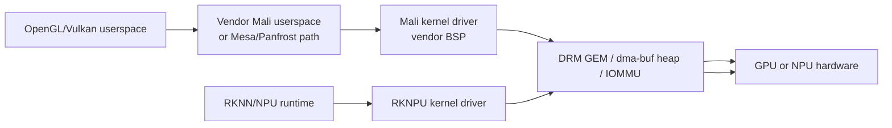

Developer notes:

- Do not mix assumptions from Panfrost and vendor Mali. Their kernel/userspace
  contracts differ.
- NPU memory-manager selection affects ABI and packaging. Check whether a
  target runtime expects DRM GEM or dma-heap behavior.
- These drivers are large and often not upstream-shaped. Treat forward-ports
  as vendor ABI preservation unless you are intentionally rewriting.

Common failure signs:

- GPU user library cannot open or version-match the kernel driver.
- NPU runtime loads but model execution fails on buffer import.
- Debugfs/procfs counters show no jobs even though userspace submits work.

## Area 8: Storage, flash, and vendor storage

### Normal-user view

This area supports products that boot from or store data on eMMC, SD, SPI NOR,
SPI NAND, raw NAND, or Rockchip-specific flash translation layers.

Users notice it as:

- the board booting from the expected media,
- persistent serial/vendor data,
- recovery or upgrade partitions,
- NAND/SPI flash support on embedded products.

### Kernel-developer view

The BSP adds both normal MTD integrations and Rockchip block-style flash
stacks:

- `drivers/rkflash/`
- `drivers/rk_nand/`
- extra SPI-NAND and SPI-NOR manufacturer tables,
- vendor storage backends in `drivers/soc/rockchip/`,
- MMC and MTD quirks used by product boot flows.

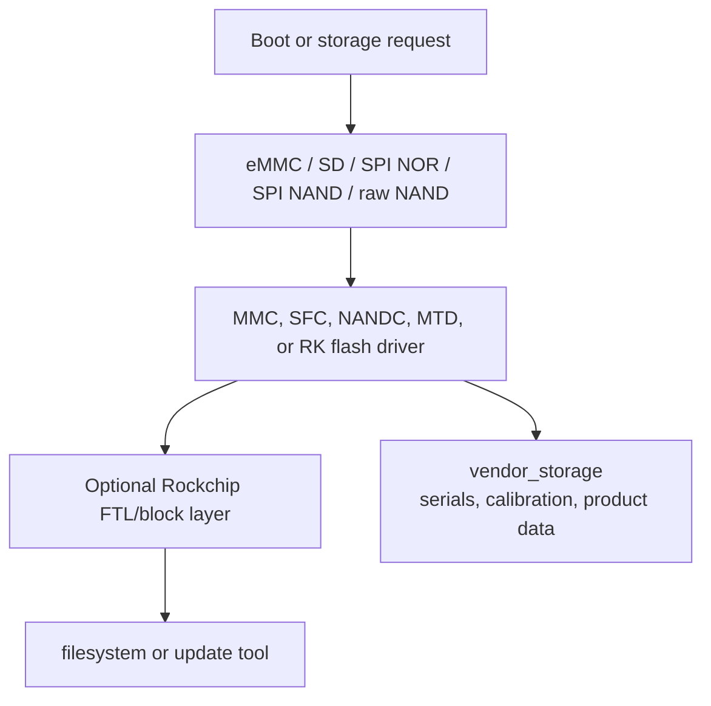

Developer notes:

- Some Rockchip flash paths expose block devices where mainline would prefer
  MTD. Understand which userspace update tools expect which interface.
- Vendor storage is a cross-cutting service. Flash, MMC, MTD, and RAM-backed
  implementations can all feed the same higher-level API.
- Manufacturer-table additions are low-level but product-critical. Removing
  an obscure SPI-NAND ID can break a shipping board.

Common failure signs:

- Bootloader sees flash but Linux does not: controller binding or partition
  binding mismatch.
- Bad-block handling differs from vendor images: FTL/BBT behavior mismatch.
- Serial/calibration data missing: vendor-storage backend not enabled.

## Area 9: Connectivity and product peripherals

### Normal-user view

This is the long tail of board features:

- Wi-Fi and Bluetooth modules,
- Ethernet quirks,
- USB Type-C and gadget modes,
- PCIe endpoint and DMA,
- audio codecs and sound cards,
- touchscreens, sensors, remotes, headsets,
- display/camera SerDes chips,
- vehicle reverse-image paths.

Users experience these as "the board feels complete." Without this area, the
kernel may boot and even run video acceleration, but the product can still
miss audio, touch, wireless, camera adapters, or special I/O modes.

### Kernel-developer view

This part of the BSP is broad and uneven. It includes both small board quirks
and large vendor drops:

- `drivers/net/wireless/rockchip_wlan/` with Broadcom `bcmdhd`,
- many `drivers/input/touchscreen/` vendor drivers,
- `sound/soc/rockchip/` controller and machine-driver additions,
- many `sound/soc/codecs/` additions,
- `drivers/mfd/display-serdes/`,
- `drivers/mfd/rkx110_x120/`,
- USB gadget/UVC changes,
- PCIe host/endpoint/DMA changes,
- CAN, LTE, RTC, PWM, regulator, power-supply additions.

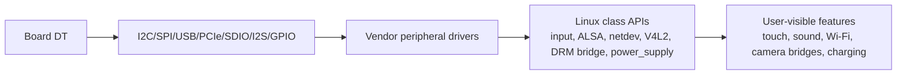

Developer notes:

- Many product peripherals are not RK3588-specific. They landed in the BSP
  because Rockchip supports whole products, not only SoC IP blocks.
- Check whether a driver is generic vendor silicon or Rockchip glue before
  deciding where it belongs.
- These drivers often carry older kernel-style APIs. Forward-porting usually
  means converting GPIO, regulator, PM, I2C, V4L2 subdev, or ALSA APIs.

Common failure signs:

- Device probes but userspace cannot access it: udev/ACL or class-device
  registration issue.
- Works only after warm reboot: reset GPIO, regulator, or firmware timing.
- Product board works with vendor kernel but not mainline: missing bridge,
  panel, touchscreen, or Wi-Fi module driver.

## Area 10: Common-kernel behavior changes

### Normal-user view

These changes are not tied to one visible device. They adjust how the whole
kernel boots, schedules work, sleeps, logs crashes, or manages memory.

Users may notice:

- faster product boot,
- different suspend names such as `lite` or `ultra`,
- crash logs surviving reboot,
- different real-time responsiveness,
- different memory availability around video workloads.

### Kernel-developer view

This is the highest-risk part to pull forward blindly because it modifies
common Linux code. Examples observed in the BSP include:

- async initcalls for Thunder Boot,
- deferred memblock freeing,
- page-struct zeroing changes for boot speed,
- `CMA_INACTIVE`,
- Rockchip schedutil `target_load`,
- RT-priority changes for kernel workers,
- lite/ultra suspend states,
- pstore boot-log and minidump integration,
- USB UVC gadget behavior changes,
- MMC tuning and runtime-PM quirks,
- MTD/SPI-NAND manufacturer gating and bad-block behavior.

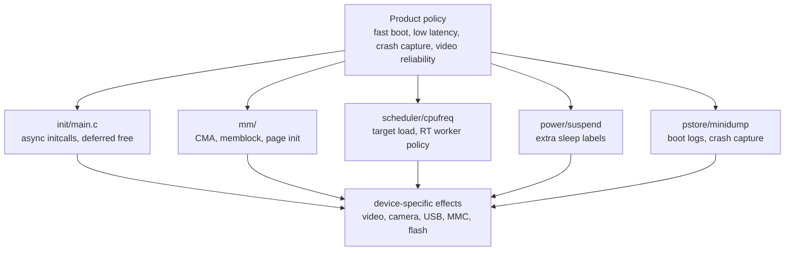

Developer notes:

- Separate "required for the device to work" from "product optimization." A
  codec forward-port usually does not need every Thunder Boot or scheduler
  patch.
- Common-kernel deltas need stronger testing than isolated drivers because
  they can regress unrelated workloads.
- Keep config guards meaningful. If a change is Rockchip-only, it should not
  alter non-Rockchip builds.
- When a vendor feature changes ABI visible to userspace, document it as ABI,
  not as an implementation detail.

Common failure signs:

- Random boot-order races after enabling async initcalls.
- Memory pressure or allocation failures that do not reproduce on stock Linux.
- Real-time workloads behaving differently after worker-priority changes.
- Suspend succeeds at the PM core level but hardware state is wrong on resume.

## Area 11: Userspace ABI and library expectations

### Normal-user view

The BSP assumes matching userspace. The kernel drivers are only half of the
story. To use hardware video or camera features, users normally need Rockchip
or Rockchip-compatible libraries.

For the ROCK 5B media path in this repo:

- `/dev/mpp_service` is used by `librockchip_mpp`.
- `/dev/rga` is used by `librga`.
- FFmpeg support comes from `ffmpeg-rockchip`, not from stock FFmpeg alone.
- Device permissions and dma-heap access must be correct.

### Kernel-developer view

The BSP adds many UAPI headers and ioctl surfaces. Some are stable only in the
practical sense that Rockchip userspace depends on them.

Important ABI families include:

- MPP codec ioctls and command payloads,
- RGA request structures,
- RKISP parameter/statistics structures,
- RKCIF controls,
- HDMI-RX controls,
- NPU and PCIe DMA controls,
- power-supply extensions,
- debug/procfs/sysfs nodes.

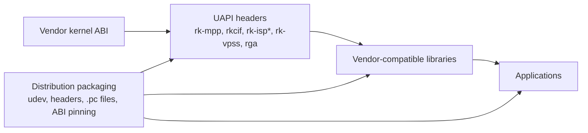

Developer notes:

- If userspace sends register tables or private structs, the kernel cannot
  freely reshape those structs without a coordinated userspace update.
- UAPI compatibility includes ioctl numbers, enum values, struct packing,
  alignment, error codes, and device-node names.
- Keep headers and userspace libraries pinned together in documentation. That
  is why this repo maintains [`source-trees.md`](source-trees.md).
- A mainline-looking rewrite can still need vendor-compat UAPI if the goal is
  to run existing Rockchip userspace.

Common failure signs:

- Library builds but runtime ioctl returns `EINVAL`: struct or command drift.
- `pkg-config` finds the wrong library/header pair.
- Device opens but initialization fails: missing heap, missing permissions, or
  kernel/userspace version mismatch.

## How to approach a forward-port

A practical forward-port should not import the whole BSP at once. Use this
order instead:

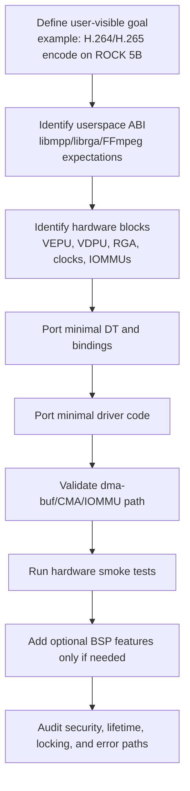

Recommended rules:

1. Start from a user-visible requirement, not from a directory.
2. Preserve the ABI expected by the userspace you intend to run.
3. Port the smallest DT and driver subset that can exercise real hardware.
4. Treat common-kernel changes as suspect until proven necessary.
5. Validate with actual hardware jobs, not just probe messages.
6. Keep board/product policy separate from reusable SoC support.
7. Record source pins and verification dates when a fact can go stale.

## Troubleshooting map by symptom

| Symptom | Likely BSP area | First place to look |
|---------|-----------------|---------------------|
| Device node missing | SoC/board description, Kconfig, driver probe | DT `compatible`, config fragment, `dmesg` probe logs |
| Device opens but job times out | clocks, reset, IRQ, IOMMU, firmware, memory | driver timeout log, IRQ count, IOMMU fault log |
| Video output corrupt | dma-buf, cache sync, stride/format, userspace ABI | buffer format, cache calls, library/header pin |
| Camera produces no frames | media graph, sensor power, CSI lanes, ISP routing | `media-ctl`, endpoint graph, regulator/GPIO logs |
| Display blank | DRM bridge/panel/PHY, clocks, power sequencing | KMS state, bridge attach logs, panel prepare/enable |
| Works only as root | udev/ACL, device permissions, dma-heap access | `/dev` ownership and groups |
| Works on vendor kernel only | missing BSP peripheral or common-kernel delta | compare DT, Kconfig, and driver dependency path |
| Random boot race | Thunder Boot/initcall changes | disable async initcalls and compare |

## What not to assume

- Do not assume "Rockchip BSP" means one coherent upstreamable patch set. It
  is a product kernel containing reusable SoC support, board files, user ABI,
  debug tools, product shortcuts, and temporary compatibility code.
- Do not assume every BSP area matters to ROCK 5B. The camera, NPU, SerDes,
  vehicle, and Thunder Boot sections may be irrelevant to a desktop/media-only
  build.
- Do not assume probe success validates the hardware path. Accelerators must
  run real jobs with real buffers.
- Do not assume a mainline subsystem has feature parity with the vendor stack.
  For this repo, mainline V4L2 does not provide the same RK3588 H.264/H.265
  encode path as the vendor MPP stack.

## Related reading

- [`work-packages.md`](work-packages.md) for this repo's package map.
- [`../kernel-drivers/docs/how-the-drivers-work.md`](../kernel-drivers/docs/how-the-drivers-work.md)
  for the shipped MPP/RGA kernel stack.
- [`../kernel-drivers/docs/vendor-forward-port.md`](../kernel-drivers/docs/vendor-forward-port.md)
  for the forward-port narrative.
- [`../kernel-drivers/docs/vendor-delta.md`](../kernel-drivers/docs/vendor-delta.md)
  for local-vs-vendor code-delta notes.
- [`../kernel-drivers/docs/device-tree.md`](../kernel-drivers/docs/device-tree.md)
  for the RK3588 device-tree details used by the ROCK 5B work.
- [`../userspace-libraries/docs/how-the-userspace-libs-work.md`](../userspace-libraries/docs/how-the-userspace-libs-work.md)
  for the kernel/userspace split.
- [`gotchas.md`](gotchas.md) for the cross-package trap index.
