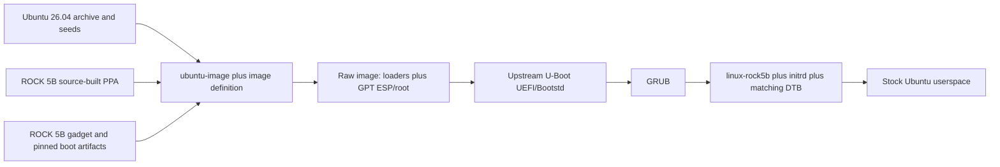

# Ubuntu 26.04 userspace with a ROCK 5B board kernel — successor plan

This is the proposed architecture for a ROCK 5B-only successor to the archived
`ubuntu-rockchip` image project. It deliberately separates the familiar Ubuntu
experience from the board-support layer that this project would have to own.

> **State:** design only as of 2026-08-01. No image built from this plan has
> booted. External facts, trust labels, and the evidence boundary are recorded
> in the [dated survey](../findings/2026-08-01-stock-ubuntu-rock5b-successor-architecture.md).
> Live implementation state belongs in [`status.md`](../status.md) only after a
> workstream and its first evidence exist.

## Product contract

The honest product description is:

> **Ubuntu 26.04 LTS userspace for the Radxa ROCK 5B, community-supported,
> with a custom ROCK 5B kernel and boot firmware.**

"Stock Ubuntu" means the Ubuntu archive, package manager, release pockets,
seeds, cloud-init, systemd, snap support, container behavior, and GNOME/server
userspace remain the default. It does **not** mean the generic Ubuntu kernel,
unmodified firmware, Canonical certification, or Canonical support for this
board.

The first target is exactly `radxa,rock-5b`, arm64. ROCK 5B+, 5T, CM5, and
other RK3588 boards are out of scope. RAM and supported storage variants expand
the test matrix, not the board matrix.

## Decisions

| Layer | Proposed choice | Rejected as the default |
|-------|-----------------|-------------------------|
| Root filesystem | Ubuntu 26.04 archive and official seeds assembled by `ubuntu-image` | Forking `livecd-rootfs`; mutating a downloaded official image as the release build |
| Kernel | Clean `linux-stable` 6.18.y plus the self-contained ROCK 5B/YSP series and explicit Ubuntu integration config | Ubuntu generic 7.0, an Armbian worktree snapshot, or DKMS as the production driver path |
| Firmware | A released upstream U-Boot tag, one ROCK 5B defconfig, pinned DDR/TPL and TF-A inputs | Radxa's deeply forked 2017.09 lineage as the permanent base; an unpinned upstream tip |
| OS handoff | U-Boot UEFI/Bootstd to GRUB, with versioned kernel, initrd, and matching DTB | `armbianEnv.txt`, `/boot/Image`, `/boot/dtb`, or a single overwrite-in-place kernel |
| Image layout | Gadget-owned raw loader regions plus GPT ESP and ext4 root; optional CIDATA | Undocumented `dd` steps after image generation |
| Updates | Source-built PPA packages and a narrow meta package; retain a fallback kernel | `apt-mark hold`, blanket PPA priority, or replacing unrelated Ubuntu packages |
| Acceleration | Stock base, then explicit media and RDP acceleration profiles | Making system FFmpeg/GRD replacement part of the base image contract |

These are architecture choices, not claims that the named components have
passed the board gates.

## System shape



The image definition chooses the Ubuntu seed, custom kernel package, gadget,
PPA, platform meta package, cloud-init inputs, fstab, and generated artifacts.
The gadget is the one owner of byte offsets and partition layout. Package
maintainer scripts own kernel/initramfs/GRUB lifecycle after first boot; they do
not rewrite raw boot firmware as a side effect of an ordinary kernel update.

## Repository and artifact boundaries

Keep this repository as the evidence, architecture, patch-delivery, and
validation record. Put product assembly in a small separate repository with a
working name such as `ubuntu-rock5b`:

```text
ubuntu-rock5b/
├── image-definition-server.yaml
├── image-definition-desktop.yaml
├── gadget/
│   ├── meta/gadget.yaml
│   └── boot-assets/
├── packages/
│   ├── rock5b-meta/
│   ├── rock5b-settings/
│   └── rock5b-firmware-tools/
└── tests/
    ├── image-audit/
    ├── package-lifecycle/
    └── hardware/
```

Kernel, U-Boot, Ubuntu packaging, and other upstream source trees remain pinned
external repositories. Do not vendor build worktrees or generated binary
artifacts into YSP. Every released image should publish its image definition,
gadget revision, source-package versions, upstream pins, manifest, checksums,
and the applicable firmware-blob identities.

## Boot and firmware

### Target flow

1. RK3588 BootROM reads a loader from the image's documented raw region, or
   from already-installed SPI for the separately qualified NVMe path.
2. The pinned DDR/TPL, SPL, TF-A/BL31, and U-Boot proper artifacts initialize
   the board.
3. U-Boot discovers the ESP through Bootstd/UEFI and starts arm64 GRUB.
4. GRUB loads a versioned `linux-rock5b` kernel, its initrd, and the DTB built
   for that exact kernel package.
5. The root filesystem mounts by filesystem UUID or label, not by a fragile
   device enumeration path.

The initial SD image must boot on a board with blank SPI so the release does not
silently depend on a pre-existing vendor loader. A separately labelled test must
cover the installed-SPI case. NVMe boot is not a first-release promise until the
chosen SPI install/recovery flow is qualified.

### Gadget contract

The gadget should encode, and CI should audit:

- exact raw content file, offset, maximum size, and checksum for every loader;
- GPT start after the reserved loader region;
- a FAT EFI System Partition mounted at `/boot/efi`;
- an ext4 root filesystem with grow-on-first-boot behavior;
- optional CIDATA only when it is part of the declared cloud-init flow; and
- no overlap between raw firmware, primary/backup GPT data, or partitions.

The old builder's observed sector-64 and sector-16384 placement is evidence for
comparison, not permission to assume that an upstream U-Boot build has the same
artifact contract. Pin and inspect the actual upstream binman outputs before
writing `gadget.yaml`.

### Firmware policy

- Build one released upstream U-Boot tag with the dedicated ROCK 5B defconfig.
- Pin the exact DDR/TPL and TF-A/BL31 inputs; record their versions, hashes,
  redistribution terms, and generated-artifact hashes.
- Treat the currently inspected upstream tip as a source candidate only. It is
  not a release pin and has no YSP hardware proof.
- Require UART output and a documented recovery path for every firmware gate.
- Ship an SPI image and an explicit backup/verify/install/recover tool only
  after qualification. Never auto-flash SPI from a kernel or routine platform
  package upgrade.
- Assume neither Secure Boot nor a verified chain for the first community
  preview. Do not imply either until keys, signatures, enforcement, recovery,
  and update behavior are implemented and tested.

Qualification must include blank-SPI SD boot, installed-SPI boot, SD/eMMC/NVMe
discovery as applicable, EFI variable behavior, GRUB menu/fallback selection,
the ROCK 5B RTL8125 Ethernet path, USB keyboard/storage needed for recovery,
warm/cold reboot, and power-loss recovery. The existing
[U-Boot comparison](../boot-firmware/docs/version-comparison.md) supplies the
lineage and artifact audit, not these passes.

## Kernel product

### Source and configuration

Start from a clean, pinned `linux-stable` 6.18.y tag and apply:

1. the contiguous YSP forward-port series (currently `0001`–`0092` at
   `7d53bc7a3adc`);
2. the self-contained ROCK 5B decoder DT described by the
   [vanilla-kernel guide](../kernel-versions/docs/vanilla-kernel.md), plus the
   existing inline encoder/RGA nodes;
3. the smallest separately reviewed set of non-media ROCK 5B enablement patches
   still needed by the release gates; and
4. explicit, reviewable configuration fragments.

The config needs four visible layers:

- upstream arm64 baseline;
- RK3588/ROCK 5B boot, storage, PCIe, Ethernet, display, audio, thermal, and
  firmware requirements;
- Ubuntu integration requirements such as initramfs, AppArmor, seccomp, audit,
  cgroups, nftables, overlayfs, BPF, snap, LXD, and container workloads; and
- optional media enablement, with production debug policy called out.

Keep MPP and RGA built in for the first comparison build because that matches
the strongest existing evidence. `CONFIG_DMABUF_DEBUG` must remain disabled in
production unless the upstream scatterlist-mangling interaction recorded by
status track 1 is resolved and requalified. The general rule is stronger: diff
the final `.config` against both the proven YSP production config and Ubuntu's
arm64 expectations; neither one alone is a sufficient product config.

### Package identity and lifecycle

Use a new source name such as `linux-rock5b` and one flavor, `rock5b`. Produce
versioned image, modules, headers, DTB, and build metadata, plus a small
`linux-rock5b` meta package that advances to the latest qualified ABI. Old
kernels must remain co-installable so GRUB can select a fallback.

Run an early `ukpack` spike because Canonical's current Image Cookbook points
custom hardware kernels there. Accept it only if it can reproduce the package
payload, hooks, headers, DTB placement, and update/rollback behavior required by
the existing PPA evidence. Otherwise keep the minimum Ubuntu-native Debian
packaging needed to meet that contract. The tool choice must not change the
gates.

Remove these Armbian identities and assumptions from the product package:

- shared patched-worktree export and Armbian build wrappers/PHASH identity;
- dependency on Armbian's `media-0001`, patcher order, or board-family config;
- `armbianEnv.txt`, `/boot/Image`, `/boot/dtb`, and Armbian maintainer scripts;
- `Provides`/conflicts that impersonate an Armbian kernel; and
- any source version or payload whose provenance cannot be reconstructed from
  the clean tag and recorded patch series.

Kernel installation must generate the initrd, make its matching DTB available
through the chosen GRUB/`flash-kernel` integration, update GRUB, preserve the
previous kernel, and fail visibly if any step fails. Removal must not delete the
running kernel or the only bootable fallback.

### Maintenance responsibility

The PPA owner owns stable point releases, security fixes, selected Ubuntu
hardening deltas, rebuilds, hardware regression, and advisories for
`linux-rock5b`. Ubuntu userspace security updates continue from the Ubuntu
archive; that fact does not transfer Canonical maintenance to the board kernel
or firmware. Schedule and rehearse the successor-LTS transition before Linux
6.18's projected December 2028 end of life.

## Userspace and package profiles

Keep the archive unmodified by default. Use explicit package dependencies and
package-level pinning only where required; do not apply `Package: *` priority
1001 to the board PPA and do not hold Ubuntu packages to freeze the image.

Proposed package split:

| Package/profile | Contents | Default |
|-----------------|----------|---------|
| `rock5b-platform` | `linux-rock5b` meta, firmware identity/tools, board settings, conservative udev rules, boot integration, diagnostics | Yes, server and desktop |
| `rock5b-media` | MPP, librga, rockchip-vaapi, co-installable FFmpeg tools/config, media validation helpers | Optional until the exact package set passes clean-image gates |
| `rock5b-rdp-hwenc` | Patched system FFmpeg/GRD and the narrow GDM ACL needed for hardware RDP encode | Explicit opt-in |

The base image should preserve the ordinary Ubuntu FFmpeg, GRD, browser, Mesa,
and GNOME dependency graph. A media profile may later make a carefully qualified
subset default on the desktop, but a system-library replacement needs its own
rollback and upgrade tests. Use `video` group access and narrow udev rules;
broader device modes or GDM ACLs are capability-specific opt-ins, not base-image
policy.

The existing source packages are useful inputs, not automatically qualified
Resolute outputs. Rebuild them from source, verify exact upstream and patch
provenance, test clean install/upgrade/removal, and retain the current evidence
label for every patch. In particular, compile-only driver tail work does not
become runtime-validated merely because it is included in an image.

## Image assembly

Build the first artifact from the official Resolute server seeds with
cloud-init, SSH, ordinary Ubuntu apt sources, the board PPA, `rock5b-platform`,
and no desktop or invasive media replacements. A representative artifact name
is `ubuntu-26.04-preinstalled-server-arm64+rock5b.img.xz`; the final naming must
also avoid implying an official Canonical image.

Pin the `ubuntu-image` version because the Image Cookbook and its schemas are
still evolving. For each build, produce and retain:

- compressed raw image and SHA-256 checksum;
- package manifest and file list;
- image definition and gadget revisions;
- kernel, U-Boot, TPL/DDR, TF-A, DTB, and PPA package identities;
- source-package locations and build logs;
- license/redistribution inventory and an SBOM or equivalent machine-readable
  component list; and
- build timestamp and a reproducibility comparison against a clean rebuild.

The official Ubuntu arm64 image is a reference input for seed/package
comparison and userspace smoke testing. A released board image must be produced
from the declared definition rather than by an undocumented mutation pipeline.

## Proof ladder

Change one boundary at a time:

1. **Clean-kernel proof:** boot clean 6.18.y plus the YSP series and
   self-contained DT on the currently known userspace/firmware path. Re-run the
   established kernel and media gates. This removes Armbian kernel-source
   assumptions first.
2. **Userspace proof:** boot an Ubuntu 26.04 server rootfs with that same kernel,
   DTB, and known firmware through an interim known boot path. Prove cloud-init,
   SSH, apt, snap/container expectations, and services before changing U-Boot.
3. **Final-boot proof:** switch to the pinned upstream U-Boot, gadget layout,
   UEFI/GRUB, and final kernel lifecycle. Prove update, fallback, removal, blank
   SPI, installed SPI, and recovery.
4. **Reproducible server preview:** build the complete definition from clean
   inputs twice, audit manifests/layout, flash fresh media, and run the server
   release gate.
5. **Desktop:** add stock Ubuntu Desktop/GNOME and qualify Wayland, Panfrost,
   display, audio, input, browser, suspend/reboot, and upgrade behavior without
   accelerated replacement packages.
6. **Acceleration profiles:** add `rock5b-media`, then the more invasive RDP
   profile, with exact clean-image and rollback gates for each.

QEMU can validate generic arm64 userspace and packaging behavior, but it cannot
prove RK3588 firmware, DT, storage, display, or accelerator behavior. Until a
hardware-in-the-loop rig exists, release evidence needs a named board, UART
capture, exact image checksum, and manually recorded pass/fail bundle.

## Minimum release gates

The first server preview must pass all of the following on an exact ROCK 5B
identity:

- blank-SPI SD boot to login, plus the separately declared installed-SPI case;
- correct U-Boot, DTB, kernel, root-media, and userspace identities;
- Ethernet link, DHCP/static configuration as declared, SSH, DNS, and bounded
  bidirectional throughput/loss testing;
- root filesystem grow, time synchronization, reboot, cold boot, and repeated
  unclean-power filesystem checks on disposable media;
- `apt update`, full upgrade, reboot into kernel N+1, manual selection of N,
  failed-N+1 recovery, and safe removal of N+1;
- initramfs and GRUB regeneration, package install/remove/reinstall, and PPA
  key/source correctness;
- cloud-init first boot and idempotent subsequent boot;
- AppArmor, seccomp, cgroups, nftables, snap, and at least one LXD/container
  smoke test if advertised;
- bounded CPU/memory/storage load with thermal, OOM, IOMMU, PCIe, and filesystem
  error scans; and
- no unexpected panic/oops/WARN/hung-task/IOMMU/firmware errors in the retained
  journal and ramoops channels.

If a media profile ships, append the existing MPP/RGA conformance, root gates,
codec matrix, VA-API/browser, long-run, and application-specific gates. Passing
those media gates does not waive the whole-board gaps in
[`support-coverage.md`](support-coverage.md). Before calling even the server
image release-grade, add useful evidence for C04–C10 and C15–C19: thermals,
memory pressure, general SD/eMMC/NVMe I/O, Ethernet, USB, display, audio,
wireless when fitted, GPIO, suspend/power, reboot/watchdog, and recovery.

## Delivery sequence and rough effort

| Milestone | Narrow promise | Planning estimate |
|-----------|----------------|-------------------|
| 0.0 proof of concept | Clean 6.18 kernel on a stock Resolute server rootfs; UART, Ethernet, SSH | 1–2 weeks |
| 0.1 server preview | Reproducible SD image, cloud-init, apt upgrade, kernel fallback, checksums/manifest | 4–8 weeks total from start |
| 0.2 storage/firmware | Final upstream U-Boot qualification, explicit SPI tooling, eMMC/NVMe paths | Depends on recovery and hardware failures found |
| Desktop preview | Stock GNOME/Wayland, display/audio/input/Panfrost and upgrade gates | Roughly 3–6 additional weeks |
| Media profiles | Qualified MPP/RGA/VA-API and optional RDP replacements | After base desktop stability; ongoing rebase cost |

These are **INFERRED** engineering ranges, not commitments. Firmware recovery,
kernel regressions, board-peripheral gaps, and Launchpad turnaround dominate the
variance. Release 0.1 should make a narrow server-preview claim, not "full ROCK
5B support."

## Open decisions before implementation

1. Does the first preview support SD only, or SD plus eMMC? Keep NVMe/SPI out
   until its recovery contract is chosen.
2. Does `ukpack` meet the required versioned-DTB and rollback contract, or does
   `linux-rock5b` need a small maintained Debian packaging layer?
3. Which released U-Boot tag and exact rkbin/TF-A revisions pass the qualification
   matrix and have acceptable redistribution terms?
4. Should the desktop eventually install `rock5b-media` by default, while
   keeping system FFmpeg/GRD replacements opt-in?
5. Which non-media RK3588 patches are truly required beyond the current
   self-contained 6.18/YSP tree?

The repository-owned licensing decision is closed in
[`LICENSE.md`](../LICENSE.md): documentation and non-code use CC BY-SA 4.0,
while code follows its upstream target and Yi Ding's own original kernel
contributions use GPL-2.0-or-later. That grant does not apply to upstream
kernel code. A public image still needs an artifact-level audit: preserve
all imported upstream notices, record every exact component license, verify
rkbin/TF-A redistribution, and review Ubuntu naming/trademark requirements.
