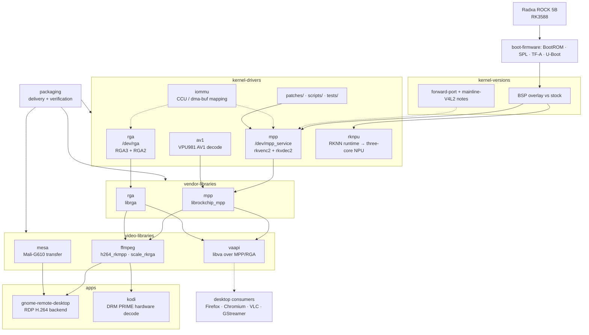

# Work packages — how this repo is organized

The work here improves ROCK 5B support on Armbian's Ubuntu 26.04 images. Most
project directories follow the RK3588 hardware-video path from kernel bases up
to real applications; boot-chain knowledge has a durable owner in
[`../boot-firmware/`](../boot-firmware/README.md), with raw observations still
entering through `findings/`. The whole-board [`support coverage inventory`](support-coverage.md) makes areas
outside that media-heavy project taxonomy explicit instead of silently treating
them as supported. The
repo is split **project-by-project**, grouped into categories; this page is the
detailed reading map and owns the canonical stack diagram (the root
[`README.md`](../README.md) carries the front-door taxonomy that links here).

Project-specific docs, patches, scripts, tests, and code artifacts live inside
the owning project. Category hubs such as `apps/` and `video-libraries/` map
their child projects; each project front door answers the same questions near
the top of its `README.md`:

| Field | Meaning |
|-------|---------|
| Purpose / user outcome | What this project covers or enables and where its code lives (which `../` tree). |
| Developer focus | What someone changing, reviewing, or upstreaming code should learn here. |
| Owns | The files, patches, or docs for which this project is the front door. |
| Depends on | The lower layers or external projects that must already work. |
| Current state | The dated validation or known caveat, with [`../status.md`](../status.md) as the rollup. |

## Stack diagram

## Project map

| Category | Project | Purpose | Entry |
|----------|---------|---------|-------|
| boot-firmware | U-Boot | BootROM-to-Linux stages, Rockchip artifacts, Armbian/Radxa/upstream comparison, and safe boot debugging. | [`../boot-firmware/`](../boot-firmware/README.md) |
| kernel-versions | — | Kernel bases and moving between them: BSP overlay vs stock, forward-port narrative, mainline-V4L2 alternative. | [`../kernel-versions/`](../kernel-versions/README.md) |
| kernel-drivers | mpp / rga / av1 / iommu / rknpu | In-kernel accelerator drivers. Shared driver model, DT, patches, scripts, tests at the top; RKNPU also documents its tightly coupled RKNN userspace. | [`../kernel-drivers/`](../kernel-drivers/README.md) |
| vendor-libraries | mpp / rga | `librockchip_mpp` and `librga` userspace: library/kernel split, ioctls, dma-buf imports, ABI facts. | [`../vendor-libraries/`](../vendor-libraries/README.md) |
| video-libraries | ffmpeg / vaapi / mesa | RKMPP codecs/RGA filters, the standard VA-API bridge for desktop consumers, and the Mali-G610 transfer investigation behind GRD fallback. | [`../video-libraries/`](../video-libraries/README.md) |
| apps | gnome-remote-desktop / kodi | Real application integration: zero-copy RDP encode and DRM PRIME media playback. | [`../apps/`](../apps/README.md) |
| packaging | — | Installable delivery: DKMS, udev ACLs, PPA source packages, rollback, binary policy. | [`../packaging/`](../packaging/README.md) |
| scripts | — | Repo-wide maintenance checks (links, documentation contracts, whitespace) and board operations. | [`../scripts/`](../scripts/README.md) |

## Operating and re-entry paths

| Goal | Path |
|------|------|
| Check the repo before handoff | [`../CONTRIBUTING.md`](../CONTRIBUTING.md) -> `bash scripts/check-repo.sh` |
| Reconstruct a multi-finding investigation | [`../findings/` investigation trails](../findings/README.md#reconstruct-an-investigation) -> maintained project model -> [`../status.md`](../status.md) |
| Find an unassessed board subsystem or choose the next intake test | [`support-coverage.md`](support-coverage.md) -> [`system-baseline.md`](system-baseline.md) -> [`../findings/`](../findings/README.md) |
| Understand or diagnose SD/SPI/U-Boot behavior | [`../boot-firmware/`](../boot-firmware/README.md) -> [debugging guide](../boot-firmware/docs/debugging.md) -> [`../status.md`](../status.md) track 12 -> [`../scripts/`](../scripts/README.md) |
| Compare the validated 6.18 vendor path with maximum-mainline RK3588 support | [`../kernel-versions/`](../kernel-versions/README.md) -> [`../packaging/ppa/kernel-maxline/board-support.md`](../packaging/ppa/kernel-maxline/board-support.md) -> [`../status.md`](../status.md) track 13 |
| Capture a reproducible board/runtime baseline | [`system-baseline.md`](system-baseline.md) -> [`../kernel-drivers/tests/conformance/`](../kernel-drivers/tests/conformance/README.md) |
| Get codecs working on a board | [`../install.md`](../install.md) -> [`../kernel-drivers/`](../kernel-drivers/README.md) -> [`../kernel-drivers/scripts/`](../kernel-drivers/scripts/README.md) -> [`../kernel-drivers/tests/`](../kernel-drivers/tests/README.md) |
| Understand or begin validating RKNN inference | [`../kernel-drivers/rknpu/`](../kernel-drivers/rknpu/README.md) -> [`how-rknpu-works.md`](../kernel-drivers/rknpu/docs/how-rknpu-works.md) -> [`support-coverage.md`](support-coverage.md) row C16 |
| Build a command-line media stack | [`../vendor-libraries/`](../vendor-libraries/README.md) -> [`../video-libraries/ffmpeg/`](../video-libraries/ffmpeg/README.md) -> [`../kernel-drivers/tests/transcode-test.sh`](../kernel-drivers/tests/transcode-test.sh) |
| Understand or validate browser/desktop VA-API | [`../video-libraries/vaapi/`](../video-libraries/vaapi/README.md) -> [`app-enablement.md`](app-enablement.md) -> [`../status.md`](../status.md) track 14 |
| Run accelerated RDP | [`../install.md`](../install.md) -> [`../packaging/`](../packaging/README.md) -> [`../apps/gnome-remote-desktop/`](../apps/gnome-remote-desktop/README.md) |
| Build and test Kodi hardware decode | [`../apps/kodi/`](../apps/kodi/README.md) -> [`../apps/kodi/docs/build-hwaccel.md`](../apps/kodi/docs/build-hwaccel.md) |
| Recover from a failure | [`../status.md`](../status.md) -> [`gotchas.md`](gotchas.md) -> [`debug-kernel.md`](../kernel-drivers/docs/debug-kernel.md) |

## Developer reading paths

| Goal | Path |
|------|------|
| Compare or modify U-Boot | [`../boot-firmware/docs/u-boot-primer.md`](../boot-firmware/docs/u-boot-primer.md) -> [`../boot-firmware/docs/version-comparison.md`](../boot-firmware/docs/version-comparison.md) -> pinned sibling trees |
| Review the kernel port | [`../kernel-drivers/`](../kernel-drivers/README.md) -> [`how-the-drivers-work.md`](../kernel-drivers/docs/how-the-drivers-work.md) -> [`vendor-forward-port.md`](../kernel-versions/docs/vendor-forward-port.md) -> [`vendor-delta.md`](../kernel-drivers/docs/vendor-delta.md) |
| Review the rewrite's current and target architecture | [`../kernel-drivers/docs/rewrite-driver-architecture/`](../kernel-drivers/docs/rewrite-driver-architecture/README.md) -> [`driver-architecture-comparison.md`](../kernel-drivers/docs/driver-architecture-comparison.md) -> [`rewrite-ownership-refactor-plan.md`](../kernel-drivers/docs/rewrite-ownership-refactor-plan.md) -> [`rewrite-validation-plan.md`](../kernel-drivers/docs/rewrite-validation-plan.md) |
| Maintain or refresh the maximum-mainline proposal integration | [`../packaging/ppa/kernel-maxline/`](../packaging/ppa/kernel-maxline/README.md) -> [`manifest.yaml`](../packaging/ppa/kernel-maxline/manifest.yaml) -> [`public-series.tsv`](../packaging/ppa/kernel-maxline/public-series.tsv) / [`wip-donors.tsv`](../packaging/ppa/kernel-maxline/wip-donors.tsv) |
| Review userspace ABI compatibility | [`../vendor-libraries/`](../vendor-libraries/README.md) -> [`how-the-userspace-libs-work.md`](../vendor-libraries/docs/how-the-userspace-libs-work.md) -> [`dev-uapis.md`](../kernel-drivers/docs/dev-uapis.md) -> [`rewrite-drivers.md`](../kernel-drivers/docs/rewrite-drivers.md) |
| Review the RKNN/RKNPU boundary | [`how-rknpu-works.md`](../kernel-drivers/rknpu/docs/how-rknpu-works.md) -> [`kernel-driver-architecture.md`](../kernel-drivers/rknpu/docs/kernel-driver-architecture.md) -> [quality/security appendix](../findings/2026-07-16-rockchip-bsp-driver-quality.md#rknpu-deep-dive-capable-fixed-stack-unsafe-multi-client-abi) -> pinned sibling trees |
| Maintain the package set | [`../packaging/`](../packaging/README.md) -> [`armbian-packaging.md`](../packaging/docs/armbian-packaging.md) -> [`resyncing.md`](../kernel-drivers/docs/resyncing.md) |
| Upstream or rebase application work | [`../video-libraries/ffmpeg/docs/rebase-notes.md`](../video-libraries/ffmpeg/docs/rebase-notes.md), [`../video-libraries/ffmpeg/docs/fix-candidates.md`](../video-libraries/ffmpeg/docs/fix-candidates.md), [`../video-libraries/vaapi/`](../video-libraries/vaapi/README.md), [`../apps/gnome-remote-desktop/patches/`](../apps/gnome-remote-desktop/patches/README.md), [`../video-libraries/mesa/docs/validation.md`](../video-libraries/mesa/docs/validation.md) |

## Maintenance rule

[`../CONTRIBUTING.md`](../CONTRIBUTING.md) is the canonical update contract. It
owns the file-placement rules, evidence lifecycle, status/ledger procedure, and
handoff checks; this page owns only the project taxonomy and reading paths.
