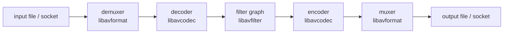
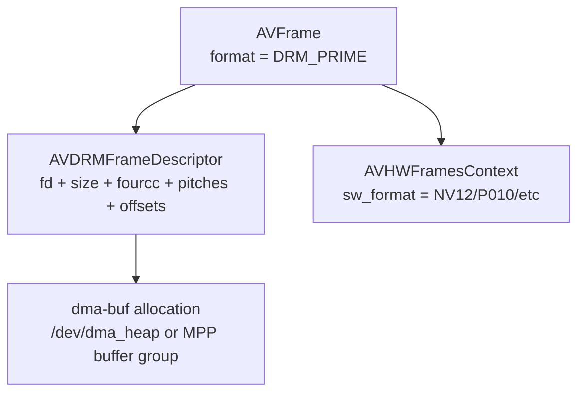
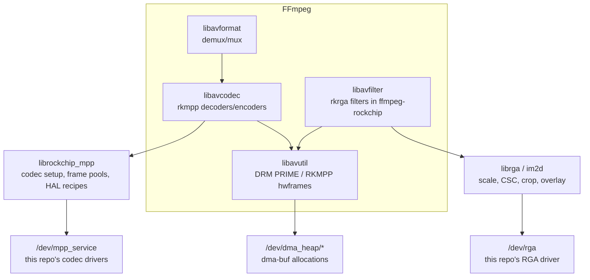
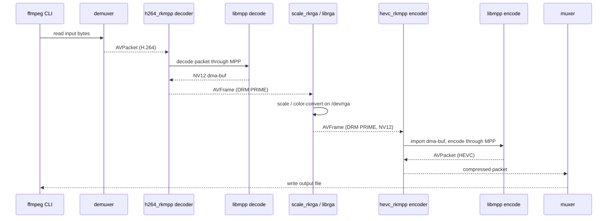
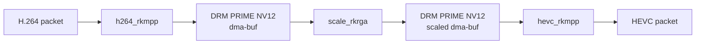
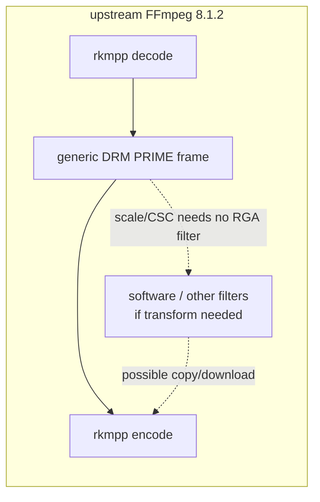
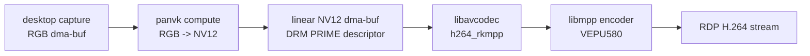
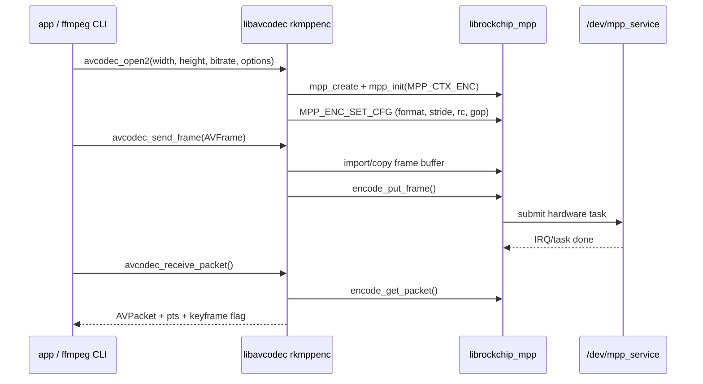

# How FFmpeg works in this stack

This is the FFmpeg companion to the kernel, uAPI, and userspace-library docs. It
is written for someone who understands the Rockchip codec stack at a high level,
but is not an FFmpeg developer.

The short version: FFmpeg does not replace libmpp or librga. FFmpeg is the
plumbing layer that reads media files or streams, chooses decoders and encoders,
moves frames through a filter graph, and hands hardware frames to libmpp/librga
when an rkmpp codec or rkrga filter is selected.

## 0. The mental model

Most FFmpeg pipelines are the same five-stage shape:



In plain terms:

- The **demuxer** opens a container such as MP4, Matroska, or raw Annex B H.264
  and pulls out compressed stream chunks.
- The **decoder** turns compressed chunks into raw pictures.
- The **filter graph** changes raw pictures: scale, crop, color-convert, overlay,
  upload/download hardware frames, and so on.
- The **encoder** turns raw pictures back into compressed chunks.
- The **muxer** writes those chunks into the output container.

The `ffmpeg` command-line tool is only one front end to these libraries. GNOME
Remote Desktop does not shell out to `ffmpeg`; it links libavcodec/libavutil and
calls the same encoder API directly.

## 1. The two key objects: packets and frames

FFmpeg uses two object types everywhere:

| FFmpeg object | Meaning | Rockchip example |
|---------------|---------|------------------|
| `AVPacket` | Compressed bytes plus timestamps. Usually container payload or encoded output. | H.264 NAL units going into `h264_rkmpp` decode, or coming out of `h264_rkmpp` encode. |
| `AVFrame` | One decoded/raw picture plus metadata. Can be CPU memory or a hardware-frame descriptor. | NV12 stored in a dma-buf and described as DRM PRIME. |

A software frame has CPU pointers in `frame->data[]`. A hardware frame usually
does not. Instead it carries a descriptor and a reference to an `AVHWFramesContext`
that says what hardware pool the frame came from and what the underlying software
pixel format would be if mapped.

For this stack, the important hardware format is **DRM PRIME**. In FFmpeg terms,
`AV_PIX_FMT_DRM_PRIME` means "this frame is described by dma-buf fds, DRM fourcc
formats, pitches, offsets, and modifiers." It does not mean the GPU rendered it;
it is just the standard fd-based way to pass a picture between Linux media
drivers without copying.



## 2. Where Rockchip code plugs in

Rockchip support enters FFmpeg through codec wrappers and, in ffmpeg-rockchip,
through filters and a hardware context:

| FFmpeg layer | Upstream FFmpeg 8.1.2 | ffmpeg-rockchip |
|--------------|-----------------------|-----------------|
| `libavcodec` decode | `h264_rkmpp`, `hevc_rkmpp`, `vp8_rkmpp`, `vp9_rkmpp` call libmpp. | More rkmpp decoders call libmpp. |
| `libavcodec` encode | `h264_rkmpp`, `hevc_rkmpp` call libmpp. | H.264, HEVC, and MJPEG encoders call libmpp with more controls exposed. |
| `libavfilter` | No Rockchip RGA filters. | `scale_rkrga`, `vpp_rkrga`, `overlay_rkrga` call librga. |
| `libavutil` hardware context | Uses generic DRM PRIME hardware frames. | Adds an RKMPP hardware device and frame pool backed by MPP buffers. |

The important boundary: FFmpeg does **not** program VEPU580, VDPU381, or RGA
registers directly. It calls the userspace libraries:



The kernel and uAPI docs explain what happens after libmpp/librga issue their
ioctls. This document is about the FFmpeg side of the handoff.

## 3. A full ffmpeg-rockchip transcode

The repo's full transcode test is the cleanest FFmpeg example:

```bash
ffmpeg -hwaccel rkmpp -hwaccel_output_format drm_prime -i in.h264 \
  -vf scale_rkrga=w=1280:h=720:format=nv12 \
  -c:v hevc_rkmpp -b:v 4M out.mp4
```

Data flow:



The key points:

- `-hwaccel rkmpp` selects the rkmpp decoder wrapper.
- `-hwaccel_output_format drm_prime` asks the decoder to output hardware frames
  rather than downloading to CPU memory.
- `scale_rkrga` accepts DRM PRIME frames, uses librga, and outputs DRM PRIME
  frames.
- `hevc_rkmpp` imports the output dma-buf and gives it to libmpp's encoder.

So the big picture is:



This is why ffmpeg-rockchip is so useful for validating this repo's kernel stack:
the command exercises `/dev/mpp_service`, `/dev/dma_heap/*`, and `/dev/rga` in one
pipeline.

## 4. What upstream FFmpeg 8.1.2 can and cannot do

Upstream FFmpeg 8.1.2 has rkmpp decoders and encoders, but no RGA filters and no
RKMPP hardware context. It models rkmpp output as generic DRM PRIME.

That is enough for:

- decoding H.264/HEVC/VP8/VP9 with MPP;
- encoding H.264/HEVC with MPP;
- importing a linear NV12 DRM PRIME frame into the encoder;
- application-level use cases where the application already supplies the right
  hardware frame, as GNOME Remote Desktop does.

It is not enough for a full Rockchip hardware post-processing chain inside
FFmpeg. If the CLI pipeline needs scale, crop, color conversion, or overlay,
upstream FFmpeg 8.1.2 has no `scale_rkrga`/`vpp_rkrga`/`overlay_rkrga` equivalent.
You either avoid that transform, use a non-Rockchip hardware path if one fits, or
fall back to software/downloads.



## 5. How GRD uses FFmpeg differently

GNOME Remote Desktop uses FFmpeg as a library, and only for the encode stage. It
does not need `scale_rkrga` because GRD's graphics pipeline already has a Vulkan
RGB -> NV12 path:



This is why upstream FFmpeg 8.1.2 is acceptable for GRD: GRD already provides a
proper NV12 hardware frame. The trade-off is that upstream's encoder wrapper is
thin. GRD must work around things ffmpeg-rockchip exposes directly:

- no fixed-QP option;
- no H.264 profile option;
- no forced-IDR handling for `frame->pict_type = I`;
- `rc_max_rate` must be set explicitly to avoid MPP's low default VBR ceiling.

## 6. What a wrapper does inside libavcodec

An FFmpeg codec wrapper has three jobs:

1. Translate FFmpeg settings into the external codec library's settings.
2. Translate FFmpeg frames/packets into the external library's buffers.
3. Preserve FFmpeg's API expectations around timestamps, flushing, keyframe
   flags, extradata, errors, and cleanup.

For rkmpp encode, that means:



The difference between upstream FFmpeg 8.1.2 and ffmpeg-rockchip is mostly in
step 1 and step 2:

- upstream translates only a small set of options and accepts only a narrow set of
  input formats;
- ffmpeg-rockchip translates more MPP controls, supports more input formats, and
  can allocate/share frames through its RKMPP hwcontext.

## 7. How to tell which behavior your binary has

The codec names overlap, so check behavior rather than assuming from the name:

```bash
ffmpeg -hide_banner -filters | grep rkrga
ffmpeg -hide_banner -h encoder=h264_rkmpp
ffmpeg -hide_banner -h decoder=h264_rkmpp
ffmpeg -hide_banner -hwaccels | grep rkmpp
```

Interpretation:

| Probe | Upstream FFmpeg 8.1.2 | ffmpeg-rockchip |
|-------|-----------------------|-----------------|
| `grep rkrga` | no output | `scale_rkrga`, `vpp_rkrga`, `overlay_rkrga` |
| `-h encoder=h264_rkmpp` | `rc` only for rate control; no QP/profile/IDR option surface | `rc_mode`, QP controls, profile/level/coder controls |
| `-hwaccels` / hwdevice names | no RKMPP hwdevice | RKMPP hwdevice support |

The same command line can therefore mean different things depending on which
FFmpeg implementation is installed.
