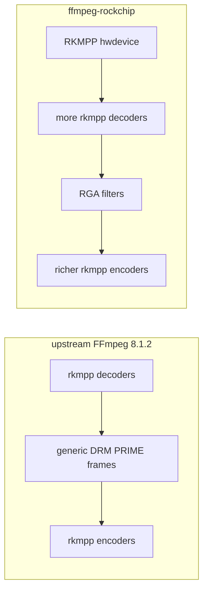
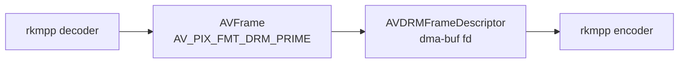
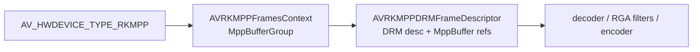
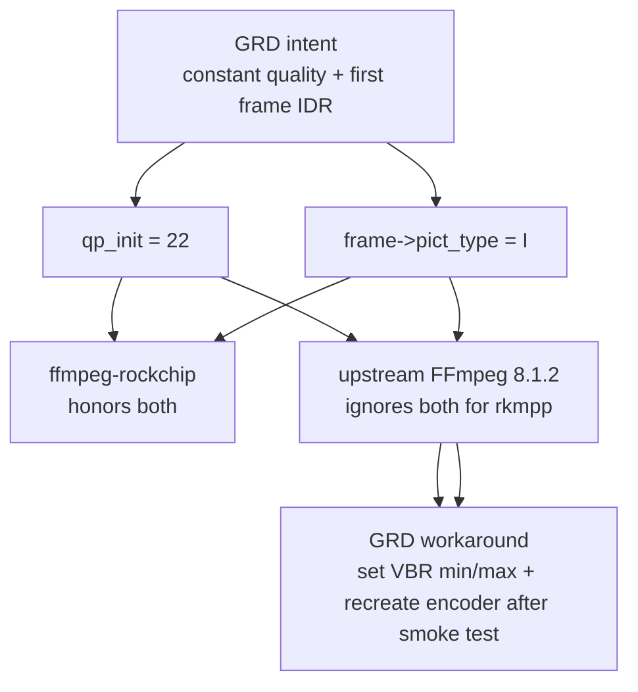
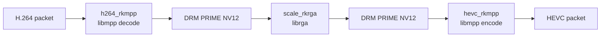
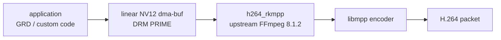
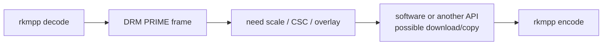

# FFmpeg implementation comparison

This compares **upstream FFmpeg 8.1.2** with **ffmpeg-rockchip** for the parts
that matter to this ROCK 5B codec stack. Read
[`HOW-FFMPEG-WORKS.md`](HOW-FFMPEG-WORKS.md) first if you want the FFmpeg mental
model before the source-level differences.

Comparison points:

| Implementation | Source point | Why it matters here |
|----------------|--------------|---------------------|
| upstream FFmpeg 8.1.2 | release tag `n8.1.2` (`38b88335f99e`, 2026-06-17) | ABI-friendly base used by the packaged GNOME Remote Desktop stack. |
| ffmpeg-rockchip | `40c412daccf0` (`40c412d`, 2026-04-23) | Rockchip-focused fork used for full CLI hardware transcode validation. |

This is a source-code comparison, not a new runtime benchmark.

## 0. Summary

Both implementations use Rockchip's **libmpp** for codecs. They differ in how
much of the Rockchip hardware pipeline they expose through FFmpeg.



Upstream FFmpeg 8.1.2 is a compact codec bridge:

- decode H.264/HEVC/VP8/VP9 through MPP;
- encode H.264/HEVC through MPP;
- pass frames as generic DRM PRIME descriptors;
- keep the public ABI close to distro FFmpeg;
- omit Rockchip RGA filters and most MPP encoder controls.

ffmpeg-rockchip is a full platform pipeline:

- broader MPP codec list;
- RKMPP hardware device and MPP-backed frame pools;
- RGA filters for scale, crop, color conversion, transpose, and overlay;
- more encoder controls: fixed QP, profile, level, CABAC, forced IDR, SEI, AFBC,
  async depth, and more formats.

The practical choice in this repo:

| Need | Best fit | Why |
|------|----------|-----|
| Full command-line hardware transcode with scale/CSC | ffmpeg-rockchip | It has `scale_rkrga`/`vpp_rkrga` and keeps frames in dma-buf form. |
| Distro-style FFmpeg upgrade for applications | upstream FFmpeg 8.1.2 with rkmpp enabled | It is ABI-compatible with the FFmpeg 8.x package set used by Ubuntu/Armbian. |
| GRD hardware H.264 encode | upstream FFmpeg 8.1.2 plus GRD workarounds | GRD already supplies NV12 DRM PRIME frames; it only needs the encoder bridge. |
| Constant-quality H.264/HEVC from the CLI | ffmpeg-rockchip | It exposes MPP fixed-QP mode. |

## 1. Build and registration

| Area | upstream FFmpeg 8.1.2 | ffmpeg-rockchip |
|------|-----------------------|-----------------|
| Configure switches | `--enable-rkmpp`; requires `--enable-libdrm`. | `--enable-rkmpp --enable-rkrga --enable-libdrm`; `rkrga` requires `rkmpp`. |
| MPP pkg-config | `rockchip_mpp >= 1.3.8`; checks `rockchip/rk_mpi.h`, `rockchip/mpp_buffer.h`, `mpp_create`, and `mpp_buffer_sync_begin_f`. | `rockchip_mpp >= 1.3.9`; checks `rockchip/rk_mpi.h` and `mpp_create`. |
| RGA pkg-config | None. | `librga`; checks `rga/RgaApi.h` (`c_RkRgaBlit`) and `rga/im2d.h` (`querystring`). |
| libavutil additions | None for Rockchip. | Adds `hwcontext_rkmpp.c` and `hwcontext_rkmpp.h`; registers `AV_HWDEVICE_TYPE_RKMPP`. |
| libavfilter additions | None for Rockchip. | Adds `rkrga_common.c`, `vf_vpp_rkrga.c`, and `vf_overlay_rkrga.c`. |

Source footprint:

| Implementation | Rockchip-specific FFmpeg files |
|----------------|--------------------------------|
| upstream FFmpeg 8.1.2 | `libavcodec/rkmppdec.c`, `libavcodec/rkmppenc.c` |
| ffmpeg-rockchip | `rkmppdec.c/.h`, `rkmppenc.c/.h`, `hwcontext_rkmpp.c/.h`, `rkrga_common.c/.h`, `vf_vpp_rkrga.c`, `vf_overlay_rkrga.c` |

That file list explains the difference in ambition. Upstream only wraps libmpp
codecs. The fork also builds a Rockchip hardware-frame and RGA post-processing
world inside FFmpeg.

## 2. Hardware-frame model

### Upstream FFmpeg 8.1.2

Upstream uses FFmpeg's existing DRM hardware-frame model:



Important details:

- The decoder sets `avctx->pix_fmt = AV_PIX_FMT_DRM_PRIME`.
- The decoder advertises an internal DRM PRIME hardware config.
- The encoder accepts DRM PRIME frames from a DRM frames context.
- For DRM PRIME encode input, upstream requires `hwframes->sw_format == NV12`.
- The encoder imports the dma-buf fd with `mpp_buffer_import()`.

This is simple and upstream-friendly, but it leaves allocation and post-processing
mostly outside Rockchip-specific FFmpeg code.

### ffmpeg-rockchip

The fork adds an RKMPP hardware device:



Important details:

- `AV_HWDEVICE_TYPE_RKMPP` is registered under the name `rkmpp`.
- `AVRKMPPFramesContext` owns an MPP buffer group and optional preallocated frame
  descriptors.
- `AVRKMPPDRMFrameDescriptor` embeds the normal `AVDRMFrameDescriptor` and keeps
  `MppBuffer` references alive.
- The hwcontext implements allocation, CPU map/unmap for linear frames,
  transfer-to/from, and `DMA_BUF_IOCTL_SYNC`.

The result is a coherent hardware-frame model for decode -> RGA -> encode. The
fork can allocate frames that MPP and RGA both understand, while still presenting
them to FFmpeg as hardware frames.

## 3. Decoder behavior

| Capability | upstream FFmpeg 8.1.2 | ffmpeg-rockchip |
|------------|-----------------------|-----------------|
| Registered rkmpp decoders | H.264, HEVC, VP8, VP9. | AV1, H.263, H.264, HEVC, MJPEG, MPEG-1, MPEG-2, MPEG-4, VP8, VP9. |
| Output frames | DRM PRIME only. | DRM PRIME or negotiated software formats (`NV12`, `NV16`, `NV15`, `NV20`) through the RKMPP frame model. |
| Decoder options | No Rockchip decoder options exposed. | `deint`, `afbc=off/on/rga`, `fast_parse`, `buf_mode=half/ext`. |
| AFBC/RFBC awareness | Minimal DRM fourcc/modifier handling. | Explicit AFBC/RFBC helpers and modifier-aware descriptors. |
| Buffer ownership | Internal MPP decoder flow, exposed as generic DRM PRIME. | Half-internal or pure-external MPP buffer mode; external mode can use RKMPP frame pools. |

In plain terms: upstream can hardware-decode the common formats, but it does not
try to be the whole Rockchip frame-management environment. ffmpeg-rockchip does.

The fork's broader codec list is not the same thing as this repo validating every
listed codec on RK3588. This repo's hardware goal and tests are H.264/H.265
decode, H.264/H.265 encode, and RGA scale/CSC.

## 4. Encoder behavior

Encoder differences are the most important application-facing differences.

| Capability | upstream FFmpeg 8.1.2 | ffmpeg-rockchip |
|------------|-----------------------|-----------------|
| Registered rkmpp encoders | H.264, HEVC. | H.264, HEVC, MJPEG. |
| H.264/HEVC input formats | `DRM_PRIME`, `NV12`, `YUV420P`; DRM PRIME must describe NV12. | Many YUV, semi-planar, packed YUV, RGB/BGR, and DRM PRIME formats. |
| Rate-control option | `rc=vbr/cbr/avbr`; default is VBR. | `rc_mode=VBR/CBR/CQP/AVBR`; default is auto. |
| Fixed QP | Not exposed and no `rc:qp_*` values are written. | Exposed through `CQP` and through auto mode when `qp_init >= 0`. |
| Bitrate bounds | Writes `rc:bps_target` from `bit_rate`; writes `rc:bps_max` only from `rc_max_rate`; writes `rc:bps_min` only from `rc_min_rate`. | Computes and writes target/min/max for bitrate modes. Fixed-QP mode skips bitrate setup. |
| H.264 profile/level/coder | Not exposed. MPP defaults apply. In the GRD case this behaved as constrained baseline. | Exposes profile, level, CABAC/CAVLC, 8x8 transform, user-data SEI, and prefix mode. Default H.264 profile is High. |
| HEVC profile/tier/level | Not exposed. | Exposes profile, tier, and level. |
| Forced IDR | Does not inspect `frame->pict_type`; cannot turn an FFmpeg I-frame request into an MPP IDR request. | Calls `MPP_ENC_SET_IDR_FRAME` when an H.264/HEVC input frame has `pict_type == I`. |
| Header/extradata | Can emit global header or header on each IDR through MPP header mode. | Same concept, plus more SEI/header controls. |
| Packet metadata | Marks keyframes from `KEY_OUTPUT_INTRA`. | Marks keyframes and attaches average-QP encoder stats from `KEY_ENC_AVERAGE_QP`. |
| Async behavior | Simple receive loop around FFmpeg's encode queue and MPP put/get. | Tracks submitted frames, uses nonblocking output for H.26x/MJPEG unless low-delay is requested, and supports deeper frame parallelism. |

### Why GRD needed workarounds on upstream FFmpeg 8.1.2

GNOME Remote Desktop's VA-API path was designed around fixed-QP intent: "encode
this desktop at roughly constant quality." That maps well to ffmpeg-rockchip, but
not to upstream FFmpeg 8.1.2.



The concrete consequences:

- `qp_init=22` selects fixed-QP mode in ffmpeg-rockchip, but there is no upstream
  option to set it.
- `frame->pict_type = I` forces IDR in ffmpeg-rockchip, but upstream does not call
  `MPP_ENC_SET_IDR_FRAME`.
- Upstream only sets `rc:bps_max` when `AVCodecContext.rc_max_rate` is set. If an
  application sets only `bit_rate`, MPP can retain its low default VBR ceiling.
- Upstream does not set H.264 profile, so applications cannot ask it for High
  profile through the rkmpp wrapper.

That is why the GRD patch sets `rc_max_rate`/`rc_min_rate` and recreates the
encoder after the startup smoke encode.

## 5. RGA filter behavior

Upstream FFmpeg 8.1.2 has no Rockchip RGA filters. ffmpeg-rockchip adds three:

| Filter | Purpose | Input/output model |
|--------|---------|--------------------|
| `scale_rkrga` | Resize and pixel-format conversion. | DRM PRIME -> DRM PRIME. |
| `vpp_rkrga` | Scale, crop, and transpose. | DRM PRIME -> DRM PRIME. |
| `overlay_rkrga` | Two-input composition. | DRM PRIME + DRM PRIME -> DRM PRIME. |

Common RGA features in ffmpeg-rockchip:

- pixel-format mapping from FFmpeg formats to librga formats;
- RGA2/RGA3 feature checks;
- multicore RGA scheduler-core selection;
- async blits and fence synchronization;
- AFBC output option;
- AFBC/RFBC input modifier handling;
- format forcing (`force_yuv`, `force_chroma`);
- `async_depth` queueing.

The important CLI-visible gotcha:

```bash
scale_rkrga=w=640:h=480
```

does **not** mean exact 640x480 by default. `scale_rkrga` defaults
`force_original_aspect_ratio=decrease`, so exact dimensions require:

```bash
scale_rkrga=w=640:h=480:force_original_aspect_ratio=disable
```

## 6. Pipeline differences

### ffmpeg-rockchip full hardware transcode



This is what `tests/transcode-test.sh` validates. A pass means the decoder, RGA,
encoder, dma-heap allocation, dma-buf import, and device permissions all worked.

### Upstream FFmpeg 8.1.2 application encode



This is the GRD model. FFmpeg is not asked to scale or color-convert; GRD's
Vulkan path already produced the NV12 frame.

### Upstream FFmpeg 8.1.2 CLI with transforms



This is where upstream falls short for our validation use case: it has the codec
bridge, but not Rockchip's hardware post-processing bridge.

## 7. Which one do I have?

The codec names overlap, so check the option surface:

```bash
ffmpeg -hide_banner -filters | grep rkrga
ffmpeg -hide_banner -h encoder=h264_rkmpp
ffmpeg -hide_banner -h decoder=h264_rkmpp
ffmpeg -hide_banner -hwaccels | grep rkmpp
```

| Probe | upstream FFmpeg 8.1.2 | ffmpeg-rockchip |
|-------|-----------------------|-----------------|
| `grep rkrga` | no RGA filters | `scale_rkrga`, `vpp_rkrga`, `overlay_rkrga` |
| H.264 encoder help | `rc` only; no QP/profile controls | `rc_mode`, QP, profile, level, coder, SEI controls |
| Decoder help | no Rockchip-specific options | `deint`, `afbc`, `fast_parse`, `buf_mode` |
| Hardware device list | no RKMPP hwdevice | RKMPP hwdevice support |

## 8. Resync checklist

When either implementation moves, re-check these exact points:

- Does upstream still lack `AV_HWDEVICE_TYPE_RKMPP`?
- Did upstream add any RGA filters?
- Did upstream add QP/profile/forced-IDR support to `rkmppenc.c`?
- Did upstream change the `rc:bps_max` behavior?
- Did ffmpeg-rockchip change `scale_rkrga` defaults or option names?
- Did libmpp change required pkg-config version or header layout?

Those are the facts that affect this repo's tests, GRD workarounds, and packaging
choices.
