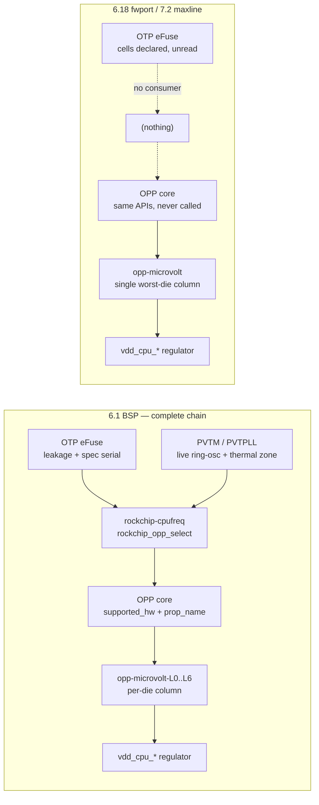

# RK3588 per-die voltage binning: the BSP selects voltage from eFuse, mainline ships only the worst-die column

> Scope: kernel bases (`kernel-versions/`) — CPU/GPU DVFS voltage selection on
> the ROCK 5B, across the 6.1 BSP, the 6.18 forward port, and the pinned maxline
> tree. The `W15` **shim tag** in
> [`vendor-delta.md`](../kernel-drivers/docs/vendor-delta.md) is the codec-core
> half of this same missing stack; note that tag is a BSP-banner namespace and is
> **not** the `status.md` watchlist ID `W15` (RGA session-close).
> Source: `../kernel/rockchip-kernel` @ `b4ef083dc0c3` (6.1.141 BSP) ·
> `../kernel/linux-6.18-rkvenc` @ `40cf22629cf63` (`v6.18-253`) ·
> `../kernel/linux` @ `7481ab327d7ea` (`v7.2-rc2-242`, maxline) ·
> `../kernel/rock5b-kernel-build/armbian-build` (`rockchip64-6.18` patch archive) ·
> booted `6.18.38-ysp-rockchip64`
> Date: 2026-07-25
> Trust: MEASURED / SOURCE-INSPECTED / CONFIRMED / INFERRED / DESIGN

## Result

The Rockchip BSP picks CPU/GPU voltages per **individual die**, from eFuse and an
on-chip process monitor. Neither the 6.18 forward port nor the 7.2-rc2 maxline
tree has any of that machinery. What mainline ships instead is, byte for byte,
the BSP's **unbinned worst-die column** — verified below at every shared OPP.

### The BSP runs two independent mechanisms

They are frequently conflated. They are not the same thing and they fail
differently.

**1. SKU bin → which OPPs exist at all.**
`drivers/cpufreq/rockchip-cpufreq.c` `rk3588_get_soc_info()` reads two OTP cells
and sets a bin index, which the OPP core then uses as the `opp-supported-hw`
bit position:

| OTP cell | value | `bin` | mask bit |
|---|---|---|---|
| `specification_serial_number` | `0xd` | 1 | `0x02` (RK3588M) |
| `specification_serial_number` | `0xa` | 2 | `0x04` (RK3588J) |
| `customer_demand` | `0x3` | 4 | `0x10` |
| — | else | 0 | `0x01` (plain RK3588) |

**2. Per-die voltage adjustment → what voltage each surviving OPP runs at.**
`drivers/soc/rockchip/rockchip_opp_select.c` (with `rockchip_pvtm.c`,
`rockchip-cpuinfo.c`, `rockchip_system_monitor.c`) reads the die's leakage cells
and runs the process-voltage-temperature monitor, indexes the
`rockchip,pvtm-voltage-sel*` tables, and uses the resulting index to select one
of the named `opp-microvolt-L<n>` variants. Other domains use
`rockchip,leakage-voltage-sel` instead — `dmc_opp_table` (`rk3588s.dtsi:2292`),
`venc_opp_table` (`:4999`), `vop_opp_table` (`:5635`).



### Mainline's voltages *are* the BSP's unbinned baseline — exactly

Comparing every CPU OPP the two trees share (method in *Evidence* below):

| Cluster | shared OPPs | mainline == BSP baseline | BSP per-die headroom |
|---|---|---|---|
| cluster0 (little) | 5 | **5 / 5** | up to −75 mV @ 1800 |
| cluster1 (big) | 7 | **7 / 7** | up to −87 mV @ 1800, 2016 |
| cluster2 (big) | 7 | **7 / 7** | up to −87 mV @ 1800, 2016 |

Not one value differs. Concretely, cluster0 @ 1416 MHz:

```
BSP baseline   opp-microvolt    = <762500 762500 950000>   <-- what mainline ships
BSP per-die    opp-microvolt-L1 = <750000 ...>
               opp-microvolt-L2 = <737500 ...>
               opp-microvolt-L3 = <725000 ...>
               opp-microvolt-L4 = <725000 ...>
               opp-microvolt-L5 = <712500 ...>
               opp-microvolt-L6 = <712500 ...>   <-- 50 mV below mainline
```

Mainline also drops the low steps (408/600/816 everywhere, 1008 on the big
clusters) and the 2256/2304/2352 steps, keeping 2400.

### The M/J bins are **derated**, not enhanced

This is the counter-intuitive part and it inverts the obvious risk reading. The
`0x06`/`0x04` OPP sets are not a faster tier — they are the industrial/extended
grades, and they cap **lower** and demand **more** voltage:

| | little cluster max | big cluster max | voltage vs bin 0 |
|---|---|---|---|
| bin 0 — plain RK3588 | 1800 MHz | 2400 MHz | (baseline) |
| bins 1,2 — RK3588M/J | 1704 MHz | 2016 MHz | **+25 to +75 mV** at shared OPPs |
| bin 4 — customer_demand | 1608 MHz | 2016 MHz | — |

So mainline, which ships only the bin-0 set, would run an RK3588J **above its
vendor frequency cap and below its vendor voltage floor** simultaneously. (One
inversion exists: cluster0 @ 1416 MHz, where M/J is 12.5 mV *lower* than bin 0.)

This does not affect the ROCK 5B — see the measured bin below — but the DT is
SoC-wide, so it applies to any RK3588J/M board booting these trees.

### This board is bin 0, measured

Read from the booted 6.18 kernel via the mainline `rockchip-otp` nvmem device,
decoded against the BSP cell definitions (`rk3588s.dtsi:7774`):

| Cell | offset / bits | value | meaning |
|---|---|---|---|
| `cpu_code` | `0x02` ×2 | `35 88` | RK3588 |
| `specification_serial_number` | `0x06` bits `<0 5>` | **`0x01`** | not `0xd`/`0xa` → **bin 0** |
| `customer_demand` | `0x22` bits `<4 4>` | **`0x00`** | not `0x3` → stays bin 0 |
| `cpub0_leakage` / `cpub1_leakage` | `0x17` / `0x18` | 13 / 13 | mA |
| `cpul_leakage` | `0x19` | 15 | mA |
| `log_leakage` / `gpu_leakage` | `0x1a` / `0x1b` | 51 / 23 | mA |
| `npu_leakage` / `codec_leakage` | `0x28` / `0x29` | 12 / 20 | mA |
| `cpul_opp_info`, `cpub01_opp_info` | `0x3d`, `0x43` ×6 | **all zero** | no factory OPP record on this die |

(`otp_id` at `0x07` is a unique per-chip serial and is deliberately not recorded
here.) So on this board mainline's OPP *set* is correct — it is only the
*voltage* that is left at the worst-die value.

### Undervolt: static only

Voltage control genuinely works on the forward port. `cpu-supply` is wired for
all eight cores (`rk3588-rock-5b-5bp-5t.dtsi:149-177`, 8 occurrences; the same
count in the maxline tree), and the booted kernel shows the three rails at
independent values, so `cpufreq-dt` is really driving them:

```
scaling_driver = cpufreq-dt
vdd_cpu_lit_s0:   950000 uV   (min 550000, max  950000)
vdd_cpu_big0_s0: 1000000 uV   (min 550000, max 1050000)
vdd_cpu_big1_s0:  675000 uV   (min 550000, max 1050000)
```

The regulator floor is 0.55 V, well under the table's 0.675 V minimum, so there
is real headroom. But the **only** lever is the DT: `cpufreq-dt` exposes no
runtime voltage knob, so undervolting means editing `opp-microvolt` in
`rk3588-opp.dtsi` or shipping an overlay. That is a single number applied to
every die that boots the image — exactly the guardband the BSP scheme exists to
reclaim per-part. Tuning to one known die is fine; shipping it is not.

Mainline also carries **none** of the BSP's thermal guardbands — no
`rockchip,low-temp-min-volt = <800000>`, no `rockchip,high-temp-max-freq`, no
`volt-mem-read-margin`. The BSP raises the voltage floor below 15 °C; an
undervolt that is stable at room temperature can therefore fail on a cold boot
with nothing to compensate.

### Half the plumbing is already upstream and dead

The generic framework is present and exported: `dev_pm_opp_set_config()`
(`drivers/opp/core.c:2542`, `EXPORT_SYMBOL_GPL` at `:2643`) takes `.supported_hw`
and `.prop_name`, and `drivers/opp/of.c` parses both `opp-supported-hw` and
`opp-microvolt-<name>`.

More surprising: mainline already ships the RK3588 eFuse plumbing and nothing
uses it. `drivers/nvmem/rockchip-otp.c` exists, and `rk3588-base.dtsi:3323`
declares `efuse@fecc0000` with the cells broken out — `cpub0_leakage@17`,
`cpub1_leakage@18`, `cpul_leakage@19`, `gpu_leakage`, `npu_leakage`,
`codec_leakage`, `otp_cpu_version@1c`, `cpu_code@2`. A grep across every rockchip
`.dts`/`.dtsi` finds **no consumer of any of them**. They are declared and dead.

What is absent is (a) the `specification_serial_number@6` and
`customer_demand@22` cells, and (b) any driver that reads these and calls the OPP
core. There is a clean in-tree precedent for exactly that shape:
`drivers/cpufreq/imx-cpufreq-dt.c` reads `speed_grade`/`market_segment` via
`nvmem_cell_read_u32()` and sets `supported_hw[] = {BIT(speed_grade), BIT(mkt_segment)}`.

The part that does **not** port cheaply is PVTM. `rockchip_pvtm.c` has no
mainline equivalent, and `rockchip_parse_pvtm_config()`
(`rockchip_opp_select.c:310`) shows why it cannot be reduced to an eFuse read: it
requires a live thermal zone, a clock, and a regulator, and the RK3588 CPU path
(`rockchip,pvtm-pvtpll`) closed-loop calibrates against the PVTPLL hardware at
runtime (`rockchip_pvtpll_calibrate_opp()`, `:837`). The **leakage-cell half**
needs only nvmem, which mainline already has.

## Boundary

- **No undervolt was applied or booted.** That a DT `opp-microvolt` edit takes
  effect is INFERRED from the wired `cpu-supply` plus the three rails observed at
  independent voltages — it was not tested, and no stability envelope was
  established for this or any die.
- **This die's BSP voltage-sel index is not derivable offline.** Its
  `cpul_opp_info`/`cpub01_opp_info` cells are blank and the PVTM path is a
  runtime measurement, so "what L-column this board would have landed in" is
  unknown. The −37…−87 mV figures are the table's *span*, not this board's
  entitlement.
- **The BSP stack was not run.** Every BSP claim is source-inspected against
  `b4ef083dc0c3`; no BSP kernel was booted to observe the selection happening.
- **CPU clusters only** for the voltage comparison. GPU/NPU/DMC/VOP/venc tables
  use `rockchip,leakage-voltage-sel` and were identified but not compared
  value-by-value.
- **RK3588J/M behavior is inferred from the DT and bin logic**, not observed —
  no such part was tested.
- Armbian's `vendor` branch **is** the BSP and does have all of this. Only
  `current`/`edge` (mainline-based, which is what `rockchip64-6.18` and therefore
  our forward port ride) do not.

## Evidence and reproduction

- **Identity:** booted `6.18.38-ysp-rockchip64` on the ROCK 5B; source trees at
  the four pins in the header.
- **Detection:** `cat /sys/devices/system/cpu/cpu0/cpufreq/scaling_driver` →
  `cpufreq-dt`; available frequencies `408000…1800000` (policy0) and
  `408000…2400000` (policy4, policy6).
- **Exercise — driver presence:** `ls drivers/soc/rockchip/` in both mainline
  trees returns exactly `Kconfig Makefile dtpm.c grf.c io-domain.c`; the BSP adds
  `rockchip_opp_select.c`, `rockchip_pvtm.c`, `rockchip-cpuinfo.c`,
  `rockchip_system_monitor.c`. Neither mainline tree has
  `drivers/cpufreq/rockchip-cpufreq.c`, and `cpufreq-dt-platdev.c` does not list
  rk3588.
- **Exercise — DT comparison:** a brace-matching parse of the
  `cluster{0,1,2}_opp_table` nodes in BSP `rk3588s.dtsi` and mainline
  `rk3588-opp.dtsi`, extracting `opp-microvolt`, every `opp-microvolt-L<n>`, and
  `opp-supported-hw` per OPP node, then joined on frequency. Note the BSP node
  **names** carry the bin (`opp-408000000` vs `opp-b-408000000`); a regex keyed on
  `opp-<digits>` silently sees only the bin-0 set and will wrongly report that
  the M/J tiers do not exist.
- **Exercise — OTP:** `od -A d -t x1 -N 112 /sys/bus/nvmem/devices/rockchip-otp0/nvmem`,
  decoded against the BSP `otp:` node cell `reg`/`bits` at `rk3588s.dtsi:7774`.
  Read-only; no OTP write was attempted.
- **Pass/fail signal:** 19/19 shared CPU OPPs match the BSP baseline with zero
  mismatches; `opp-supported-hw`/`nvmem`/`leakage`/`pvtm` occur **zero** times in
  mainline `rk3588-opp.dtsi`. Across all mainline rockchip DTs only
  `rk3562.dtsi` uses `opp-supported-hw` at all.
- **Armbian:** the `rockchip64-6.18` archive adds nothing here — the only rk3588
  OPP patch, `rk3588-0025-add-missing-op-nodes.patch`, appends plain OPP nodes to
  `rk3588-opp.dtsi` with no binning properties.
- **Artifacts:** none committed; the comparison is a throwaway script, fully
  described above and cheap to rebuild.

## Why it matters / follow-up

- On every ysp mainline-based kernel, a ROCK 5B runs the vendor's **worst-die**
  voltages at all times. That is correct and safe, and it is the reason the board
  cannot match BSP power/thermal figures at equal frequency. Any BSP-vs-forward-port
  power comparison must state this or it is measuring the missing driver.
- The cheapest real improvement is not PVTM. It is a small
  `imx-cpufreq-dt`-shaped driver plus two DT cells to get **SKU-correct OPP
  sets** — which for an RK3588J is a safety fix, not an optimization. Per-die
  voltage needs the leakage tables as well, and full parity needs PVTM.
- Whether mainline gains any of this is an external fact that can change without
  a repository edit — tracked as `W22` in
  [`status.md`](../status.md#watch-w22).
- Related: the codec-core half of the same gap is the `W15` shim tag in
  [`vendor-delta.md`](../kernel-drivers/docs/vendor-delta.md) and the
  PVTM/OPP row in
  [`forward-port-scope.md`](../kernel-drivers/docs/forward-port-scope.md); the
  base-level framing is in
  [`bsp/02-firmware-power-boot.md`](../kernel-versions/bsp/02-firmware-power-boot.md).
