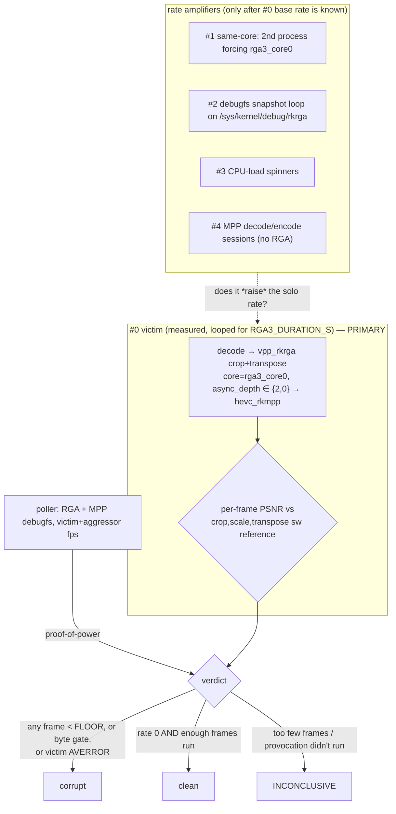

# Plan: a dedicated RGA3 cross-process contention harness that provokes and honestly detects the silent vpp corruption

> Scope: rewrite RGA driver (`rk_rga_rewrite`) RGA3 job isolation under concurrent clients; a new stress tool `kernel-drivers/tests/rewrite-rga3-contention.sh`, sibling to `rewrite-reset-contention.sh`
> Source: design grounded in [`2026-08-07-rga3-cross-process-vpp-corruption-lead.md`](2026-08-07-rga3-cross-process-vpp-corruption-lead.md) (MEASURED); harness pattern from `kernel-drivers/tests/rewrite-reset-contention.sh`; detector reuses `kernel-drivers/tests/ffmpeg-suite.sh` `encoded_psnr_against_input()` (~:902) and its per-frame `psnr` `stats_file` (~:956); victim case is the suite's `ffmpeg_filter_vpp_rkrga_crop_transpose` (~:1448-1455)
> Date: 2026-08-08
> Trust: DESIGN, SOURCE-INSPECTED

> **Reframed 2026-08-08, same day, before any code was written.** The
> [lead's](2026-08-07-rga3-cross-process-vpp-corruption-lead.md)
> concurrency-necessary premise was falsified hours after this plan was drafted:
> the vpp corruption reproduced in two consecutive **solo** full-conformance runs
> (`20260807-204828` at 8.56 dB, `20260808-081340` at 12.48 dB), with the runner
> and the ffmpeg suite both strictly serial and dmesg clean. So cross-process
> contention is **not** the trigger — at most a rate amplifier. The harness is
> still worth building, but its shape changes: **ingredient #0 (a solo victim
> loop, with an `async_depth` bisection) is now the primary experiment**, and the
> aggressor ingredients demote to "does concurrency *raise* the already-nonzero
> solo rate." The sections below are updated to lead with #0.

> **Implementation-order update 2026-08-08:** source inspection found that the
> rewrite rang the RGA start doorbell without first publishing the completed
> coherent command image. The `dma_wmb()` fix is at 6.18 `c20fc8c1cbf76`
> (mainline `09e39082007dd`) and is compile-verified only. Build and boot that
> exact tip before investing in a larger harness; run the same solo victim loop
> at depths 2 and 0 there. If corruption persists, the rate harness remains the
> next discriminator. If it clears, retain a bounded repeat as the regression
> gate, but do not call the barrier causal until the red/green comparison is
> reproduced.

## Result

This is the plan for a purpose-built harness that provokes the
[RGA3 vpp corruption](2026-08-07-rga3-cross-process-vpp-corruption-lead.md)
deterministically enough to measure a rate, and detects it honestly. It is
modelled on `rewrite-reset-contention.sh`: one measured victim plus optional
concurrent aggressor engines, and a three-way `INCONCLUSIVE / corrupt / clean`
verdict that refuses to call a run "clean" unless the provocation provably ran.
Because the corruption now reproduces single-client, the harness leads with a
solo victim loop and treats contention as an amplifier to test, not the trigger
to reproduce.

### Why this needs its own tool and cannot be a suite case

The corruption is **silent**. In the lead, no RGA error/timeout/fault counter
moved and dmesg stayed clean in the corrupt windows; jobs "succeeded" while
emitting wrong pixels, and KASAN was active and quiet throughout. So there is
**no counter to read** — unlike `rewrite-reset-contention.sh`, which differences
`mpp:reset_deassert_contended_count`. The only signal is **per-frame PSNR of the
hardware vpp output against a clean software reference**. The lead measured run
averages of 12.7 / 13.1 dB with per-frame **min ~6.7** (garbage) and **max
~38.5** (clean) against a **38.93 dB** clean baseline — so a whole-run average is
already a poor detector (a handful of trashed frames in an otherwise-clean run
barely moves it); the detector must be the **per-frame minimum**.

This is a stress/robustness tool, gated behind `EXPECT=` like the reset harness,
and it is separate from the conformance suite because it measures a *rate* over
many iterations rather than gating one. Note this no longer buys the vpp case
stability in normal conformance: the required `ffmpeg_filter_vpp_rkrga_crop_transpose`
case failed the last two full serial runs, so the driver defect is live in the
default set until it is fixed — the harness exists to characterize and close it,
not to quarantine it.

### What reproduces it (updated 2026-08-08)

The corruption fires **single-client**. Two consecutive solo full-conformance
runs failed the victim case with the runner and ffmpeg suite both strictly
serial and dmesg clean: `20260807-204828` at `average:8.56` (every frame
trashed) and `20260808-081340` at `average:12.48` (mixed, min 6.33 / max 38.48).
The base solo rate is therefore already high — roughly 2/2 recent full runs — so
the first job is to *quantify* it, not to hunt for a trigger.

The lead's earlier serialized-bisection "clean" results are now read as an
intermittent bug missing, not as a concurrency gate:

- solo victim clean 6/6 suite-case + 12/12 standalone `async_depth 2`/`0` +
  20/20 hwdownload — **all now known to have been luck**, since solo since fails.
- a single concurrent RGA client on `rga3_core1` — 6/6 clean.
- encoder present/absent, `rga3`/`rga2` forced/unforced — clean at the time.

The one structural difference between the failing suite case and the "clean"
standalone runs worth suspecting is that the suite victim runs `async_depth=2`
(two of its own jobs in flight on `rga3_core0`), i.e. **intra-process** job
pipelining — which would explain a solo repro with no second client. That is
ingredient #0's bisection axis; cross-process same-core interleaving drops from
"suspect #1" to "does it raise the rate."

## Architecture

One victim pipeline under measurement; N aggressor engines that each add one
kind of contention; a poller for proof-of-power; an honest verdict. Every
ingredient is a toggle so the bisection is `provoke one thing → measure → add
the next`.

### The victim (exactly the case that broke)

Reuse the suite's `ffmpeg_filter_vpp_rkrga_crop_transpose` verbatim so geometry
and reference match what was measured at 38.93 dB clean:

- filter: `vpp_rkrga=cw=960:ch=540:cx=160:cy=90:w=640:h=360:format=nv12:transpose=clock:core=rga3_core0:async_depth=2`
- encode leg: `hevc_rkmpp`
- reference: `crop=960:540:160:90,scale=640:360:flags=bicubic,transpose=1`

The victim runs in a loop for `RGA3_DURATION_S`, and **every iteration** is
PSNR-checked, so the harness accumulates victim-frames-under-load rather than
betting everything on one run. This is the analog of the reset harness driving
resets from the error path instead of one kill: maximise the number of victim
frames that execute while the aggressors are provably loading the hardware.

### Ingredient #0: the solo victim loop (primary)

Run **only** the victim, looped, no aggressor, and measure the corrupt-frame
rate. This is now the default mode, because the corruption reproduces
single-client. The one variable to bisect first is the victim's own
`async_depth`:

0. **`RGA3_ASYNC_DEPTH`** — run the victim at `async_depth=2` (two of its own
   RGA3 jobs in flight on `rga3_core0`) versus `async_depth=0` (serialized). If
   the rate collapses to zero at depth 0, the defect is intra-process job
   pipelining on one RGA3 core — a minimal, single-process reproducer, and the
   root-cause work targets per-job output isolation between a client's own
   in-flight jobs. If depth 0 still corrupts, the trigger is upstream of RGA
   pipelining entirely.

### The aggressor ingredients — rate amplifiers, tested only after #0

Each is an env toggle, all **off by default** now. They are no longer candidate
*triggers* (the bug fires without them); they answer "does concurrency raise the
solo rate," which matters for how bad the defect gets under real multi-client
load:

1. **`RGA3_SAME_CORE`** — a second, independent process running a vpp/scale
   pipeline that also forces `core=rga3_core0`. The clean 6/6 single-client run
   used `rga3_core1`, so same-core cross-process interleaving is still the
   untested cross-process delta — now as an amplifier, not the trigger.
2. **`RGA3_DEBUGFS_POLL`** — a loop reading `/sys/kernel/debug/rkrga` (the
   surface `rga-mmu-debug.sh` uses) *while jobs are in flight*. Snapshot reads
   during active jobs were present in every corrupt window and absent from the
   serialized clean runs; a debugfs read that touches shared driver state under
   an active job is a plausible poison worth isolating.
3. **`RGA3_CPU_LOAD`** — CPU spinners sized to `nproc`, to widen
   submit/complete windows the way a second full suite's CPU load did.
4. **`RGA3_MPP_SESSIONS`** — concurrent MPP decode/encode loops with **no** RGA
   client, to reproduce the decoder/encoder pressure a second suite adds without
   adding a second RGA client (separates MPP-session pressure from RGA
   contention).

## The detector

Reuse the suite's proven two-leg comparison rather than reinventing it — decode
both legs to raw frames with `-fps_mode passthrough`, gate on equal byte counts
(a dropped/duplicated frame is a hard fail, not silent padding), and read the
per-frame `psnr` `stats_file`. Concretely, factor `encoded_psnr_against_input()`
out of `ffmpeg-suite.sh` into a shared `checker-common.sh` (or source the suite)
so the contention harness and the suite share one implementation and cannot
drift. The harness then adds three corruption conditions, **any** of which fails
the frame/run:

- **per-frame PSNR floor** — `min(psnr_avg) < RGA3_PSNR_FLOOR` (default ~30 dB:
  well above 6.7 dB garbage, well below the 38.9 dB clean baseline and its
  bicubic-vs-hardware scaling noise).
- **byte-count gate** — the existing `ref_bytes != test_bytes` check
  (`ffmpeg-suite.sh` ~:947); contention can also drop frames.
- **victim fault under load** — the victim exiting with `AVERROR_BUG` /
  `h264_rkmpp` / `hevc_rkmpp` error must score as **corrupt**, never "clean." The
  [dispatch-race finding](2026-08-07-rewrite-mpp-same-session-dual-core-dispatch-race.md)
  saw an `h264_rkmpp AVERROR_BUG` under load as a *second* possible mechanism, so
  a crashed victim is a positive result, not a skipped one.

The dmesg fatal scan (`suite_dmesg_start` / `suite_dmesg_finish` from
`suite-common.sh`) runs across the whole harness as usual — if a variant does
trip a fault, that is a stronger result than pixel corruption and must be
surfaced.

## The honest verdict (the part that makes it worth building)

Borrow the reset harness's discipline: **a "clean" contention run is worthless
unless the contention provably happened.** Decide power first, for every mode.

- **corrupt** — any of the three detector conditions fired. The contention is
  reachable on this kernel and board. This is the reachability evidence that
  would justify the root-cause work.
- **INCONCLUSIVE** — the provocation had no power: aggressors failed to start or
  forced the wrong core, or the victim ran too few frames under load. Says
  nothing either way. Raise `RGA3_DURATION_S` / aggressor counts and re-run. This
  is the analog of `RESET_MIN_EXPECT` / the under-powered guard.
- **clean** — all victim frames above floor, byte-gated, no fault, **and**
  proof-of-power satisfied. Because the bug is intermittent (2 hits against
  6/6 + 12/12 + 20/20 + 6/6 clean elsewhere), a single clean run does **not**
  prove absence: report a **hit rate** (corrupt frames per N, corrupt runs per M)
  over many looped victim iterations, and treat "clean" as meaningful only
  against a configuration that has shown a nonzero rate — exactly as
  `rewrite-reset-contention.sh` treats its `clean` expectation.

### Proof-of-power, measured vs upper-bound

Following the reset harness's `expected_basis = measured | upper-bound` honesty:

- **measured** — if the rewrite `rkrga` debugfs exposes per-core dispatch/job
  counts, difference them before/after (like `debugfs-counters.sh` does for
  `mpp:`) to confirm the aggressor actually dispatched RGA3 jobs on the forced
  core, and confirm the victim's own dispatch count. A zero corruption result
  against a measured, adequate victim-frame count is a real (if intermittent)
  negative for that configuration.
- **upper-bound** — if `rkrga` exposes no such counter (the lead only says the
  *error* counters did not move; the dispatch counters were not checked), fall
  back to the aggressor process's own frame throughput (fps from its ffmpeg
  progress) as a power proxy, and **say so**: it proves the aggressor ran, not
  that it contended on the same core at the same instant. A zero against an
  upper-bound estimate is not proof of absence.

Confirming which counters `rkrga` actually exposes is the first implementation
task, because it decides whether "clean" can ever mean anything here.

## Env knobs (proposed)

| Knob | Default | Meaning |
|------|---------|---------|
| `EXPECT` | `report` | `corrupt` / `clean` to gate; `report` never fails |
| `RGA3_DURATION_S` | `120` | victim loop duration |
| `RGA3_ASYNC_DEPTH` | `2` | victim `async_depth`; **the #0 bisection axis** (set 0 to serialize the victim's own jobs) |
| `RGA3_PSNR_FLOOR` | `30` | per-frame `psnr_avg` floor (dB) below which a frame is corrupt |
| `RGA3_SAME_CORE` | `0` | amplifier: 2nd process vpp/scale forcing `rga3_core0` |
| `RGA3_DEBUGFS_POLL` | `0` | amplifier: poll `/sys/kernel/debug/rkrga` during active jobs |
| `RGA3_CPU_LOAD` | `0` | amplifier: CPU spinners (`nproc`-sized) |
| `RGA3_MPP_SESSIONS` | `0` | amplifier: concurrent MPP decode/encode loops, no RGA |
| `RGA3_MIN_FRAMES` | `600` | victim frames below which a zero-rate run is INCONCLUSIVE |

## Output artifacts

Under `$CONFORMANCE_ROOT/logs/$PROFILE/$RUN_ID-rga3-contention/`, mirroring the
reset harness: `summary.tsv` (config, victim frames, corrupt frames, worst PSNR,
hit rate, power basis, verdict), per-iteration `psnr` stats files, aggressor fps
logs, `counters-before/after/delta.tsv` if `rkrga` counters exist, and
`dmesg-fatal.txt`. Never commit raw captures; keep them under the run dir.

## Boundary

**The harness has not been built or run.** The tag is DESIGN: the floor and the
verdict logic are predictions built from the lead and from reading the existing
harness and checker. What is *no longer* speculative is that the corruption
reproduces solo — that is MEASURED (two full serial runs). Specifically
unestablished:

- **Whether `async_depth=0` clears it (#0).** The intra-process pipelining
  hypothesis is the informed guess, not confirmed; the lead recorded 12/12 clean
  standalone at `async_depth=2`, which now reads as luck, so the axis is worth
  bisecting but not settled.
- **Whether `rkrga` exposes dispatch counters at all.** If it does not, every
  "clean" verdict is upper-bound only until a kernel carrying such a counter
  exists — the same asymmetry the reset harness documents.
- **The floor.** 30 dB is chosen from a few data points (6.3–8.6 garbage, 38.9
  clean); a partially-corrupt frame could land between, so the floor may need
  tuning once more corrupt frames are captured with their PSNRs.
- **The rate.** Two positive full-run observations is not a per-frame rate. The
  harness exists to *measure* it; until it has, absence from any single run
  proves nothing (a zero needs `RGA3_MIN_FRAMES` of proven work behind it).

This is a stress/robustness defect, not a memory-safety one (KASAN was clean),
so the harness targets job-output corruption, not an oops — keep KASAN on to
catch it if a variant escalates.

## Verification gate

The smallest useful run is now a fixed-tip driver experiment, not just a
harness self-test: build and boot exact 6.18 source `c20fc8c1cbf76`, then loop
the solo victim (`RGA3_SAME_CORE=0`) ~20× at `async_depth=2` and again at
`async_depth=0`. Given the ~2/2 recent
full-run base rate, depth 2 should reproduce a `corrupt` verdict quickly; the
first discriminator is whether the fixed depth-2 run still corrupts. If it
does, the result at depth 0 tests intra-process pipelining. Harness health is a
non-INCONCLUSIVE verdict with proof-of-power satisfied and a reported rate.

## Follow-up

Because the bug reproduces solo, the near-term repro no longer needs the full
harness. Implementation order: (1) package and boot exact fixed tip
`c20fc8c1cbf76`; (2) confirm what `/sys/kernel/debug/rkrga` exposes for per-core
dispatch/job counts (decides measured vs upper-bound power); (3) run the solo
`async_depth` bisection; (4) build the harness with ingredient #0 as
default, wiring the per-frame floor + byte gate + victim-fault detector by
factoring `encoded_psnr_against_input()` into a shared checker; (5) add the
aggressor amplifiers only if the solo rate needs an upper bound under
multi-client load. Register it beside `rewrite-reset-contention.sh` in
`run-root-gates.sh` if it earns a place.
