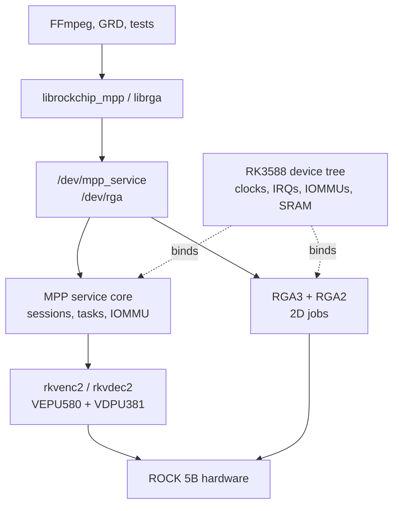

# kernel-drivers/ - RK3588 codec and RGA kernel work

This package explains the kernel-side work for the ROCK 5B: the vendor
Rockchip MPP codec drivers, the RGA driver, their RK3588 device tree, the audit
fix series, and the clean-room rewrite track.

## Package brief

| Field | Contents |
|-------|----------|
| User outcome | Boot a kernel that exposes `/dev/mpp_service` and `/dev/rga`, then validate that VEPU580 encode, VDPU381 decode, and RGA jobs run on hardware. |
| Developer focus | Understand the MPP service model, dma-buf/IOMMU lifetime, device-tree wiring, forward-port deltas, audit findings, and the rewrite-driver alternative. |
| Owns | Kernel patch deliverables in [`../patches/`](../patches/README.md), kernel architecture docs in [`../docs/01`](../docs/01-how-the-drivers-work.md), uAPI detail in [`../docs/03`](../docs/03-dev-uapis.md), and status in [`../docs/04`](../docs/04-status.md). |
| Depends on | Armbian or vanilla 6.18 kernel build inputs, RK3588 device tree, and the userspace libraries described in [`../userspace-libraries/`](../userspace-libraries/README.md). |
| Current state | The combined Armbian kernel path is hardware-validated; DKMS compiles on 6.18 but its overlay is not boot-validated; the audit-fix and rewrite tracks are not shippable replacements yet. See [`../STATUS.md`](../STATUS.md). |

## How the kernel package fits

The kernel work is split into three related tracks:

| Track | What it is | Read next |
|-------|------------|-----------|
| Forward-port | The shipped stack: Rockchip 6.1 BSP MPP + RGA drivers carried to Linux 6.18 with small compatibility shims and RK3588 bring-up fixes. | [`../patches/`](../patches/README.md), [`../docs/05`](../docs/05-vendor-forward-port.md), [`../docs/06`](../docs/06-vendor-delta.md) |
| Audit fixes | A reviewable 65-patch correctness/security cleanup series on top of the forward-port. | [`../docs/11`](../docs/11-bsp-audit.md), [`../patches/cleanup-split/`](../patches/cleanup-split/README.md) |
| Rewrite drivers | Public-API-only reimplementations of `/dev/mpp_service` and `/dev/rga`, used as the second track for learning and upstreamable design pressure. | [`../docs/13`](../docs/13-rewrite-drivers.md) |

## User path

If your goal is "make hardware codecs work on my board", do not start by
reading patch internals.

1. Choose a kernel delivery path in [`../INSTALL.md`](../INSTALL.md).
2. Build/install the combined kernel with [`../scripts/`](../scripts/README.md)
   or use the DKMS package in [`../packaging/dkms/`](../packaging/dkms/README.md)
   if you accept its current validation limits.
3. Install the device-node rule from
   [`../scripts/99-rockchip-codec.rules`](../scripts/99-rockchip-codec.rules)
   or [`../packaging/codec-udev/`](../packaging/codec-udev/README.md).
4. Run [`../scripts/validate-combined.sh`](../scripts/validate-combined.sh) and
   then the on-hardware tests in [`../tests/`](../tests/README.md).
5. Move up to FFmpeg or GRD through [`../ffmpeg/`](../ffmpeg/README.md) or
   [`../gnome-remote-desktop/`](../gnome-remote-desktop/README.md).

## Developer path

Read in this order when changing or reviewing kernel behavior:

| Question | Canonical doc |
|----------|---------------|
| What does each driver layer do? | [`../docs/01-how-the-drivers-work.md`](../docs/01-how-the-drivers-work.md) |
| What ioctl ABI does userspace depend on? | [`../docs/03-dev-uapis.md`](../docs/03-dev-uapis.md) |
| What was changed during the forward-port? | [`../docs/05-vendor-forward-port.md`](../docs/05-vendor-forward-port.md) |
| How much code is vendor vs local? | [`../docs/06-vendor-delta.md`](../docs/06-vendor-delta.md) |
| How are RK3588 nodes, IRQs, IOMMUs, aliases, and SRAM wired? | [`../docs/07-device-tree.md`](../docs/07-device-tree.md) |
| How does Armbian packaging apply the DT safely? | [`../docs/08-armbian-packaging.md`](../docs/08-armbian-packaging.md) |
| What changes on vanilla mainline? | [`../docs/09-vanilla-kernel.md`](../docs/09-vanilla-kernel.md) |
| What are the known traps? | [`../docs/10-gotchas.md`](../docs/10-gotchas.md) |
| What did the BSP audit find? | [`../docs/11-bsp-audit.md`](../docs/11-bsp-audit.md) |
| How do we resync to a new kernel or BSP? | [`../docs/12-resyncing.md`](../docs/12-resyncing.md) |

## Files owned elsewhere

This directory is the package front door. The large artifacts remain in their
original homes:

| Location | Role |
|----------|------|
| [`../patches/rk3588-rkvenc2-01-vcodec-rga-drivers.patch`](../patches/rk3588-rkvenc2-01-vcodec-rga-drivers.patch) | Forward-port driver patch. |
| [`../patches/rk3588-rkvenc2-02-vcodec-rga-dt.patch`](../patches/rk3588-rkvenc2-02-vcodec-rga-dt.patch) | RK3588 device-tree patch. |
| [`../patches/cleanup-split/`](../patches/cleanup-split/README.md) | Reviewable audit-fix series. |
| [`../packaging/dkms/`](../packaging/dkms/README.md) | DKMS delivery channel for the same driver source. |
| [`../docs/14-debug-kernel.md`](../docs/14-debug-kernel.md) | Crash-capture kernel workflow for debugging driver faults. |
