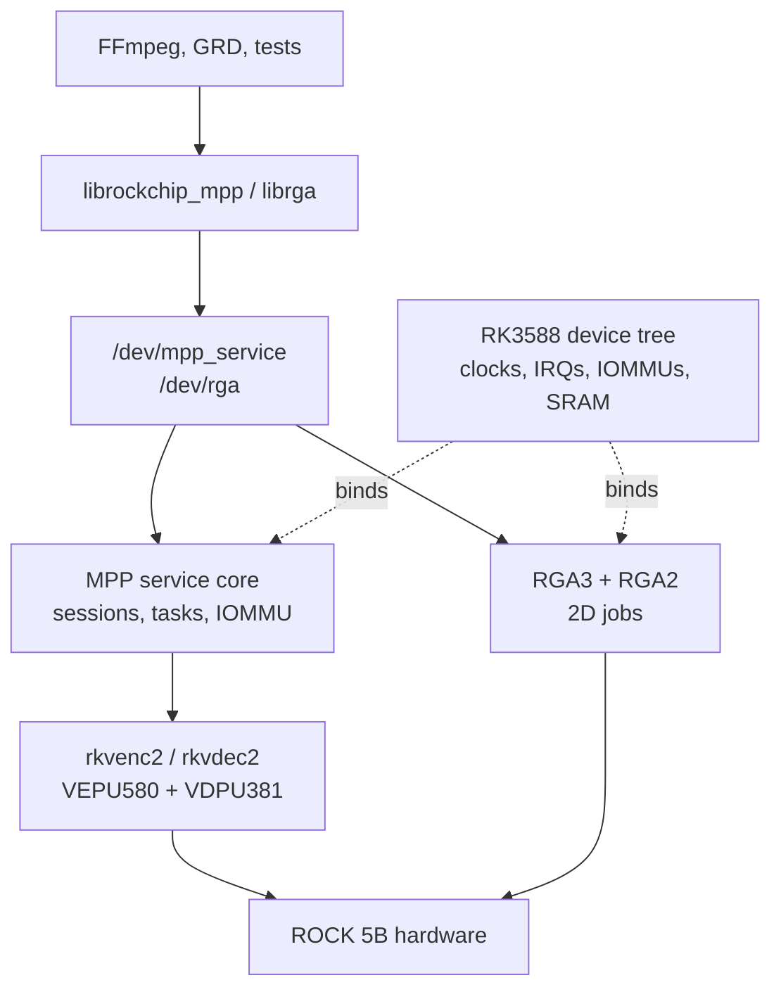

# kernel-drivers/ — RK3588 codec and RGA kernel work

The kernel-side work for the ROCK 5B: the vendor Rockchip MPP codec drivers, the
RGA driver, their RK3588 device tree, the audit fix series, and the clean-room
rewrite track. Driver code lives in the sibling kernel trees (`linux-6.18-rkvenc*`,
`rockchip-kernel`); this project holds the architecture, the patch deliverables,
and the on-hardware validation.

Split into four sub-projects — `mpp`, `rga`, `av1`, `iommu` — each with its own
`README.md` + `keywords.md`. **Shared** driver architecture, uAPI, device tree,
the combined patch series, board scripts, and on-hardware tests stay at this top
level, because one combined patch series and one architecture doc cover mpp+rga
together. Kernel-base topics (what the BSP adds, forward-porting between kernel
versions, the mainline-V4L2 alternative) live in
[`../kernel-versions/`](../kernel-versions/README.md).

## Project brief

| Field | Contents |
|-------|----------|
| Purpose | Boot a kernel that exposes `/dev/mpp_service` and `/dev/rga`, then validate that VEPU580 encode, VDPU381 decode, and RGA jobs run on hardware. |
| Developer focus | The MPP service model, dma-buf/IOMMU lifetime, device-tree wiring, forward-port deltas, audit findings, and the rewrite-driver alternative. |
| Owns | Shared kernel docs in [`docs/`](docs/how-the-drivers-work.md); the four sub-projects; patch deliverables in [`patches/`](patches/README.md); board scripts in [`scripts/`](scripts/README.md); hardware smoke tests in [`tests/`](tests/README.md). |
| Depends on | Armbian or vanilla 6.18 kernel build inputs, RK3588 device tree, and [`../vendor-libraries/`](../vendor-libraries/README.md). |
| Current state | The combined Armbian kernel path is hardware-validated; DKMS compiles on 6.18 but its overlay is not boot-validated; audit-fix and rewrite tracks are not shippable replacements yet. See [`../status.md`](../status.md). |

## How the kernel package fits

```mermaid
flowchart TB
  app["FFmpeg, GRD, tests"]
  libs["librockchip_mpp / librga"]
  devs["/dev/mpp_service<br/>/dev/rga"]
  service["MPP service core<br/>sessions, tasks, IOMMU"]
  codec["rkvenc2 / rkvdec2<br/>VEPU580 + VDPU381"]
  rga["RGA3 + RGA2<br/>2D jobs"]
  dt["RK3588 device tree<br/>clocks, IRQs, IOMMUs, SRAM"]
  hw["ROCK 5B hardware"]

  app --> libs --> devs
  devs --> service --> codec --> hw
  devs --> rga --> hw
  dt -. binds .-> service
  dt -. binds .-> rga
```

## Sub-projects

| Sub-project | Covers | Scoped docs |
|-------------|--------|-------------|
| [`mpp/`](mpp/README.md) | The MPP service + rkvenc2/rkvdec2 codec cores; multi-core scheduling. | [`multicore-scheduling.md`](mpp/docs/multicore-scheduling.md) |
| [`rga/`](rga/README.md) | The RGA3/RGA2 2D blit/scale/convert driver. | shared driver docs + `tests/librga-*` |
| [`av1/`](av1/README.md) | The RK3588 AV1 decode path and the BSP bugs the AV1 port exposed. | [`av1-rk3588.md`](av1/docs/av1-rk3588.md), [`av1-bsp-audit.md`](av1/docs/av1-bsp-audit.md) |
| [`iommu/`](iommu/README.md) | CCU/IOMMU memory path: the net-new MMU plan and the SOFT/HARD CCU rewrite finding. | [`mpp-ccu-iommu-plan.md`](iommu/docs/mpp-ccu-iommu-plan.md), [`rewrite-hard-ccu-finding.md`](iommu/docs/rewrite-hard-ccu-finding.md) |

The kernel work runs on three tracks across those sub-projects:

| Track | What it is | Read next |
|-------|------------|-----------|
| Forward-port | The shipped stack: Rockchip 6.1 BSP MPP + RGA drivers carried to Linux 6.18 with compatibility shims and RK3588 bring-up fixes. | [`patches/`](patches/README.md), [`../kernel-versions/docs/vendor-forward-port.md`](../kernel-versions/docs/vendor-forward-port.md), [`docs/vendor-delta.md`](docs/vendor-delta.md), [`docs/bsp-6.1-6.6-comparison.md`](docs/bsp-6.1-6.6-comparison.md) |
| Audit fixes | A reviewable 65-patch correctness/security cleanup series on top of the forward-port. | [`docs/bsp-audit.md`](docs/bsp-audit.md), [`patches/cleanup-split/`](patches/cleanup-split/README.md) |
| Rewrite drivers | Public-API-only reimplementations of `/dev/mpp_service` and `/dev/rga`, as a learning + upstreamable-design track. | [`docs/rewrite-drivers.md`](docs/rewrite-drivers.md) |

## User path

If your goal is "make hardware codecs work on my board", do not start by reading
patch internals.

1. Choose a kernel delivery path in [`../install.md`](../install.md).
2. Build/install the combined kernel with [`scripts/`](scripts/README.md), or use
   the DKMS package in [`../packaging/dkms/`](../packaging/dkms/README.md) if you
   accept its current validation limits.
3. Install the device-node rule from
   [`scripts/99-rockchip-codec.rules`](scripts/99-rockchip-codec.rules) or
   [`../packaging/codec-udev/`](../packaging/codec-udev/README.md).
4. Run [`scripts/validate-combined.sh`](scripts/validate-combined.sh) and then the
   on-hardware tests in [`tests/`](tests/README.md).
5. Move up to FFmpeg or GRD through
   [`../video-libraries/ffmpeg/`](../video-libraries/ffmpeg/README.md) or
   [`../apps/gnome-remote-desktop/`](../apps/gnome-remote-desktop/README.md).

## Developer path

Read in this order when changing or reviewing kernel behavior:

| Question | Canonical doc |
|----------|---------------|
| What does each driver layer do? | [`docs/how-the-drivers-work.md`](docs/how-the-drivers-work.md) |
| What ioctl ABI does userspace depend on? | [`docs/dev-uapis.md`](docs/dev-uapis.md) |
| Which parts of that ABI are dead/dormant — safe to not special-case? | [`docs/abi-dormancy.md`](docs/abi-dormancy.md) |
| What was changed during the forward-port? | [`../kernel-versions/docs/vendor-forward-port.md`](../kernel-versions/docs/vendor-forward-port.md) |
| How much code is vendor vs local? | [`docs/vendor-delta.md`](docs/vendor-delta.md) |
| How does the forward port compare with Rockchip's 6.1 and 6.6 BSP media drivers? | [`docs/bsp-6.1-6.6-comparison.md`](docs/bsp-6.1-6.6-comparison.md) |
| Which later Rockchip 5.10 RGA fixes still need to be adapted to the rewrite? | [`rga/rewrite-5.10-reconciliation.md`](rga/rewrite-5.10-reconciliation.md) |
| How are RK3588 nodes, IRQs, IOMMUs, aliases, and SRAM wired? | [`docs/device-tree.md`](docs/device-tree.md) |
| How does Armbian packaging apply the DT safely? | [`../packaging/docs/armbian-packaging.md`](../packaging/docs/armbian-packaging.md) |
| What changes on vanilla mainline? | [`../kernel-versions/docs/vanilla-kernel.md`](../kernel-versions/docs/vanilla-kernel.md) |
| What are the known traps? | [`../docs/gotchas.md`](../docs/gotchas.md) |
| What did the BSP audit find? | [`docs/bsp-audit.md`](docs/bsp-audit.md) |
| What did adversarial review find in our forward-port glue? | [`../kernel-versions/docs/forward-port-review-log.md`](../kernel-versions/docs/forward-port-review-log.md) |
| What is the net-new CCU MMU/IOMMU plan? | [`iommu/docs/mpp-ccu-iommu-plan.md`](iommu/docs/mpp-ccu-iommu-plan.md) |
| What is the RK3588 AV1 path, and why is it separate from RKVDEC2? | [`av1/docs/av1-rk3588.md`](av1/docs/av1-rk3588.md) |
| Why is RK3588 multi-core decode hard, and where would a scheduler live? | [`mpp/docs/multicore-scheduling.md`](mpp/docs/multicore-scheduling.md) |
| How does the mainline V4L2 `rkvdec` decoder work (the other stack)? | [`../kernel-versions/docs/mainline-rkvdec-v4l2.md`](../kernel-versions/docs/mainline-rkvdec-v4l2.md) |
| How do we resync to a new kernel or BSP? | [`docs/resyncing.md`](docs/resyncing.md) |
| How do we validate the rewrite drivers to production readiness? | [`docs/rewrite-validation-plan.md`](docs/rewrite-validation-plan.md) |

## Shared files

Docs and artifacts owned at this top level (sub-project-scoped docs are indexed in
each sub-project's `README.md`).

| Path | One-liner |
|------|-----------|
| [`docs/forward-port-status.md`](docs/forward-port-status.md) | Project-local scorecard for the kernel forward-port (distinct from the whole-project [`../status.md`](../status.md)). |
| [`docs/how-the-drivers-work.md`](docs/how-the-drivers-work.md) | What each MPP/RGA driver layer does end to end. |
| [`docs/dev-uapis.md`](docs/dev-uapis.md) | The `/dev/mpp_service` + `/dev/rga` ioctl ABI userspace depends on. |
| [`docs/abi-dormancy.md`](docs/abi-dormancy.md) | Which of that ABI is actually exercised vs defined-but-dead (batch server, RGA2 `0x60xx`, dead flags/config) — zero-caller evidence, so the rewrite doesn't support phantom ABI. |
| [`docs/device-tree.md`](docs/device-tree.md) | RK3588 node/IRQ/IOMMU/alias/SRAM wiring and DT glossary. |
| [`docs/vendor-delta.md`](docs/vendor-delta.md) | How much of the tree is vendor code vs local glue. |
| [`docs/bsp-6.1-6.6-comparison.md`](docs/bsp-6.1-6.6-comparison.md) | Direct pinned comparison of the baseline/current forward ports with Rockchip's 6.1 and 6.6 MPP/RGA trees. |
| [`docs/bsp-audit.md`](docs/bsp-audit.md) | Multi-agent audit findings and the draft cleanup series. |
| [`docs/resyncing.md`](docs/resyncing.md) | Playbook for resyncing to a newer kernel or BSP. |
| [`docs/rewrite-drivers.md`](docs/rewrite-drivers.md) | Public-API-only clean-room reimplementation track. |
| [`docs/rewrite-validation-plan.md`](docs/rewrite-validation-plan.md) | What it would take to make the rewrite drivers production-ready. |
| [`docs/debug-kernel.md`](docs/debug-kernel.md) | Capture a crash / run the KASAN debug kernel. |
| [`patches/`](patches/README.md) | Forward-port driver + DT patches and the reviewable audit-fix series. |
| [`scripts/`](scripts/README.md) | Combined-kernel build/install/validate wrappers and the codec udev rule. |
| [`tests/`](tests/README.md) | On-hardware decode/encode/transcode smoke tests, plus the rewrite build gate and conformance suites. |
| [`mpp/`](mpp/README.md) · [`rga/`](rga/README.md) · [`av1/`](av1/README.md) · [`iommu/`](iommu/README.md) | The four kernel-driver sub-projects. |
| [`../packaging/dkms/`](../packaging/dkms/README.md) | DKMS delivery channel for the same driver source. |
