# BSP-derived forward port vs clean-room rewrite — architecture comparison

The two ROCK 5B media-driver tracks expose the same device files but make very
different internal tradeoffs. The **BSP-derived forward port** preserves
Rockchip's MPP and RGA subsystem architecture while adapting and hardening it
for Linux 6.18. The **clean-room rewrite** keeps the current userspace contract
but replaces the global BSP machinery with session/job ownership and public
kernel APIs.

This document compares architecture, not just feature lists. It is based on the
2026-07-26 source pair:

| Track | Pin |
|-------|-----|
| BSP-derived forward port | `rk3588-video-6.18@12a7da02bea83` |
| 6.18 rewrite | `rk3588-rewrite-6.18@6edc44f79a4d` |
| Mainline rewrite cross-check | `rk3588-rewrite-mainline@c53bbc84dce4` on `v7.2-rc5`; both rewrite driver and ABI files are byte-identical to the 6.18 versions |

The [current implementation comparison](./rewrite-drivers.md#current-comparison-2026-07-26)
owns moving status, scope, exact source counts, and the production decision.
The [forward-port driver guide](./how-the-drivers-work.md) and
[rewrite architecture guide](./rewrite-driver-architecture/README.md) remain
the detailed source-reading companions.

## 1. Same external contract, different design centers

Both tracks sit below the same applications and userspace libraries:

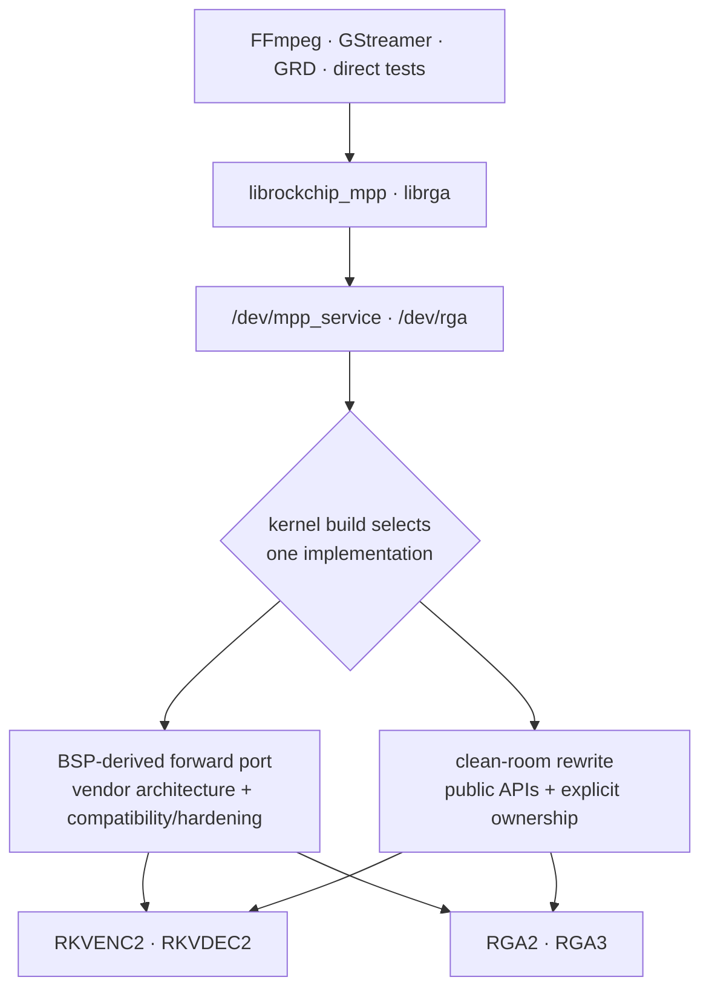

They cannot run side by side for the same hardware in one boot. Their Kconfig
options are mutually exclusive because each pair binds the same device-tree
nodes and registers the same device files.

The common silicon pipeline is also unavoidable:

```text
copy request → validate → resolve buffers → choose core → build/patch commands
             → power/clock → start DMA → IRQ/timeout/fault → read back → complete
```

The architectural disagreement is about who owns state at each stage, how long
that ownership lasts, and what happens when normal completion races close,
reset, fault recovery, or device removal.

| Design question | BSP-derived answer | Rewrite answer |
|-----------------|--------------------|----------------|
| What is preserved? | The broad vendor subsystem and historical ABI behavior. | The observed current ROCK 5B ABI and hardware behavior. |
| Where does state live? | Global service/request/memory managers plus per-device scheduler state. | Opening session, immutable submitted job, and retained hardware/import objects. |
| How is kernel drift handled? | Compatibility headers and narrow adaptations around BSP assumptions. | Public kernel APIs, with the same driver sources replayed on 6.18 and current mainline. |
| How is unsupported behavior treated? | Usually inherited because the vendor surface is carried wholesale. | Classified in `ABI.rst` and rejected explicitly when no safe implementation exists. |
| What is the main source of confidence? | Vendor history plus extensive board and production testing. | Executable invariants and source clarity; board qualification remains incomplete. |

## 2. MPP codec architecture

MPP is primarily a register-job transport. Userspace's codec HAL builds the
H.264/H.265/VP9 register recipe; the kernel validates it, replaces buffer fds
with device addresses, schedules it, starts the selected core, and returns
register readback.

### 2.1 BSP-derived MPP

The BSP MPP architecture is a service framework with specialized hardware
backends:

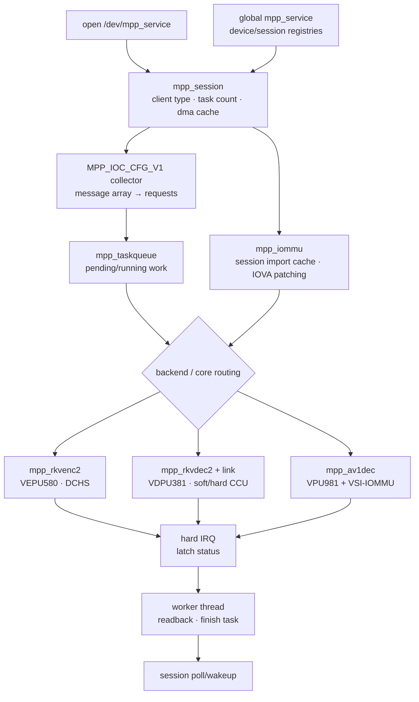

Important properties:

- `INIT_CLIENT_TYPE` binds a lightweight open session to a concrete MPP
  backend and taskqueue.
- The service, backend, taskqueue, and DMA cache are separate objects. This
  makes the code modular, but the lifetime of one request crosses several
  managers.
- Imported dma-bufs are cached at session scope and mapped for the relevant
  device/domain. Register translation tables identify which user register
  values are buffer fds that must become IOVAs.
- Encoder cores coordinate through the VEPU580 DCHS channels. Decoder cores use
  the RKVDEC2 CCU and link-table machinery, normally in software-dispatch mode.
- The current forward port also includes the separate RKMPP AV1 backend. It is
  not part of RKVDEC2 and is absent from the rewrite.
- Close may hand a live session to deferred cleanup while outstanding task
  owners drain. This preserves broad BSP behavior but makes retirement order a
  cross-subsystem concern.

### 2.2 Rewrite MPP

The rewrite makes each accepted unit of work a refcounted kernel-owned snapshot:

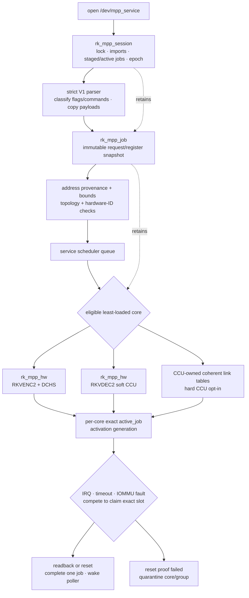

Important properties:

- Message payloads and session controls are copied into kernel-owned staged
  jobs. Later messages cannot retroactively change an already staged job.
- A job retains every dma-buf import and the selected hardware object until no
  asynchronous path can use either one.
- Queue publication, core removal, session reset, and active-slot publication
  are coordinated so an accepted job cannot disappear between owners.
- IRQ, timeout, fault, close, and removal do not independently “finish” a job.
  They contend on the same protected active slot; only the winner owns terminal
  completion.
- A generation identifies one activation of one hardware slot. Delayed work
  from an older activation cannot reset its replacement.
- If reset cannot prove the engine stopped DMA, the rewrite quarantines the
  core—or the dependent decoder group—rather than returning it to scheduling.

### 2.3 MPP object-ownership contrast

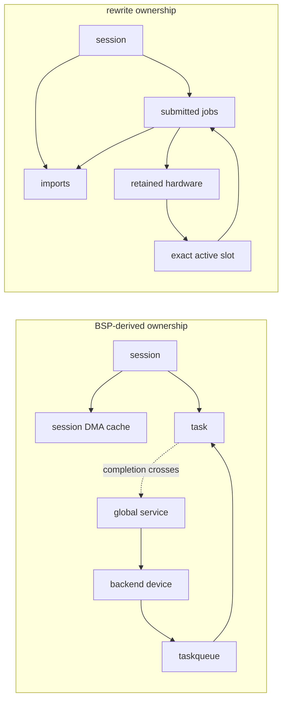

The BSP model is not “unowned”; it is **manager-owned**. The rewrite is
**object-owned**. Manager ownership is convenient for broad routing and
debugging, but correctness depends on consistent ordering among several global
containers. Object ownership makes one job's lifetime easier to audit, at the
cost of more references, more explicit state transitions, and stricter
admission checks.

### 2.4 Multicore scheduling is similar at the silicon boundary

Both architectures must implement the same RK3588 coordination:

| Path | BSP-derived forward port | Rewrite |
|------|--------------------------|---------|
| RKVENC2 | Taskqueue selects a core; DCHS IDs link dependent work across the two VEPU580 cores. | Service queue chooses an eligible least-loaded core; job-owned DCHS state is validated and released with the job. |
| RKVDEC2 soft CCU | Shared queue; software finds an idle VDPU381 core while the CCU owns common hardware state. | Software selection with per-core active slots; reset/error recovery is serialized around the exact job. |
| RKVDEC2 hard CCU | Vendor link tables and CCU dispatch machinery. | Opt-in coherent link tables recreated with public DMA APIs, explicit shared-domain checks, sentinel reservation, and coordinator-wide ownership. |
| Contention | Vendor queueing/task state decides when a core becomes available. | Accepted work remains on an internal queue rather than returning `-EBUSY`. |

The rewrite changes software containment more than scheduling theory. It does
not remove DCHS, CCU, link tables, shared DMA visibility, or the need to reset a
whole dependency group after some decoder failures.

## 3. RGA image-engine architecture

RGA is more semantic than MPP. The kernel receives image formats, planes,
strides, rectangles, transforms, blending, compression modes, priorities,
fences, and core masks, then generates RGA2 or RGA3 command words itself. This
is why the RGA implementations remain large even when the ownership model is
simplified.

### 3.1 BSP-derived RGA

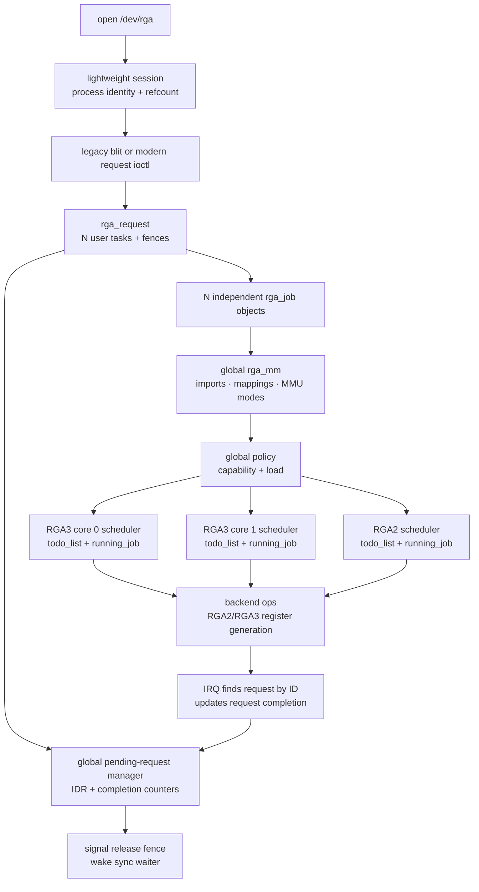

The design is a broad multi-generation subsystem:

- A request is globally discoverable by ID and expands into independently
  schedulable jobs.
- `rga_mm` accepts the vendor's wide buffer model and associates imports and
  mappings with sessions/schedulers.
- A global policy layer chooses among RGA2 and both RGA3 cores using capability
  and load.
- Backend operation tables isolate RGA2 and RGA3 register generation from
  request and memory management.
- Debugfs/procfs and policy machinery observe global state conveniently.
- Completion returns from a per-core `running_job` through the global request
  manager so multi-job request counters and fences can be updated.

This supports broad behavior and lets tasks in one request use different
cores, but it also creates several retirement paths: request completion,
submission failure, acquire-fence callback, timeout, session close, and driver
shutdown can meet the same global objects. The forward-port hardening series
has fixed real double-drop, use-after-free, and teardown-order defects in these
intersections.

### 3.2 Rewrite RGA

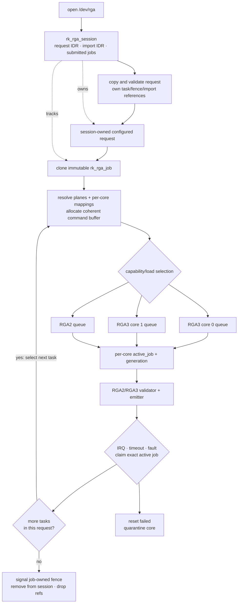

The rewrite deliberately changes request execution:

- Configured request IDs and imported-buffer IDs belong to the opening session,
  not a global pending-request namespace.
- Submission clones an immutable job snapshot. The configured request may be
  reconfigured or destroyed without altering already submitted work.
- A job retains its acquire callback, release fence, imports, per-core mappings,
  command buffer, hardware reference, and session-list membership.
- Multi-task jobs progress serially. Each next task can be rerouted to the
  appropriate RGA2/RGA3 core, but two tasks from the same submitted request are
  not fanned out concurrently.
- The selected core is known before execution mappings and command buffers are
  finalized, so DMA ownership is attached to the device that will actually run
  the task.
- Physical-address imports and unimplemented command profiles fail closed.

### 3.3 RGA request-model tradeoff

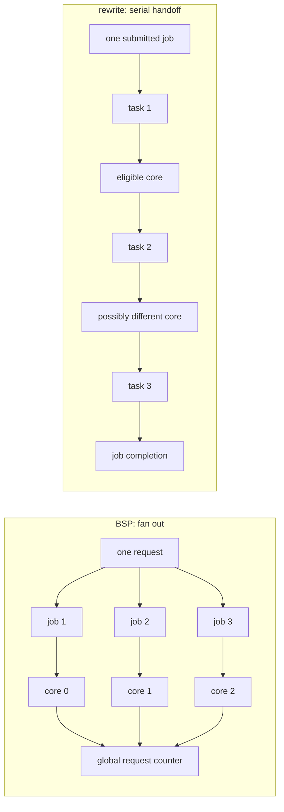

The BSP model can expose more intra-request parallelism. The rewrite model
reduces completion aggregation and fence-ordering complexity. Whether that
serialization matters in production is a performance question, not something
source inspection can answer; the rewrite still owes the paired production
timing gate.

## 4. Buffer, DMA, and IOMMU architecture

Both drivers are DMA drivers: the object lifetime is only safe if no hardware
or IOMMU path can still reach the memory when the final reference is dropped.

```mermaid
flowchart TB
  subgraph BU["BSP-derived buffer route"]
    bfd["userspace fd / VA / physical-style ABI"] --> bmm["session/global memory manager"]
    bmm --> bcache["cached import/mapping"]
    bcache --> bsched["scheduler/core association"]
    bsched --> biova["IOVA or vendor MMU representation"]
    biova --> bhw["hardware"]
  end

  subgraph RU["rewrite buffer route"]
    rfd["userspace dma-buf fd or userptr"] --> rimport["session import<br/>identity + provenance"]
    rimport --> rjob["job retains import"]
    rjob --> rdev["select exact DMA device"]
    rdev --> rmap["job-owned mapping<br/>contiguous span + aperture proof"]
    rmap --> riova["validated IOVA"]
    riova --> rhw["hardware"]
  end
```

| Concern | BSP-derived architecture | Rewrite architecture |
|---------|--------------------------|----------------------|
| dma-buf reuse | Session/global caches avoid remapping. | Session imports are keyed by fd, dma-buf identity, and DMA device; jobs retain mappings. |
| Core selection vs mapping | Mapping and scheduler association are mediated through the global memory subsystem. | The concrete core/DMA device is selected before per-job execution mapping. |
| Scattered userptr | Vendor memory/MMU modes support a broad historical surface. | Normal DMA mapping is tried first; RGA3 may build a driver-owned contiguous IOVA span through the public IOMMU API. |
| Literal addresses | Broad vendor behavior, with later hardening around apertures and physical imports. | Literal IOVAs must be proven inside a retained session mapping; raw physical imports are rejected. |
| Decoder peer visibility | Vendor shared-domain/CCU model. | Hard-CCU admission verifies that every possible executing peer sees the same DMA/IOMMU domain. |
| Fault attribution | Vendor-derived fault and recovery plumbing, hardened in the forward port. | Provider-local callbacks identify the exact physical source, then route recovery to the owning active job or coordinator. |

The rewrite's central invariant is:

```text
no hardware-visible address without provenance
no provenance without a retained import
no execution mapping without a selected DMA device
no final put until DMA is stopped or isolated
```

That stronger local proof reduces the number of implicit assumptions. It also
rejects some workloads the BSP accepts and requires more topology validation at
probe and admission time.

## 5. Completion, recovery, and races

Normal IRQ completion is the easy case. The dangerous case is several terminal
paths arriving together.

### 5.1 BSP-derived completion

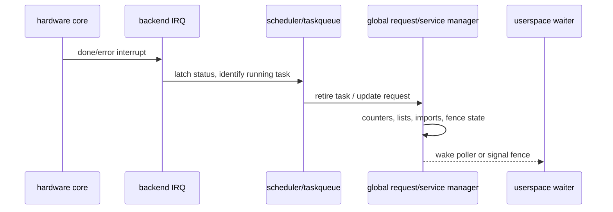

Close, reset, timeout, shutdown, and IRQ paths must all follow compatible global
manager ordering. The hardening tail makes several retire operations
idempotent or serialized, but it retains this basic topology.

### 5.2 Rewrite completion claim

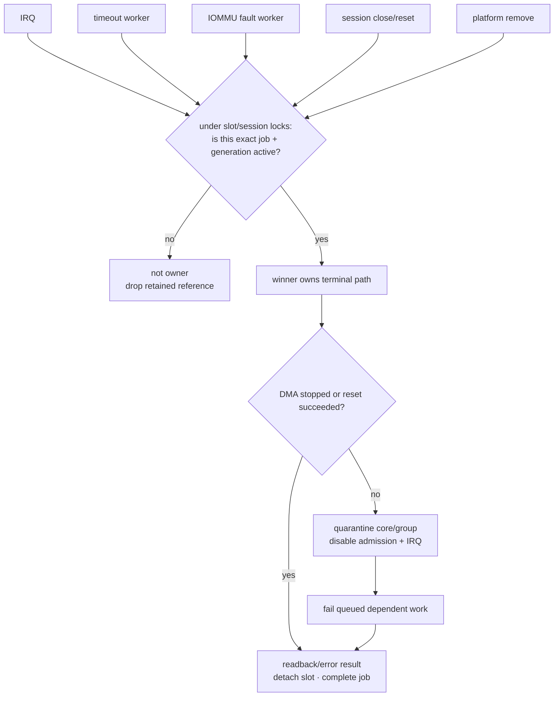

The rewrite separates three ideas that are easy to conflate:

1. A **reference** proves the job or hardware object remains allocated.
2. A **lock/active-slot claim** chooses which contender owns completion.
3. A **generation** proves delayed work belongs to this activation rather than a
   later job that reused the same core.

This is a stronger recovery architecture, but it is also more code. Hard-CCU
peer execution, deferred fault recovery, reset failure, and removal all need
their own exact-reference handoffs. The rewrite's large recent recovery churn
and its KUnit-discovered fixture problems are reminders that explicit state
machines can still be implemented incorrectly.

## 6. Session close and device removal

### 6.1 BSP-derived teardown

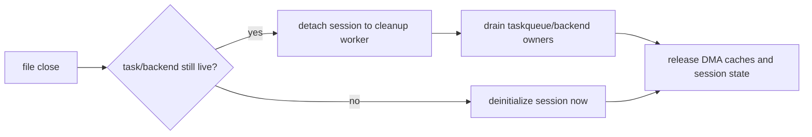

This is compatible with the vendor framework's distributed task ownership.
Its main cost is that the object being closed can remain reachable through
backend and manager structures after the file operation returns.

### 6.2 Rewrite teardown

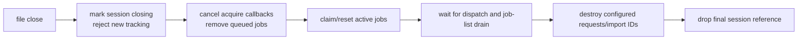

Removal applies the same principle one level higher:

```text
remove from routing → reject admission → quiesce IRQ/work → abort exact jobs
                    → wait for retained hardware refs → release devm resources
```

The rewrite therefore makes teardown easier to state as an invariant. The BSP
path has broader operational history, while the rewrite still needs hostile
unbind/rebind and close/reset board evidence to prove its source-level model.

## 7. Source structure and test architecture

```text
BSP-derived MPP                   rewrite MPP
├── mpp_common.[ch]              ├── mpp_rewrite.c
├── mpp_service.c                ├── ABI.rst
├── mpp_iommu.[ch]               ├── Kconfig
├── mpp_rkvenc2.c                └── Makefile
├── mpp_rkvdec2.[ch]
├── mpp_rkvdec2_link.[ch]
├── mpp_av1dec.c
├── compat/
└── hack/

BSP-derived RGA                   rewrite RGA
├── rga_drv.c                    ├── rga_rewrite.c
├── rga_job.c                    ├── ABI.rst
├── rga_mm.c                     ├── Kconfig
├── rga_policy.c                 └── Makefile
├── rga_fence.c
├── rga2_reg_info.c
├── rga3_reg_info.c
├── debugger / IOMMU helpers
└── include/
```

| Source property | BSP-derived forward port | Rewrite |
|-----------------|--------------------------|---------|
| MPP code/build lines | 18,442, including AV1, compatibility headers, and legacy-SoC helpers | 14,118 including 4,653 KUnit lines; 9,465 without KUnit |
| RGA code/build lines | 21,160 | 23,990 including 10,692 KUnit lines; 13,298 without KUnit |
| ABI ledger | External project documentation and vendor headers | 648-line MPP and 633-line RGA in-tree `ABI.rst` files |
| In-driver KUnit | None comparable | 90 MPP + 152 RGA cases |
| Primary verification style | Board conformance, sanitizer builds, hostile reproducers, production runs | KUnit/build profiles first, then the same board suites and differential artifacts |

The modular BSP layout is easier to browse file by file. The rewrite keeps an
ownership transition close to the state it changes, but its single-file
drivers are harder to review as diffs and more likely to create merge
conflicts. Embedded KUnit explains much of their apparent size, but it also
interleaves test and runtime code in unusually large translation units.

## 8. Pros and cons

### 8.1 BSP-derived forward-port architecture

| Pros | Cons |
|------|------|
| Preserves the widest vendor hardware and ABI surface, including RKMPP AV1 and historical RGA modes. | Carries compatibility glue, legacy-SoC code, private assumptions, and resync work into every new kernel line. |
| Modular backend, scheduler, memory, debugger, and register-generation files. | A single operation crosses several global managers, so ownership and retirement order are harder to prove locally. |
| Mature scheduling and command recipes inherited from the silicon vendor. | Global request/session/memory state has produced real close, IRQ, refcount, and teardown races. |
| Strongest empirical evidence: conformance, bit-exact output, KASAN, root gates, and production performance. | No comparable embedded KUnit suite; pure parser/error-path invariants depend more on audit and external reproducers. |
| Best compatibility oracle for existing Rockchip userspace. | Broad permissive behavior can preserve unsafe or unused ABI paths that a narrower design would reject. |
| Lower immediate deployment risk. | Higher long-term kernel-integration and audit cost. |

### 8.2 Rewrite architecture

| Pros | Cons |
|------|------|
| Public kernel APIs and near-identical driver sources across 6.18 and current mainline reduce forward-maintenance coupling. | Current scope includes a source-only RKMPP AV1 backend, but still omits JPEG/legacy VPU blocks, physical imports, and some historical RGA profiles; AV1 has no hardware evidence yet. |
| Session/job/hardware/import ownership makes asynchronous lifetime and close/remove order locally auditable. | Refcount, lock, generation, work-cancel, and quarantine state machines add substantial implementation complexity. |
| Fail-closed ABI, address-provenance, topology, hardware-ID, and reset checks reduce silent unsafe behavior. | Strict rejection can expose compatibility gaps only when real userspace reaches them. |
| Exact active-slot claims and generation-aware recovery directly address bug classes seen in the BSP architecture. | Clearer architecture has not prevented rewrite-specific recovery, fixture, DT-resource, and shared-IRQ defects. |
| 238 KUnit cases and explicit ABI ledgers make assumptions executable and reviewable. | Large single-file drivers and embedded tests are a review/merge burden; KUnit cannot prove real register recipes, IRQ wiring, or DMA reset behavior. |
| Lower non-test source footprint: roughly half-size MPP and 37% smaller RGA runtime slices. | No successful current-tip media-hardware, production-performance, fuzz, or soak record yet. |
| Better long-term candidate if hardware parity is demonstrated. | Higher immediate qualification risk. |

## 9. Decision matrix

| Goal | Better architecture today | Reason |
|------|---------------------------|--------|
| Ship a working ROCK 5B media stack | BSP-derived forward port | It is the only broadly hardware- and production-validated implementation. |
| Preserve every vendor/legacy behavior | BSP-derived forward port | Its scope is intentionally wider. |
| Minimize kernel-version coupling | Rewrite | Public APIs and the same source on 6.18/current mainline reduce compatibility surface. |
| Audit one job's lifetime and recovery | Rewrite | Session/job ownership, exact slot claims, generations, and quarantine make the proof local. |
| Navigate subsystem code by responsibility | BSP-derived forward port | Its many focused files separate policy, memory, jobs, backends, and debugging. |
| Execute parser/register-emission/error invariants without the board | Rewrite | Embedded KUnit and explicit ABI ledgers provide that layer. |
| Establish behavioral truth on real RK3588 silicon | BSP-derived forward port | Its output and performance are already measured; it remains the differential oracle. |
| Long-term replacement after parity | Rewrite, conditionally | Its maintenance model is preferable only after equivalent hardware, recovery, performance, fuzz, and soak evidence exists. |

## 10. Bottom line

The BSP-derived architecture optimizes for **behavioral continuity**. It keeps
the vendor's broad subsystem, hardware knowledge, and proven paths, then repairs
them incrementally. Its main weakness is distributed global ownership, which
makes races and future kernel integration expensive to reason about.

The rewrite optimizes for **containment and maintainability**. It narrows scope,
ties resources to sessions and immutable jobs, uses public APIs, and treats
unsupported or unprovable states as errors. Its main weakness is that the
cleaner model has grown into two large implementations and has not yet earned
the forward port's hardware evidence.

The sound transition strategy is therefore not an early winner-take-all choice:

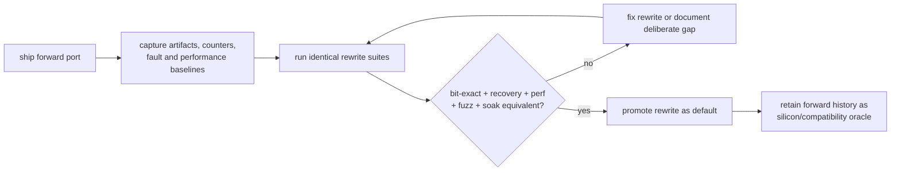

Use the forward port because its behavior is proven. Develop the rewrite because
its ownership and kernel-integration model is better suited to long-term
maintenance. Promote it only when those architectural advantages and equivalent
hardware evidence exist at the same time.

## 11. Quality comparison with upstream media and vendor drivers (2026-07-30)

The rewrite is a better **source design** than the original BSP MPP/RGA stack,
but it is not yet a better **delivered driver** than the BSP-derived forward
port. Against mature upstream video drivers, it is unusually strong in explicit
ownership, fail-closed validation, documentation, and KUnit coverage, but below
the upstream bar in UAPI design, framework integration, source organization,
independent review, and hardware maturity.

This quality judgment extends the architecture comparison above with later
evidence:

| Input | Pin or evidence boundary |
|-------|--------------------------|
| Rewrite 6.18 | `rk3588-rewrite-6.18@600d6e2fb6a49`; 16,095-line MPP and 24,574-line RGA translation units |
| Rewrite mainline replay | `rk3588-rewrite-mainline@451634b8c5a22`; MPP differs from the 6.18 copy by three lines at this boundary, RGA is byte-identical |
| Rockchip BSP donor | `develop-6.1@b4ef083dc0c3` |
| Upstream-style comparators | Linux `v7.2-rc5`-era `rockchip/rkvdec`, Verisilicon Hantro, Chips&Media Wave5, Qualcomm Venus, MediaTek vcodec, Allegro DVT, and Amphion sources in the mainline replay tree |
| Runtime boundary | The rewrite has a clean exact 90 MPP + 152 RGA KUnit gate, but its latest multicore and AV1/VSI lifecycle fixes are not boot-verified |

The upstream comparators are reference designs for kernel-boundary and
maintenance quality, not feature- or performance-equivalent implementations.
Likewise, no claim is made that every silicon-vendor BSP has Rockchip's exact
strengths or weaknesses. The comparison separates what the source proves from
what has run on RK3588 hardware.

### 11.1 Comparative scorecard

| Dimension | Rewrite | BSP-derived forward port | Mature upstream media drivers |
|-----------|---------|--------------------------|-------------------------------|
| Source architecture | Good to very good | Fair | Very good |
| UAPI and client boundary | Good implementation of a risky private ABI | Weak | Excellent |
| Lifetime and recovery model | Very good conceptually | Fair; ownership crosses global managers | Generally good, aided by common frameworks |
| Hardware and feature coverage | Broad but incomplete and unevenly proven | Best for RK3588 | Narrower and hardware-dependent |
| Driver-local unit testability | Excellent by media-driver standards | Weak | Usually modest |
| Real-hardware maturity | Poor at this gate | Strong | Generally mature on each driver's supported platforms |
| Source organization | Weak to fair: two unusually large translation units | Modular, but cross-file ownership is difficult to follow | Usually split by core, queue, codec, firmware, and platform responsibility |
| Kernel-version maintenance | Good: mostly shared sources across 6.18/mainline | Weak: compatibility and resync work remain structural | Best |
| Public review traceability | Limited; extensive local audit, no subsystem review lineage | Weak in the public BSP history | Strongest |
| Upstream readiness | Low without architectural changes | Very low | Already follows subsystem conventions |

The scorecard is deliberately split. Calling the rewrite simply “higher
quality” would erase the forward port's much stronger functional evidence;
calling it “not ready, therefore poor” would erase substantial improvements at
the userspace/kernel boundary.

### 11.2 Where the rewrite is genuinely stronger

The rewrite's principal strength is local ownership. Sessions own configured
state and imports; accepted jobs own immutable request snapshots and retain the
hardware and mappings that asynchronous paths may still use. IRQ, timeout,
fault, reset, close, and removal contend for the same exact active slot instead
of independently retiring a globally managed task. Activation generations keep
delayed recovery from attacking a replacement job, and failed reset proof
quarantines a core or decoder group rather than returning uncertain hardware to
the scheduler.

The userspace boundary is also materially safer than the original BSP:

- unknown flags, malformed message sizes, unsupported secure operation, and
  unimplemented RGA profiles fail closed;
- register indices, offsets, image extents, IOVA spans, 32-bit apertures, MMIO
  windows, hardware IDs, core masks, and CCU/IOMMU topology are checked before
  hardware admission;
- literal codec IOVAs require provenance from retained session mappings;
- raw physical RGA submissions are rejected;
- dma-buf mappings are tied to the selected DMA device and retained until no
  job or asynchronous path can use them; and
- probe or recovery failures generally remove capability instead of continuing
  with guessed hardware state.

These properties directly improve on confirmed BSP defect classes:
session-fd type confusion, unchecked userspace-derived indexes and sizes,
raw-physical-import crashes, global request/fence retirement races, error-pointer
probe bugs, and mappings outliving or underliving their hardware users. The RGA
rewrite also deliberately fixes the BSP's shared release-fence timeline:
independently completing cores receive independent fence contexts, so a merged
sync file cannot signal merely because a later-submitted sibling completed
first. The dated
[BSP quality assessment](../../findings/2026-07-16-rockchip-bsp-driver-quality.md)
records the inspected defects and the boundary of that comparison.

The verification support is exceptional for this driver class. Two explicit
ABI ledgers, 237 embedded KUnit cases, clean-source memory/race build profiles,
debug counters, an event journal, differential artifact comparators, and
fail-closed fixture audits make assumptions executable. None of the inspected
`rkvdec`, Hantro, Wave5, Venus, MediaTek, Allegro, or Amphion directories had a
comparable embedded KUnit suite. This does not make those upstream drivers less
reliable overall—their framework reuse, review history, and hardware use are
different evidence—but it makes the rewrite unusually inspectable.

#### Why upstream media drivers rarely carry suites this large

The missing driver-local KUnit blocks are not normally replaced by equally
large private suites kept elsewhere. Some vendors and CI systems have
non-public tests that cannot be assessed here, but the visible upstream media
test strategy is weighted differently:

- V4L2, vb2, media-request, control, and mem2mem behavior is implemented in
  shared frameworks. A driver reuses those lifetimes and state machines instead
  of unit-testing another private implementation of them.
- The media maintainer checklist requires the external `v4l2-compliance` tool
  from `v4l-utils`; codec drivers are additionally exercised through real
  streams, codec-conformance tools, FFmpeg/GStreamer userspace, CI, and board
  testing.
- Much of a media driver's highest-risk behavior depends on real firmware,
  DMA/IOMMU topology, interrupt timing, reset semantics, and register effects.
  A small fake often gives less confidence than a hardware integration test.
- KUnit is best suited to small, self-contained white-box units. Many mature
  media drivers predate KUnit, and retrofitting unit seams into hardware-bound
  code has competed with functional and conformance work.

At the inspected `v7.2-rc5`-era pin, no registered KUnit suite was found
anywhere under `drivers/media`, not merely in the selected codec comparators.
That is a statement about subsystem practice, not a recommendation that media
drivers should remain un-unit-tested.

The rewrite also owns substantially more unit-testable policy than a normal
V4L2 codec driver. Its private ABIs require custom message and task parsing,
register-image classification, fd/import identity, literal-IOVA provenance,
core routing, fences, polling, timeout/fault generations, and RGA command
emission. Tests for those contracts are justified; deleting them merely to
resemble the upstream case count would reduce confidence without reducing the
production attack surface.

The current suite is nevertheless overbuilt in **shape**, though not simply in
raw case count. The RGA KUnit region is about 10,700 lines and the MPP region
about 4,600 lines—roughly 15,300 test lines embedded in approximately 40,700
driver lines. Several costs are now demonstrated:

- consumer-named FFmpeg, GStreamer, RKNN, display, and librga cases sometimes
  reach the same normalized validator/emitter recipe instead of sharing one
  parameterized golden table;
- compile-time ABI properties and behavior fully visible through public ioctls
  have consumed boot KUnit cases despite stronger `static_assert` or
  userspace-test owners;
- large lifecycle cases manually constructed partial sessions, devices, jobs,
  imports, work items, files, and fences, producing fixture bugs that poisoned
  later cases or the live service; and
- tests embedded in the production `.c` files have unrestricted access to
  static internals, encourage fixture duplication, and make both production
  review and test-only diffs harder to navigate.

The right correction is rationalization, not deletion. Keep device-free KUnit
for deterministic parsing, bounds, layout, routing, address provenance, and
independent register goldens. Keep isolated lifecycle KUnit for ownership,
fence, abort, timeout, and recovery transitions that are difficult to trigger
reliably. Move ABI-visible behavior to `abi-probe`/fuzz tests, compile-time
layout to assertions, and hardware truth—pixels, bitstreams, IRQ wiring, DMA,
IOMMU, clocks, and reset—to conformance. Consolidate equivalent vectors into
named parameter tables, build lifecycle fixtures through complete shared
constructors, and move tests into separate translation units.

The target should therefore not be “238 cases” or an arbitrary smaller number.
It should be the minimum set of independently-oracled cases that uniquely owns
each material contract at the lowest safe layer. A parameterized case with 30
named boundary vectors can be stronger and much cheaper than 30 copied
consumer-profile fixtures.

### 11.3 Why mature upstream drivers still set a higher bar

The preserved BSP ABI is the rewrite's structural ceiling. `/dev/mpp_service`
accepts low-level message streams and register images; `/dev/rga` accepts a
large private image-operation structure. Even a carefully validated
implementation must own a bespoke parser, fd/import cache, scheduler, polling
contract, fence model, and recovery state machine.

Mainline stateless decoders such as `rkvdec` and Hantro instead express work
through typed codec controls, media requests, vb2 buffers, and V4L2 mem2mem
ownership. Stateful encoder/decoder drivers such as Wave5, Venus, MediaTek
vcodec, and Amphion use the same queue/control framework around
firmware- or hardware-specific backends. Those abstractions do not make the
drivers bug-free, and firmware protocols can hide complexity outside the
kernel, but they remove whole classes of private request, buffer, and
per-client lifetime machinery.

The rewrite cannot receive that framework advantage while remaining a drop-in
`libmpp`/`librga` compatibility driver. It can become a high-quality downstream
compatibility implementation, but the private register-job ABI is unlikely to
be the preferred upstream media architecture. A V4L2-facing path would be a
separate design, not a cleanup patch.

Other upstream-readiness costs remain:

- the MPP and RGA implementations are concentrated in approximately 16k- and
  24.5k-line files; embedded tests explain much of the size, but production
  responsibilities are still harder to review, merge, and assign than in
  normally split upstream drivers;
- precise recovery uses new Rockchip/VSI IOMMU provider hooks. They avoid
  carrying private BSP internals, but remain bespoke cross-subsystem interfaces
  that need independent IOMMU review;
- board-level DT retyping and private procfs compatibility markers are
  downstream integration devices, not clean standard interfaces; and
- local adversarial audits have been productive, but they are not a substitute
  for sustained independent review by media, DMA, IOMMU, locking, and hardware
  maintainers.

The mainline-style Rockchip RGA driver illustrates the feature tradeoff. Its
roughly 3k-line V4L2 path is much smaller and cleaner because it exposes a
narrow one-source scale/convert/blit contract. It lacks most `/dev/rga`
composition, compression, tiling, rotation, synchronization, and multicore
behavior, so its size is not evidence that a feature-compatible rewrite should
also be 3k lines.

### 11.4 The present implementation-maturity penalty

The rewrite's architecture has not yet stabilized at the hardware boundary.
The
[2026-07-24 full-file audit](../../findings/2026-07-24-rewrite-driver-multi-agent-defect-audit.md)
confirmed and fixed 17 distinct lifetime, DMA, command-emission, UAPI,
scheduling, IRQ, and recovery defects. The
[2026-07-29 review](../../findings/2026-07-29-rewrite-driver-review-round-2.md)
confirmed another 12 defects, including a hard-CCU chain dual writer, an abort
path that failed to restart scheduling, incorrect RGA fence timelines,
shared-IRQ unpowered MMIO, and a legacy rotation convention that made every
genuine portrait 90°/270° submission fail.

Finding and fixing those defects is evidence of a healthy review process. Their
number and severity are also evidence that the implementation had not
stabilized. Several were regressions introduced during recent hardening rather
than inherited unknowns.

The board result is more important than the audit count. The first multicore
media qualification found a repeatable full-system interconnect wedge. The
[first dual-core finding](../../findings/2026-07-29-rewrite-soft-ccu-dual-core-wedge.md)
records the original discriminator and source model; the later 2026-07-30
sequence narrowed the surviving trigger:

1. the exact KUnit gate completes;
2. H.264 and multithreaded H.264 pass after the first soft-CCU correction;
3. H.265 at the next session's first submission wedges the board;
4. H.265 alone passes, and the reduced `mpi_dec_mt_h264` → `mpi_dec_h265`
   pair reproduces the wedge; and
5. the current group-power fix is source-reasonable but unbooted.

That failure is precisely the boundary KUnit cannot model: coordinator
registration, clock gating, sibling power, interrupts, and register ordering on
real silicon. The current source-level recovery model remains a strength, but
it is not yet runtime proof.

The tests themselves have also revealed oracle debt. Early fixtures poisoned
the live service or freed production-owned objects twice; the gate initially
misparsed real KTAP and misreported live lockdep; incorrect RGA rotation
fixtures hid a real ABI-wide failure; and several emitter tests compute
expectations through helpers shared with the production emitter. The suite is
valuable infrastructure, but the case count must not be treated as independent
functional certification.

### 11.5 Feature, performance, and vendor-driver comparison

The BSP still wins on breadth and observed behavior. It carries mature
multicore RKVENC2/RKVDEC2 coordination, the AV1 path, broad RGA composition and
format support, legacy hardware helpers, and product-specific power and memory
knowledge. The forward port has bit-exact decode, multicore encode, RGA,
transcode, KASAN, root-gate, and production-performance evidence. The rewrite
now contains an AV1 backend in source, but AV1 has no rewrite hardware result;
JPEG, legacy VPU codecs, secure mode, and parts of the RGA operation matrix
remain outside scope. Rewrite RGA also advances tasks within one submitted
multi-task request serially, while the BSP can fan them across cores; the
performance effect is unmeasured.

Compared with vendor-only accelerator drivers, the rewrite is well above the
inspected Rockchip MPP/RGA/RKNPU boundary quality: it does not trust exported
kernel pointers, accept unchecked physical channels, silently ignore unknown
flags, or depend on the same broad global ownership model. That does not mean
all vendor code is poor. Rockchip's framework-led DRM display sample is much
closer to ordinary mainline quality, and vendor stacks often know hardware
quirks, clock sequencing, firmware behavior, and product workloads that a
rewrite learns only through failures. The current CCU wedge is a concrete
example of the BSP's operational knowledge outperforming a cleaner abstraction.

Upstreamed vendor-origin drivers occupy the middle ground. Wave5, Venus,
MediaTek, and Amphion are still complex vendor hardware integrations with
custom firmware protocols and substantial platform data, but their external
contract, buffer ownership, and scheduling entry points use common media
frameworks and have subsystem review history. The rewrite is more transparent
than a firmware-heavy driver and better unit-instrumented than many of them; it
is weaker at the public interface and qualification layers.

### 11.6 Graded assessment and deployment decision

These grades are judgments; the source and runtime boundaries above are the
durable evidence.

| Dimension | Grade |
|-----------|-------|
| Source design | B+ |
| Kernel-boundary validation | B+ |
| Testability and documentation | A- |
| Code organization | C+ |
| Current runtime correctness and qualification | C- / D+ |
| Upstream readiness as code | C- |
| Suitability of the preserved private UAPI for upstream | D |
| Long-term downstream replacement potential | B+ / A-, conditional on qualification |

The forward port should remain the shipping implementation and differential
oracle. The rewrite becomes the better overall driver only after the current
dual-core sequence passes, followed by full MPP/RGA/AV1 conformance, byte-exact
comparison, hostile recovery, coverage-guided fuzzing, production performance,
and soak. Until then the fair description is:

> The rewrite is substantially better engineered at the kernel boundary than
> the original BSP, and promising as the long-term downstream implementation,
> but it has not yet reached mature upstream-driver quality as a delivered
> driver.

## 12. Current mainline and maxline Rockchip codec audit (2026-07-30)

The rewrite review also exposed useful questions to ask of the standard V4L2
Rockchip codec paths. A fresh source audit produced seven bounded correction
groups for current mainline or Hantro code, a deeper timeout-recovery concern
that needs hardware evidence before changing, and several lifetime blockers in
the not-yet-merged maxline multicore series.

This section is the public engineering record: what the inspected code does,
why it is suspect, and what would prove a correction. Upstream submission
sequencing is deliberately not recorded here; repository policy assigns that
material to the private `rock-5b-security` repository.

> **The diagnoses below survived re-review; three of the patches written from
> them did not.** A 2026-08-02 adversarial read of
> [`patches/mainline-codec-fixes/`](../patches/mainline-codec-fixes/README.md)
> against the same mainline source found that the Hantro unwind patch
> self-deadlocks, the `sizeimage` patch rejects geometry the driver advertises
> instead of clamping it, and both DMA-mask patches are no-ops because the
> platform streaming mask is already 32-bit. Read §12.4 and §12.5 in particular
> as correct problem statements whose obvious implementation is wrong; the
> mechanisms are in
> [the series self-review](../../findings/2026-08-02-mainline-codec-fix-series-self-review.md).

### 12.1 Exact scope and the encoder naming trap

| Input | Pin inspected |
|-------|---------------|
| Torvalds mainline | `origin/master@3708dd9488440e35a165aee2bb2a1a7b1d0d5777` (2026-07-30) |
| Media integration | `media/next@a52e6f7923c17a672135b485ffd96fbd72f46267` (2026-07-17) |
| Maxline public integration | `rk3588-maxline-public@f12fb0acf7bb923c5958e9430edd0dae93400951` |
| Maxline WIP integration | `rk3588-maxline-wip@74b24e96da6245ef951ec34de481b7b8a2b91d34` |
| Maxline VDPU381 VP9 donor commit | `6f0159ae61a89d4e4eee2e4f0170c351bf7543fa` |

The source was separated into the clean external worktree
`/home/yi/Code/rock-5b/kernel/linux-maxline`, with the public integration
checked out and the WIP state retained as a separate branch. The reconstruction
recipe and all pins live in
[`docs/source-trees.md`](../../docs/source-trees.md#13-current-mainline-media-and-maxline-codec-audit-trees).

“Mainline Rockchip encoder” does **not** mean the RK3588 VEPU580/RKVENC2
H.264/H.265 block studied by the BSP and rewrite tracks. Neither the official
tree nor maxline contains such a driver. The relevant mainline RK3588 media
paths are:

| Hardware/path | Mainline driver and scope |
|---------------|---------------------------|
| VEPU121 | Verisilicon Hantro, using `rk3568_vepu_variant`; JPEG encode only |
| VDPU381/VDPU383 | `drivers/media/platform/rockchip/rkvdec`; stateless H.264 and H.265 |
| VPU981 | Verisilicon Hantro; stateless AV1 decode |
| Legacy Hantro blocks | JPEG encode and SoC-dependent MPEG-2/VP8/H.264 decode |

Therefore the rewrite's VEPU580 DCHS, slice FIFO, dual-core producer retirement,
and private MPP-register ABI findings do not map to an existing mainline
encoder. They remain design requirements for a future VEPU580 driver rather
than fixes to the Hantro JPEG encoder.

The inspected `media/next` already carries other independent RKVDEC/Hantro
corrections:

| Commit | Correction |
|--------|------------|
| `f0b9d7e5be061` | tighten extended HEVC SPS RPS control dimensions |
| `052c5ed5a1d96` | guard an HEVC inter-RPS prediction index underflow |
| `c37aca64206fa` | propagate `platform_get_irq()` errors |
| `28ceb7eb73c90` | use `DIV_ROUND_UP()` for CTB counts |
| `7504c2463632a` | add missing Hantro media-entity cleanup |

Literal source comparison against that integration pin found none of the
issues below corrected there.

### 12.2 Mainline RKVDEC capture-format state and size arithmetic are unsafe

`rkvdec_try_capture_fmt()` calls `rkvdec_fill_decoded_pixfmt()`, which stores
the proposed image size in `ctx->colmv_offset`. That makes
`VIDIOC_TRY_FMT` stateful: a speculative format query with different dimensions
can change the colmv address used by a later decode even though userspace never
committed that capture format. The derived offset must instead be returned
separately and stored only by capture `S_FMT` or an internal committed-format
reset.

VDPU381 and VDPU383 advertise H.264 dimensions up to `65520 × 65520` and H.265
dimensions up to `65472 × 65472`. `rkvdec_fill_decoded_pixfmt()` then:

1. asks `v4l2_fill_pixfmt_mp()` to fill a `struct
   v4l2_plane_pix_format`, whose `sizeimage` member is `u32`;
2. saves that value as the colmv offset; and
3. adds the variant's colmv allocation to the same `u32`.

The V4L2 helper's stride, plane-size multiplication, and composite-plane sum
also use `unsigned int`. The driver checks each queued capture plane only
against this already-truncated `sizeimage`. Axis bounds alone therefore do not
prove that the byte span represented by the format is representable.

For a concrete valid-step example, an NV12 `46400 × 46400` VDPU381 H.264
capture needs:

```text
NV12 frame = 1.5 × width × height = 3,229,440,000 bytes
colmv      = 0.5 × width × height = 1,076,480,000 bytes
true total                          = 4,305,920,000 bytes
u32 result after addition          =    10,952,704 bytes
```

The negotiated allocation can thus be about 10.4 MiB while the programmed
geometry describes slightly over 4 GiB of frame plus colmv storage. Depending
on the IOMMU and adjacent mappings, the result can be an IOMMU fault or DMA
beyond the accepted capture buffer.

The robust boundary is the **derived byte span**, not an arbitrary 8K width
cap. Long, thin pictures such as `8440 × 1056` demonstrate why a product/format
check is more accurate than rejecting every axis above a familiar display
resolution. A correction needs a `u64` or checked-arithmetic calculation for
all component planes plus colmv, followed by rejection when the exact
`sizeimage` cannot be represented. The colmv helper itself must not overflow
before its result is widened.

> **Corrected 2026-08-02: "rejection" is the wrong verb at the ioctl boundary.**
> The overflow analysis holds, but `VIDIOC_TRY_FMT` and `VIDIOC_S_FMT` are
> required to adjust a format the driver cannot accept, not to fail — and the
> geometry in question is published by the driver's own
> `rkvdec_enum_framesizes()`, so returning `-EINVAL` makes the driver
> inconsistent on its own interface and fails `v4l2-compliance`. The checked
> arithmetic belongs where it is; what follows it is a **clamp** to the largest
> representable size for the requested pixel format, which also makes
> `enum_framesizes` honest. Rejection remains correct only where no adjustment
> is possible. The patch written from this subsection rejects; see
> [the series self-review](../../findings/2026-08-02-mainline-codec-fix-series-self-review.md).

Useful proof consists of a small pure-helper boundary table:

- the largest representable square-ish NV12 case;
- the next aligned dimension, rejected;
- a legal long/thin case, retained;
- the 10-bit and 4:2:2 formats, whose byte limits differ; and
- `TRY_FMT`/`S_FMT` plus `v4l2-compliance` confirmation that userspace sees the
  same accepted boundary and that `TRY_FMT` cannot alter a committed colmv
  offset.

This is a proportional use for a small KUnit or ordinary helper test. It does
not justify importing the rewrite's whole private-ABI suite.

### 12.3 Mainline RKVDEC holds an enable reference on every clock

Commit `6a846f7d72c7b` changed probe to
`devm_clk_bulk_get_all_enabled()`. That helper obtains **and enables** all
clocks until devres teardown. Runtime resume separately calls
`clk_bulk_prepare_enable()`, and runtime suspend calls
`clk_bulk_disable_unprepare()`.

Consequently runtime suspend removes only the runtime reference. The probe
reference remains, so autosuspend cannot actually gate the clocks. The bounded
ownership correction is to obtain the clocks without enabling them and leave
runtime PM as the sole enable owner.

The functional smoke test is insufficient because decoding still works with
the leak. The discriminating check is the relevant clock counts in
`/sys/kernel/debug/clk/clk_summary` before decode, while active, and after the
autosuspend interval.

### 12.4 RKVDEC and Hantro set only the coherent DMA mask

Both probe paths call:

```c
dma_set_coherent_mask(dev, DMA_BIT_MASK(32));
```

Their hardware address registers are 32-bit, but vb2 capture/output queues
accept imported DMABUFs. vb2 dma-contig maps those attachments with streaming
DMA APIs, which use `dev->dma_mask`, not `dev->coherent_dma_mask`. A coherent
mask alone therefore does not establish the comment's claimed invariant that
the most-significant address bits are zero.

Each driver needs the streaming and coherent masks set consistently, normally
through `dma_set_mask_and_coherent()`. This is two driver-local corrections,
not one cross-driver patch. A 32-bit Rockchip IOMMU aperture can hide the
mistake on common boards, so the useful validation is an imported-DMABUF test
with the IOMMU disabled or with memory placement that would expose an
unconstrained streaming mask.

> **Corrected 2026-08-02: there is no live defect here.** The API observation
> above is accurate — vb2 does map imported DMABUFs through the streaming API
> and `dev->dma_mask` — but for these two platform devices that mask is already
> constrained before probe runs.  `setup_pdev_dma_masks()`
> (`drivers/base/platform.c`) defaults both `dma_mask` and `coherent_dma_mask`
> to `DMA_BIT_MASK(32)`, and `of_dma_configure_id()` (`drivers/of/device.c`)
> only ever ANDs them narrower. `dma_set_mask_and_coherent(dev,
> DMA_BIT_MASK(32))` therefore changes nothing, and the patches written from
> this subsection are no-ops asserting a regression that never happened. The
> generalization was applied without tracing the mask's actual provenance on
> this device class; see
> [the series self-review](../../findings/2026-08-02-mainline-codec-fix-series-self-review.md).

### 12.5 Hantro `device_run()` leaks acquired execution resources on errors

Hantro's `device_run()` obtains runtime PM and then enables prepared clocks.
Both a clock-enable failure and a codec backend's `run()` failure jump directly
to `hantro_job_finish_no_pm()`, which completes buffers but intentionally does
not balance either resource.

The backend error boundary also crosses request-control and watchdog ownership.
An error can follow `hantro_start_prepare_run()`, while request controls remain
installed, or `hantro_end_prepare_run()`, after request controls were completed
and the watchdog was scheduled. The current generic error path neither
completes the first state nor cancels the second.

The VPU981 AV1 backend has an additional double-completion path: its
`prepare_error` label calls `hantro_end_prepare_run()` and
`hantro_irq_done(..., VB2_BUF_STATE_ERROR)`, then returns an error to
`device_run()`, whose generic path completes the same mem2mem job again. A
synchronous backend error needs one completion owner.

The failure states require separate unwind ownership:

| Last successful acquisition | Required unwind before buffer completion |
|-----------------------------|-------------------------------------------|
| none; runtime resume failed | none |
| runtime PM only | runtime-PM put |
| runtime PM plus enabled clocks | disable clocks and runtime-PM put |

This affects the shared Hantro core and therefore includes the RK3588 VEPU121
JPEG encoder and VPU981 AV1 decoder. The bounded correction tracks whether
request controls are installed, cancels any staged watchdog, balances clocks
and runtime PM according to the last successful acquisition, and leaves all
synchronous run-error completion to `device_run()`. Fault injection before and
after both prepare helpers should prove exactly one buffer/job completion, one
request-control completion, no remaining watchdog, and PM/clock counts returned
to baseline.

> **Implementation trap, recorded 2026-08-02.** "Cancels any staged watchdog"
> must not become `cancel_delayed_work_sync()`. `hantro_watchdog()` re-enters
> `device_run()` through `v4l2_m2m_schedule_next_job()`, so a synchronous
> cancel on the run-error path waits for the work item that is currently
> calling it, and the same path is reachable from the non-threaded IRQ handler.
> Mainline's non-sync `cancel_delayed_work()` in `hantro_irq_done()` is the
> interrupt-versus-watchdog completion-ownership protocol, not an oversight —
> whatever replaces it has to answer who owns the job when the cancel loses the
> race. The patch written from this subsection got this wrong; see
> [the series self-review](../../findings/2026-08-02-mainline-codec-fix-series-self-review.md).

### 12.6 RKVDEC destroys a provider-owned SRAM pool on probe failure

RKVDEC obtains optional RCB SRAM with `of_gen_pool_get()`. That is a borrowed
pool owned by the SRAM provider; it is not transferred to the codec consumer.
If subsequent V4L2 initialization fails, RKVDEC nevertheless calls
`gen_pool_destroy()` on it.

Destroying the shared provider object can invalidate the provider's own
reference and any other consumer. The consumer error path should simply stop
using the borrowed pool. The useful error-path test forces failure after SRAM
lookup and verifies that the provider and a second pool lookup remain valid.
The ownership mistake entered with the RCB/SRAM support represented by commit
`e5640dbb991c4`.

### 12.7 Timeout recovery is variant-wrong and lacks a generation proof

The common RKVDEC watchdog writes legacy `RKVDEC_IRQ_DIS` to offset `0x004`.
That matches the old RKVDEC register layout, but the newer variants place
interrupt control elsewhere:

| Variant | Relevant interrupt-control location |
|---------|-------------------------------------|
| Legacy RKVDEC | `RKVDEC_REG_INTERRUPT = 0x004` |
| VDPU381 | `VDPU381_REG_IMPORTANT_EN = 0x02c` |
| VDPU383 | link-window `VDPU383_LINK_INT_EN = 0x048` |

The watchdog then completes the current mem2mem job without a
variant-specific quiesce/reset operation or synchronization against a late
interrupt. The shared IRQ entry obtains the current context and dispatches to a
variant handler without first proving it is non-NULL and still belongs to the
timed-out activation. A late completion can therefore encounter no current
context or a replacement job.

This maps directly to the rewrite's most valuable recovery lesson:

```text
allocation lifetime is not completion ownership
current slot is not proof of activation identity
timeout completion is unsafe until DMA and IRQ sources are quiesced
```

A cosmetic NULL check would avoid only one symptom. A real correction needs
variant-specific interrupt disable/reset semantics, IRQ synchronization, and
an exact activation/generation ownership rule. Because those operations are
hardware-specific, the audit classifies this as a source-confirmed design gap
whose exact correction remains unverified. Timeout fault injection and a
forced late IRQ are required before changing the recovery sequence.

### 12.8 The maxline multicore series has shared-lifetime blockers

Maxline is not another name for mainline. Its public branch integrates
not-yet-merged RK3588 patchsets, including RKVDEC multicore work, while its WIP
branch adds the VDPU381 VP9 donor commit. Defects in those commits should be
folded into the series while it is still under development; they are not
defects in Torvalds' single-core driver.

#### Cross-core runtime PM can power down an active sibling

Each core is a separate platform device and jobs take a runtime-PM reference on
the selected core's device. However, every platform device stores the same
shared `struct rkvdec_dev` as drvdata, and each runtime callback loops over
**all** registered cores' clocks.

If core A becomes idle, suspending device A can disable core B's clocks while
device B still has its own active PM reference and hardware job. This is the
same ownership error as the rewrite soft-CCU wedge: a local lifetime transition
mutates a shared sibling without owning the sibling's state.

Each per-device callback must operate only on that device's core. Any genuinely
shared clock or power resource needs a coordinator-level reference whose
critical section covers the whole dependent operation.

#### Streamoff frees codec state before hardware is proven idle

The maxline `rkvdec_stop_streaming()` calls the codec-specific `stop()` hook and
only then calls `vb2_wait_for_all_buffers()`. Codec stop hooks free coherent
H.264/H.265/VP9 tables and `ctx->priv`.

The multicore dispatch path can report the mem2mem scheduling job finished
while the selected core still owns the hardware work. Ordinary mem2mem
cancellation therefore no longer proves that the hardware and IRQ path have
released the codec state. Streamoff needs to cancel/quiesce and wait for every
in-flight core activation before any codec-private DMA storage is freed.

#### Probe and unbind do not have a stable cluster owner

The series treats the first matching DT node as the owner of a shared,
devm-allocated cluster:

- `core_count` is incremented before clocks, MMIO, IOMMU, IRQ, and runtime-PM
  acquisition succeeds, so probe defer/failure consumes a slot;
- the fixed `cores[2]` storage is indexed without a count bound;
- a secondary core can probe before the selected first core has published the
  shared object, without an explicit `-EPROBE_DEFER` contract; and
- removing any child performs shared V4L2 cleanup, while removing the first
  child's devm allocation can leave another child pointing into freed state.

The cluster needs a real lifetime owner—component/auxiliary coordination or an
equivalent explicit parent—with per-core registration committed only after
successful acquisition and rolled back on every failure.

#### Failed empty-domain allocation leaves an `ERR_PTR`

The multicore code checks `iommu_paging_domain_alloc()` with `IS_ERR()` but
does not clear the stored pointer. Remove later treats every non-NULL value as
a domain and frees it. Official mainline already clears the pointer on this
failure; the maxline series regressed that behavior and should retain the
mainline error-state invariant.

The common watchdog/late-IRQ concern from §12.7 becomes more dangerous with
per-core raw `curr_ctx` pointers. Multicore IOMMU recovery also detaches and
reattaches a core around a shared global domain; peer execution must be part of
the exclusion proof rather than assumed harmless.

### 12.9 The VDPU381 VP9 WIP commit is not internally consistent

WIP commit `6f0159ae61a89` adds 1,303 lines in one change and says the hardware
supports VP9 through `7680 × 4320`, but its format table advertises
`65472 × 65472`. That unnecessarily inherits and amplifies the capture-size
overflow in §12.2.

The register programming also contains a direct scale-axis error:

```c
regs->vp9_param.reg92.vp9_aref_hor_scale = hscale;
regs->vp9_param.reg93.vp9_aref_ver_scale = hscale; /* should use vscale */
```

Only the alternate-reference vertical path is wrong; last and golden
references use `vscale`. A VP9 frame whose altref dimensions differ vertically
is the discriminating hardware vector.

The same file derives `aligned_pitch`, `y_len`, `uv_len`, `yuv_len`, pixel
counts, and motion-vector base addresses through `unsigned int` arithmetic.
Those expressions must be checked or bounded consistently with the advertised
format limits before the code can safely program buffer offsets. The commit
also carries Android `Change-Id` metadata and inconsistent formatting, but
those are review-shape issues, not functional evidence.

### 12.10 What the rewrite taught that transfers—and what does not

| Rewrite lesson | Mainline/maxline application |
|----------------|------------------------------|
| Validate derived byte spans, not just independent fields | Directly exposes RKVDEC `sizeimage` and VP9 WIP arithmetic overflow |
| One owner balances every acquired PM/clock/DMA/control/watchdog resource | Exposes RKVDEC's probe/runtime clock double ownership and Hantro's incomplete and duplicate failure completion |
| A consumer must not free provider-owned infrastructure | Exposes the borrowed SRAM `gen_pool` destruction |
| A per-core lifetime transition must not mutate an unowned sibling | Exposes maxline's all-core runtime callbacks |
| Finishing a software scheduling slot does not prove DMA has stopped | Exposes maxline streamoff ordering and mainline timeout recovery |
| A retained pointer is not activation identity | Motivates generation-aware late-IRQ handling |
| Unit-test deterministic policy; prove silicon behavior on hardware | Supports a tiny arithmetic/error-unwind suite, not a 238-case transplant |
| Private register-job ABI validation | Does not transfer to V4L2 request drivers, which reuse typed controls, vb2, requests, and mem2mem ownership |
| VEPU580 DCHS/slice-FIFO invariants | No current mainline VEPU580 encoder exists to patch |

The result is not that the rewrite is “better than mainline.” The common media
framework removes large amounts of private machinery that the rewrite must
test itself. The useful conclusion is narrower: the rewrite review produced
several general DMA, power, ownership, and recovery invariants, and applying
those invariants to current upstream-style code found concrete defects that
framework reuse does not automatically prevent.

### 12.11 Prepared mainline correction evidence

The seven mainline-only corrections are preserved as mail-formatted patches in
[`patches/mainline-codec-fixes/`](../patches/mainline-codec-fixes/README.md).
They were prepared from
`3708dd9488440e35a165aee2bb2a1a7b1d0d5777` on branch
`mainline-rkvdec-hantro-fixes-ready`, whose audited tip is
`c28b6586f74f7fb37c071174b66a445cf4ce0884`. No maxline or other
not-yet-merged-driver change is present.

The evidence closes source-shape and compile gates only:

- strict `checkpatch.pl` reported zero errors, warnings, and checks for every
  commit and exported patch;
- the dependent two-patch format correction and each independent remaining
  patch apply cleanly to the recorded base; and
- an arm64 `defconfig` plus `COMPILE_TEST=y`, the RKVDEC and Hantro modules,
  Rockchip Hantro support, and `W=1` built both aggregate driver objects.

This does **not** close runtime correctness. Format-boundary negotiation,
autosuspend clock counts, imported-DMABUF addressing, each failed-run stage, and
provider-owned SRAM survival retain the discriminating hardware tests described
above.
