# BSP-derived forward port vs clean-room rewrite — architecture comparison

The two ROCK 5B media-driver tracks expose the same device files but make very
different internal tradeoffs. The **BSP-derived forward port** preserves
Rockchip's MPP and RGA subsystem architecture while adapting and hardening it
for Linux 6.18. The **clean-room rewrite** keeps the current userspace contract
but replaces the global BSP machinery with session/job ownership and public
kernel APIs.

This document compares architecture, not just feature lists. It is based on the
2026-07-26 source pair:

| Track | Pin |
|-------|-----|
| BSP-derived forward port | `rk3588-video-6.18@12a7da02bea83` |
| 6.18 rewrite | `rk3588-rewrite-6.18@4273266a990e` |
| Mainline rewrite cross-check | `rk3588-rewrite-mainline@ef79d16bd902` on `v7.2-rc5`; the two rewrite driver files are byte-identical to the 6.18 versions |

The [current implementation comparison](./rewrite-drivers.md#current-comparison-2026-07-26)
owns moving status, scope, exact source counts, and the production decision.
The [forward-port driver guide](./how-the-drivers-work.md) and
[rewrite architecture guide](./rewrite-driver-architecture/README.md) remain
the detailed source-reading companions.

## 1. Same external contract, different design centers

Both tracks sit below the same applications and userspace libraries:

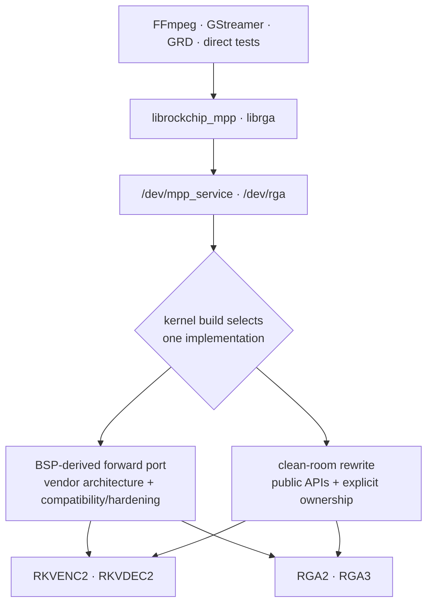

They cannot run side by side for the same hardware in one boot. Their Kconfig
options are mutually exclusive because each pair binds the same device-tree
nodes and registers the same device files.

The common silicon pipeline is also unavoidable:

```text
copy request → validate → resolve buffers → choose core → build/patch commands
             → power/clock → start DMA → IRQ/timeout/fault → read back → complete
```

The architectural disagreement is about who owns state at each stage, how long
that ownership lasts, and what happens when normal completion races close,
reset, fault recovery, or device removal.

| Design question | BSP-derived answer | Rewrite answer |
|-----------------|--------------------|----------------|
| What is preserved? | The broad vendor subsystem and historical ABI behavior. | The observed current ROCK 5B ABI and hardware behavior. |
| Where does state live? | Global service/request/memory managers plus per-device scheduler state. | Opening session, immutable submitted job, and retained hardware/import objects. |
| How is kernel drift handled? | Compatibility headers and narrow adaptations around BSP assumptions. | Public kernel APIs, with the same driver sources replayed on 6.18 and current mainline. |
| How is unsupported behavior treated? | Usually inherited because the vendor surface is carried wholesale. | Classified in `ABI.rst` and rejected explicitly when no safe implementation exists. |
| What is the main source of confidence? | Vendor history plus extensive board and production testing. | Executable invariants and source clarity; board qualification remains incomplete. |

## 2. MPP codec architecture

MPP is primarily a register-job transport. Userspace's codec HAL builds the
H.264/H.265/VP9 register recipe; the kernel validates it, replaces buffer fds
with device addresses, schedules it, starts the selected core, and returns
register readback.

### 2.1 BSP-derived MPP

The BSP MPP architecture is a service framework with specialized hardware
backends:

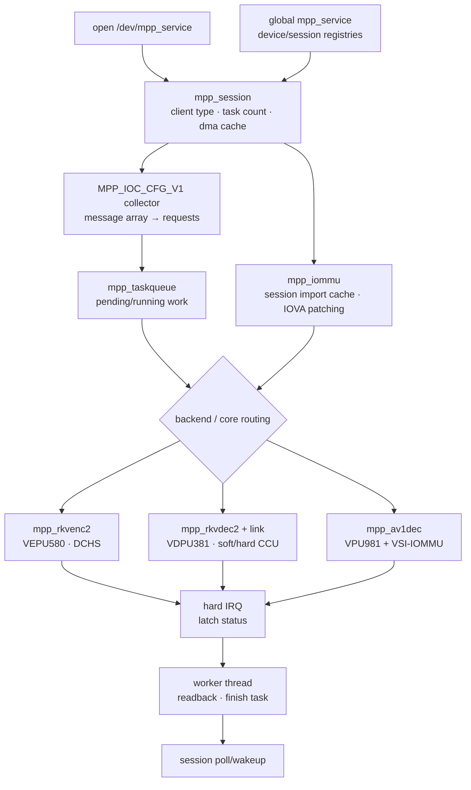

Important properties:

- `INIT_CLIENT_TYPE` binds a lightweight open session to a concrete MPP
  backend and taskqueue.
- The service, backend, taskqueue, and DMA cache are separate objects. This
  makes the code modular, but the lifetime of one request crosses several
  managers.
- Imported dma-bufs are cached at session scope and mapped for the relevant
  device/domain. Register translation tables identify which user register
  values are buffer fds that must become IOVAs.
- Encoder cores coordinate through the VEPU580 DCHS channels. Decoder cores use
  the RKVDEC2 CCU and link-table machinery, normally in software-dispatch mode.
- The current forward port also includes the separate RKMPP AV1 backend. It is
  not part of RKVDEC2 and is absent from the rewrite.
- Close may hand a live session to deferred cleanup while outstanding task
  owners drain. This preserves broad BSP behavior but makes retirement order a
  cross-subsystem concern.

### 2.2 Rewrite MPP

The rewrite makes each accepted unit of work a refcounted kernel-owned snapshot:

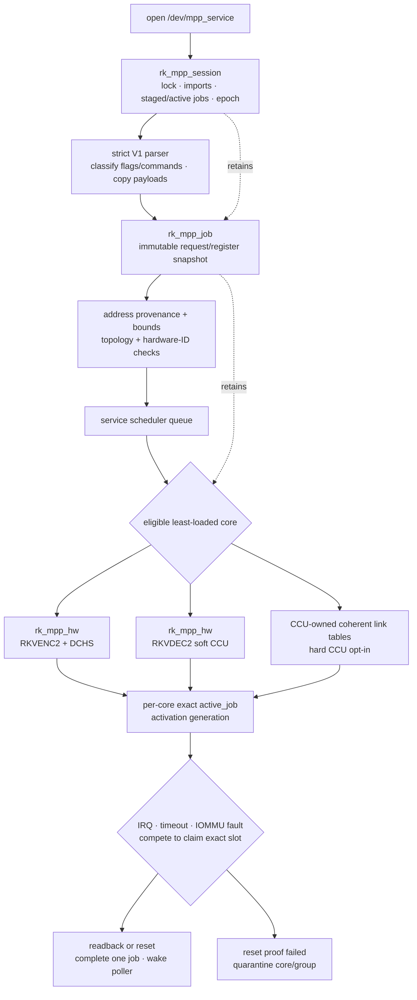

Important properties:

- Message payloads and session controls are copied into kernel-owned staged
  jobs. Later messages cannot retroactively change an already staged job.
- A job retains every dma-buf import and the selected hardware object until no
  asynchronous path can use either one.
- Queue publication, core removal, session reset, and active-slot publication
  are coordinated so an accepted job cannot disappear between owners.
- IRQ, timeout, fault, close, and removal do not independently “finish” a job.
  They contend on the same protected active slot; only the winner owns terminal
  completion.
- A generation identifies one activation of one hardware slot. Delayed work
  from an older activation cannot reset its replacement.
- If reset cannot prove the engine stopped DMA, the rewrite quarantines the
  core—or the dependent decoder group—rather than returning it to scheduling.

### 2.3 MPP object-ownership contrast

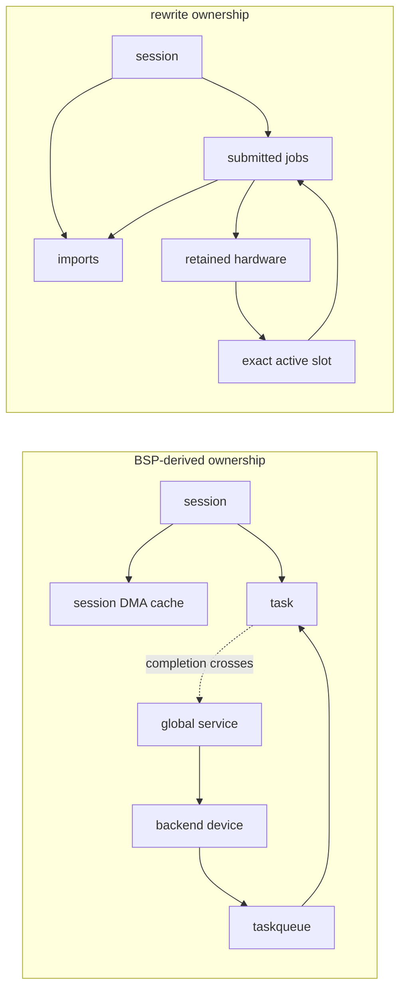

The BSP model is not “unowned”; it is **manager-owned**. The rewrite is
**object-owned**. Manager ownership is convenient for broad routing and
debugging, but correctness depends on consistent ordering among several global
containers. Object ownership makes one job's lifetime easier to audit, at the
cost of more references, more explicit state transitions, and stricter
admission checks.

### 2.4 Multicore scheduling is similar at the silicon boundary

Both architectures must implement the same RK3588 coordination:

| Path | BSP-derived forward port | Rewrite |
|------|--------------------------|---------|
| RKVENC2 | Taskqueue selects a core; DCHS IDs link dependent work across the two VEPU580 cores. | Service queue chooses an eligible least-loaded core; job-owned DCHS state is validated and released with the job. |
| RKVDEC2 soft CCU | Shared queue; software finds an idle VDPU381 core while the CCU owns common hardware state. | Software selection with per-core active slots; reset/error recovery is serialized around the exact job. |
| RKVDEC2 hard CCU | Vendor link tables and CCU dispatch machinery. | Opt-in coherent link tables recreated with public DMA APIs, explicit shared-domain checks, sentinel reservation, and coordinator-wide ownership. |
| Contention | Vendor queueing/task state decides when a core becomes available. | Accepted work remains on an internal queue rather than returning `-EBUSY`. |

The rewrite changes software containment more than scheduling theory. It does
not remove DCHS, CCU, link tables, shared DMA visibility, or the need to reset a
whole dependency group after some decoder failures.

## 3. RGA image-engine architecture

RGA is more semantic than MPP. The kernel receives image formats, planes,
strides, rectangles, transforms, blending, compression modes, priorities,
fences, and core masks, then generates RGA2 or RGA3 command words itself. This
is why the RGA implementations remain large even when the ownership model is
simplified.

### 3.1 BSP-derived RGA

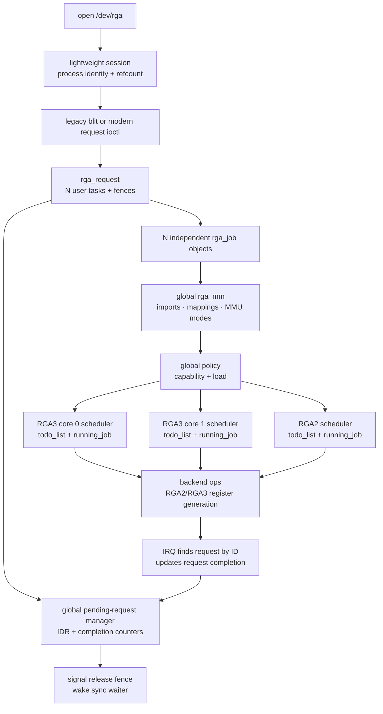

The design is a broad multi-generation subsystem:

- A request is globally discoverable by ID and expands into independently
  schedulable jobs.
- `rga_mm` accepts the vendor's wide buffer model and associates imports and
  mappings with sessions/schedulers.
- A global policy layer chooses among RGA2 and both RGA3 cores using capability
  and load.
- Backend operation tables isolate RGA2 and RGA3 register generation from
  request and memory management.
- Debugfs/procfs and policy machinery observe global state conveniently.
- Completion returns from a per-core `running_job` through the global request
  manager so multi-job request counters and fences can be updated.

This supports broad behavior and lets tasks in one request use different
cores, but it also creates several retirement paths: request completion,
submission failure, acquire-fence callback, timeout, session close, and driver
shutdown can meet the same global objects. The forward-port hardening series
has fixed real double-drop, use-after-free, and teardown-order defects in these
intersections.

### 3.2 Rewrite RGA

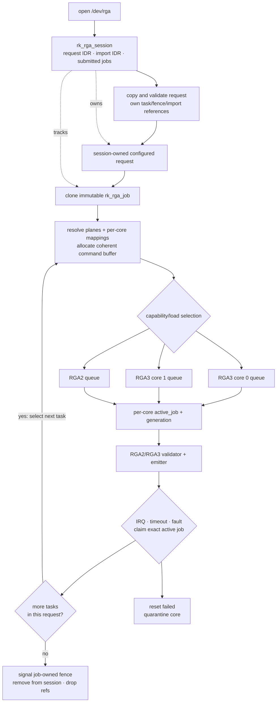

The rewrite deliberately changes request execution:

- Configured request IDs and imported-buffer IDs belong to the opening session,
  not a global pending-request namespace.
- Submission clones an immutable job snapshot. The configured request may be
  reconfigured or destroyed without altering already submitted work.
- A job retains its acquire callback, release fence, imports, per-core mappings,
  command buffer, hardware reference, and session-list membership.
- Multi-task jobs progress serially. Each next task can be rerouted to the
  appropriate RGA2/RGA3 core, but two tasks from the same submitted request are
  not fanned out concurrently.
- The selected core is known before execution mappings and command buffers are
  finalized, so DMA ownership is attached to the device that will actually run
  the task.
- Physical-address imports and unimplemented command profiles fail closed.

### 3.3 RGA request-model tradeoff

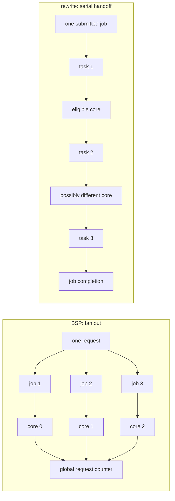

The BSP model can expose more intra-request parallelism. The rewrite model
reduces completion aggregation and fence-ordering complexity. Whether that
serialization matters in production is a performance question, not something
source inspection can answer; the rewrite still owes the paired production
timing gate.

## 4. Buffer, DMA, and IOMMU architecture

Both drivers are DMA drivers: the object lifetime is only safe if no hardware
or IOMMU path can still reach the memory when the final reference is dropped.

```mermaid
flowchart TB
  subgraph BU["BSP-derived buffer route"]
    bfd["userspace fd / VA / physical-style ABI"] --> bmm["session/global memory manager"]
    bmm --> bcache["cached import/mapping"]
    bcache --> bsched["scheduler/core association"]
    bsched --> biova["IOVA or vendor MMU representation"]
    biova --> bhw["hardware"]
  end

  subgraph RU["rewrite buffer route"]
    rfd["userspace dma-buf fd or userptr"] --> rimport["session import<br/>identity + provenance"]
    rimport --> rjob["job retains import"]
    rjob --> rdev["select exact DMA device"]
    rdev --> rmap["job-owned mapping<br/>contiguous span + aperture proof"]
    rmap --> riova["validated IOVA"]
    riova --> rhw["hardware"]
  end
```

| Concern | BSP-derived architecture | Rewrite architecture |
|---------|--------------------------|----------------------|
| dma-buf reuse | Session/global caches avoid remapping. | Session imports are keyed by fd, dma-buf identity, and DMA device; jobs retain mappings. |
| Core selection vs mapping | Mapping and scheduler association are mediated through the global memory subsystem. | The concrete core/DMA device is selected before per-job execution mapping. |
| Scattered userptr | Vendor memory/MMU modes support a broad historical surface. | Normal DMA mapping is tried first; RGA3 may build a driver-owned contiguous IOVA span through the public IOMMU API. |
| Literal addresses | Broad vendor behavior, with later hardening around apertures and physical imports. | Literal IOVAs must be proven inside a retained session mapping; raw physical imports are rejected. |
| Decoder peer visibility | Vendor shared-domain/CCU model. | Hard-CCU admission verifies that every possible executing peer sees the same DMA/IOMMU domain. |
| Fault attribution | Vendor-derived fault and recovery plumbing, hardened in the forward port. | Provider-local callbacks identify the exact physical source, then route recovery to the owning active job or coordinator. |

The rewrite's central invariant is:

```text
no hardware-visible address without provenance
no provenance without a retained import
no execution mapping without a selected DMA device
no final put until DMA is stopped or isolated
```

That stronger local proof reduces the number of implicit assumptions. It also
rejects some workloads the BSP accepts and requires more topology validation at
probe and admission time.

## 5. Completion, recovery, and races

Normal IRQ completion is the easy case. The dangerous case is several terminal
paths arriving together.

### 5.1 BSP-derived completion

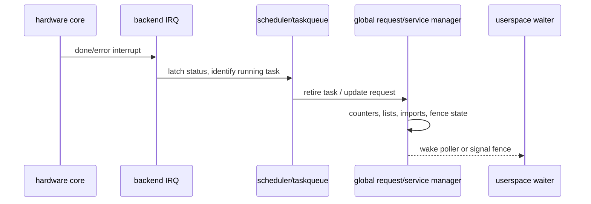

Close, reset, timeout, shutdown, and IRQ paths must all follow compatible global
manager ordering. The hardening tail makes several retire operations
idempotent or serialized, but it retains this basic topology.

### 5.2 Rewrite completion claim

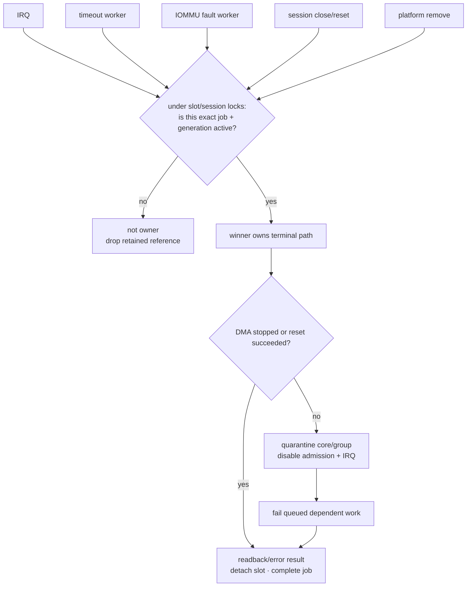

The rewrite separates three ideas that are easy to conflate:

1. A **reference** proves the job or hardware object remains allocated.
2. A **lock/active-slot claim** chooses which contender owns completion.
3. A **generation** proves delayed work belongs to this activation rather than a
   later job that reused the same core.

This is a stronger recovery architecture, but it is also more code. Hard-CCU
peer execution, deferred fault recovery, reset failure, and removal all need
their own exact-reference handoffs. The rewrite's large recent recovery churn
and its KUnit-discovered fixture problems are reminders that explicit state
machines can still be implemented incorrectly.

## 6. Session close and device removal

### 6.1 BSP-derived teardown

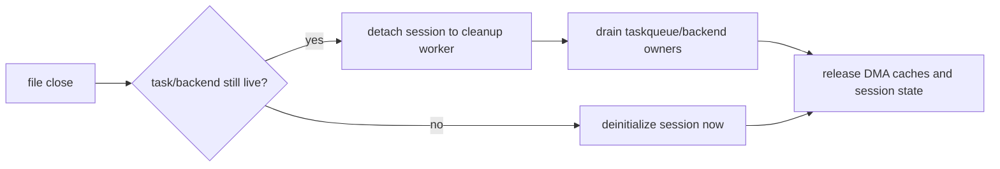

This is compatible with the vendor framework's distributed task ownership.
Its main cost is that the object being closed can remain reachable through
backend and manager structures after the file operation returns.

### 6.2 Rewrite teardown

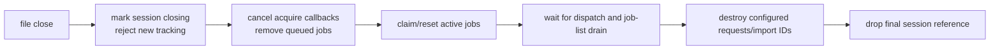

Removal applies the same principle one level higher:

```text
remove from routing → reject admission → quiesce IRQ/work → abort exact jobs
                    → wait for retained hardware refs → release devm resources
```

The rewrite therefore makes teardown easier to state as an invariant. The BSP
path has broader operational history, while the rewrite still needs hostile
unbind/rebind and close/reset board evidence to prove its source-level model.

## 7. Source structure and test architecture

```text
BSP-derived MPP                   rewrite MPP
├── mpp_common.[ch]              ├── mpp_rewrite.c
├── mpp_service.c                ├── ABI.rst
├── mpp_iommu.[ch]               ├── Kconfig
├── mpp_rkvenc2.c                └── Makefile
├── mpp_rkvdec2.[ch]
├── mpp_rkvdec2_link.[ch]
├── mpp_av1dec.c
├── compat/
└── hack/

BSP-derived RGA                   rewrite RGA
├── rga_drv.c                    ├── rga_rewrite.c
├── rga_job.c                    ├── ABI.rst
├── rga_mm.c                     ├── Kconfig
├── rga_policy.c                 └── Makefile
├── rga_fence.c
├── rga2_reg_info.c
├── rga3_reg_info.c
├── debugger / IOMMU helpers
└── include/
```

| Source property | BSP-derived forward port | Rewrite |
|-----------------|--------------------------|---------|
| MPP code/build lines | 18,442, including AV1, compatibility headers, and legacy-SoC helpers | 14,118 including 4,653 KUnit lines; 9,465 without KUnit |
| RGA code/build lines | 21,160 | 23,990 including 10,692 KUnit lines; 13,298 without KUnit |
| ABI ledger | External project documentation and vendor headers | 648-line MPP and 633-line RGA in-tree `ABI.rst` files |
| In-driver KUnit | None comparable | 85 MPP + 148 RGA cases |
| Primary verification style | Board conformance, sanitizer builds, hostile reproducers, production runs | KUnit/build profiles first, then the same board suites and differential artifacts |

The modular BSP layout is easier to browse file by file. The rewrite keeps an
ownership transition close to the state it changes, but its single-file
drivers are harder to review as diffs and more likely to create merge
conflicts. Embedded KUnit explains much of their apparent size, but it also
interleaves test and runtime code in unusually large translation units.

## 8. Pros and cons

### 8.1 BSP-derived forward-port architecture

| Pros | Cons |
|------|------|
| Preserves the widest vendor hardware and ABI surface, including RKMPP AV1 and historical RGA modes. | Carries compatibility glue, legacy-SoC code, private assumptions, and resync work into every new kernel line. |
| Modular backend, scheduler, memory, debugger, and register-generation files. | A single operation crosses several global managers, so ownership and retirement order are harder to prove locally. |
| Mature scheduling and command recipes inherited from the silicon vendor. | Global request/session/memory state has produced real close, IRQ, refcount, and teardown races. |
| Strongest empirical evidence: conformance, bit-exact output, KASAN, root gates, and production performance. | No comparable embedded KUnit suite; pure parser/error-path invariants depend more on audit and external reproducers. |
| Best compatibility oracle for existing Rockchip userspace. | Broad permissive behavior can preserve unsafe or unused ABI paths that a narrower design would reject. |
| Lower immediate deployment risk. | Higher long-term kernel-integration and audit cost. |

### 8.2 Rewrite architecture

| Pros | Cons |
|------|------|
| Public kernel APIs and byte-identical driver sources across 6.18 and current mainline reduce forward-maintenance coupling. | Current scope omits RKMPP AV1, JPEG/legacy VPU blocks, physical imports, and some historical RGA profiles. |
| Session/job/hardware/import ownership makes asynchronous lifetime and close/remove order locally auditable. | Refcount, lock, generation, work-cancel, and quarantine state machines add substantial implementation complexity. |
| Fail-closed ABI, address-provenance, topology, hardware-ID, and reset checks reduce silent unsafe behavior. | Strict rejection can expose compatibility gaps only when real userspace reaches them. |
| Exact active-slot claims and generation-aware recovery directly address bug classes seen in the BSP architecture. | Clearer architecture has not prevented rewrite-specific recovery, fixture, DT-resource, and shared-IRQ defects. |
| 233 KUnit cases and explicit ABI ledgers make assumptions executable and reviewable. | Large single-file drivers and embedded tests are a review/merge burden; KUnit cannot prove real register recipes, IRQ wiring, or DMA reset behavior. |
| Lower non-test source footprint: roughly half-size MPP and 37% smaller RGA runtime slices. | No successful current-tip media-hardware, production-performance, fuzz, or soak record yet. |
| Better long-term candidate if hardware parity is demonstrated. | Higher immediate qualification risk. |

## 9. Decision matrix

| Goal | Better architecture today | Reason |
|------|---------------------------|--------|
| Ship a working ROCK 5B media stack | BSP-derived forward port | It is the only broadly hardware- and production-validated implementation. |
| Preserve every vendor/legacy behavior | BSP-derived forward port | Its scope is intentionally wider. |
| Minimize kernel-version coupling | Rewrite | Public APIs and the same source on 6.18/current mainline reduce compatibility surface. |
| Audit one job's lifetime and recovery | Rewrite | Session/job ownership, exact slot claims, generations, and quarantine make the proof local. |
| Navigate subsystem code by responsibility | BSP-derived forward port | Its many focused files separate policy, memory, jobs, backends, and debugging. |
| Execute parser/register-emission/error invariants without the board | Rewrite | Embedded KUnit and explicit ABI ledgers provide that layer. |
| Establish behavioral truth on real RK3588 silicon | BSP-derived forward port | Its output and performance are already measured; it remains the differential oracle. |
| Long-term replacement after parity | Rewrite, conditionally | Its maintenance model is preferable only after equivalent hardware, recovery, performance, fuzz, and soak evidence exists. |

## 10. Bottom line

The BSP-derived architecture optimizes for **behavioral continuity**. It keeps
the vendor's broad subsystem, hardware knowledge, and proven paths, then repairs
them incrementally. Its main weakness is distributed global ownership, which
makes races and future kernel integration expensive to reason about.

The rewrite optimizes for **containment and maintainability**. It narrows scope,
ties resources to sessions and immutable jobs, uses public APIs, and treats
unsupported or unprovable states as errors. Its main weakness is that the
cleaner model has grown into two large implementations and has not yet earned
the forward port's hardware evidence.

The sound transition strategy is therefore not an early winner-take-all choice:

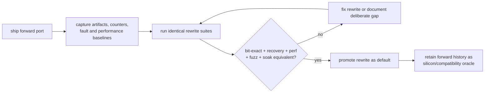

Use the forward port because its behavior is proven. Develop the rewrite because
its ownership and kernel-integration model is better suited to long-term
maintenance. Promote it only when those architectural advantages and equivalent
hardware evidence exist at the same time.
