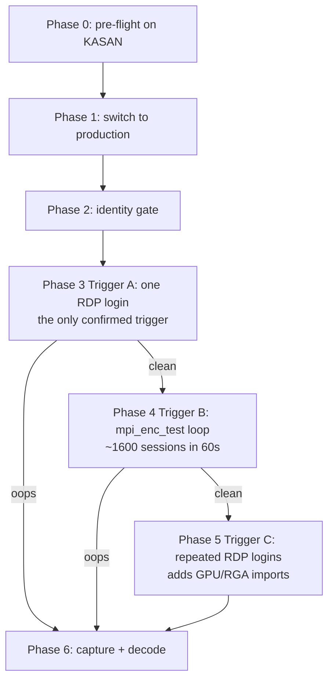
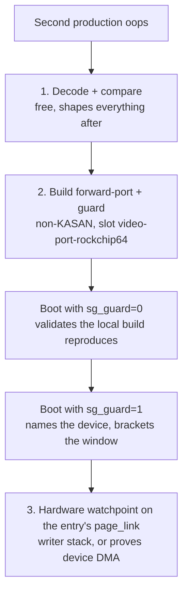

# Reproduction plan — GRD/RKMPP system-heap scatterlist oops on the production kernel

Companion to
[`findings/2026-07-27-grd-rkmpp-system-heap-sg-corruption-oops.md`](../../findings/2026-07-27-grd-rkmpp-system-heap-sg-corruption-oops.md).
Target: stock `6.18.40-ysp-rockchip64`, **no guard patch**. The point of this run
is to learn whether the bug is live and at what rate, before spending a build on
instrumentation.

> **Resolved 2026-07-28 — this plan is closed; do not run the escalation
> path.** The writer is
> [`mangle_sg_table()`](../../findings/2026-07-28-dmabuf-debug-mangle-sg-table-is-the-sg-writer.md)
> in `drivers/dma-buf/dma-buf.c` (~:831), compiled in only when
> `CONFIG_DMABUF_DEBUG=y`. It XORs every `page_link` with `~0xffUL` for the
> interval an attachment is mapped, and the system heap's `end_cpu_access()`
> syncs exactly those mangled tables. Production sets the option; the three
> other 6.18.40 kernels on this board do not, which is the whole of the
> reproduce/don't-reproduce split.
>
> Both open questions this plan was built around are answered. The bug is
> **deterministic**, not rare — production oopsed seven times in boot -1 alone.
> KASAN does not mask it; the KASAN kernels simply lack the option. Sections
> [*Put the guard on the kernel that reproduces*](#2-put-the-guard-on-the-kernel-that-reproduces),
> [*What the guard must capture*](#2b-what-the-guard-must-capture-and-what-is-already-excluded),
> and [*Hardware watchpoint*](#3-hardware-watchpoint-the-instrument-that-names-the-writer)
> are superseded — no instrument is needed. What remains is the one-line config
> fix and its boot verification.

## Why this run exists

The evidence is thinner than the write-up implies. Measured from the retained
journal on 2026-07-27:

| Kernel | RDP handovers | Encoders created | Oopses |
|---|---|---|---|
| `6.18.40-ysp-rockchip64` (production, boot -1) | **1** | 0 | **1** |
| `6.18.40-video-port-kasan-rockchip-rk3588` (boot 0) | 9 | 9 | 0 |
| same, direct `mpi_enc_test` (400 iters × 4 instances) | — | 1600 | 0 |

The production kernel has been booted with GRD exactly once, took exactly one
handover, and oopsed on it. So **n=1**. Two very different explanations remain
unfalsified:

- the bug is deterministic on production and KASAN masks it (plausible — see the
  [guard patch README](../patches/system-heap-sg-guard/README.md) on why KASAN
  is likely blind to this write); or
- the bug is rare, and the single production attempt was unlucky.

Nothing done so far distinguishes them. This run does, and it is cheap.



## Safety envelope

Checked on this box, and the reason this is low-risk:

- `panic_on_oops=0`, `panic=10`. An oops kills the faulting thread, not the
  machine — which is exactly what happened on boot -1 (GRD survived, the box ran
  another 37 minutes). Only a true panic reboots.
- `pstore.backend=ramoops` + `printk.always_kmsg_dump=1`, ramoops registered at
  `0xd0000@0x118000`, `/sys/fs/pstore` mounted. A hard death still leaves the
  oops readable after reboot.
- `Storage=persistent` journald, 16 boots retained. Evidence survives reboots.
- We are **switching to an already-installed kernel**, not installing one. No
  package is written, nothing is clobbered, and `vmlinuz.old` already points at
  the production kernel.
- `console=ttyS2,1500000` is on the cmdline. If you have the UART cable handy,
  attach it — it is the only capture that survives a hang with no pstore write.
  Not required.

Without the guard patch the production kernel **will oops rather than log and
skip**. That is intended here: the oops is the signal.

## Phase 0 — pre-flight (do this while still on the KASAN kernel)

```bash
# Baseline + confirm the production kernel is bootable from disk
uname -r
ls -l /boot/vmlinuz-6.18.40-ysp-rockchip64 /boot/uInitrd-6.18.40-ysp-rockchip64
ls -ld /boot/dtb-6.18.40-ysp-rockchip64
cat /proc/sys/kernel/tainted

# Clear pstore so anything found after this run is definitely from this run
ls /sys/fs/pstore/
```

If `/sys/fs/pstore/` is non-empty, save it aside first, then (as root)
`rm -f /sys/fs/pstore/*`.

The repro harness is already staged at `~/Code/tmp/sg-oops-repro/loop.sh` and
survives the reboot.

## Phase 1 — switch to the production kernel

`install-kernel.sh` **cannot** do this: it refuses the `ysp-rockchip64` slot by
design (that slot is the PPA lineage, not one of `OUR_SLOTS`). Use
`kernel-revert.sh`, which repoints `/boot/Image`, `/boot/uInitrd` and `/boot/dtb`
— the only kernel selection this board has, since U-Boot offers no boot menu.

```
! sudo bash /home/yi/Code/rock-5b-ysp/kernel-drivers/scripts/kernel-revert.sh list
! sudo bash /home/yi/Code/rock-5b-ysp/kernel-drivers/scripts/kernel-revert.sh switch 6.18.40-ysp-rockchip64
```

Verify **before** rebooting — a wrong symlink set means a non-booting board:

```bash
ls -l /boot/Image /boot/uInitrd /boot/dtb    # all three must name 6.18.40-ysp-rockchip64
```

Then `! sudo reboot`.

## Phase 2 — identity gate (after boot)

All of these must hold before any trigger runs, or the result means nothing:

```bash
uname -r                       # must be exactly 6.18.40-ysp-rockchip64
cat /proc/sys/kernel/tainted   # must be 0
dpkg -l | grep -E "linux-image-ysp|gnome-remote-desktop|rockchip-mpp|librga" | awk '{print $2,$3}'
```

Expected, matching the finding's environment:

| Component | Version |
|---|---|
| kernel | `6.18.40+rk3588av1fwport20260725-0ubuntu1~rk1` |
| GNOME Remote Desktop | `50.2+rkmpp+git20260721.13.cf60b4d` |
| libmpp | `1.5.0+git20260529.1375813c` |
| librga | `2.2.0+git20260725.26a50ef` |

If any differ, stop and record it — a version drift would explain a
non-reproduction on its own.

## Phase 3 — Trigger A: one RDP login (the only confirmed trigger)

Do this **first** and **once**. It is the only path with a recorded hit, and the
first attempt is the highest-information one: it is the direct n=2 to the
production kernel's n=1.

1. From the macOS client, connect to the login screen at the same geometry —
   client window sized so GRD negotiates `2064x1296` (boot -1 logged surface
   `2056x1290` → encoder `2064x1296`).
2. Watch from a second terminal (SSH, not the RDP session):

```bash
watch -n1 'cat /proc/sys/kernel/tainted; dmesg | tail -5'
```

The signal is **not** whether the session connects. On boot -1 the session
authenticated, handed over to GDM, started the greeter and negotiated AVC420 —
and then oopsed. The discriminators are:

| Observation | Meaning |
|---|---|
| `Initialized FFmpeg/rkmpp encode backend` **but no** `Created h264_rkmpp encode session` | the boot -1 failure signature |
| tainted flips `0` → `128` (`DIE`) | oops fired |
| both log lines present, login screen renders | clean run, no reproduction |

If it oopses: **stop here** and go to Phase 6. Do not run further triggers on a
tainted kernel — later evidence is contaminated by the first failure.

## Phase 4 — Trigger B: direct encoder loop

Only if Phase 3 came back clean. This drives the same libmpp path
(`mpp_enc_hal_start()` → `mpp_buffer_sync_partial_end()` → `DMA_BUF_IOCTL_SYNC`)
without RDP, at ~40 ms per encoder instead of a full login.

```bash
cd ~/Code/tmp/sg-oops-repro
ITERS=50  INSTANCES=4 bash loop.sh     # smoke: ~10s
ITERS=400 INSTANCES=4 bash loop.sh     # ~60s, 1600 encoder sessions
```

The script exits non-zero the moment `/proc/sys/kernel/tainted` moves or a
kernel report appears, so it stops on the first hit rather than running over it.

Scale up only if clean: `ITERS=2000`. Note the ceiling — this same loop has
already run 1600 sessions clean on the KASAN kernel, so a clean production run
here is a *direct* comparison, not a new baseline.

## Phase 5 — Trigger C: repeated RDP logins

Only if A and B are both clean. This closes the known gap in Trigger B:
`mpi_enc_test` generates its own frames, so it imports no external dma-buf and
never involves the GPU or RGA. GRD's path does both — `panthor`, `rockchipdrm`
and the RGA driver were all live in the boot -1 module set — and
`system_heap_dma_buf_end_cpu_access()` walks **every** mapped attachment of a
buffer, not just the encoder's. Multiple attachments per buffer is the shape
Trigger B cannot produce.

Do 10 login/logout cycles, checking taint between each:

```bash
for i in $(seq 1 10); do
  echo "--- cycle $i: connect, wait for login screen, disconnect ---"
  read -r -p "press enter when the cycle is done "
  echo "taint=$(cat /proc/sys/kernel/tainted)"
done
```

Ten clean cycles against the production kernel's 1-for-1 is already a strong
statement that the failure is rare rather than deterministic.

## Phase 6 — capture

On any hit, before rebooting:

```bash
D=~/Code/tmp/sg-oops-repro/hit-$(date +%Y%m%d-%H%M%S); mkdir -p "$D"
journalctl -k -b --no-pager        > "$D/kernel.log"
journalctl -b --no-pager           > "$D/full.log"
cp -r /sys/fs/pstore                 "$D/pstore" 2>/dev/null
uname -r > "$D/uname"; cat /proc/sys/kernel/tainted > "$D/tainted"
dpkg -l | grep -E "linux-image-ysp|gnome-remote|rockchip-mpp|librga" > "$D/versions"
cat /proc/iomem > "$D/iomem" 2>/dev/null
echo "saved to $D"
```

### Decoding a second oops

The boot -1 register block gives the arithmetic to compare against. From
`iommu_dma_sync_sg_for_device`:

| Reg | boot -1 value | Meaning |
|---|---|---|
| `x19` | `ffff0001c3e59400` | scatterlist array **base** — 1024-aligned, i.e. the `kmalloc-1024` object holding `kmalloc_array(24, 32)` = 768 B. (The finding calls this the failing entry; the alignment says otherwise. Failing entry 1 is at `…9420`.) |
| `x20` | `fffffdffc0000000` | **`vmemmap` base** |
| `x21` | `0x18` | 24 entries (`orig_nents`) |
| `x22` | `0` | `DMA_BIDIRECTIONAL` |
| `x23` | `1` | failing entry index |
| `x0`/`x1` | `ffff001e0c1fc000` / `ffff001e0c2fc000` | clean range; delta `0x100000` = that entry is 1 MiB |

With `x20` in hand the corrupt pointer is recoverable, which the finding could
not do:

```text
page_link  = x20 + PFN * 64
PFN        = (page_link - x20) / 64

valid page_link window (PFN 0 .. 0x4fffff):
             0xfffffdffc0000000 .. 0xfffffdffd4000000

boot -1:     PFN 0x1e0c1fc  ->  page_link ~ 0xfffffe0038307f00
             i.e. ~1.68 GiB past the top of the valid window
```

That is the load-bearing observation: the stored value is a **well-formed
`struct page` pointer just outside RAM**, not slab poison, not a freelist
pointer, not ASCII, not zero — any of those would decode to an astronomically
larger PFN and a wild fault address rather than a clean `__va(0x1e0c1fc000)`.

### The fingerprint, after three samples (2026-07-27)

Three oopses have now been decoded. Entry 1 is an order-8 (1 MiB) system-heap
chunk, so its true PFN is `≡ 0 (mod 256)` and its true `page_link` is
`≡ 0 (mod 0x4000)`. All three corrupt values instead end in `0x3f00`:

```text
16:36  PFN 0x1e0c1fc -> 0xfffffe0038307f00     19:38  PFN 0x1dbe8fc -> 0xfffffe0036fa3f00
20:11  PFN 0x1de02fc -> 0xfffffe003780bf00     all: page_link & 0x3fff == 0x3f00

    V = pfn_to_page(A - 4),   A = 0 (mod 256),   A ~ 0x1de0300 (~119.5 GiB phys)
```

The stored value is the vmemmap slot of a 1 MiB-aligned page **minus exactly
four `struct page`s (256 bytes)**, with the aligned base itself far outside RAM.
Both 32-bit halves differ from the correct value and the high half differs by
exactly `+1`, so the event was a single 8-byte store, a 64-bit add, or two
adjacent 32-bit stores — **not** a 4-byte device write, which would have left
`0xfffffdff` at `+0x24`. This is a CPU pointer-arithmetic shape.

**Do not read the high word as `-ERESTARTSYS`.** `0xfffffe00` is forced: every
`struct page *` for a PFN in `[0x1000000, 0x5000000)` has exactly that high
word, so the `{u32 address, s32 -512}` decomposition carries no information. An
earlier pass chased a `{addr, errno}` writeback record on the strength of it and
found nothing, which is the expected outcome.

**Do not assume the damaged table is the encoder's.**
`system_heap_dma_buf_end_cpu_access()` syncs **every** mapped attachment, and
all attachments of a buffer are `dup_sg_table()` copies with identical geometry
— so `orig_nents == 24` and a 1 MiB entry 1 do not identify which attachment
faulted. Establishing the owning device is one of the guard's jobs.

So on a second oops, record and compare: the entry index (`x23`), that entry's
length (`x1 - x0`), the array base alignment (`x19`), and the recovered PFN. A
**repeat of index 1 at 1 MiB** points to a structural bug tied to the buffer
layout. A **different index or length** points to a wandering writer, and the
delta between the two PFNs is then the strongest clue available about the
arithmetic that produced them.

## Interpretation

| Phase 3 | Phase 4 | Phase 5 | Reading |
|---|---|---|---|
| oops | — | — | Deterministic on production. KASAN masking confirmed; the guard patch becomes the priority and should go on **production**, where it is the only instrument that can see this write. |
| clean | oops | — | Live but not RDP-specific. `mpi_enc_test` becomes the primary harness — cheap, scriptable, no GDM. Best possible outcome for iteration speed. |
| clean | clean | oops | Live but needs the multi-attachment/GPU-import shape. Attribution work should focus on which device's attachment is damaged, which is exactly what the guard reports. |
| clean | clean | clean | The production failure is rare, not deterministic. n=1 stands and the finding's "blocked on this gate" framing is too strong — the tracks it blocks (focus/resume, audio) can proceed in parallel while attribution continues. |

The last row is a real possibility and worth naming in advance, so a clean run
gets recorded as a result rather than treated as a failed attempt.

## Rollback

```
! sudo bash /home/yi/Code/rock-5b-ysp/kernel-drivers/scripts/kernel-revert.sh switch 6.18.40-video-port-kasan-rockchip-rk3588
! sudo reboot
```

If the board does not come up, the symlinks are the only thing that changed:
boot the SD rescue and use `kernel-revert.sh --auto list` / `--auto switch` per
the script header. No package was modified, so no `reinstall` is needed.

## If it oopses again — the escalation path



### 1. Decode and compare first

Costs nothing and changes what is worth building. Recover the second PFN via
`x20` and compare four values against boot -1: entry index (`x23` = 1), entry
length (`x1 - x0` = 1 MiB), array base alignment (`x19`, 1024-aligned), and
recovered PFN (`0x1e0c1fc`).

- **Same index and length** → structural, tied to the 24-entry buffer layout;
  the writer is reachable from something that walks this specific table.
- **Different index or length** → a wandering writer. The delta between the two
  recovered PFNs then becomes the strongest available clue to the arithmetic
  that produced them; two samples of a computed-page-pointer bug often pin the
  expression outright.

### 2. Put the guard on the kernel that reproduces

Not the KASAN image. Build the **non-KASAN** production forward-port with
[`system-heap-sg-guard`](../patches/system-heap-sg-guard/README.md) applied:

```bash
bash kernel-drivers/scripts/build-kernel.sh forward-port
```

That lands in slot `video-port-rockchip64`, which `install-kernel.sh` *can*
write — unlike the PPA's `ysp-rockchip64`. It is not currently installed, so
this is a fresh build.

**One build, two experiments**, because `sg_guard` is a runtime-writable module
parameter defaulting on:

1. Boot with `system_heap.sg_guard=0`. The guard is compiled in but inert, so the
   kernel behaves like stock. If it still oopses, the local build is a validated
   stand-in for the PPA kernel.
2. Then `echo 1 > /sys/module/system_heap/parameters/sg_guard` (or reboot without
   the parameter) for full instrumentation.

Step 1 is not optional ceremony. The local forward-port series and the PPA's
renumbered `0001`–`0071` + `0074`/`0075` tail are not known to be identical, and
without it a non-reproduction cannot be attributed between the guard, the build,
and the patch delta.

**Step 1 does not control for the compiler.** Production is a Launchpad buildd
binary built with **gcc 15.2.0 / binutils 2.46**; every local Armbian build,
including this guarded one, uses the Docker container's **gcc 13.3.0 /
binutils 2.42** — two major GCC releases apart, and the configs show the gap
changing code semantics (`CC_HAS_COUNTED_BY` and `CC_HAS_MIN_FUNCTION_ALIGNMENT`
are production-only). See
[`findings/2026-07-27-kasan-vs-production-build-provenance-confound.md`](../../findings/2026-07-27-kasan-vs-production-build-provenance-confound.md),
which also records what was checked and found *not* confounded (memory-layout
config, vendor driver source, Armbian derivation).

So read step 1 asymmetrically:

- **It oopses** → decisive. Toolchain is not the discriminator, KASAN masking is
  confirmed, and the guard is immediately useful.
- **It comes back clean** → ambiguous three ways (KASAN layout, toolchain,
  Armbian-archive vintage). Do not record it as "the guard build does not
  reproduce". The cheapest way out is to build the same guarded source through
  the `ppa-forward-port` flavor so **Launchpad** compiles it with gcc 15.2,
  leaving config as the only variable. `gcc-15.2.0` is also installed natively on
  this board if a local same-compiler build is preferred.

### 2b. What the guard must capture, and what is already excluded

Source inspection on 2026-07-27 swept `drivers/video/rockchip/{mpp,rga3}/`, the
series' `drivers/iommu/` delta, and `system_heap.c`
([finding](../../findings/2026-07-27-grd-sg-writer-source-sweep-vendor-drivers-cleared.md)).
It **cleared the vendor MPP driver**: only
four scatterlist references exist there and all are reads, and no object MPP
allocates or frees on this path lands in the victim's kmalloc-1024 bucket. It
also found that neither vendor driver contains any device-writable slab memory,
so a device-DMA writer would have to live outside them. Do not re-sweep `mpp/`.

Three data therefore matter more than any further reading, and the guard already
records all three:

| Datum | Why it is the priority |
|---|---|
| the **prior** `page_link` value | gives `D = V - T`, which discriminates a 64-bit add from an 8-byte store in one shot — the single most informative missing number |
| the **owning device** + attachment count | settles whether the encoder's own table faulted, which the register block cannot show |
| the first **checkpoint** that drifts | brackets the window by measurement instead of inference |

Latent defects found during that sweep — including two unprivileged-reachable
memory-corruption bugs — are catalogued with proposed fixes in the private
`rock-5b-security` repository. None is confirmed to be this writer.

### 3. Hardware watchpoint — the instrument that names the writer

The guard reports at checkpoints, so it brackets the write rather than catching
it. `CONFIG_HAVE_HW_BREAKPOINT=y` on both kernels, so once the guard shows a
clean `post-map`, arm `register_wide_hw_breakpoint()` on that attachment's
`&sgl[1].page_link` for the life of the attachment and dump the stack from the
handler.

It is also the only available **CPU-vs-DMA discriminator**:

| Watchpoint | Guard | Reading |
|---|---|---|
| fires | — | CPU writer, with its stack trace. Attribution done. |
| silent | still reports corruption | the write came from **device DMA**, which no CPU-side tool — KASAN, watchpoints, `slub_debug` — can observe. Redirects to IOMMU domain/fault tracing and device isolation. |

Constraint: arm64 exposes 4 watchpoint slots, so arm only on the buffer of
interest, identifiable by `len == 2678784` and `orig_nents == 24`.

### What not to spend time on

`CONFIG_PAGE_OWNER` is not set on production, and enabling it buys little here:
the bogus PFN is outside RAM, so there is no `struct page` to carry owner data.
`slub_debug` redzones are similarly unlikely to trip, since the evidence points
to a wrong-value store rather than an overflow. Enable them if convenient, but
not as the primary bet.

## After this run

Update the finding's *Next verification gate* with the measured rate, the
maintained kernel/GRD evidence owners, and the `status.md` rows for tracks 1 and
7, which currently assert the gate blocks GRD work on the strength of n=1.
